# CTF入门课程：13：CTF夺旗 - 网络安全基础入门 🚩

在本节课中，我们将学习CTF（Capture The Flag）夺旗赛的基本概念，并通过一个完整的实战演练，掌握如何探测目标机器、发现并获取Flag值。我们将从信息收集开始，逐步深入到服务探测、漏洞利用，最终成功提交Flag。

---

## 概述

CTF是一种流行的信息安全竞赛形式。其英文名可直译为“夺得Flag”，也可意译为“夺旗赛”。其基本流程是：参赛团队之间通过进行信息对抗、程序分析等形式，率先从主办方给出的比赛环境中得到一串具有一定格式的字符串或其他内容，并将其提交给主办方，从而获得分数。为了方便称呼，我们把这样的内容称之为**Flag**。

在CTF比赛中，涉及内容比较繁杂，我们需要利用所有可以利用的方法获得对应的Flag。下面我们来介绍今天的实验环境。

## 实验环境

我们使用Kali Linux作为攻击机，其IP地址是 `192.168.1.111`。靶场机器使用Linux系统，其IP地址是 `192.168.1.110`。

拿到实验环境后，我们所有的操作都要具有一个目的性，那就是获得靶场机器上的Flag值。

## 第一步：信息探测

在获得靶场机器的IP地址之后，我们需要对其进行第一步操作：信息探测。核心目标是发现靶场开放了哪些服务。

以下是进行信息探测的常用方法：

### 1. 使用Nmap扫描开放端口

Nmap是一个强大的网络扫描工具。我们可以使用以下命令快速扫描靶机所有端口：


```bash
nmap -p- -T4 192.168.1.110
```
*   `-p-`：表示扫描所有端口（0-65535）。
*   `-T4`：表示使用Nmap的最大线程数，以最快速度进行扫描。

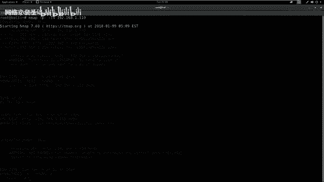

执行该命令后，Nmap会列出靶机开放的端口及其对应的服务。

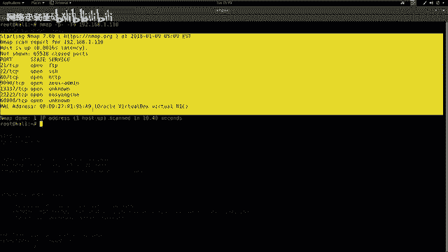

### 2. 使用Nmap进行深度扫描

除了快速扫描端口，我们还可以使用Nmap的所有扫描模块进行更深入的探测：

```bash
nmap -T4 -A -v 192.168.1.110
```
*   `-A`：启用操作系统检测、版本检测、脚本扫描和路由跟踪。
*   `-v`：显示详细输出。

**注意**：深度扫描有时会遗漏某些非常规端口。因此，在实际操作中，建议结合快速端口扫描和深度扫描两种方式。

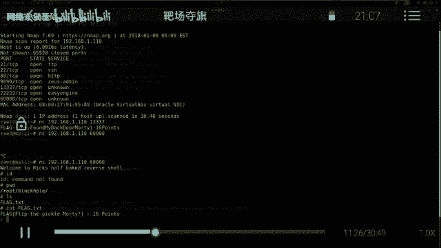

### 3. 使用Nikto探测Web敏感信息

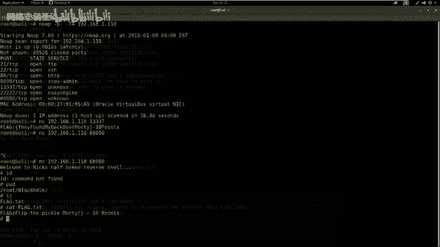

对于开放的HTTP服务，我们可以使用Nikto工具探测Web应用的敏感文件、配置错误和已知漏洞。

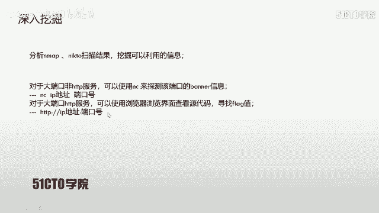

```bash
nikto -host http://192.168.1.110
```
如果HTTP服务运行在非80端口（例如9090），则需要指定端口号：
```bash
nikto -host http://192.168.1.110:9090
```

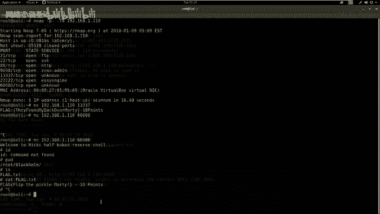

### 4. 使用Dirb探测Web目录

Dirb是一个Web内容扫描器，通过字典攻击来寻找隐藏的目录和文件。

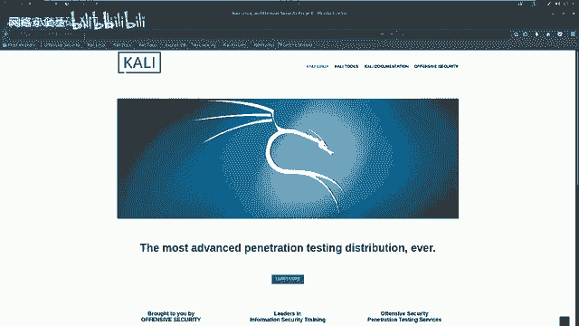

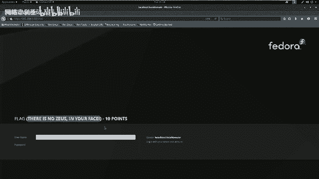

```bash
dirb http://192.168.1.110
```
同样，对于非80端口的服务需要指定端口：
```bash
dirb http://192.168.1.110:9090
```

---

上一节我们介绍了如何使用工具进行初步的信息收集。本节中，我们来看看如何分析扫描结果，并从中挖掘可利用的信息。

## 第二步：分析结果与挖掘信息

分析Nmap和Nikto的扫描结果，挖掘其中可以利用的信息是关键。

以下是分析后可能采取的几种行动：

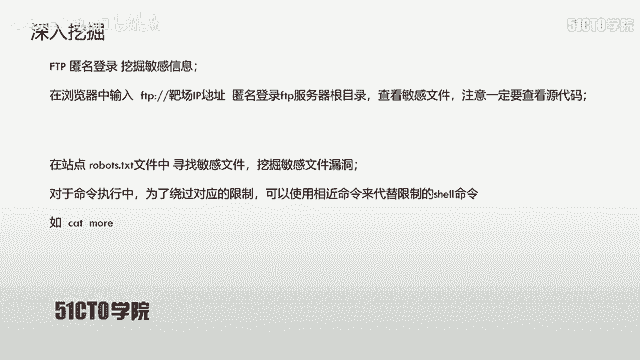

### 1. 探测未知服务的Banner信息

对于扫描结果中识别为“unknown”的大端口服务，我们可以使用Netcat（nc）工具连接并获取其Banner信息，其中可能包含Flag。

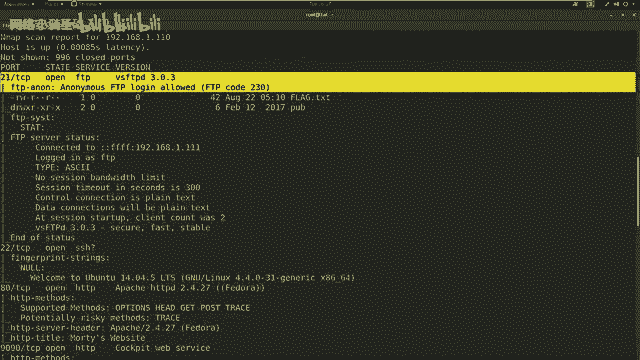

```bash
nc 192.168.1.110 13337
```
执行后，服务器返回的Banner信息中可能直接包含第一个Flag。


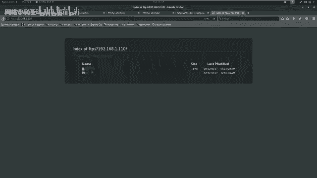

### 2. 访问Web服务并查看源代码

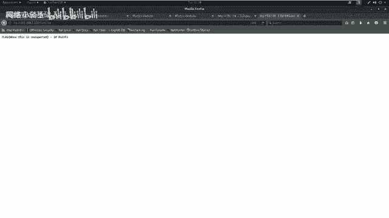

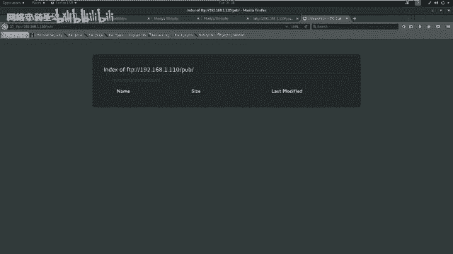

对于开放的HTTP服务（如80、9090端口），直接使用浏览器访问。查看页面内容的同时，务必使用开发者工具（F12）查看网页源代码，Flag或提示信息可能隐藏在注释中。

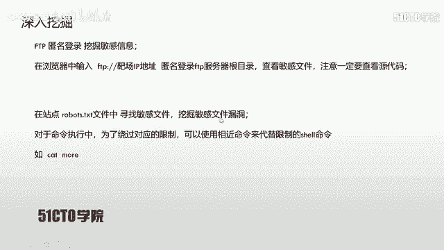

访问格式为：`http://靶机IP:端口`。例如：`http://192.168.1.110:9090`

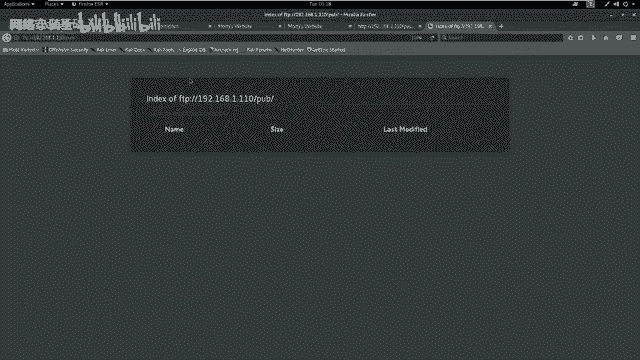

### 3. 尝试访问探测到的敏感目录


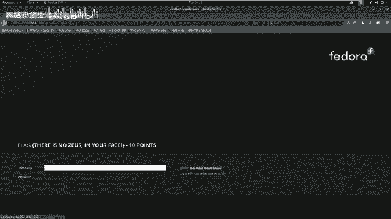

根据Dirb等工具的扫描结果，尝试访问发现的敏感目录或文件。例如，扫描可能发现 `/passwords/` 目录，访问后可能找到 `flag.txt` 文件。

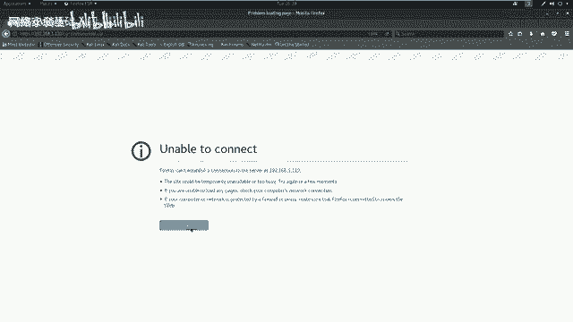

### 4. 利用FTP匿名登录

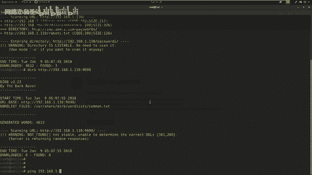

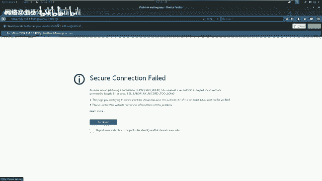

如果扫描发现21端口（FTP）支持匿名登录（允许用户名 `anonymous`，密码为空），可以在浏览器中直接访问：`ftp://192.168.1.110`。在FTP根目录中寻找敏感文件，如 `flag.txt`。


### 5. 检查Robots.txt文件

Robots.txt文件通常用于指示搜索引擎爬虫哪些目录可以或不可以访问。在CTF中，它常常会泄露敏感的目录或文件路径。访问 `http://靶机IP/robots.txt` 查看内容，并尝试访问其中列出的路径。

---

上一节我们通过多种方式挖掘到了不少信息，甚至可能已经找到了几个Flag。本节中我们来看看如何利用发现的漏洞进行更深层次的渗透。

## 第三步：漏洞利用与深入渗透

在挖掘信息过程中，我们可能会发现一些漏洞点，需要进一步利用。

### 1. 测试命令注入漏洞

在访问某个CGI页面（例如 `cgi-bin/traceroute.cgi`）时，发现其接受一个IP参数并执行路由追踪。这可能存在命令注入漏洞。

测试方法：在输入IP地址的参数后添加分号 `;`，然后跟上系统命令。
*   例如，输入 `127.0.0.1; id`，如果页面返回了当前用户的ID信息，则证明存在命令注入漏洞。
*   如果常见的 `cat` 命令被过滤，可以尝试使用功能相近的命令如 `more`、`less`、`head`、`tail` 来绕过。
    ```bash
    127.0.0.1; more /etc/passwd
    ```
    通过查看 `/etc/passwd` 文件，我们可以获取系统上的用户名列表。

### 2. 利用凭据进行远程登录

结合之前信息收集阶段发现的密码（例如在网页注释中找到的密码 `winter`）和通过漏洞获取的用户名（例如 `summer`），尝试进行远程登录。
*   首先检查靶机是否开放SSH服务（通常为22端口）。
*   如果22端口被限制，查看Nmap扫描结果中是否开放了其他端口的SSH服务（例如 `512` 端口）。
*   使用以下命令尝试登录：
    ```bash
    ssh summer@192.168.1.110 -p 512
    ```
    输入密码 `winter` 后，成功获得一个反向Shell。

### 3. 在Shell中寻找Flag

登录成功后，在获得的Shell中执行命令来寻找Flag。
1.  使用 `pwd` 查看当前工作目录。
2.  使用 `ls` 列出当前目录下的文件。
3.  如果发现 `flag.txt` 等文件，使用 `more`（如果 `cat` 被过滤）查看其内容。
    ```bash
    more flag.txt
    ```
    获取到的Flag值即可提交。

---

## 总结

本节课中我们一起学习了CTF夺旗赛的基本流程和实战技巧。我们来总结一下核心要点：

1.  **全面探测**：对于未知服务的大端口，使用 `nc` 获取Banner信息，可能直接暴露Flag。
2.  **灵活绕过**：在测试或利用命令注入等漏洞时，如果常用命令被过滤，要善于使用功能相近的命令进行绕过，例如用 `more` 代替 `cat`。
3.  **不放过任何服务**：需要对发现的每一个服务（如FTP、SSH、HTTP及其各种端口）进行深入探测。仔细挖掘每个服务可能存在的弱点、配置错误或敏感信息泄露点。

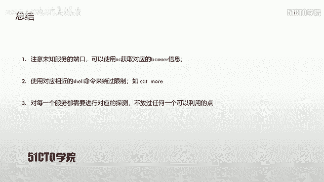

在CTF比赛中，细心和耐心至关重要。每一个开放的端口、每一条扫描结果、每一行源代码注释，都可能成为你找到下一个Flag的关键线索。