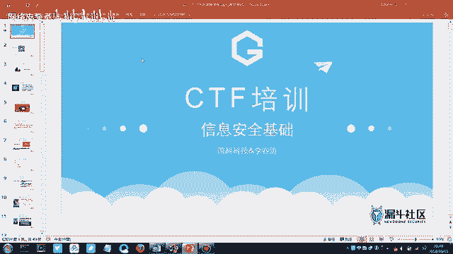
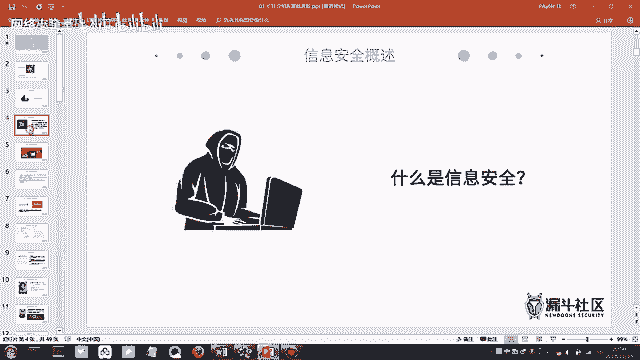
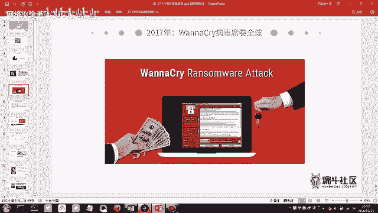
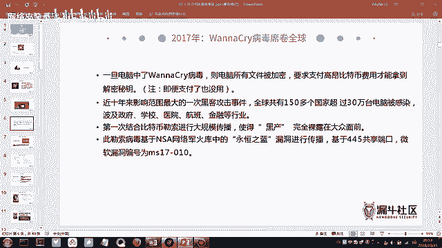
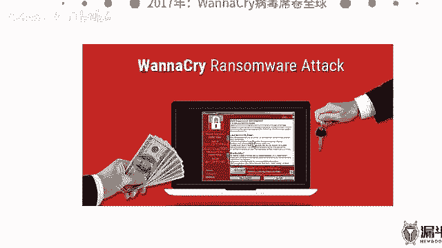
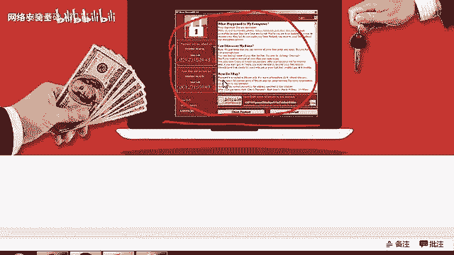
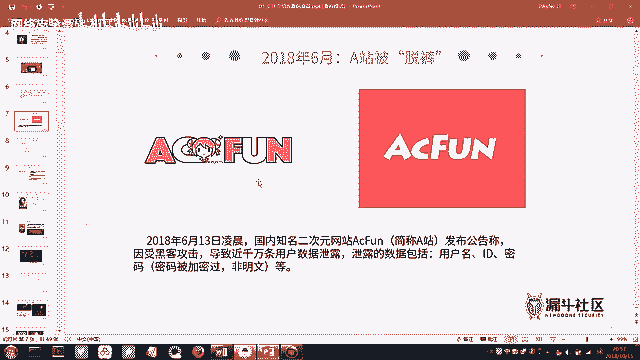
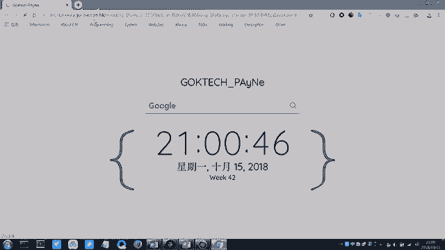
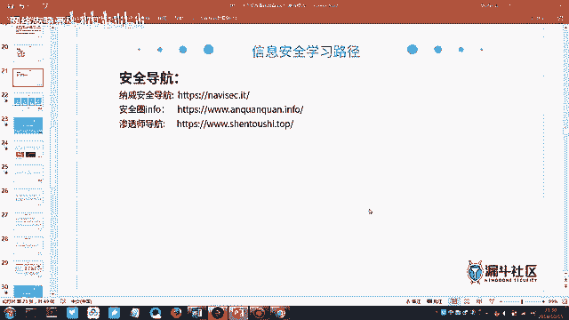
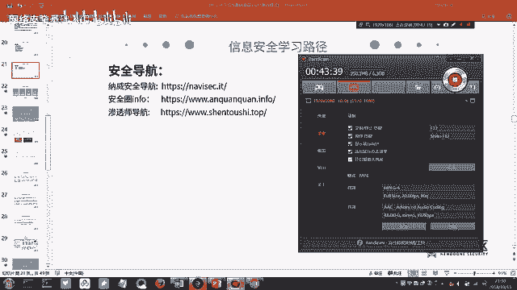

# CTF入门课程：1：CTF赛制介绍与信息安全基础 🛡️



在本节课中，我们将要学习CTF比赛的基本概念，并了解其背后的核心领域——信息安全。我们将从信息安全的定义出发，通过真实案例理解其重要性，并初步探索学习信息安全后可以从事的方向。

## 什么是信息安全？



我们所说的CTF比赛，涉及到的知识点都属于信息安全方向的范畴。信息安全本身包含非常多的方向，例如传统的网络安全、近年提出的源安全、Web安全、工控安全等。在学习时，无论学习什么知识，都应该树立一个知识体系框架，将零散的知识点填充进去，这样学习才会清晰高效。





以下是信息安全领域的一些主要方向：
*   **传统网络安全**：涉及网络基础设施的防护。
*   **源安全**：关注软件开发供应链的安全。
*   **Web安全**：专注于网站和Web应用的安全。
*   **工控安全**：保护工业控制系统免受攻击。





## 信息安全的概念与案例

国际标准化组织ISO对信息安全的官方定义是为了保护数据的**机密性、完整性和可用性**。这个概念可能有些枯燥，我们可以通过以下真实事件来更好地理解。

### 案例一：WannaCry勒索病毒
2017年爆发的WannaCry勒索病毒会加密受害者电脑中的文件，并要求支付比特币来解密。它对许多政企单位造成了严重损失，因为其中存储的往往是机密或重要文档。该病毒设置了支付时限，但事实上，即使支付了赎金，文件也往往无法恢复。



### 案例二：A站数据泄露
ACFun（A站）曾发生数据库被盗事件。数据库对一个网站至关重要，它存储了多年积累的所有用户数据。黑客获取数据库后，会进行“撞库”攻击，即用泄露的用户名和密码去尝试登录其他网站（如微信、QQ），因为很多人习惯在不同平台使用相同密码。这会导致连锁反应，造成更大范围的隐私泄露和财产损失。当时，约800万条用户数据在暗网标价40万人民币出售。

**撞库攻击**的核心逻辑可以用伪代码描述：
```python
# 假设获取了A站的用户数据
leaked_accounts = [('user1@mail.com', 'password123'), ...]




# 尝试用这些凭证登录其他网站
for email, password in leaked_accounts:
    if try_login('wechat.com', email, password):
        # 登录成功，账户被盗
        print(f"成功撞库: {email}")
```

### 关于暗网
上述事件中提到了“暗网”。我们日常访问的互联网只是“表层网络”，而“深网”和“暗网”则构成了网络世界的其余部分。暗网以其**隐匿性**著称，常使用洋葱路由等技术，难以追踪。它常被用于非法交易，包括数据买卖。暗网网站的域名后缀通常是 `.onion`。需要强调的是，暗网内容复杂，不建议深入探索。

## 信息安全的重要性：国家层面

信息安全是**网络空间安全**的核心。网络空间已被视为继海、陆、空、天之后的“第五空间”。因此，“没有网络安全就没有国家安全”并非空话。

一个著名案例是“震网”病毒事件。美国和以色列的情报机构利用该病毒，成功破坏了伊朗核设施的离心机，使其核计划大幅延迟。这预示着未来的国家间对抗可能越来越多地在网络空间展开。

正因为其重要性，国家层面非常重视网络安全人才培养。例如，由公安部主办的“网鼎杯”网络安全大赛，规模巨大，成绩优异者有机会被公安部或顶尖安全公司直接录用。

## 信息安全从业者：白帽子

在信息安全领域，站在防御和正义一方的从业者被称为**白帽子**，而进行非法攻击和破坏的则被称为**黑帽子**。

国内顶尖的白帽子代表包括：
*   **吴翰清（道哥）**：阿里巴巴首席安全科学家。传奇事迹包括在面试时黑掉阿里内网，以及通过爆破全公司邮箱密码来推动公司建立安全部门。
*   **余弦（钟晨鸣）**：前知道创宇技术VP，404实验室创始人，Web安全领域专家，著有《Web前端黑客技术揭秘》。后创立专注于区块链安全的“慢雾科技”。

## 学习信息安全可以做什么？

学习信息安全后，可以从事多种有趣且有价值的工作：

### 1. 漏洞挖掘与提交（SRC）
许多公司和平台设有“安全应急响应中心（SRC）”，白帽子可以向其提交发现的漏洞并获得奖金或积分奖励。例如：
*   **通用平台**：漏洞盒子、补天等，可提交各大厂商的漏洞。
*   **厂商专属SRC**：如腾讯安全应急响应中心、阿里安全应急响应中心等，只接收自家产品的漏洞。

在SRC排行榜上名列前茅，是技术实力的证明，也能带来丰厚回报和职业机会。

### 2. 参加CTF等安全竞赛
CTF比赛是检验和提升安全技术的最佳途径之一。比赛类型丰富：
*   **省级/国家级**：如“海峡杯”、“网鼎杯”、“护网杯”。
*   **世界级**：如DEF CON CTF。
*   **厂商杯**：如“百度杯”。

通过比赛不仅可以赢得奖金，更是获得知名企业青睐的绝佳机会。

### 3. 参与技术交流
可以参加像Black Hat（黑帽大会）、KCon这样的顶级安全技术峰会，与全球的安全专家交流学习，了解前沿技术。

### 4. 职业发展
信息安全领域有明确的职业路径，例如**安全服务工程师**、**渗透测试工程师**、**安全研究员**等。这些岗位薪资丰厚，需求旺盛。

## 学习资源推荐

为了帮助大家入门和深入学习，这里推荐一些资源：

**推荐书籍**：
*   《白帽子讲Web安全》
*   《Web前端黑客技术揭秘》
*   《黑客攻防技术宝典：Web实战篇》

**导航网站**（包含大量学习链接和资源）：
*   **安全导航站1**：包含各类工具、论坛、博客链接。
*   **安全导航站2**：聚焦漏洞库、CTF平台和安全资讯。
*   **安全导航站3**：整合了学习路径、视频教程和社区。

---





本节课中我们一起学习了CTF与信息安全的基础概念。我们了解了信息安全的广泛内涵，通过WannaCry和A站泄露等案例认识了安全威胁的真实存在与严重性。我们也看到了信息安全在国家层面的战略意义，并认识了“白帽子”这一职业角色。最后，我们展望了学习信息安全后可以参与的漏洞挖掘、CTF竞赛等实践方向，并为大家推荐了入门资源。从下节课开始，我们将逐步深入CTF比赛的具体赛制和工具使用。