# CTF入门课程：P24：命令注入1 - 网络安全基础入门

## 概述
在本节课中，我们将学习CTF比赛中一种常见的漏洞类型——命令注入。我们将了解如何通过Web应用程序从外部执行目标主机的系统命令，最终目标是获取主机的访问权限、提升至root权限，并取得对应的flag值。

---

## 实验环境搭建
上一节我们介绍了命令注入的基本概念，本节中我们来看看具体的实验环境配置。

攻击机使用Kali Linux，其IP地址为 `192.168.1.106`。
靶场机器的IP地址为 `192.168.1.104`。

在CTF比赛中，主要目标是获取靶场机器上的flag值。所有操作都应围绕获取flag以及控制靶场机器（root权限）这一目标展开。

---

## 第一步：外围信息探测
在发起攻击前，首先需要对靶场机器进行信息收集。以下是信息探测的常用方法。

### 使用Nmap扫描服务
首先，我们使用Nmap扫描靶场机器开放的服务及其版本信息。
执行命令：
```bash
nmap -sV 192.168.1.104
```
Nmap会向靶场发送数据包并根据响应分析结果。

除了扫描版本，还可以使用以下命令进行更全面的主机信息扫描：
```bash
nmap -A -v -T4 192.168.1.104
```
参数 `-T4` 表示以较快的速度发送数据包，加快扫描进程。

### 使用Nikto和Dirb扫描Web目录
如果靶机开放了HTTP服务，可以使用Nikto和Dirb扫描其目录和文件信息。

使用Nikto扫描：
```bash
nikto -h http://192.168.1.104
```
Nikto会分析HTTP响应，并列出发现的目录、文件（如 `robots.txt`）以及支持的HTTP方法（如GET、POST）。

使用Dirb扫描目录：
```bash
dirb http://192.168.1.104
```
Dirb会尝试枚举服务器上的目录和文件。

---

## 第二步：信息分析与利用
探测完信息后，需要从结果中挖掘可利用的线索。例如，开放了HTTP服务，就可以用浏览器访问敏感页面。

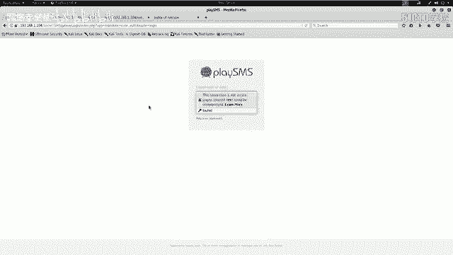

访问扫描发现的 `robots.txt` 文件，发现它禁止爬取某些目录。我们需要手动访问这些目录。
访问 `/nosuch` 目录时，页面显示“Not Found”。但与真正的404页面略有不同。查看该页面的HTML源代码，发现注释中隐藏了密码信息：
```
my secret pass: freedom, password, hello world!, I love root
```
这些密码可能在后续步骤中使用。

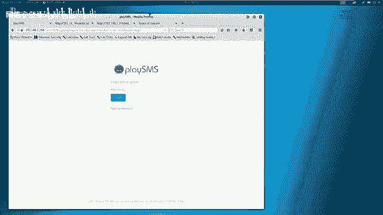

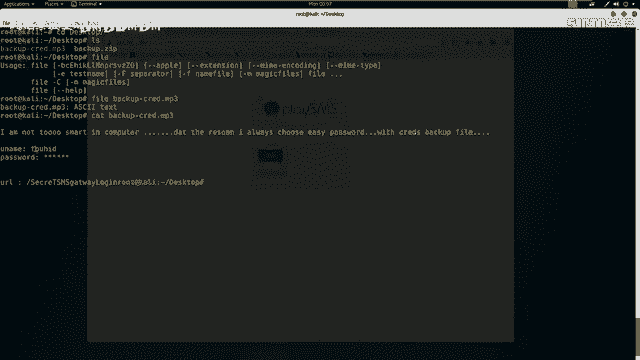

继续访问其他目录，在 `/secret/` 目录下发现一个备份文件 `backup.zip`。下载该文件。

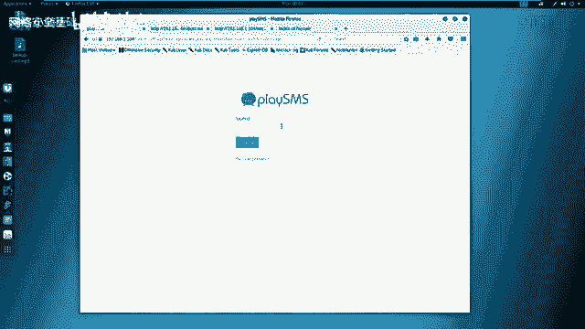

---

## 第三步：解密与深入
解压 `backup.zip` 需要密码。联想到之前在 `robots.txt` 的注释中发现的密码，尝试使用 `freedom` 解压，成功。

解压出的文件名为 `backup.mp3`。使用 `file` 命令检查其真实类型：
```bash
file backup.mp3
```
结果显示它是一个ASCII文本文件。使用 `cat` 查看内容：
```bash
cat backup.mp3
```
文件内容显示，它使用简单密码（如 `freedom`）加密，并包含用户名 `touchID` 和一个被星号隐藏的密码。同时，文件中还包含一个URL。

将URL复制到浏览器中访问，发现一个登录界面。使用用户名 `touchID` 和之前发现的密码列表进行尝试。最终，使用密码 `drowssap` 成功登录系统后台。

---

## 第四步：漏洞搜索与验证
登录系统后，需要判断该系统是否存在已知漏洞。系统名为“playSMS”。使用 `searchsploit` 工具搜索相关漏洞：
```bash
searchsploit playSMS
```
搜索结果显示存在一个“不严格的文件上传”漏洞（2017年5月14日）。漏洞描述指出，在 `sdfromfile.php` 文件中，由于缺乏有效的文件验证，注册用户可以上传任意文件。

根据公开的漏洞详情（PoC），我们需要访问 `sdfromfile.php` 页面。在网站中找到该页面，它是一个文件上传点。

按照PoC提示，首先在攻击机桌面创建一个CSV文件：
```bash
touch 1.csv
```
然后通过网站上传该文件。

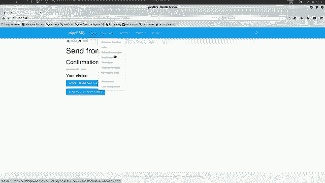

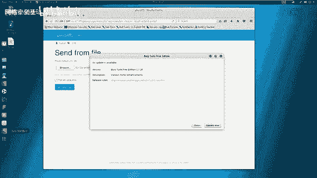

---

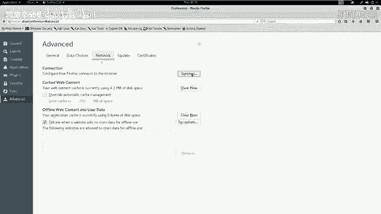

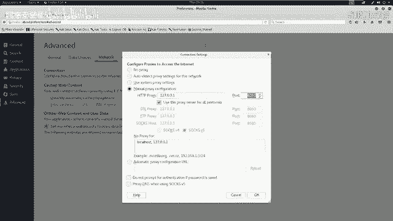

## 第五步：利用漏洞执行命令
为了修改上传请求并注入恶意代码，我们需要使用Burp Suite工具。

1.  配置浏览器代理指向Burp Suite（默认端口8080）。
2.  在Burp Suite中拦截上传 `1.csv` 文件的HTTP请求。
3.  将拦截到的请求发送到“Repeater”模块。
4.  在Repeater中，修改 `filename` 参数，将其值从 `1.csv` 替换为包含PHP代码的字符串，例如：
    ```
    test.php; system("uname -a");
    ```
5.  发送修改后的请求。查看响应，可以看到系统成功执行了 `uname -a` 命令，并返回了Linux系统信息。

这证明了 `filename` 参数存在命令注入漏洞，我们可以通过注入PHP代码来执行任意系统命令。

---

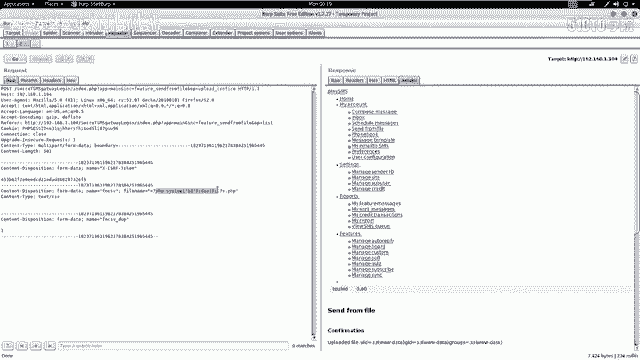

## 总结
本节课我们一起学习了命令注入攻击的初步流程：
1.  **信息收集**：使用Nmap、Nikto、Dirb等工具扫描目标，发现开放服务、目录和敏感文件。
2.  **信息分析**：分析扫描结果，访问可疑目录，查看源代码，挖掘隐藏信息（如密码）。
3.  **漏洞发现**：利用获取的凭证登录系统，并使用 `searchsploit` 查找已知漏洞。
4.  **漏洞验证**：根据漏洞详情，构造恶意请求（如文件上传），并利用Burp Suite修改请求参数，成功注入并执行系统命令。

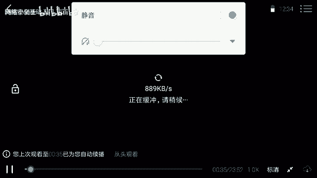

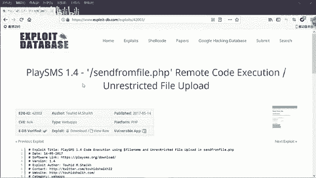

通过以上步骤，我们实现了从外部对靶场服务器的初步命令执行。下节课我们将学习如何利用此漏洞进一步获取服务器权限。