# CTF入门课程：P27：CTF综合测试 - 网络安全基础入门 🛡️


在本节课中，我们将学习如何通过Web应用程序的安全漏洞进行渗透测试，最终目标是获取目标主机的最高权限（root权限）或找到CTF比赛中的flag值。我们将从信息收集开始，逐步分析并利用发现的漏洞。

## Web安全概述

随着Web 2.0、社交网络、微博等新型互联网产品的诞生，基于Web环境的互联网应用越来越广泛。在企业信息化过程中，各种应用都架设在Web平台之上，Web业务的迅速发展也引起了黑客的强烈关注。


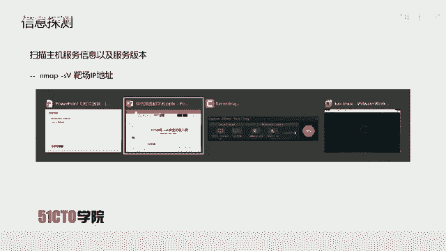

黑客利用网站操作系统的漏洞和Web应用程序的SQL注入漏洞等，获取Web服务器的控制权限。轻则篡改网页内容，重则窃取企业内部重要数据。更为严重的是在网页中植入恶意代码，例如植入挖矿脚本（如挖掘比特币、门罗币等虚拟货币），使网站访问者受到侵害。

## 实验环境搭建


以下是本次实验的环境配置：
*   **攻击机IP地址**：`192.168.253.12`
*   **靶机IP地址**：`192.168.253.13`

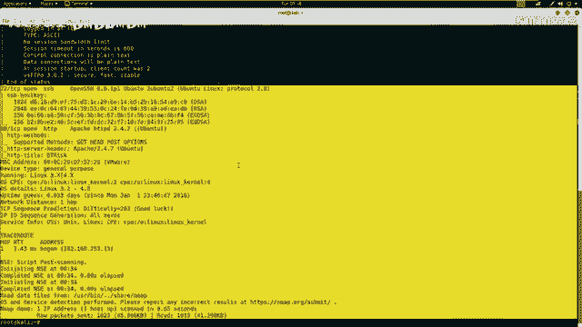

渗透测试的目标是获取靶机的root权限。在CTF比赛中，目标则是找到靶机上的flag值。

## 信息收集与探测

在开始测试前，我们需要对目标进行信息收集，深入了解其开放的服务和潜在弱点。

### 使用Nmap扫描服务

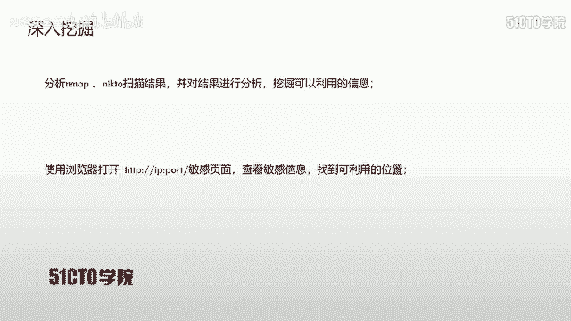

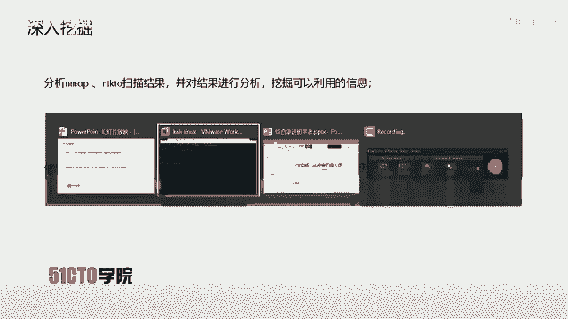

我们可以使用Nmap工具扫描靶机开放的服务及其版本信息。

**基本服务与版本扫描命令**：
```bash
nmap -sV 192.168.253.13
```
执行此命令后，Nmap会向目标IP发送数据包，并将处理后的服务信息显示在标准输出中。

**全面信息扫描命令**：
为了获取更全面的信息，可以使用Nmap的`-A`参数进行全功能扫描，并用`-T4`指定较快速度，`-v`显示详细过程。
```bash
nmap -A -v -T4 192.168.253.13
```
命令参数的顺序可以调整，不影响执行结果。扫描完成后，结果将输出到终端。

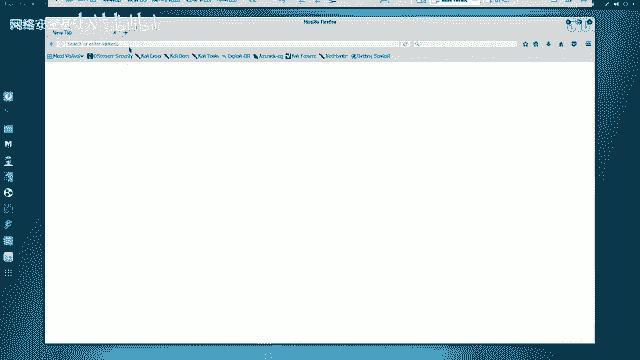

### 使用其他工具扫描Web目录

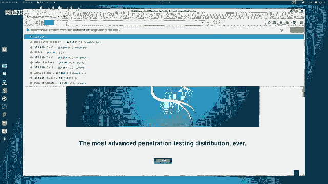

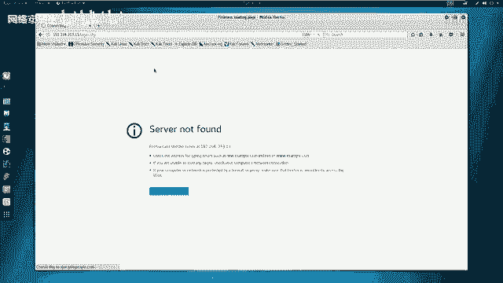

除了Nmap，我们还可以使用专门工具扫描Web服务的目录和敏感文件。

**使用Nikto扫描**：
Nikto是一款Web服务器扫描器，用于发现潜在的危险文件和配置。
```bash
nikto -h http://192.168.253.13
```
如果Web服务运行在默认的80端口，端口号可以省略。否则需要指定，例如`http://192.168.253.13:8080`。

**使用Dirb扫描**：
Dirb是一个Web内容扫描器，通过字典攻击来寻找隐藏的目录和文件。
```bash
dirb http://192.168.253.13
```
Dirb会探测靶机上可能存在的目录和文件信息。


## 信息分析与漏洞挖掘

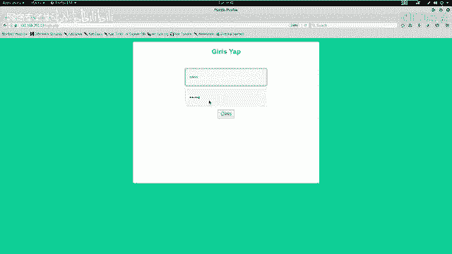

在收集到大量信息后，下一步是从中挖掘出可利用的漏洞点。

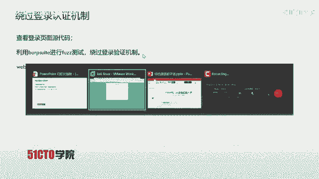

以下是分析扫描结果时的主要思路：
1.  **检查登录界面**：是否存在SQL注入漏洞，可能直接绕过认证进入系统后台。
2.  **查找敏感信息泄露**：例如扫描到的`config.php`文件，可能包含数据库认证信息。
3.  **识别Web框架**：检查站点是否使用了已知的CMS（如WordPress、Joomla）等框架，这些框架可能存在公开的漏洞利用方式。
4.  **注意备份文件**：备份文件（如`.bak`, `.old`）中可能包含源代码、配置文件等，可通过代码审计发现逻辑漏洞。
5.  **保持敏锐观察**：在实际渗透和CTF中，需要对每个文件和目录都保持警惕，善于发现隐藏信息。

### 初步分析结果

分析之前的扫描结果，我们注意到：
*   开放了21端口（FTP）、22端口（SSH）和80端口（HTTP）。
*   Nikto扫描发现了一个敏感文件 `config.php`，可能包含数据库凭据。
*   发现了一个登录页面 `login.php`。

### 深入测试登录页面

我们访问登录页面 `http://192.168.253.13/login.php` 进行测试。尝试使用常见弱口令（如admin/admin）登录失败。

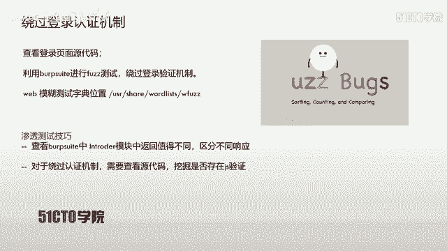

**查看页面源代码**：
在页面源代码底部，发现了一段JavaScript验证代码：
```javascript
// 示例代码逻辑：提取用户名中“@”后的部分进行验证，并对密码进行简单检查。
if (pwd == '\'') {
    alert('黑客攻击！');
} else if (pwd != '\'' && str != 'btrisk.com') {
    alert('...');
} else {
    // 执行登录
}
```
代码显示，当密码为单引号 `'` 时会触发警告，这强烈暗示后端可能存在SQL注入漏洞。同时，用户名需要以 `@btrisk.com` 结尾。

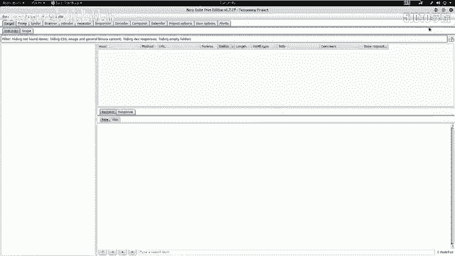

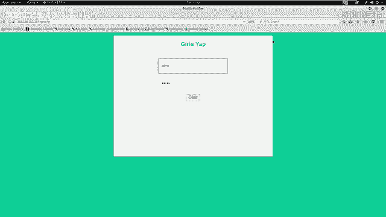

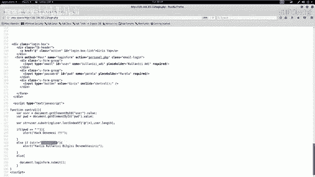

## 利用漏洞绕过认证

基于代码分析，我们决定对密码字段进行**模糊测试（Fuzz Testing）**，以验证和利用潜在的SQL注入。

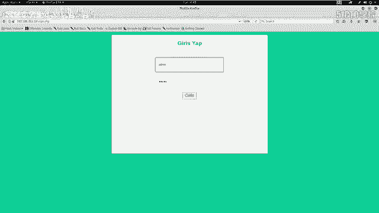

**模糊测试原理**：通过自动化工具向目标输入大量测试数据，根据服务器返回响应的差异（如页面长度、状态码）来判断输入是否有效。在登录场景中，成功和失败返回的页面长度通常不同。

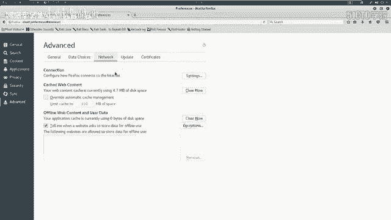

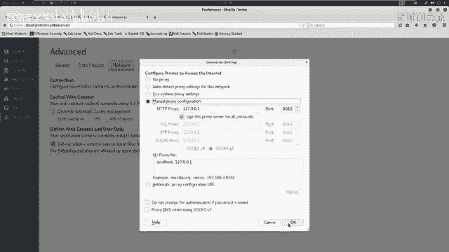

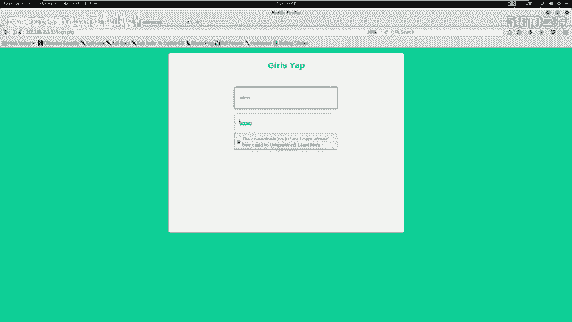

**操作步骤**：
1.  配置浏览器代理（如Burp Suite），拦截登录请求。
2.  在Burp Suite的`Intruder`模块中，将密码字段设为攻击点（Payload Position）。
3.  选择Payload。这里使用Kali Linux自带的SQL注入测试字典：`/usr/share/wordlists/fuzzdb/attack/sql-injection/detect/GenericBlind.txt`。
4.  开始攻击，观察不同Payload对应的响应长度（Length）。

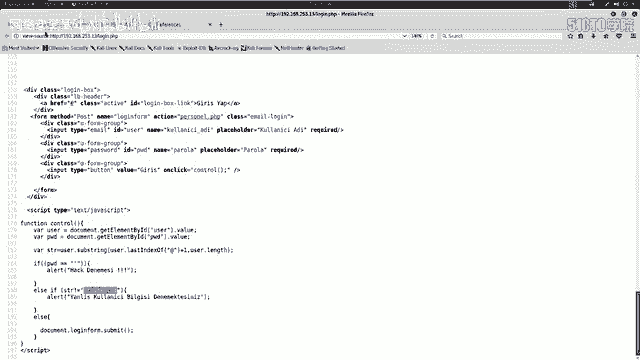

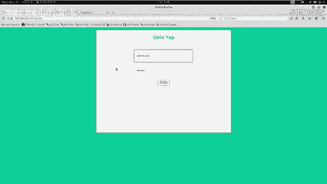

**测试结果分析**：
攻击结果显示，大多数请求返回长度为2044或2203，表示登录失败。但其中一个Payload对应的请求返回长度为2900，与其他均不同。

在浏览器中直接访问这个特殊请求的响应内容，发现成功跳转到了一个**文件上传功能页面**。这证实我们通过SQL注入绕过了登录认证。

## 上传功能测试与绕过

成功进入系统后，我们发现了文件上传功能。通常，这是获取WebShell（从而控制服务器）的关键入口。

**初步测试**：
*   上传一个图片文件（如`.jpg`）成功。
*   尝试直接上传一个PHP Webshell文件（如`.php`）被阻止，页面提示不允许上传该类型文件。

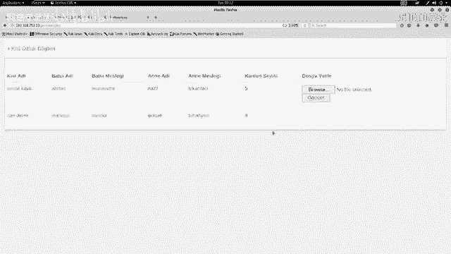

这表明应用程序存在前端或后端的文件类型检测机制。直接上传恶意PHP文件失败。

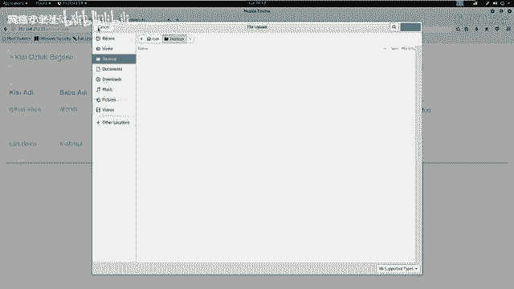

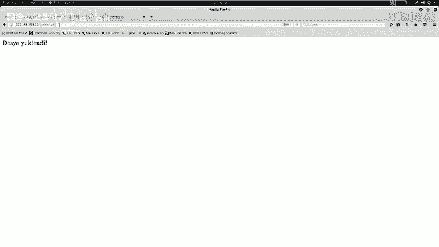

## 本节总结

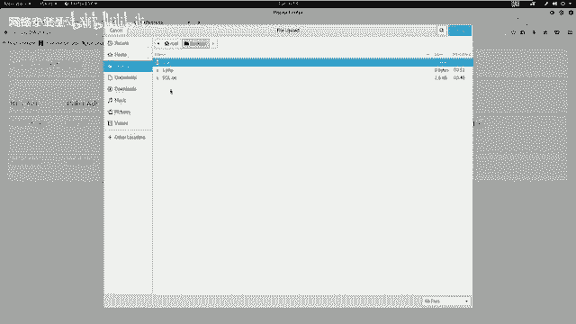

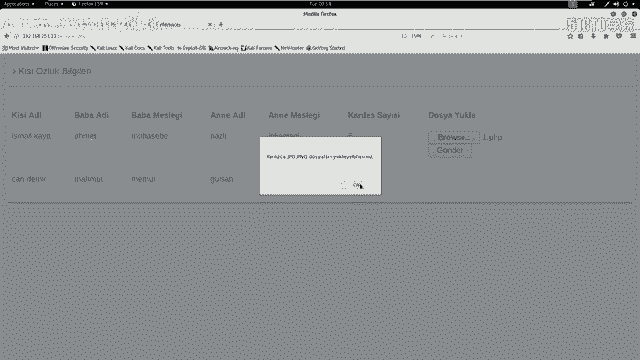

本节课中，我们一起学习了Web渗透测试的初步流程：
1.  **信息收集**：使用Nmap、Nikto、Dirb等工具扫描目标，获取服务、目录和文件信息。
2.  **漏洞分析**：分析扫描结果，重点关注登录界面、敏感文件、已知框架漏洞和备份文件。
3.  **漏洞利用**：通过分析登录页面的JavaScript代码，推测存在SQL注入，并使用Burp Suite的Intruder模块进行模糊测试，成功绕过登录认证。
4.  **功能点测试**：在进入的后台中发现文件上传功能，并进行了初步测试，发现存在上传限制。

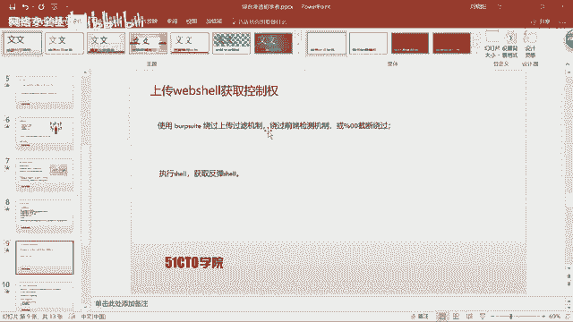

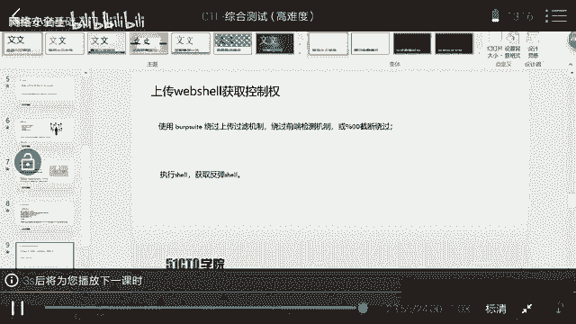

我们成功完成了从外部信息收集到突破边界（登录认证）的过程。下一节课，我们将重点探讨如何**绕过上传检测机制**，从而上传WebShell并最终获取服务器权限。