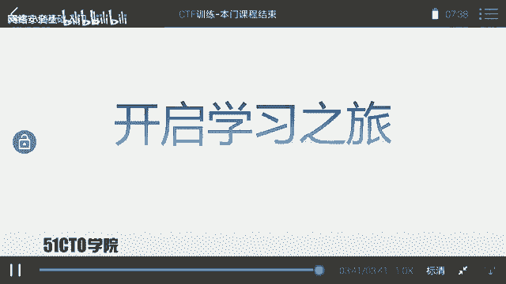
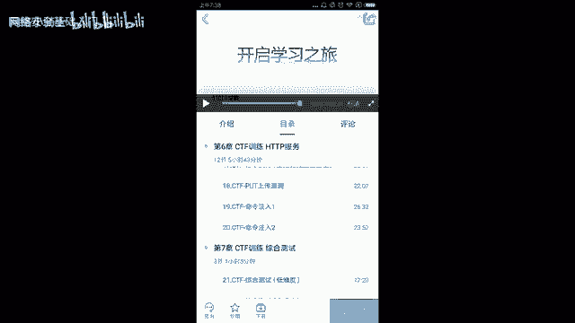

# CTF入门课程：P29：课程总结 🎯

在本节课中，我们将对之前所学的CTF基础知识进行回顾与总结，并展望未来的学习路径。

## 课程回顾

上一节我们完成了课程的主体内容学习，本节中我们来对整个课程进行梳理。

CTF是一种流行的信息安全竞赛形式，其英文名可译为“夺旗赛”。其大致流程是：参赛团队之间通过进行攻防对抗、程序分析等形式，率先从主办方给出的比赛环境中得到一串具有一定格式的字符串或其他内容，并将其提交给主办方，从而夺得分数。为了方便称呼，我们把这样的内容称之为 **`flag`**。

在CTF比赛中，涉及的内容比较繁杂。参赛者需要利用所有可以利用的方法获得对应的`flag`。这要求参赛者具备开阔的思路来挖掘隐藏的信息。

通过本门课程的学习，大家基本掌握了CTF比赛中的一些基本套路，可以完成一定难度靶场中`flag`的寻找。

## 学习方法与持续进步

然而，本门课程并不能确保你立即成为技术高手。通往高手的道路相当漫长。在接下来的时间里，大家需要不断学习，不断进步，以缩短与高手之间的距离。

在信息安全或CTF学习中，我们需要不断实践与尝试，才能更快地进步。同时，学习也需要有系统的方法、对应的课程以及训练环境。

## 后续课程预告

以下是讲师计划后续推出的系列课程，旨在帮助大家深入学习：

*   **代码审计课程**：专门教授如何挖掘软件中的漏洞，并编写对应的概念验证代码 **`POC`**。
*   **WiFi安全课程**：将使用高度集成的工具测试WiFi安全性，并涉及最新的测试方法，例如中间人攻击 **`MITM`** 和直接修改WiFi密码 **`WPA/WPA2`** 等技术。
*   **Metasploit模块编写课程**：教授如何编写一个 **`Metasploit`** 模块来进行自动化安全测试。
*   **CTF高端训练课程**：提升课程难度，旨在使大家对CTF有更深入的了解，并全面提升安全实战能力。

## 总结与鼓励

本节课中，我们一起回顾了CTF的基本概念、竞赛形式以及本课程的收获。大家的学习尚未成功，仍需努力。让我们保持热情，共同开启接下来的学习之旅。

