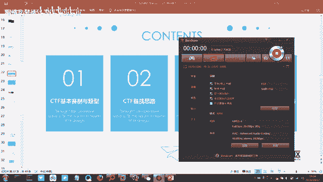
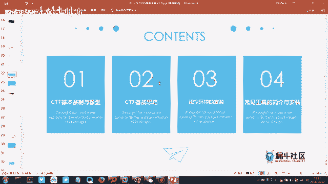
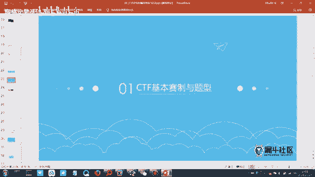
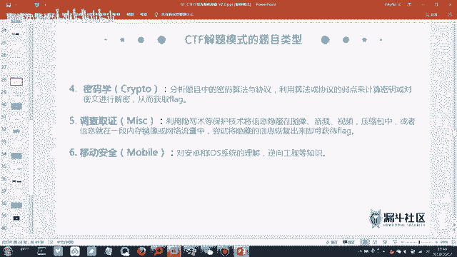
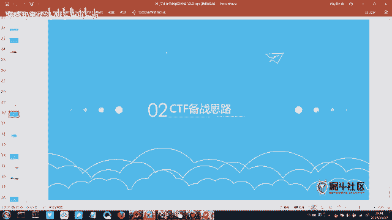

# CTF入门课程：2：CTF赛制介绍与工具安装

在本节课中，我们将要学习CTF比赛的基本赛制、常见题型以及为参赛需要准备的核心工具和环境。通过本节课，你将了解如何开始你的CTF学习之旅。

## 概述

上节课我们介绍了信息安全的基本概念、行业趋势和职业方向。本节课中，我们正式进入CTF（Capture The Flag，夺旗赛）的学习模块。我们将首先解读CTF是什么，然后介绍其基本赛制和比赛模式，最后讲解备赛思路和必须安装的工具与环境。

## CTF基本赛制与题型

CTF的全称是Capture The Flag，即“夺旗赛”。这里的“旗”（Flag）通常指一个特定的字符串或目标，参赛者的核心任务就是通过各种技术手段找到并提交它。

CTF比赛起源于黑客技术交流大会，后逐渐演变为技术竞赛形式。比赛流程通常是：主办方部署题目服务器，选手通过外网访问平台解题。每道题目对应一个Flag，提交正确的Flag即可获得相应分数。题目难度不同，分值也不同。最终根据总分进行排名。

本次福建省赛事的平台由永信至诚公司提供，其旗下的“i春秋”是在线学习平台，“e春秋”则是比赛平台。

### 比赛模式

CTF主要有以下几种比赛模式：

1.  **解题模式（Jeopardy）**：这是最经典的模式。选手在题目列表中选择题目进行解答，获取Flag并提交得分。题目分数通常会随时间推移而降低，第一个解出题目的队伍（即“一血”）往往有额外加分。初赛通常采用此模式。
2.  **攻防模式（Attack-Defense）**：在此模式下，每个队伍不仅需要攻击其他队伍的服务器获取Flag，还需要防守自己的服务器不被攻破。队伍内部需要分工，一部分人负责攻击，一部分人负责防御。分数会因被攻击成功而扣减。
3.  **综合渗透模式**：这是介于解题和攻防之间的模式。选手无需相互攻击，只需攻击主办方提供的目标服务器，发现漏洞并获取Flag。本次比赛的决赛下午环节预计采用此模式。

**初赛与决赛的区别**：初赛多为线上赛，可以自由访问外网和使用搜索引擎。决赛则为线下赛，通常在隔离的内网环境中进行，无法访问外部互联网资源。

### 题目类型

了解游戏规则后，我们来看看“游戏关卡”——CTF的题目类型。以下是主要的五大类型：

1.  **Web安全（Web）**：考察网站相关的安全漏洞。常见考点包括：
    *   **SQL注入**：利用数据库查询漏洞获取数据。
    *   **跨站脚本（XSS）**：在网页中注入恶意脚本，盗取用户信息。
    *   **文件上传漏洞**：利用上传功能上传恶意文件，从而控制服务器。
    *   **代码审计**：分析给定的网站源代码，找出其中的安全缺陷。Web安全涉及知识点广泛，是CTF中的重要部分。

2.  **逆向工程（Reverse Engineering）**：考察对软件程序的分析能力。需要将编译后的程序（如.exe, .apk文件）进行反汇编、反编译，理解其运行逻辑，找到隐藏的Flag。这需要对编程语言和操作系统有较深理解。

3.  **二进制漏洞（Pwn）**：这是CTF中最难的题型之一。主要考察挖掘和利用软件本身的二进制漏洞（如缓冲区溢出），来获取系统权限或直接读取Flag。Pwn题分值通常很高。

4.  **密码学（Crypto）**：考察各种编码和解密技术。主要包括：
    *   **古典/现代密码**：如凯撒密码、RSA加密等。
    *   **编码转换**：如Base64、Hex（十六进制）编码等。
    *   **摘要算法**：如MD5、SHA系列（通常用于破解或碰撞）。解题关键是识别出使用了哪种加密或编码方式，然后用对应工具或脚本进行解码。

5.  **杂项（Misc）**：全称Miscellaneous，意为“混杂的”。这类题目范围极广，可能涉及信息隐藏、数字取证、数据分析、编程脚本、甚至图片处理、音频分析等。其特点是“杂”，入门相对容易，但综合题也可能很难。

**难度排序与备赛重点**：对于初学者，建议按照 **杂项(Misc) -> 密码学(Crypto) -> Web安全(Web)** 的顺序进行学习。逆向工程和二进制漏洞难度较大，在省级比赛中题目数量较少，初期可暂缓深入。将前三种类型的题目掌握好，就有很大机会获奖。

## 备赛思路与工具环境准备

上一节我们介绍了CTF的各种题型，本节中我们来看看如何针对性地进行准备，特别是需要搭建哪些必要的学习和比赛环境。

我们的课程将围绕四个模块展开：
1.  CTF基本介绍（赛制与模式）
2.  CTF备赛思路
3.  语言环境安装
4.  常用工具安装

### 核心语言环境安装

以下是解题过程中必须安装的三种语言运行环境：

*   **Java环境**：许多工具和题目附件需要Java环境才能运行。
    *   **安装建议**：安装JDK（Java Development Kit），并配置好`JAVA_HOME`环境变量。
*   **Python环境**：用于编写自动化脚本、解密或处理数据。
    *   **安装建议**：安装Python 3.x版本，并确保`pip`包管理工具可用。
*   **PHP环境**：用于本地调试Web题目，运行PHP代码。
    *   **安装建议**：可以安装集成的环境包（如XAMPP、PHPStudy），或者单独安装PHP解释器。

### 必备工具安装

以下是CTF比赛中几乎一定会用到的两个核心工具：

1.  **VMware Workstation / VirtualBox**：
    *   **作用**：虚拟机软件。用于创建隔离的测试环境，运行不同的操作系统（如Kali Linux），避免对宿主机造成影响。
    *   **安装说明**：下载安装包，按照指引完成安装。VMware需要许可证，可寻找可用密钥或使用免费替代品VirtualBox。

2.  **Burp Suite**：
    *   **作用**：强大的Web漏洞扫描器和代理工具。主要用于拦截、查看和修改浏览器与服务器之间的HTTP/HTTPS流量，是Web题目和渗透测试的利器。
    *   **安装说明**：下载社区版（免费）或专业版（需许可证）。社区版功能足够入门学习。安装后需要配置浏览器代理指向Burp Suite。

**其他工具**：课程提供的CTF工具包中包含大量其他工具（如Wireshark抓包、Stegsolve图片隐写分析工具等），可根据题目类型按需学习和使用。群文件中的思维导图提供了详细的工具安装指引。

## 总结

本节课中我们一起学习了CTF比赛的核心框架。我们首先了解了CTF是一项“夺旗”竞赛，并熟悉了其主要的解题模式、攻防模式和综合渗透模式。接着，我们详细剖析了Web、逆向、Pwn、密码学和杂项这五大题型的特点及难度，为初学者指明了从杂项、密码学到Web安全的进阶路径。最后，我们明确了备赛需要搭建的Java、Python、PHP语言环境，以及VMware虚拟机、Burp Suite代理工具等核心软件。理解这些赛制、题型和工具，是迈出CTF实战第一步的关键。下节课我们将开始动手实践，安装并使用这些工具。