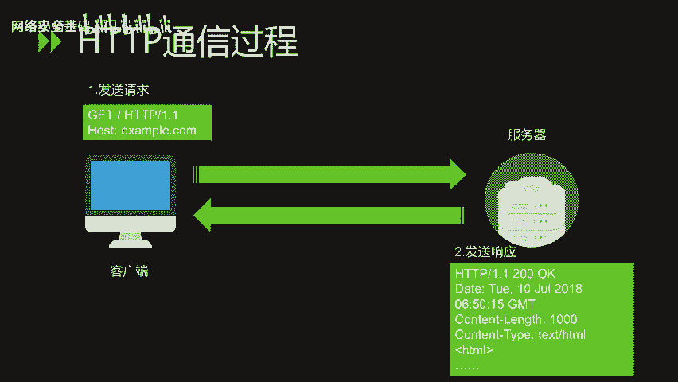
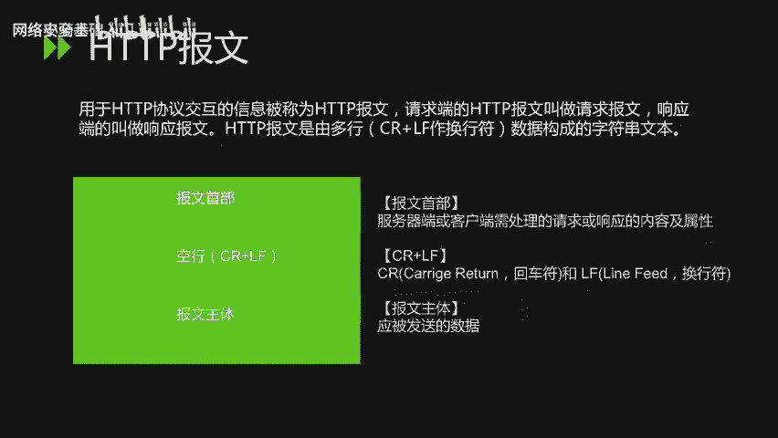
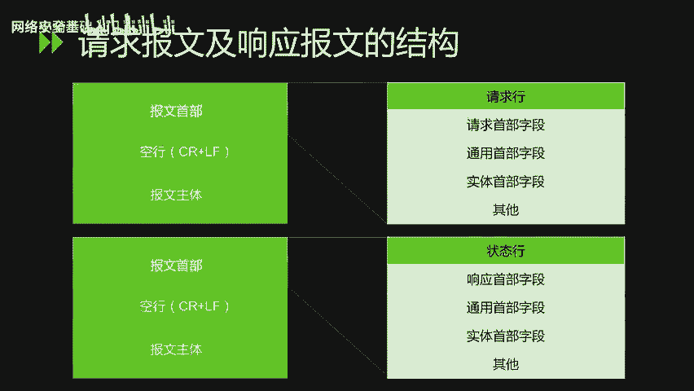
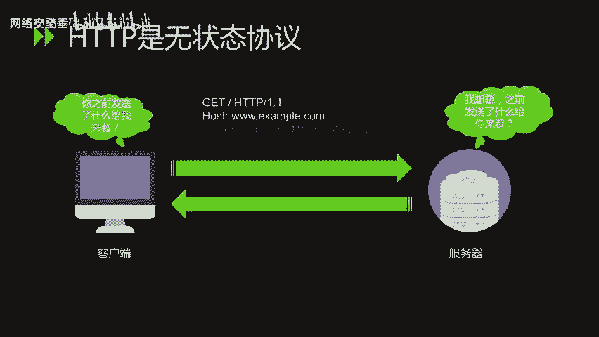
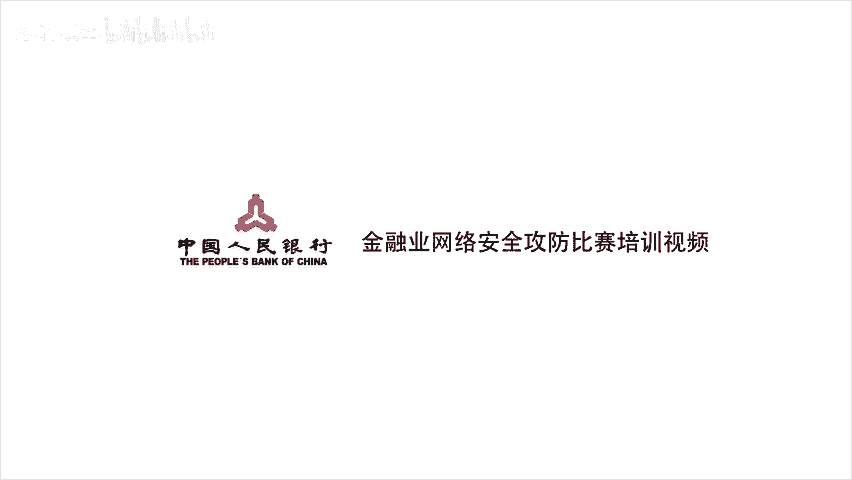

# CTF入门课程：P30：【第二节】30.HTTP协议分析_1 🔍

在本节课中，我们将要学习HTTP协议的基础知识，包括其发展历史、协议结构、请求与响应报文的构成，以及常见的状态码。理解HTTP协议是网络安全和CTF竞赛中Web题目分析的基础。

## HTTP发展史 📜

上一节我们介绍了网络基础，本节中我们来看看HTTP协议是如何发展而来的。

HTTP是超文本传输协议，它是目前互联网上应用最为广泛的一种网络协议，所有的WWW文件都必须遵守这个标准。设计HTTP最初的目的是为了提供一种发布和接收HTML页面的方法。HTTP协议和TCP/IP协议组内的其他众多协议相同，用于客户端和服务端之间的通信。HTTP是建立在TCP协议上进行通信的。

以下是HTTP发展的关键节点：
*   **1989年**：HTTP诞生。最初的设想是借助多文档之间相互关联形成的超文本，连接成可相互参阅的万维网。
*   **1990年**：HTTP/0.9版本问世。
*   **1996年5月**：HTTP正式作为标准被公布，当时是HTTP/1.0版本。
*   **1997年1月**：公布了HTTP/1.1，这是目前主流的HTTP协议版本。

## HTTP协议结构 🏗️

了解了HTTP的由来后，我们具体看一下它的通信过程与结构。

HTTP协议规定，通信先从客户端开始建立，服务端在没有接收到请求之前，不会发送响应。其基本过程是：客户端主动向服务端发起请求，服务端在接收到请求之后，会做出相应的响应。

在HTTP通信过程中，用于交互的信息单元称为**HTTP报文**。请求端发出的报文叫**请求报文**，响应端发出的叫**响应报文**。

HTTP报文是由多行数据构成的字符串文本，行之间使用CRLF（回车换行符）作为分隔符。报文大致可分为**报文首部**和**报文主体**两块。
*   **报文首部**：包含服务器或客户端需处理的请求或响应的内容及属性。
*   **空行**：CRLF，用于分隔首部和主体。
*   **报文主体**：应被发送的数据。

## HTTP请求报文 📤

接下来，我们深入分析请求报文的构成。

在请求报文中，报文的首部主要包含请求行、请求首部字段、通用首部字段、实体首部字段等。其核心结构如下：

**请求行** + **首部字段** + **空行** + **报文主体**

其中，**请求行**包含了决定报文性质的请求方法、请求目标资源的URI以及使用的HTTP协议版本。

以下是主要的HTTP请求方法：
*   **GET**：请求访问已被URI识别的资源。
*   **POST**：传输实体的主体。虽然用GET方法也可以传输实体的主体，但一般不用GET方法进行传输，通常还是使用POST方法。
*   **PUT**：传输文件。
*   **HEAD**：和GET方法一样，只是不返回报文主体部分，用于确认URI的有效性及资源更新的日期时间等。
*   **DELETE**：删除文件。
*   **OPTIONS**：查询针对请求URI指定的资源支持的方法。
*   **TRACE**：让Web服务器端将之前的请求通信环回给客户端，用于追踪路径。
*   **CONNECT**：要求用隧道协议连接代理，主要用于SSL/TLS加密流的传输。

## HTTP响应报文 📥

当服务器处理完请求后，会返回一个响应报文。现在，我们来看看响应报文的格式。

响应报文由协议版本、状态码、原因短语、可选的响应首部字段以及实体主体构成。其核心结构如下：

**状态行** + **首部字段** + **空行** + **报文主体**

其中，**状态行**中的**状态码**是一个三位数字，用于表示请求的结果是成功还是失败，并指示下一步动作。

HTTP状态码负责表示客户端HTTP请求的返回结果，标记服务器端的处理是否正常，或通知出现的错误。状态码主要分为5类：

以下是5类状态码的概括：
*   **1xx（信息性）**：接收的请求正在处理。
*   **2xx（成功）**：请求正常处理完毕。
*   **3xx（重定向）**：需要进行附加操作以完成请求。
*   **4xx（客户端错误）**：服务器无法处理请求，问题通常在客户端。
*   **5xx（服务器错误）**：服务器处理请求出错。

在日常上网或工作中，常见的状态码有以下几种：
*   **200 OK**：请求被服务器正常处理。
*   **301 Moved Permanently**：永久性重定向。请求的资源已被分配新的URI，以后应使用新URI。
*   **302 Found**：临时性重定向。请求的资源已被分配新的URI，希望用户本次使用新URI访问。
*   **304 Not Modified**：客户端发送附带条件的请求时，服务器允许访问资源，但未满足条件。返回此状态码时，不包含任何响应的主体部分。（附带条件的请求指采用GET方法的请求报文中包含If-Match, If-Modified-Since等首部）
*   **400 Bad Request**：请求报文中存在语法错误。
*   **401 Unauthorized**：请求需要通过HTTP认证。若之前已请求过一次，则表示用户认证失败。
*   **403 Forbidden**：对请求资源的访问被服务器拒绝。
*   **404 Not Found**：服务器上无法找到请求的资源。
*   **500 Internal Server Error**：服务器端在执行请求时发生错误。
*   **503 Service Unavailable**：服务器暂时处于超负载或正在进行停机维护，无法处理请求。

## HTTP的无状态性与Cookie 🍪

最后，我们需要理解HTTP的一个重要特性：无状态协议。

HTTP协议自身不对请求和响应之间的通信状态进行保存。也就是说，协议对于发送过的请求或响应都不做持久化处理。这样设计是为了更快地处理大量事务，确保协议的可伸缩性。

但是，随着Web业务的发展，因无状态而导致业务处理变得棘手的情况越来越多（例如用户登录状态保持）。为了实现保持状态的功能，引入了**Cookie**技术。有了Cookie技术，再通过HTTP协议通信，便可以管理状态。关于Cookie技术的详细讲解，将在下一节课进行。

---

本节课中我们一起学习了HTTP协议的发展简史、通信模型、请求与响应报文的详细结构，以及各类状态码的含义。我们还了解了HTTP作为无状态协议的特性及其解决方案Cookie的引入。掌握这些基础知识是进一步学习Web安全、分析CTF中Web题目的关键第一步。