# CTF入门课程：P31：HTTP协议分析_2 🔍

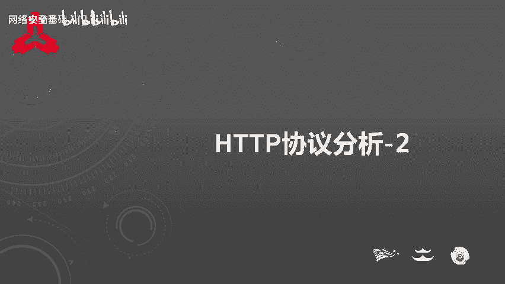

在本节课中，我们将深入学习HTTP协议的首部字段，并了解在CTF比赛中如何分析和利用这些字段来解题。课程内容分为两部分：HTTP首部字段的详细解析和基于这些知识的典型CTF题目讲解。

## HTTP首部字段概述

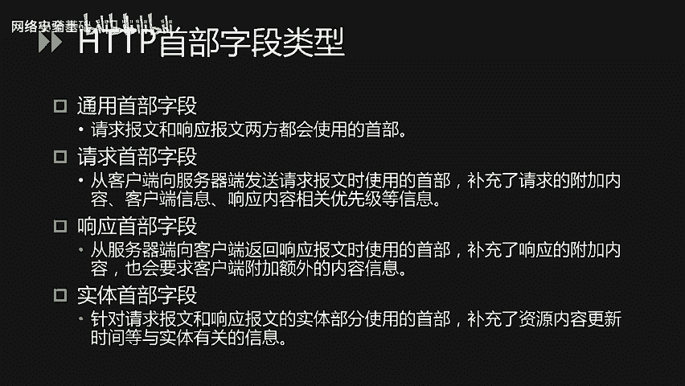

HTTP首部字段是构成HTTP报文的关键要素之一。在客户端与服务器之间进行HTTP通信时，无论是请求还是响应，都会使用首部字段来传递额外的重要信息。这些信息包括报文主体的大小、使用的语言、认证信息等。HTTP首部字段由字段名和字段值构成，中间用冒号分隔，并且单个字段可以包含多个值。

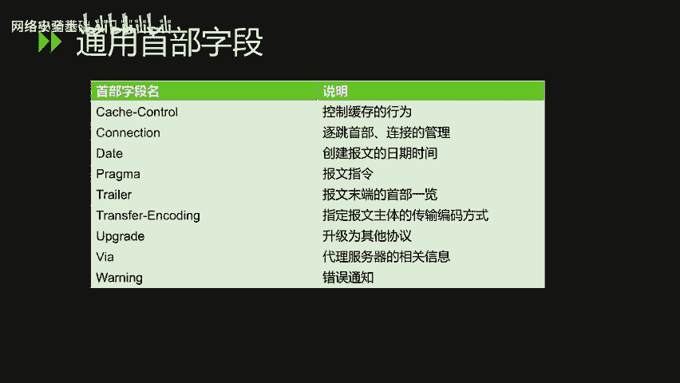

HTTP首部字段主要分为四种类型：通用首部字段、请求首部字段、响应首部字段以及实体首部字段。接下来，我们将对这四种类型进行详细分析。

## 通用首部字段

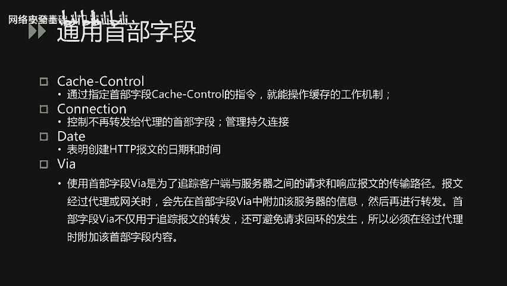

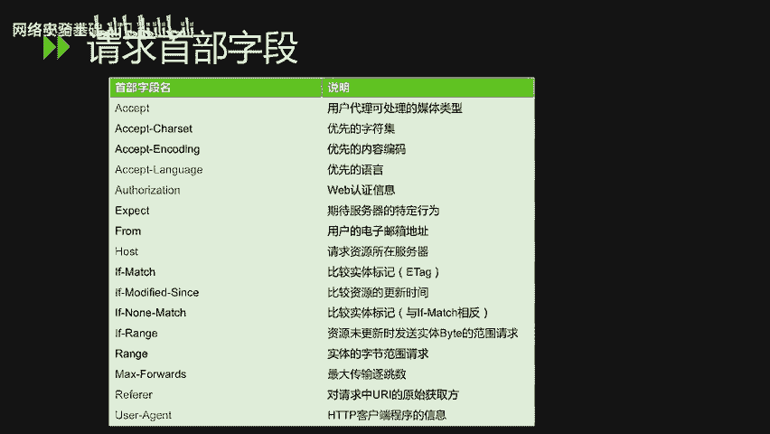

通用首部字段是请求报文和响应报文双方都会使用的首部。

以下是常见的通用首部字段及其作用：

*   **Cache-Control**：通过指定该字段的指令，可以操作缓存的工作机制。
*   **Connection**：该字段有两个主要作用。第一是控制不再转发给代理的首部字段，第二是管理持久连接。
*   **Date**：表明创建HTTP报文的日期和时间。
*   **Via**：为了追踪客户端与服务器之间请求和响应报文的传输路径。当报文经过代理或网关时，会先在首部字段`Via`中附加该服务器的信息，然后再进行转发。这不仅用于追踪，还可避免请求循环的发生，因此经过代理时必须附加此字段。

## 请求首部字段

请求首部字段是从客户端向服务器端发送请求报文时使用的首部，用于补充请求的附加内容、客户端信息、响应内容优先级等信息。

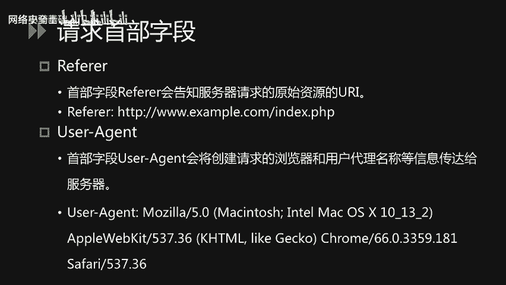

以下是常见的请求首部字段：

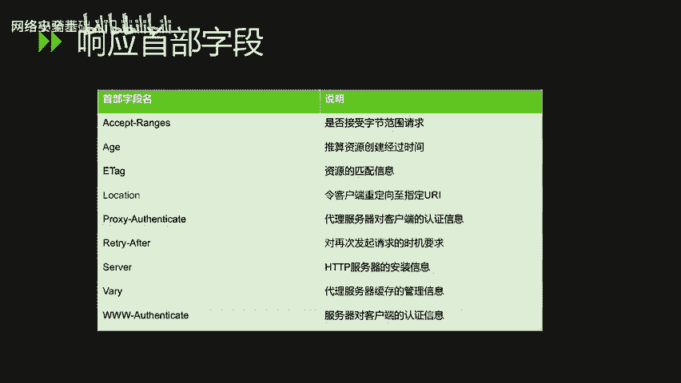

*   **Accept**：通知服务器用户代理能够处理的媒体类型及其相对优先级。可以使用`type/subtype`形式指定多种类型，例如文本文件`text/html`，图片文件`image/gif`或`image/jpeg`，应用程序`application/octet-stream`。服务器会根据权重值返回优先级最高的类型。
*   **Accept-Language**：告知服务器用户代理能够处理的自然语言集及其优先级。可以指定多种语言集，并用权重值`q`表示优先级。例如，客户端会优先请求中文版资源。
*   **Authorization**：告知服务器用户代理的认证信息。该字段的值通常是Base64编码（如Basic认证）。通常在收到`401`状态码后，客户端会在请求中加入此字段。
*   **Host**：告知服务器请求资源所在的主机名和端口号。在HTTP/1.1中，这是唯一一个必须包含在请求内的首部字段。当同一IP地址部署了多个域名时，必须用此字段明确指出请求的主机名。
*   **Referer**：告知服务器请求的原始资源URI。客户端通常会发送此字段，但出于安全性考虑（如原始URI含有token、密码等），有时也可不发送。
*   **User-Agent**：将创建请求的浏览器和用户代理名称等信息传达给服务器。

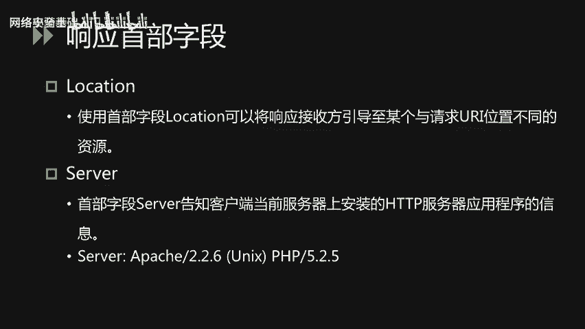

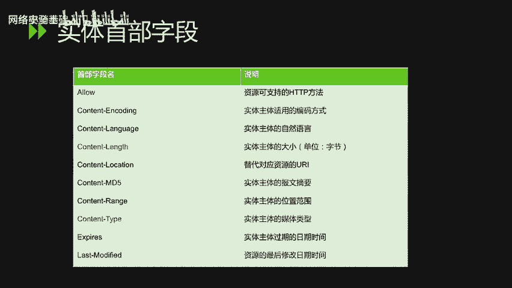

## 响应首部字段

响应首部字段是从服务器端向客户端返回响应报文时使用的首部，用于补充响应的附加内容，或要求客户端附加额外信息。

以下是常见的响应首部字段：

*   **Location**：将响应接收方引导至一个与请求URI位置不同的资源。该字段通常配合`3xx`重定向状态码使用，提供重定向的目标URI。
*   **Server**：告知客户端当前服务器上安装的HTTP服务器应用程序信息，通常包括软件名称和版本号。

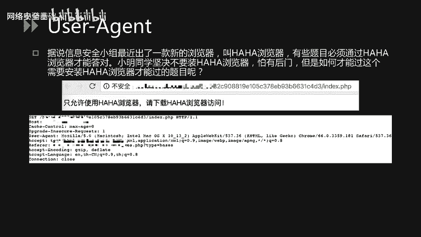

## 实体首部字段

实体首部字段是针对请求报文和响应报文的实体部分使用的首部，补充了与资源实体相关的信息，如更新时间等。

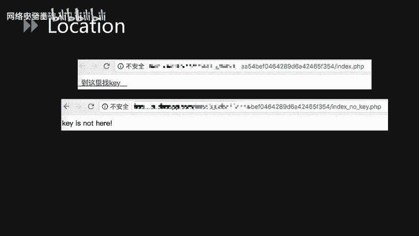

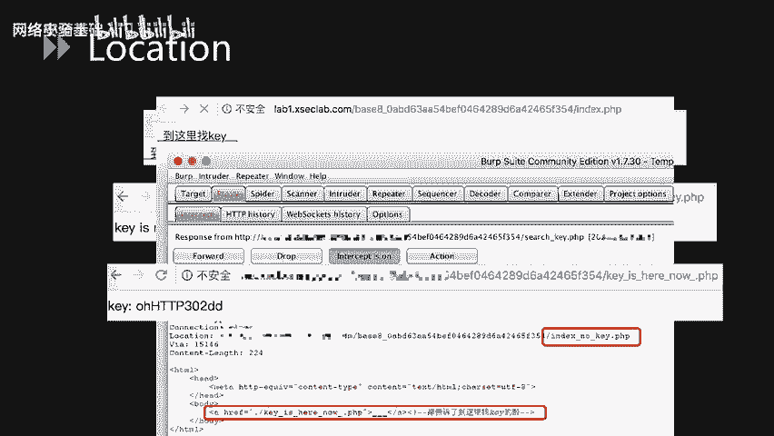

以下是常见的实体首部字段：

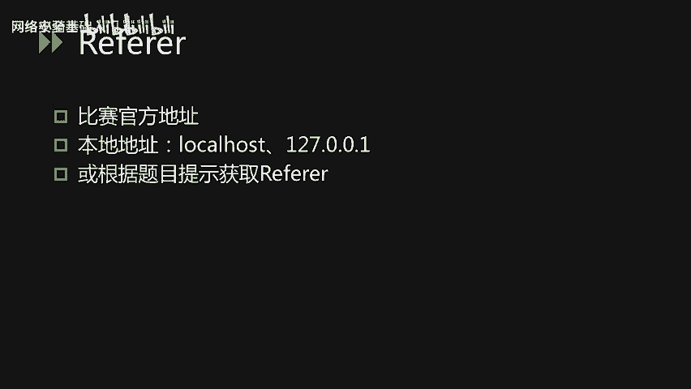

*   **Allow**：通知客户端服务器支持的所有HTTP方法（如GET, POST）。如果服务器接收到不支持的方法，会返回状态码`405 Method Not Allowed`。
*   **Content-Length**：指明实体主体部分的大小，单位是字节。
*   **Content-Type**：指明实体主体内对象的媒体类型，使用`type/subtype`形式赋值。

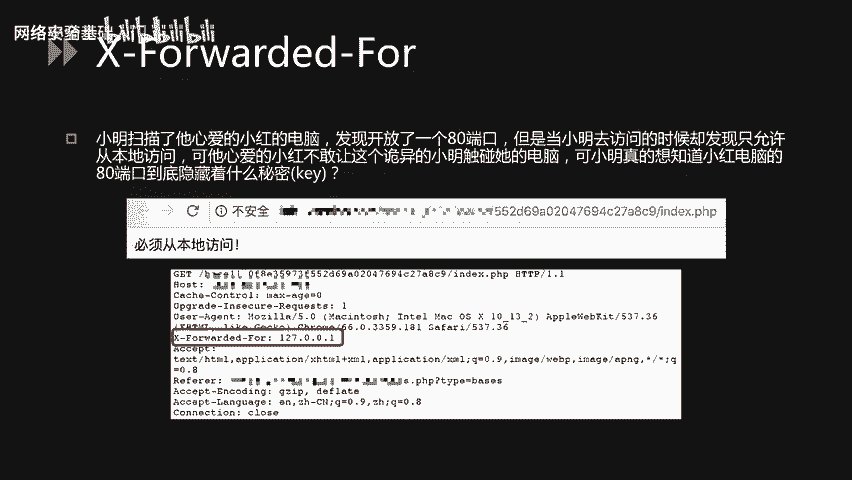

## CTF中的HTTP协议分析

上一节我们介绍了HTTP协议的各种首部字段，本节中我们来看看在CTF比赛中如何考察这些知识点。常见的考察点主要包括：请求方法、User-Agent、Location、Referer、X-Forwarded-For、Accept-Language、Cookie以及自定义首部字段。

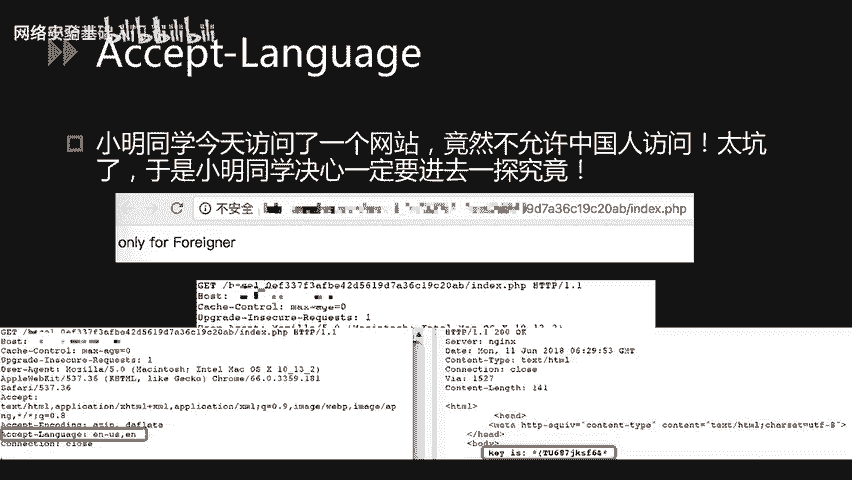

以下是针对各个知识点的典型题目场景分析：

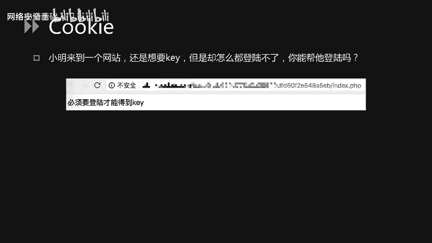

*   **请求方法 (Method)**：主要考察场景是GET请求被过滤器或WAF拦截时，可以通过将其转换为POST请求来绕过检测。在Burp Suite中，可以右键选择“Change request method”来一键切换GET和POST方法。
*   **User-Agent**：题目要求必须使用特定的浏览器（如“哈哈浏览器”）访问。解题时，使用Burp Suite拦截请求包，将`User-Agent`字段的值修改为题目要求的浏览器名称即可。
*   **Location**：题目页面有一个超链接，点击后跳转并显示“key is not here”。解题时，在点击链接时用Burp Suite拦截响应包，通常会看到一个`302`重定向响应，其`Location`字段或响应实体中可能隐藏了真正的key文件地址。
*   **Referer**：题目要求请求必须来自特定地址。解题时，使用Burp Suite拦截请求，根据题目提示将`Referer`字段的值修改为比赛官方地址、本地地址（如`127.0.0.1`）或其他指定地址。
*   **X-Forwarded-For**：题目要求必须从本地访问。解题时，使用Burp Suite拦截请求，添加`X-Forwarded-For`字段并将其值设置为`127.0.0.1`，即可伪造本地访问。
*   **Accept-Language**：题目页面显示“only for foreigner”（仅允许外国人访问）。解题时，使用Burp Suite拦截请求，将`Accept-Language`字段的值修改为`en`（英文）等非中文语言，即可绕过限制。
*   **Cookie**：题目要求登录后才能获取key，但无法正常登录。解题时，使用Burp Suite拦截请求，发现Cookie中有类似`login=0`的字段，将其篡改为`login=1`，即可伪造登录状态。
*   **自定义首部字段**：题目描述key就在当前页面。解题时，使用Burp Suite拦截服务器的响应报文，仔细检查响应头，可能会发现服务端自定义的首部字段（如`Flag`或`Key`），其值就是flag。

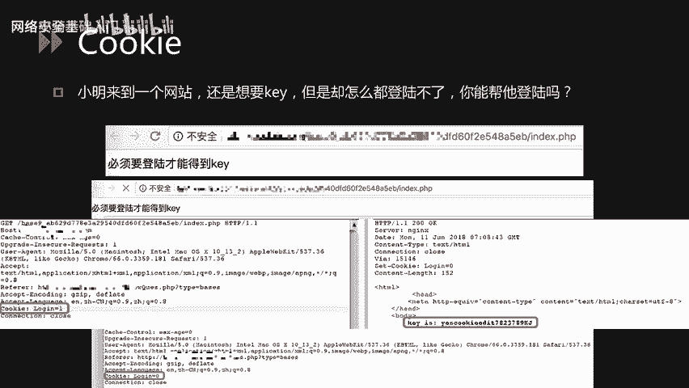

## 总结

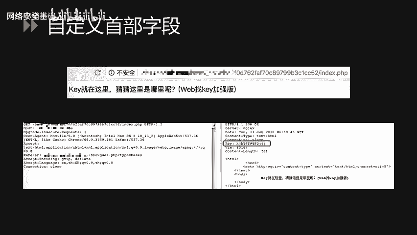

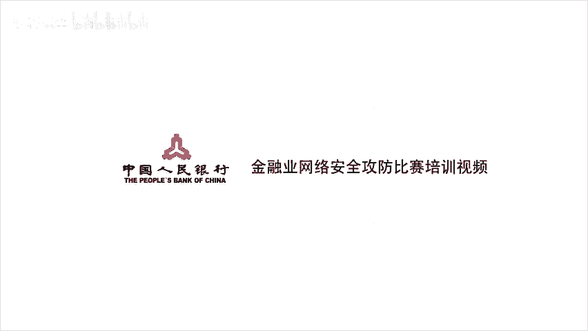

本节课中我们一起学习了HTTP协议中四种重要的首部字段：通用、请求、响应和实体首部字段，并了解了它们各自的作用和常见字段。随后，我们结合多个CTF真题，分析了如何利用这些首部字段的知识点来解题，包括修改请求方法、伪造User-Agent、分析重定向Location、设置Referer和X-Forwarded-For、切换Accept-Language、篡改Cookie以及识别自定义头部等技巧。掌握这些内容对于进行Web类CTF挑战至关重要。