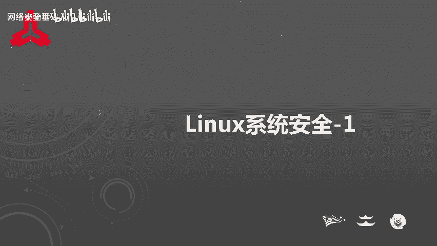
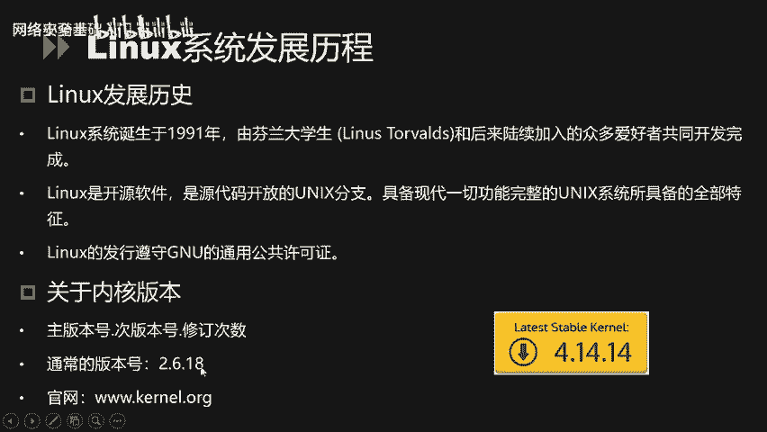
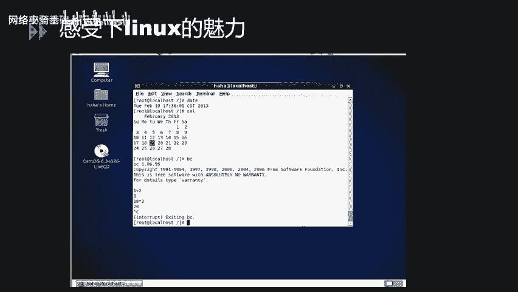
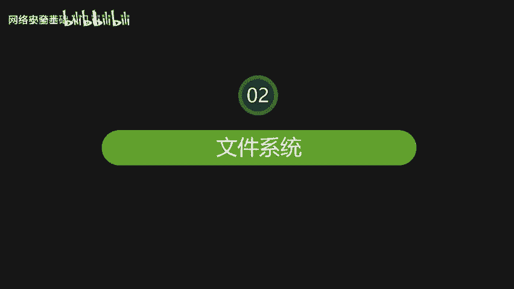
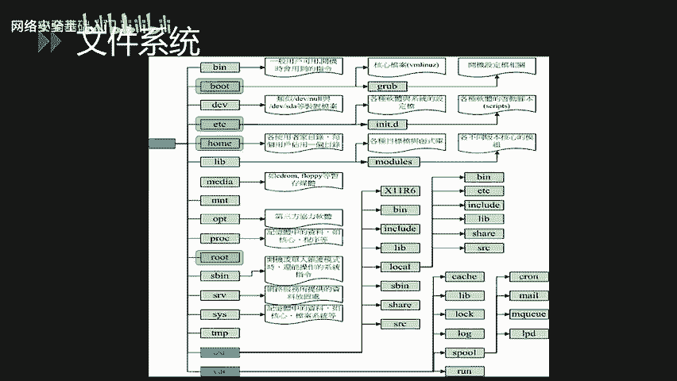
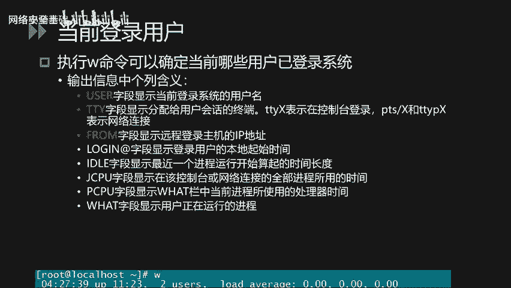
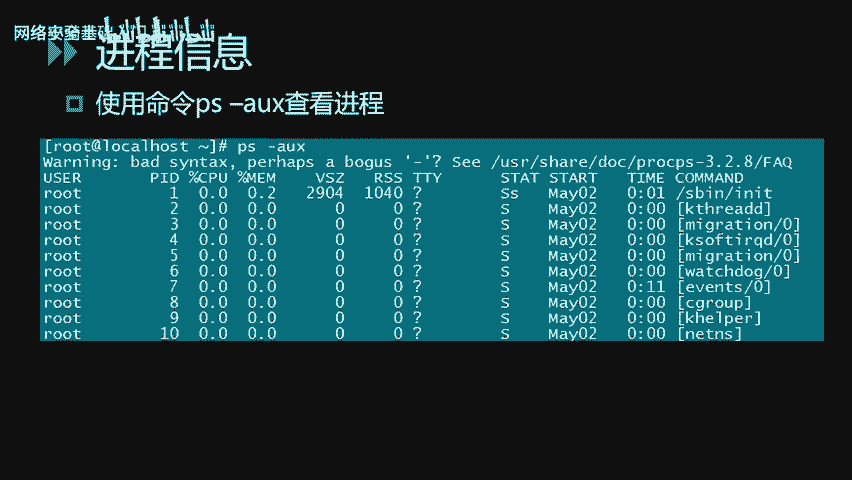
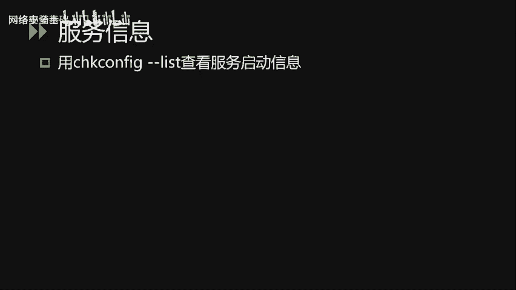

# CTF入门课程：32：Linux系统安全_1

在本节课中，我们将要学习Linux系统安全的基础知识。课程内容主要分为三个模块：Linux系统简介、Linux文件系统介绍以及Linux的基本操作。通过学习，你将能够理解Linux的基本概念、文件目录结构，并掌握一些常用的系统管理命令。

---

## 🐧 Linux简介

上一节我们概述了课程内容，本节中我们来看看Linux系统的发展历程和基本概念。

Linux系统诞生于1991年，由芬兰赫尔辛基大学的学生林纳斯·托瓦兹和后来陆续加入的众多爱好者共同开发完成。1994年，第一个完整的核心版本发布。由于Linux是开源软件，任何人都可以通过网络获取其核心源代码，进行修改后再贡献回社区。这使得Linux被广泛使用并迅速发展成为一个完整的操作系统。

Linux的标志是一只企鹅，它象征着开源精神。Linux系统可以安装在各种计算机硬件设备中，例如手机、平板电脑、路由器、视频游戏控制台以及大型计算机等。Linux是一个领先的操作系统，世界上运行最快的10台超级计算机都运行着Linux操作系统。

严格来说，“Linux”一词本身仅指Linux内核。但人们已习惯用“Linux”来指代整个基于Linux内核的操作系统。常见的Linux发行版包括：
*   **Red Hat**： 1993年创办。
*   **SuSE**： 1994年推出。
*   **Debian**： 1993年推出。
*   **Ubuntu**： 2004年推出。

简单来说，Linux是一个具有Unix系统全部特征的开源操作系统。

### Linux内核版本

Linux内核版本号由三部分组成：**主版本号.次版本号.修订次数**。例如，`2.6.18` 或 `4.14.14`。

其中，**次版本号**尤为重要：
*   如果次版本号为**偶数**（如2.6），表示这是一个**稳定版**，适合用于生产环境。
*   如果次版本号为**奇数**（如2.5），表示这是一个**开发版**，可能包含未修复的Bug，不建议用于生产环境。

因此，像 `2.6.18` 这样的版本常被用于生产环境。

### 学习环境搭建

对于初学者，可以通过虚拟机安装Linux来学习。目前许多发行版都提供了图形化界面（例如CentOS），这使得上手操作变得非常容易。

---

## 📁 Linux文件系统

了解了Linux的基本概况后，本节我们将深入探讨Linux的文件系统结构。

在Linux系统中，有一个非常重要的哲学：“**一切皆文件**”。系统将所有资源（包括硬件设备）都视为文件。每个硬件设备都被看作一个文件，通常称为设备文件。用户可以通过读写文件的方式来实现对硬件设备的访问。

Linux系统启动时，首先挂载的是**根文件系统**（`/`）。下图展示了Linux常见的树状目录结构：

以下是各主要目录的说明：

*   **`/bin`**： 存放**在单用户维护模式下仍可操作的基本指令**。这些指令可以被root用户和一般用户使用。
*   **`/boot`**： 存放**开机启动所需的文件**，包括Linux内核文件以及开机菜单配置文件等。
*   **`/dev`**： 在Linux系统上，**任何设备都以文件的形态存放在此目录中**。
*   **`/etc`**： **系统主要的配置文件目录**，例如用户账号密码文件、各种服务的启动脚本等。
*   **`/home`**： **系统默认的用户家目录**。
*   **`/lib`**： 存放**开机时用到的函数库**，以及`/bin`和`/sbin`目录下指令会调用的函数库。
*   **`/media`**： 用于挂载**可移动设备**，如软盘、光盘、U盘等。
*   **`/opt`**： 用于**给第三方软件提供安装目录**。
*   **`/root`**： **系统管理员（root）的家目录**。
*   **`/sbin`**： 存放**开机过程中所需的、包括开机修复和还原系统所需要的指令**。
*   **`/srv`**： 可以看作是“service”的缩写，存放一些**网络服务启动后所需调用的数据**。
*   **`/tmp`**： 让**一般用户或正在执行的程序暂时放置文件的地方**。

### 重要子目录说明

*   **`/usr/lib`**： 存放**各种应用软件的函式库、目标文件以及不常用的执行脚本**。
*   **`/usr/local`**： **系统管理员在本地自行安装软件时建议的安装目录**。
*   **`/var/lib`**： 存放**程序本身执行过程中需要使用到的数据文件**。
*   **`/var/log`**： **非常重要的目录**，用于存放**系统的关键日志记录文件**。
*   **`/etc/init.d/`**： 存放**系统服务预设的启动脚本**。

---

## 👤 系统账户配置文件

讲完目录结构，我们来看看与系统账户相关的重要配置文件。

### `/etc/passwd` 文件

此文件存储用户账户信息。以下是文件中的一行样例：
`test:x:1000:1000:Test User:/home/test:/bin/bash`

各字段含义如下：
1.  **用户名**： 用户登录名，如 `test`。
2.  **密码**： 早期密码直接存储于此。现在为了安全，密码移至 `/etc/shadow` 文件，此处用 `x` 代替。
3.  **用户ID (UID)**： 用户的唯一标识号。
    *   `0`： **管理员root账户**。
    *   `1-499`： **系统默认账号ID**。
    *   `500-65535`： **普通用户可登录的账号ID**。
4.  **组ID (GID)**： 用户所属的主要组ID。
5.  **描述信息**： 对账户的说明，如 `Test User`。
6.  **家目录**： 用户登录后的默认目录，如 `/home/test`。
7.  **登录Shell**： 用户登录后默认调用的Shell，如 `/bin/bash`。

### `/etc/shadow` 文件

此文件存储用户加密后的密码及相关信息。以下是密码字段的一个样例：
`test:$6$somesalt$encryptedhash:18000:0:99999:7:::`

密码域由三部分组成：`$ID$SALT$ENCRYPTED`。
*   **`ID`**： 加密算法标识。
    *   `1`： 使用 **MD5** 加密。
    *   `5`： 使用 **SHA-256** 加密。
    *   `6`： 使用 **SHA-512** 加密。
*   **`SALT`**： 一个固定长度的随机字符串，用于增加密码破解难度。
*   **`ENCRYPTED`**： 结合加密算法、盐值和原始密码生成的**加密后的密文**。

---

## 🖥️ Linux基本操作

掌握了Linux的文件系统后，本节我们将学习一些基本的系统操作命令，包括文件和目录管理、用户管理以及系统状态查看。

### 文件与目录管理

在Linux中定位文件或目录有两种方式：
*   **绝对路径**： 从根目录 `/` 开始写起，例如 `/home/test/file.txt`。
*   **相对路径**： 相对于当前工作目录，例如 `./file.txt` 或 `../dir/file.txt`。

以下是目录的基本操作命令：
*   `cd [目录路径]`： 改变当前目录。
*   `pwd`： 显示当前目录。
*   `mkdir [目录名]`： 创建新目录。
*   `rmdir [目录名]`： 删除空目录。
*   `ls`： 列出文件和目录。

### 文件权限管理

Linux文件系统的访问权限分为三类：**拥有人**、**拥有组**和**其他人**。每类都可以分配不同的权限组合：**读(r)**、**写(w)**、**执行(x)**。

*   使用 `ls -l` 命令可以查看文件或目录的详细权限信息。
*   `useradd`： 创建新用户。
*   `groupadd`： 创建新组。
*   `chown`： 更改文件的所有者。
*   `chgrp`： 更改文件的所属组。
*   `chmod`： 设置文件的权限。
*   `sudo`： 以超级用户权限执行命令。

### 用户安全管理

*   `useradd`： 添加用户。
*   `userdel -r`： 删除用户，`-r` 参数表示同时删除用户的家目录和邮件文件。
*   `passwd -l`： 锁定用户账户。
*   `usermod`： 修改用户属性，如账户有效期、登录目录等。
*   `id`： 查看当前用户的UID和GID。

### 查看系统状态

**查看登录用户**： 使用 `w` 命令。

各字段含义：
*   `USER`： 登录用户名。
*   `TTY`： 登录终端。`tty` 表示控制台登录，`pts` 表示网络连接。
*   `FROM`： 远程登录主机的IP地址。
*   `LOGIN@`： 登录时间。
*   `WHAT`： 用户正在运行的程序。

**查看开放端口**：
*   `netstat -tulpn`： 查看当前开放的端口及对应服务。
*   `lsof -i`： 显示进程和端口的对应关系。

例如，通过 `netstat` 发现3306端口开放，再通过 `lsof -i:3306` 或对比PID，可以找到是哪个进程（如MySQL）在使用该端口。

**查看进程信息**： 使用 `ps aux` 命令，可以查看进程的PID、内存和CPU使用率以及命令路径。

**查看服务信息**： 使用 `chkconfig --list` 命令，可以查看服务在不同运行级别下的启动状态。

Linux有6种运行级别：
*   0： 关机
*   1： 单用户模式
*   2： 无网络连接的多用户模式
*   3： 有网络连接的多用户模式（文本界面）
*   4： 保留未使用
*   5： 带图形界面的多用户模式
*   6： 重启

例如，如果 `mysqld` 服务在所有运行级别下都是“off”，则表示它不会随系统自动启动，需要手动启动。

---

## 📚 总结

本节课中，我们一起学习了Linux系统安全的基础知识。首先，我们了解了Linux的发展历史和内核版本规则。接着，我们深入探讨了Linux“一切皆文件”的哲学和核心的目录结构，并学习了重要的账户配置文件 `/etc/passwd` 和 `/etc/shadow`。最后，我们掌握了一系列基本的系统操作命令，包括文件目录管理、权限设置、用户管理以及如何查看系统进程、端口和服务状态。这些知识是进一步学习Linux系统管理和网络安全的重要基石。