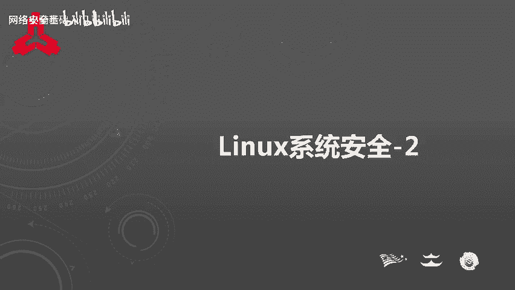
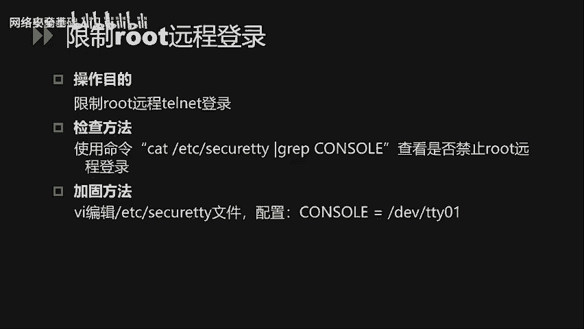
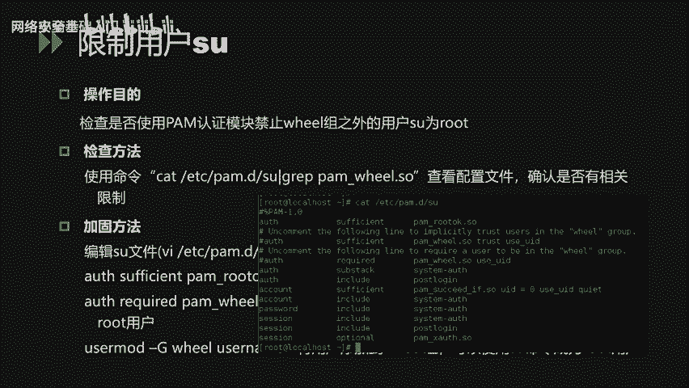
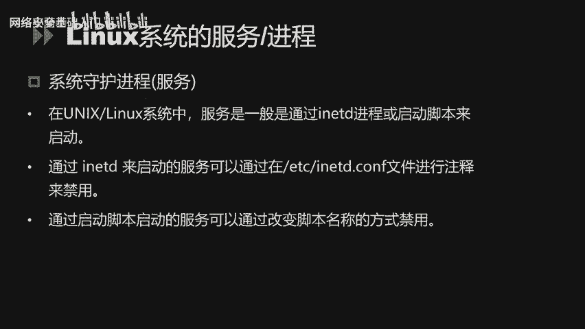
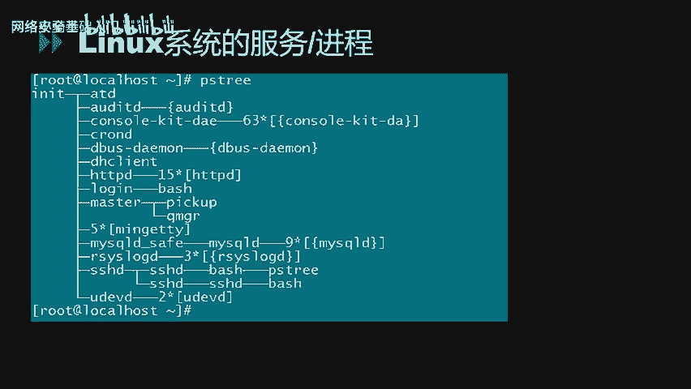
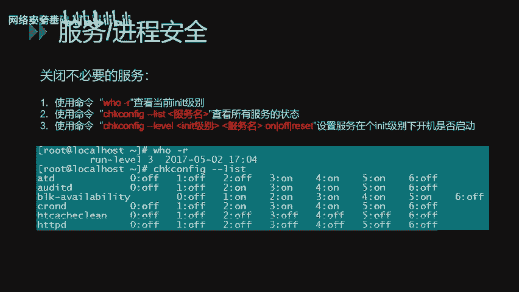
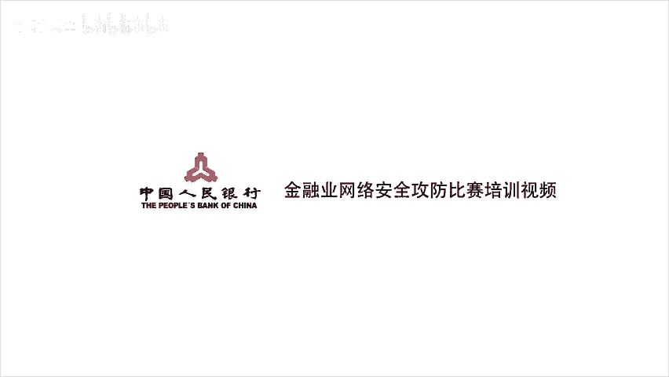

# Linux系统安全入门：P33：Linux系统安全_2



## 概述
在本节课中，我们将学习Linux系统安全配置的三个核心模块：常规安全配置、账户安全设置以及系统服务与进程的安全配置。这些知识是构建安全Linux系统环境的基础。

---

## Linux的常规安全配置 🔧

上一节我们介绍了课程的整体结构，本节中我们首先来看看Linux的常规安全配置。这部分主要涉及文件目录权限、umask值设置等内容。

### 文件与目录权限设置
针对一些重要的目录和文件，我们需要合理配置其权限以增强安全性。查看目录或文件当前权限可以使用 `ls -l` 命令。

对于重要的目录，可以使用 `chmod` 命令进行加固。例如，以 `/etc` 目录为例：
```bash
chmod -R 750 /etc
```
这样配置后，只有root用户可以读写和执行该目录下的文件，非root用户均不可访问。

通过 `chmod` 命令可以单独设置权限，但逐个设置非常繁琐。我们可以通过配置umask值来为新建的文件或目录赋予默认权限。

### umask值设置
Linux默认umask值为022。我们可以通过修改 `/etc/profile` 文件中的umask值来增强安全性。例如，将umask修改为027：
- 新建的文件属主具有读、写和执行权限。
- 同组用户只有读和执行权限。
- 其他用户无任何权限。

### 历史命令记录限制
Linux系统默认会记录最近输入的命令，并保存在隐藏文件 `~/.bash_history` 中。为提高安全性，避免非法用户通过查看历史命令获取敏感信息，我们可以限制历史命令的记录总数。

通过修改 `/etc/profile` 文件中的 `HISTFILESIZE` 和 `HISTSIZE` 值来实现限制：
- `HISTFILESIZE` 定义了在历史文件中保存的命令记录总数。
- `HISTSIZE` 定义了当前会话中记录的命令数。

例如，将这两个值都设置为5，即只保留最新执行的5条命令：
```bash
HISTFILESIZE=5
HISTSIZE=5
```

### 连接超时设置
为增加安全性，我们可以配置连接超时时间。若在规定时间内终端无任何操作，则自动断开连接。默认方法是修改 `/etc/profile` 文件中的 `TMOUT` 值。

例如，设置为180（单位：秒），表示3分钟内无操作则自动断开会话：
```bash
TMOUT=180
```

### root环境变量PATH安全设置
root环境变量PATH设置使得执行命令时无需输入绝对路径。但有时为了方便调试，运维人员会将点（`.`，代表当前目录）加入PATH环境，这会带来安全隐患。

例如，当用户在某个目录下执行 `ls` 命令时，如果PATH中包含点，且当前目录下存在一个名为 `ls` 的恶意脚本，系统就会执行该脚本而非系统的 `ls` 命令。

因此，root用户的PATH环境变量不应包含当前目录点。可以使用 `echo $PATH` 查看当前值，并通过修改 `/etc/profile` 文件来加固。

常规安全设置的内容如上，主要包括文件目录权限、umask值、历史命令记录和登录超时等。接下来，我们将针对Linux系统的账户安全设置进行讲解。

---

## Linux账户安全设置 👤

本节中我们来看看Linux账户的安全设置，主要包括账户的安全策略、口令策略和远程登录安全策略等。

### 禁用无用账号
减少系统无用账号可以降低风险。系统当前存在的账号可以通过 `cat /etc/passwd` 命令查看。

需要与管理员确认哪些账号是不必要的。在不影响业务系统的情况下，可以通过 `passwd -l` 命令锁定不必要的账号。同时，对于FTP等服务类型的账号，若不需要登录系统，应将其shell设置为 `/sbin/nologin`。

### 配置账号锁定策略
为防止攻击者通过口令爆破的方式攻击，我们可以配置账号锁定策略来降低风险。配置文件为 `/etc/pam.d/system-auth`。

例如，配置连续输错10次密码后，账户锁定5分钟：
- 设置 `deny=10`
- 设置 `unlock_time=300`（单位：秒）

账户锁定策略需要与管理员确认，确保不会影响业务系统登录。

### 检查空口令和特殊权限账号
禁用无用账号和配置口令策略后，还需检查存在的空口令账号和具有root权限的特殊账号。空口令账号是极大的安全隐患，必须整改。具有root权限的账号也必须严格检查，避免权限被非法使用。

以下是检查方法：
- **检查空口令账号**：对象是 `/etc/shadow` 文件。
- **检查root权限账号**：通过UID值判断，检查文件是 `/etc/passwd`。通常只有root的UID为0。

可以使用awk行处理器进行检查。例如，检查空口令账号：
```bash
awk -F: '($2=="") {print $1}' /etc/shadow
```
检查具有root权限（UID为0）的账号：
```bash
awk -F: '($3==0) {print $1}' /etc/passwd
```

### 配置口令周期策略
对于长期不使用或未定期修改密码的账号，可以通过配置口令周期策略强制用户定期修改密码，否则锁定账号。配置文件为 `/etc/login.defs`。

该文件有三个关键参数：
- `PASS_MAX_DAYS`：新建用户的密码最长使用天数。
- `PASS_MIN_DAYS`：新建用户的密码最短使用天数。
- `PASS_WARN_AGE`：新建用户的密码到期前提前提醒的天数。

同时，可以针对特定账号设置口令策略。例如，将某用户的密码最长使用天数设为30天，最短使用天数设为0，账号在2000年1月1日过期，过期前7天提示用户：
```bash
chage -M 30 -m 0 -E 2000-01-01 -W 7 username
```

### 配置口令复杂度策略
为避免空口令和弱口令，可以通过口令复杂度策略强制用户配置满足强度要求的口令。修改的配置文件为 `/etc/pam.d/system-auth`。

例如，要求口令至少8位，并包含一位小写字母、一位大写字母和一位数字：
```
minlen=8 lcredit=-1 ucredit=-1 dcredit=-1
```

### 限制root远程登录
对于root用户，需要限制其不能通过telnet或SSH远程登录。首先通过 `/etc/securetty` 文件查看当前配置，然后通过 `console` 参数配置对应的值来限制root只能在本地登录。

### 控制通过su命令获取root权限
必须严格限制root权限，避免非法用户使用。可以通过PAM认证模块控制通过 `su` 命令获取root权限的用户。

配置方法如下：
1.  修改 `/etc/pam.d/su` 文件，在文件开头添加配置：
    ```
    auth required pam_wheel.so group=wheel
    ```
    这表示只有 `wheel` 组的用户才能使用 `su` 命令。
2.  通过 `usermod` 命令将允许使用 `su` 的账号添加到 `wheel` 组：
    ```bash
    usermod -aG wheel username
    ```

### 防止通过单用户模式重置root密码
为防止他人通过物理接触，利用Linux单用户模式重置root密码，可以对系统的引导管理器（如GRUB）添加密码。



需要修改 `/etc/grub.conf` 文件，配置一个 `password` 字段并设置密码。

### 修改SNMP默认团体字
使用默认的只读团体字，攻击者可以收集目标网络中的大量信息（如接口地址、主机名、路由表），为攻击指明方向。而使用读写团体字则可能导致网络设备配置被下载或改写，从而被攻击者控制。因此，必须修改SNMP默认团体字。



修改方式为编辑 `/etc/snmp/snmpd.conf` 文件。如果不必要使用该服务，建议直接禁用SNMP服务。

### 使用第三方工具审计弱口令
最后，可以通过第三方工具检查系统中存在的弱口令账号。例如，使用 `john` 工具进行审计。

审计方式主要有两种：
1.  **单用户模式**：针对使用账号名作为密码的用户。工具会尝试用用户名的各种变体来爆破账号口令。
2.  **指定密码字典**：通过收集内部常见的弱口令，进行针对性的审计。

Linux系统的账户安全配置大致从账户权限、口令策略、弱口令审计等多方面进行了讲解。下面，我们将对Linux系统的服务和进程的安全配置进行讲解。

---

## Linux系统服务与进程安全配置 ⚙️

上一节我们探讨了账户安全，本节中我们来看看Linux系统的服务和进程安全配置。主要从进程的查看方法、常见服务的安全配置等方面进行说明。

### 服务与进程概述
在Linux系统下，每个启动的服务都会有对应的进程。服务其实就是运行在服务器上、监听用户请求的进程，通过不同的监听端口号来区分。

以下是常见服务及其默认端口：
- FTP服务：21端口
- SSH服务：22端口
- Telnet服务：23端口
- SMTP服务：25端口
- HTTP服务：80端口
- MySQL服务：3306端口

在Linux操作系统中，服务一般通过 `init` 进程或启动脚本来启动。
- 对于通过 `init` 进程启动的服务，可以通过修改 `/etc/inittab` 文件来配置启动或禁用。
- 对于通过启动脚本启动的服务，可以通过修改脚本名称的方式来禁用。

### 查看系统进程
我们可以使用 `pstree` 或 `ps` 命令来查看当前系统的运行状态。
- `pstree` 命令以树状图方式展现进程之间的派生关系，显示结果比较直观。
- `ps` 命令可以显示每个进程的PID、所属用户、CPU和内存使用情况等信息。

### 常见服务安全配置
下面针对Linux系统上常见的服务进行安全配置讲解。



#### SSH服务安全配置
SSH的配置文件默认为 `/etc/ssh/sshd_config`。我们可以通过修改该文件内的参数来增强安全性：
- **限制root远程登录**：修改 `PermitRootLogin` 参数为 `no`。
- **调整协议版本**：建议将 `Protocol` 调整为 `2`，因为版本1存在已知漏洞。
- **防止口令爆破**：调整 `MaxAuthTries` 的值，限制尝试登录次数。

修改SSH参数后，需要重启SSH服务才能使配置生效：
```bash
service sshd restart
```



#### TCP Wrappers服务安全配置
TCP Wrappers是一个工作在传输层的安全工具，对有状态连接的特定服务进行安全检测和访问控制。任何包含 `libwrap.so` 库文件的程序都可以接受TCP Wrappers的控制。

它的主要功能是控制谁可以访问哪些程序。常见程序如rpcbind、sshd、telnet等。

配置方法如下：
1.  在 `/etc/hosts.allow` 文件中配置允许访问本机服务的IP地址。
2.  在 `/etc/hosts.deny` 文件中配置拒绝所有其他IP地址。

例如，仅允许IP地址为 `192.168.1.100` 的主机访问本机的SSH服务：
- 在 `/etc/hosts.allow` 中添加：`sshd: 192.168.1.100`
- 在 `/etc/hosts.deny` 中添加：`sshd: ALL`

#### NFS文件共享服务安全配置
`exportfs` 命令用来管理当前NFS共享的文件系统列表。我们可以通过该命令查看当前的共享目录，确认不必要的共享。

之后，可以通过修改 `/etc/exports` 文件来删除不必要的共享目录。

#### 系统日志安全配置
`syslog` 是Linux系统的默认日志守护进程，配置文件为 `/etc/syslog.conf`。守护进程和内核提供了访问系统的日志信息，任何需要生成日志信息的程序都可以向syslog接口呼叫生成对应的日志。

我们可以修改配置，将特定级别的信息记录到指定的日志文件中。例如，将authpriv任何级别的信息记录到 `/var/log/secure` 文件中，以加强认证相关的安全日志记录。

同时，也可以针对系统日志和内核日志进行配置，按实际需求添加对应的日志记录条目。

#### 禁用危险快捷键
对于 `Ctrl+Alt+Del` 按键组合，在系统中默认用来重启系统。为避免误操作导致业务中断，可以禁用该功能。

修改 `/etc/inittab` 文件，在对应的行开头添加注释符 `#`，然后保存配置文件，并通过 `init q` 命令重新应用该文件即可。

#### 关闭不必要的服务
暴露的服务越多，风险越大，被入侵的成功率越高。因此，需要定期排查并关闭不必要的服务。

以下是排查步骤：
1.  使用 `runlevel` 命令查看当前的运行级别。
2.  使用 `chkconfig --list` 命令查看当前运行级别下自动启动的服务。
3.  使用 `chkconfig --level` 命令为对应的服务在对应的级别下设置默认的启动状态（开启或关闭）。

例如，查看运行级别3下自动启动的服务，并关闭不必要的服务。

---

## 总结 🎯

本节课我们一起学习了Linux系统安全配置的三大核心部分。



1.  **常规安全配置**：我们学习了如何通过设置文件目录权限、调整umask值、限制历史命令记录、配置连接超时以及加固PATH环境变量来构建基础的Linux安全环境。
2.  **账户安全设置**：我们探讨了如何通过禁用无用账号、配置账号锁定与口令策略、检查特殊权限账号、限制root远程登录、控制su命令权限以及使用工具审计弱口令，来全面加强系统账户的安全性。
3.  **服务与进程安全配置**：我们了解了服务与进程的关系，学习了如何查看进程，并针对SSH、TCP Wrappers、NFS等常见服务进行了安全配置讲解，同时还介绍了系统日志配置和关闭不必要服务的方法。



通过掌握这些知识，你可以为Linux系统建立起一道坚实的安全防线。