# CTF入门课程：P34：Linux系统安全_3 🔐


在本节课中，我们将要学习Linux系统安全的三个核心部分：网络安全配置、日志审计安全以及系统常见安全工具的使用。通过掌握这些知识，你将能够更好地保护Linux系统，并具备初步的安全分析和应急响应能力。

## 网络安全配置 🔧

上一节我们介绍了Linux系统的基础安全概念，本节中我们来看看如何配置网络以增强安全性。这部分主要包含网络参数配置和iptables自定义规则设置。

### 网络参数配置

系统中提供了`sysctl`命令，可以查看当前的网络参数。我们可以使用`sysctl -a`查看当前的网络参数配置。然后我们可以通过修改`/etc/sysctl.conf`这个文件内的参数来调整当前系统的网络参数配置。

例如，我们可以配置忽略ICMP广播，这样就不会对ping请求做出回应，从而无法通过ping来发现该主机。同时我们也可以通过修改TTL值来隐藏当前操作系统的正确类型，因为有些扫描器是通过系统返回的TTL值来判断当前的操作系统类型的。

完成修改配置后，我们可以通过`sysctl -p`命令来使配置生效。

### iptables防火墙

iptables是Linux内核集成的IP信息包过滤系统。如果系统连接到互联网或局域网，使用iptables可以更好地控制IP信息包过滤，实现防火墙功能。


以下是iptables命令选项的输入顺序：
*   `-t`：指定表。
*   `规则链名`：如INPUT, OUTPUT, FORWARD。
*   `规则号`：规则在链中的位置。
*   `网卡名`：如eth0。
*   `协议名`：如tcp, udp。
*   `源/目的端口`。
*   `动作`：针对匹配规则的数据包做出的行为。

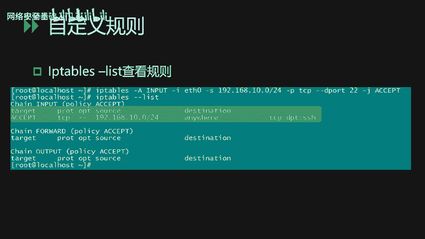

以下是常见的参数选项：
*   `-A`：向规则链中添加条目（新增规则）。
*   `-D`：从规则链中删除条目。
*   `-I`：在规则链中插入条目。
*   `-L`：查看当前已有的防火墙规则策略。
*   `-p`：匹配具体协议的数据包类型。
*   `-s`：匹配数据包的源IP地址。
*   `-j`：指定要跳转的目标（动作）。
*   `-i`：数据包进入本机的网络接口。
*   `-o`：数据包离开本机所使用的网络接口。

以下是规则链的主要内容：
*   **INPUT链**：处理输入的数据包（系统接收数据包）。
*   **OUTPUT链**：处理输出的数据包（本系统向外发的数据包）。
*   **FORWARD链**：处理转发的数据包。

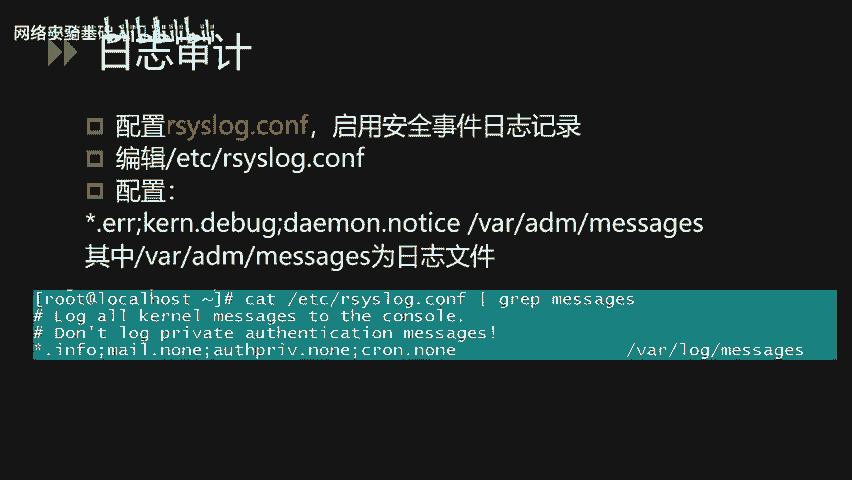

常见的动作有：
*   **ACCEPT**：接收该数据包。
*   **DROP**：丢弃该数据包。
*   **REDIRECT**：将数据包重定向到另一个指定位置。

下面我们看几个具体的iptables例子。

**示例1：限制SSH访问**
```bash
iptables -A INPUT -s 192.168.0.0/24 -p tcp --dport 22 -j ACCEPT
```
这条规则限制仅从`192.168.0.0/24`网段内的IP地址才能够连接到本机的22端口（SSH服务），从而限制访问本机SSH服务的主机范围。

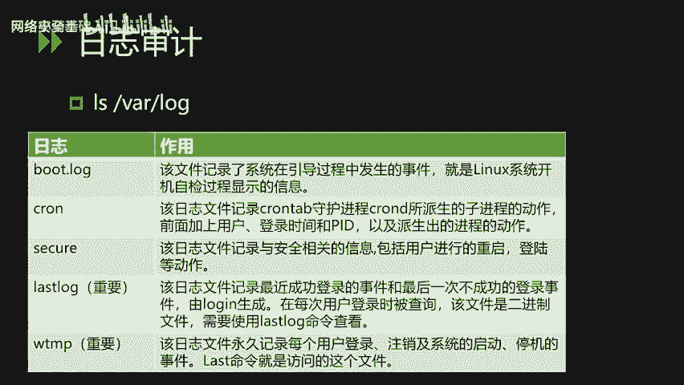

**示例2：限制外发UDP连接**
```bash
iptables -A OUTPUT -o eth0 -p udp -j DROP
```
这条规则限制本机`eth0`网卡无法向外发起UDP连接，所有向外的UDP包都会被丢弃。

添加完自定义规则后，我们可以通过`iptables -L`命令来查看当前的所有规则链。规则链通常分为三块：INPUT（进入）、FORWARD（转发）和OUTPUT（外发）。

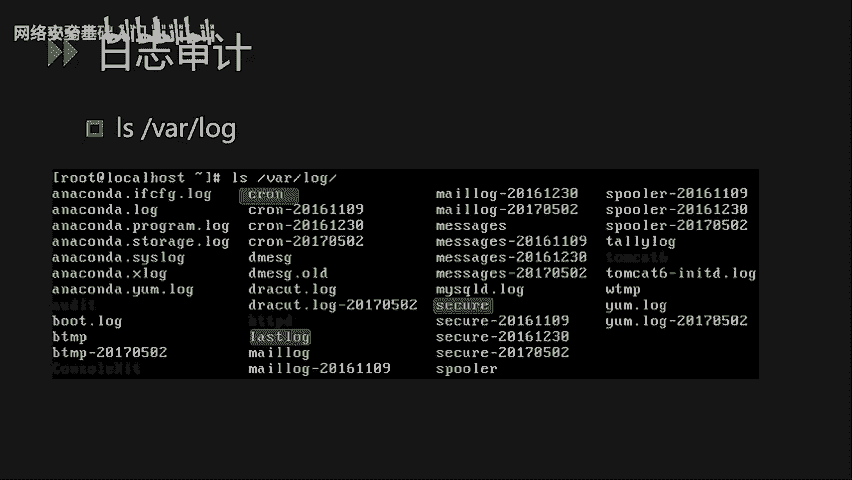

## 日志审计安全 📝

上一节我们介绍了网络安全配置，本节中我们来看看如何通过日志审计来发现安全威胁。日志审计安全主要讲解日志审计功能配置和日志的简单分析。通过日志分析，我们可以发现一些可疑的攻击行为。

### 启用与配置日志审计

首先，我们需要启用Linux系统的安全日志审计功能。通过配置`/etc/rsyslog.conf`文件来启动日志审计功能。系统的错误日志、内核日志、调试日志等都会被记录到`/var/log/messages`这个文件中。

### 重要日志文件分析

系统的日志默认情况下都保存在`/var/log`目录下。以下是一些常见的重要日志文件：


*   **`/var/log/messages`**：该日志文件记录了系统在引导过程中发生的事件，即Linux系统开机自检过程显示的相关信息。
*   **`/var/log/cron`**：记录了cron守护进程所派生的子进程的相关动作。
*   **`/var/log/secure`**：记录了与安全相关的信息，包括用户进行的重启、登录等动作内容。
*   **`/var/log/lastlog`**：记录了最近成功登录的事件和最后一次不成功的登录事件。该文件是二进制文件，需要使用`lastlog`命令查看。
*   **`/var/log/wtmp`**：永久记录每个用户的登录、注销及系统启动、停机等事件。可以使用`last`命令访问。

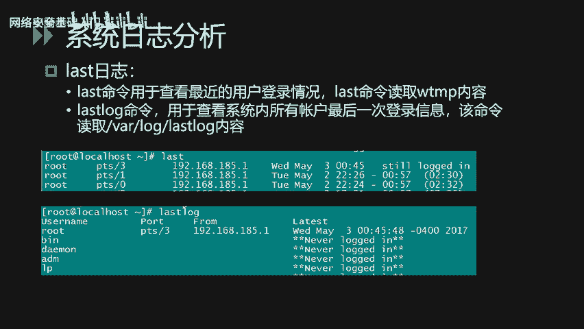

除了系统日志，第三方服务（如Apache、Tomcat）的日志也会保存在该目录中。开启对应的日志审计功能后，我们就可以通过日志分析来发现恶意的攻击行为或者非法的登录行为。


### 日志分析实战

日志内容格式通常包含事件的发生时间节点、主机名、服务/进程名以及具体事件描述。

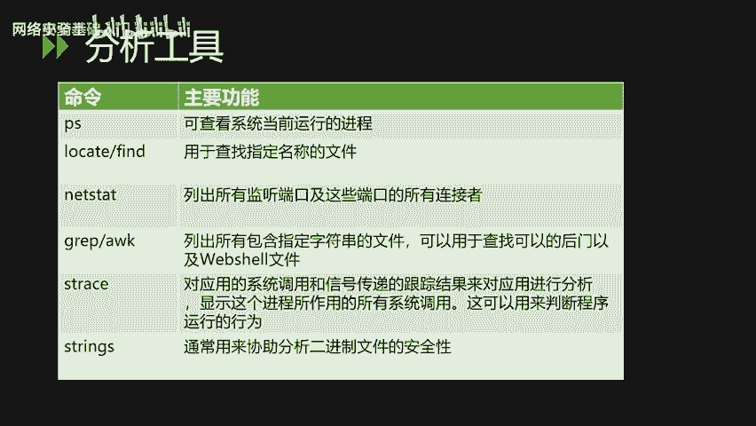

**示例：分析SSH异常登录行为**
我们可以通过命令查看SSH日志的内容，例如使用`cat`命令结合`grep`来匹配`sshd`服务的相关日志。
```bash
cat /var/log/secure | grep sshd
```
通过查看日志，可以观察到每次SSH会话的源IP地址。如果发现大量密集的登录失败信息（状态为`Failed`或`Invalid`），从事件发生的时间节点和频繁度来分析，可以初步断定这是一个SSH口令爆破行为。

在日常运维中，如果通过日志分析发现这样的行为，建议将日志导出，做批量分析，检查是否有登录成功的情况，再针对性地进行口令加固和账号定位。

**使用`last`和`lastlog`命令**
*   `last`命令：查看最近用户的登录情况，包括登录账号、登录位置（本地或远程IP）、登录时间等。
*   `lastlog`命令：查看系统内所有账号的最后一次登录信息。通过该命令可以发现异常的登录行为，例如某个不常登录的账号突然有远程登录记录。

## Linux下的安全工具 🛠️

讲完系统日志分析之后，我们再讲一下Linux下的安全工具。这主要是一些Linux下常见的命令和后门检测工具。

### 系统自带命令

通过系统自带命令，我们可以对可疑的进程和文件进行定位分析。

以下是常用的系统命令：
*   **`ps`命令**：用于查看当前运行的进程。
*   **`find`或`locate`命令**：用于查找定位指定名称的文件，可以通过关键字进行全系统搜索。
*   **`netstat`命令**：列出所有监听的端口和这些端口当前的连接状态。
*   **`grep`和`awk`命令**：文字字符串处理工具，可用于查找文件内的关键字，常用于定位恶意文件（如Webshell）。
*   **`lsof`命令**：显示进程所打开的所有系统文件/套接字，可以帮助判断程序的运行行为。
*   **`strings`命令**：可以用来协助分析二进制文件的安全性，提取文件中的可打印字符串。

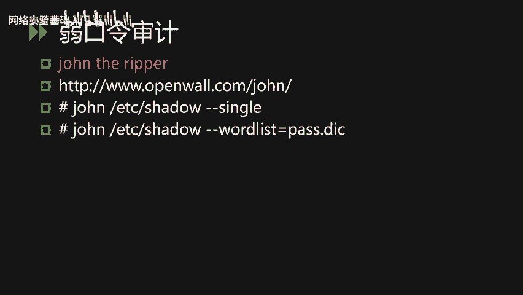

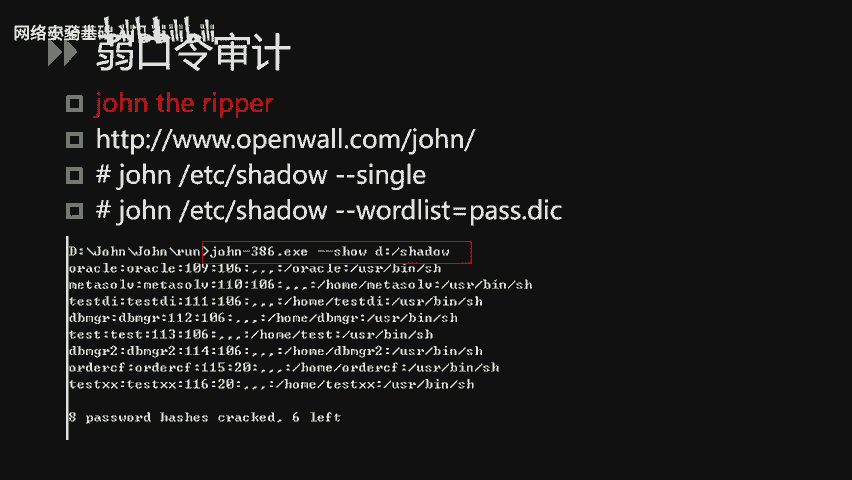

**实战示例：查找Webshell**
假设我们知道一句话木马包含`eval`和`post`这两个关键字。
*   **方法一：使用`grep`命令**
    ```bash
    grep -r -i "eval.*post" /app/website/
    ```
    `-r`参数表示递归搜索子目录，`-i`参数表示不区分大小写。此命令在`/app/website/`目录下查找包含相关关键字的内容。
*   **方法二：结合`find`命令**
    ```bash
    find /app/website/ -type f | xargs grep -l "eval.*post"
    ```
    此命令先找出`/app/website/`下的所有普通文件，然后通过`xargs`将文件名传递给`grep`进行内容匹配。

### 口令审计工具

在日常运维中，弱口令是经常碰到的安全风险。下面介绍两个工具，分别从不同层面进行口令审计。

**1. John the Ripper**
该工具能够对Linux系统的`/etc/shadow`文件进行离线口令审计。使用此工具需要有权限获取目标系统的影子密码文件。
*   **使用方法一：使用账户名变体爆破**
    ```bash
    john --single /etc/shadow
    ```
    此模式提取账户名后，利用账户名的各种格式变化来猜测密码。
*   **使用方法二：使用密码字典爆破**
    ```bash
    john --wordlist=password.lst /etc/shadow
    ```
    此模式使用指定的密码字典进行针对性爆破。

**2. Hydra（九头蛇）**
该工具与John the Ripper的区别在于它通过在线爆破的方式进行口令审计。好处是不需要提取密码文件，但可能会触发账户锁定策略，使用时需谨慎。
*   **爆破FTP服务示例**
    ```bash
    hydra -l login -P passlist.txt 192.168.0.1 ftp
    ```
    使用`login`账户和`passlist.txt`字典，爆破`192.168.0.1`主机的FTP服务密码。
*   **爆破SMB服务示例**
    ```bash
    hydra -l administrator -P passwords.txt 192.168.0.1 smb
    ```

### 后门检测工具

在Linux系统中，后门一般被称为Rootkit。

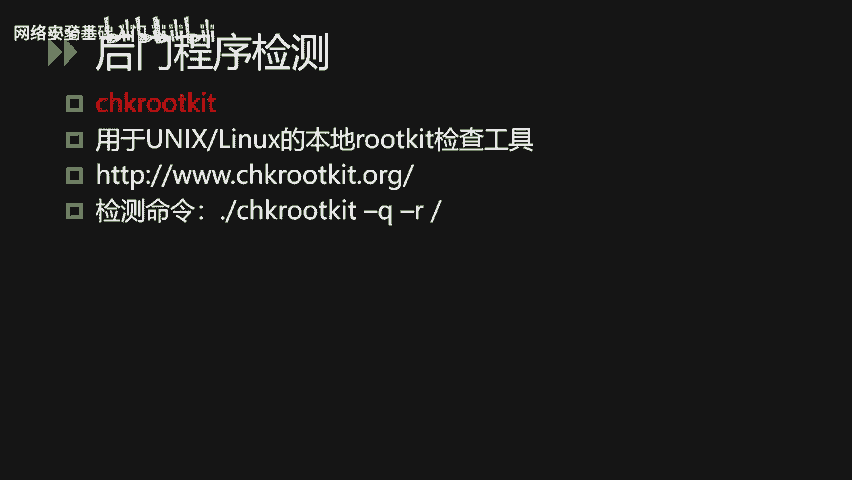

**1. chkrootkit**
它是一个用于Linux本地的Rootkit检测工具。据官方介绍，目前能够检测的Rootkit类型可达60多种。
使用方法很简单，安装后直接运行：
```bash
./chkrootkit -q -r /
```
`-q`表示安静模式，`-r`指定扫描根目录`/`。

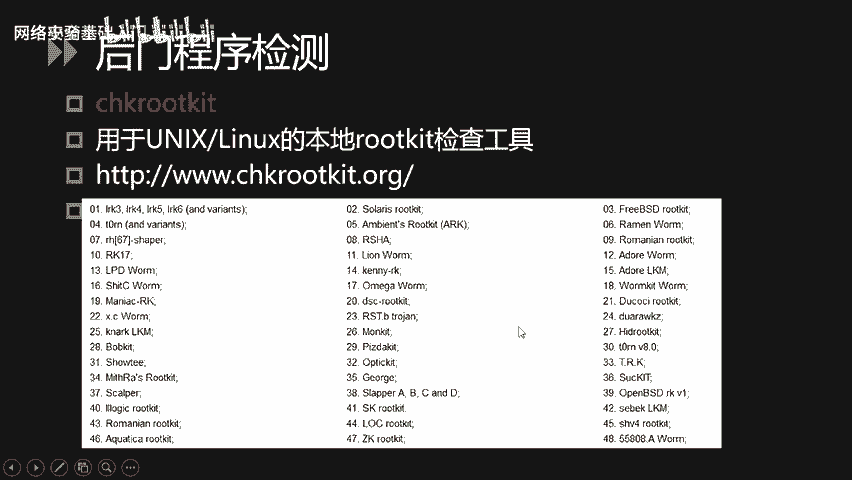

**2. rkhunter (Rootkit Hunter)**
使用起来也比较简单，安装后运行检查命令即可：
```bash
rkhunter --check
```
检查过程中程序会打印每一项的检查结果。完整的检查报告会生成在`/var/log/rkhunter.log`文件中。

---

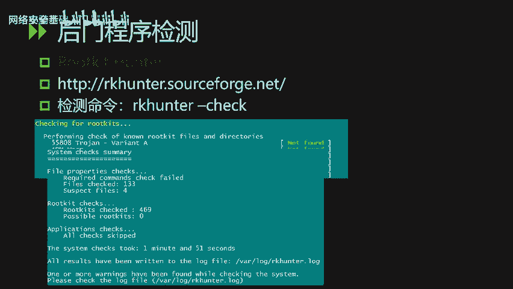


本节课中我们一起学习了Linux系统安全的三个重要方面：**网络安全配置**、**日志审计安全**以及**安全工具的使用**。我们了解了如何通过`sysctl`和`iptables`加固网络，如何分析系统日志以发现入侵痕迹，并掌握了使用系统命令及专业工具（如`grep`、`John`、`chkrootkit`）进行安全检查和应急响应的基本方法。这些是构建安全Linux系统环境的基础技能。