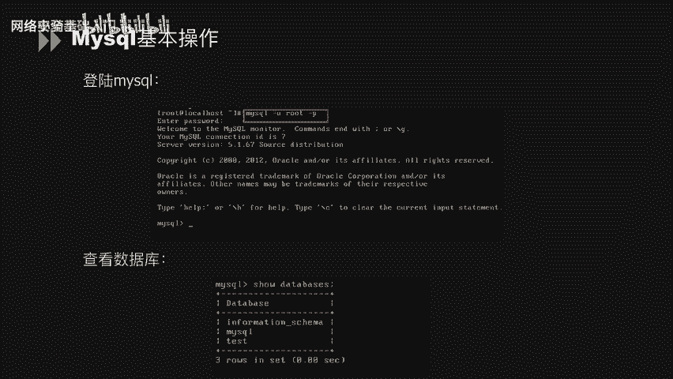
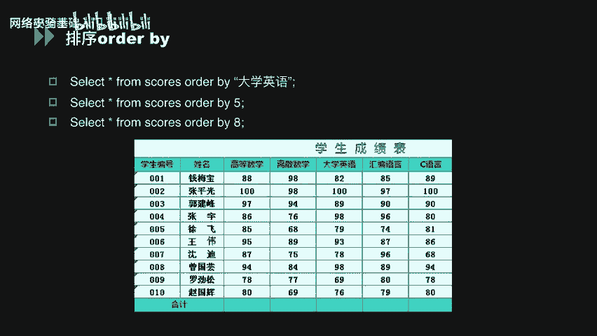
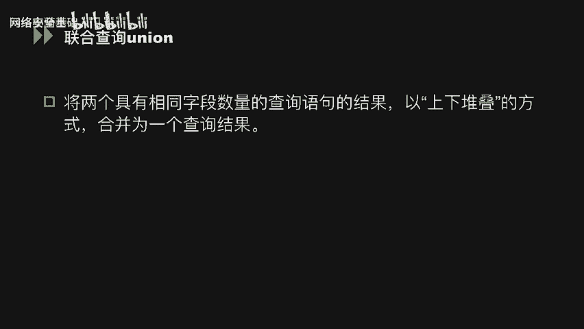
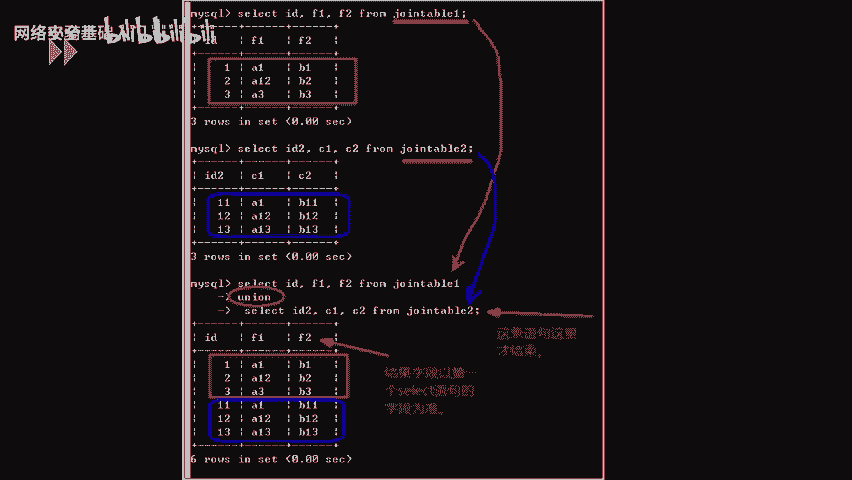
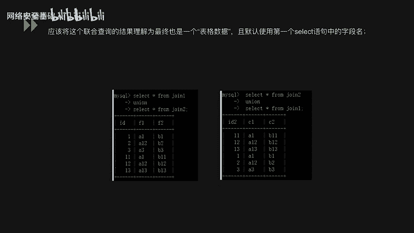

# CTF入门课程：P35：MySQL常用命令 🗄️


在本节课中，我们将学习MySQL数据库的基本操作命令。这些命令是进行数据库管理和后续安全测试的基础，涵盖了数据库的登录、用户管理、以及数据的增、删、改、查等核心操作。

## 登录与查看数据库



上一节我们介绍了MySQL的背景，本节中我们来看看如何登录和查看数据库。

登录MySQL数据库，可以使用以下命令格式：
```bash
mysql -u 用户名 -p
```
执行该命令后，控制台会提示输入密码。输入正确密码后，即可进入MySQL命令行界面。

进入MySQL后，可以使用以下命令查看当前数据库服务器中的所有数据库：
```sql
SHOW DATABASES;
```

## 用户与权限管理

以下是关于MySQL用户创建和权限管理的基本命令。

*   **新建用户并授权**：创建用户时，可以直接为其赋予权限并设置密码。
*   **查询、授予与撤销权限**：
    *   使用 `SHOW GRANTS FOR ‘test’@‘localhost’;` 可以查看指定用户的权限。
    *   使用 `GRANT` 命令可以为用户添加权限，例如 `SELECT`、`INSERT`、`DELETE` 等操作权限。
    *   使用 `REVOKE` 命令可以删除用户对特定数据库的权限。
*   **查看版本与时间**：
    *   使用 `SELECT VERSION();` 可以查看当前数据库的版本号。
    *   使用 `SELECT NOW();` 可以查看当前数据库服务器的时间。
*   **查看日志文件**：使用 `SHOW VARIABLES LIKE ‘%log%’;` 可以查看与日志相关的配置和文件路径。
*   **查看用户及主机信息**：使用 `SELECT user, host, password FROM mysql.user;` 可以查看所有用户、其允许登录的主机及密码哈希值。

## 数据库的增操作

接下来，我们学习如何向数据库中增加数据，主要涉及创建表和插入数据。

数据库的“增”操作主要包括 `CREATE` 和 `INSERT` 两个命令。

首先看 `CREATE` 命令，它用于创建数据库表。例如：
```sql
CREATE TABLE scores (id INT, name VARCHAR(50), grade INT);
```
这条语句创建了一个名为 `scores` 的表，表中包含 `id`、`name`、`grade` 三个字段。

创建表之后，就可以使用 `INSERT` 命令向表中插入具体的数据。例如：
```sql
INSERT INTO students (name, money, sex, phone) VALUES (‘张三‘, 500, ‘男‘, ‘13800138000‘);
```
这条语句向 `students` 表的指定列插入了数据。如果插入数据的顺序与表中列的顺序完全一致，可以省略列名部分。

## 数据库的删操作

现在，我们来看看如何删除数据库中的数据或结构。

数据库的“删”操作这里列举了 `DROP` 和 `DELETE` 两个命令。

通过 `DROP TABLE table_name;` 命令可以直接删除数据库中的某一张表。

而 `DELETE` 命令用于删除表中的特定行数据。例如：
```sql
DELETE FROM table_name WHERE id = 1;
```
这条语句仅会删除 `table_name` 表中 `id` 等于 1 的那一行数据。

## 数据库的改操作


学会了增删，我们再来学习如何修改已有的数据和表结构。

数据库的“改”操作主要涉及 `ALTER` 和 `UPDATE` 两个命令。

`ALTER` 命令主要用于修改表的结构，例如更改表名、增加或删除字段、修改字段类型等。

`UPDATE` 命令则用于修改表中具体的数值。例如：
```sql
UPDATE students SET money = 100;
```
这条语句没有限制条件，会将 `students` 表中所有行的 `money` 字段值都修改为 100。我们可以通过 `WHERE` 关键词来限定修改的范围：
```sql
UPDATE students SET money = 1000 WHERE name = ‘HK‘;
```
这条语句仅将 `name` 为 ‘HK‘ 的行的 `money` 值修改为 1000。

## 数据库的查操作



最后，也是最重要的部分，我们来学习如何查询数据库中的数据。



数据库的“查”操作主要使用 `SELECT` 语句，配合 `DESC` 和 `SHOW TABLES` 等命令。

*   使用 `DESC table_name;` 可以查看指定表的结构。
*   使用 `SHOW TABLES;` 可以查看当前数据库中的所有表名。
*   使用 `SELECT` 可以查询表中的具体数据：
    *   **限制查询条数**：`SELECT * FROM table_name LIMIT 5;` （查询前5条）或 `SELECT * FROM table_name LIMIT 1, 5;` （从第2条开始，查询5条）。
    *   **查询指定字段**：`SELECT id, name, sex, money, phone FROM students;`。
    *   **查询所有数据**：`SELECT * FROM table_name;`。

## 数据排序与联合查询



掌握了基本操作后，我们进一步了解两个高级查询技巧：排序和联合查询。

### 数据排序

使用 `ORDER BY` 关键词可以对查询结果进行排序。假设有一张学生成绩表 `scores`，我们想按“大学英语”成绩降序排列：
```sql
SELECT * FROM scores ORDER BY 大学英语 DESC;
```
除了指定列名，也可以指定列的序号进行排序（例如 `ORDER BY 5` 表示按第5列排序）。如果 `ORDER BY` 后面的数字超过了表的列数，数据库会报错，这个特性在后续的SQL注入测试中会用到。

### 联合查询

联合查询使用 `UNION` 操作符，用于将两个或多个 `SELECT` 语句的结果集合并为一个结果集。要使用 `UNION`，必须满足两个条件：
1.  每个 `SELECT` 语句查询的列数必须相同。
2.  对应列的数据类型应该相似。

联合查询的语法如下：
```sql
SELECT column1, column2 FROM table1
UNION [ALL]
SELECT column1, column2 FROM table2;
```
默认情况下，`UNION` 会自动去除重复的行（相当于 `UNION DISTINCT`）。如果需要保留所有行（包括重复的），则使用 `UNION ALL`。结果集中行的顺序与 `SELECT` 语句的顺序有关。



---


本节课中我们一起学习了MySQL数据库的常用基本命令，包括数据库的登录、用户权限管理，以及对数据进行增、删、改、查的核心操作。我们还了解了数据排序 (`ORDER BY`) 和联合查询 (`UNION`) 这两个重要的高级查询方法。这些知识是操作数据库和进行后续Web安全、SQL注入漏洞理解与实践的基础。