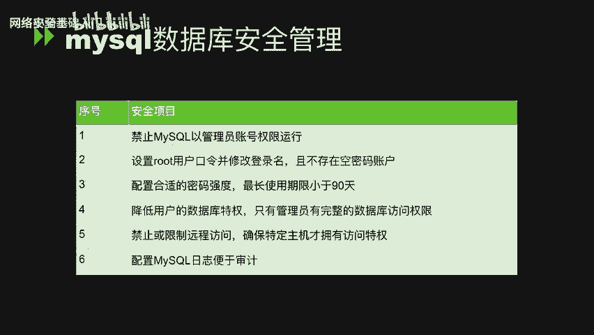
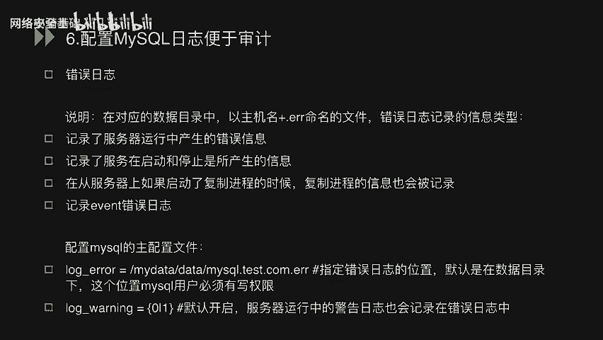
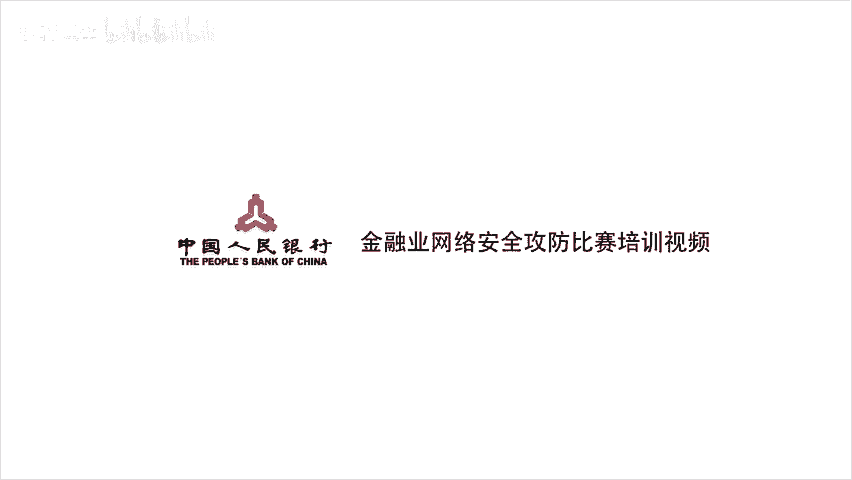

# CTF入门课程：P36：MySQL数据库系统安全管理与优化 🔒


在本节课中，我们将学习MySQL数据库安全管理的核心知识，包括安全配置规范、基本操作命令以及SQL注入原理的初步理解。课程内容分为三个主要部分，旨在帮助初学者建立数据库安全的基础认知。

## 第一部分：MySQL数据库安全管理

上一节我们介绍了课程的整体结构，本节中我们将详细讲解MySQL数据库的安全管理规范。以下是六个关键的安全基线配置点。


### 1. 禁止MySQL以管理员账号权限运行
MySQL数据库应使用非管理员账号运行，以普通账户（如`mysql`）安全运行。这样做的目的是在数据库出现漏洞时，将影响范围控制在`mysql`用户权限内，避免危及整个操作系统。



**加固方法**：在MySQL配置文件`my.cnf`中添加以下配置，然后重启数据库服务。
```ini
user = mysql
```

### 2. 设置root用户口令，修改登录名，且不存在空密码账户
首先，通过以下命令登录数据库并修改root用户密码。
```bash
mysql -uroot -p
```
```sql
SET PASSWORD FOR 'root'@'localhost' = PASSWORD('new_password');
```
为增强安全性，可以修改root用户的用户名。
```sql
USE mysql;
UPDATE user SET user='another_username' WHERE user='root';
FLUSH PRIVILEGES;
```
此外，需确保所有数据库用户均设置了密码，无空密码账户。检查空密码用户的命令如下。
```sql
SELECT * FROM mysql.user WHERE password='';
```
若有返回结果，则存在空密码用户，需使用`SET PASSWORD`命令为其设置密码。

### 3. 配置合理的密码强度与最长使用期限
密码策略应包含长度、大小写、数字和特殊字符等要求，且最长使用期限应小于等于90天。

**加固方法**：启用密码复杂度插件并设置全局策略。
```sql
-- 示例：设置密码最小长度为14，需包含大小写字母和数字
-- 具体插件配置请参考官方文档

-- 设置密码最长使用期限为90天
SET GLOBAL default_password_lifetime = 90;
```

### 4. 降低用户的数据库特权，仅管理员拥有完整访问权限
`mysql.user`和`mysql.db`表中列出了各种权限，这些权限通常只应授予管理员用户。

**加固方法**：审计非管理员用户的权限，并使用`REVOKE`语句回收不必要的权限。关键权限包括：
*   `FILE_PRIV`：允许读取主机本地文件。
*   `PROCESS_PRIV`：允许查询所有用户的进程信息。
*   `SUPER_PRIV`：允许设置全局变量、管理员调试等。
*   `SHUTDOWN_PRIV`：允许关闭数据库。
*   `CREATE_USER_PRIV`：允许创建或删除其他用户。
*   `GRANT_PRIV`：允许修改其他用户权限。

检查拥有特定权限用户的命令：
```sql
SELECT user, host FROM mysql.user WHERE file_priv = 'Y';
```
回收权限的命令示例：
```sql
REVOKE SHUTDOWN ON *.* FROM 'user'@'host';
REVOKE CREATE USER ON *.* FROM 'user'@'host';
REVOKE GRANT OPTION ON *.* FROM 'user'@'host';
```

### 5. 禁止或限制远程访问，确保特定主机才拥有访问权限
开放数据库的远程访问权限是危险的。应严格限制访问来源。

**错误示例（完全开放root远程访问）**：
```sql
GRANT ALL ON *.* TO 'root'@'%';
```
**正确做法**：限制特定IP地址访问。
```sql
GRANT ALL ON *.* TO 'root'@'192.168.1.100';
```
更进一步，可以只授予最小必要权限。
```sql
GRANT SELECT, INSERT ON mydb.* TO 'some_user'@'some_host';
```

### 6. 配置MySQL日志便于审计
MySQL应配置多种日志功能，包括错误日志、二进制日志、慢查询日志和通用查询日志等，以便于故障排查和安全审计。

**加固方法**：在主配置文件`my.cnf`中配置日志路径。
```ini
log-error = /home/mysql/error.log
```
**错误日志说明**：错误日志通常以`主机名.err`命名，记录服务器运行错误、启动/停止信息、复制进程信息以及事件错误信息。通过`log-warnings`参数可以控制是否记录警告信息。

## 第二部分：MySQL常用基本命令

在了解了安全管理规范后，本节我们来看看MySQL常用的基本操作命令，这是与数据库交互的基础。

以下是MySQL的增删改查等基本操作命令列表。

1.  **连接数据库**
    ```bash
    mysql -u username -p
    ```

2.  **显示数据库列表**
    ```sql
    SHOW DATABASES;
    ```

3.  **选择（使用）数据库**
    ```sql
    USE database_name;
    ```

4.  **显示当前数据库中的表**
    ```sql
    SHOW TABLES;
    ```

5.  **查询数据**
    ```sql
    SELECT column1, column2 FROM table_name WHERE condition;
    ```

6.  **插入数据**
    ```sql
    INSERT INTO table_name (column1, column2) VALUES (value1, value2);
    ```

7.  **更新数据**
    ```sql
    UPDATE table_name SET column1 = value1 WHERE condition;
    ```

8.  **删除数据**
    ```sql
    DELETE FROM table_name WHERE condition;
    ```

9.  **排序查询**
    ```sql
    SELECT * FROM table_name ORDER BY column_name ASC|DESC;
    ```

10. **联合查询**
    ```sql
    SELECT * FROM table1 UNION SELECT * FROM table2;
    ```

## 第三部分：SQL查询及手工注入执行

掌握了基本命令后，本节我们将通过实际执行SQL语句，来理解SQL注入的基本原理。核心在于观察数据库对用户输入的不同处理方式所返回的结果。

以下是理解SQL注入原理的关键步骤。

1.  **正常查询**：执行一个合法的查询语句，观察返回的正确数据。
    ```sql
    SELECT * FROM users WHERE id = 1;
    ```

2.  **注入尝试**：通过修改输入参数，尝试改变原SQL语句的逻辑结构。
    ```sql
    -- 原意可能是查询id为1的用户，但输入 `1' OR '1'='1` 后
    SELECT * FROM users WHERE id = '1' OR '1'='1';
    ```
    此时，`WHERE`条件永远为真，可能导致返回所有用户数据。

3.  **观察回显**：对比正常查询与注入尝试后数据库返回的结果差异。注入成功的标志是返回了超出预期的数据（如全部数据）或执行了非预期的操作。

4.  **理解原理**：SQL注入的本质是**用户输入被直接拼接到了SQL命令中，并被数据库解释执行**。攻击者通过构造特殊的输入，打破了原有查询的逻辑，实现了窃取数据、破坏数据或提升权限等目的。



**防御思想**：永远不要信任用户输入。必须使用参数化查询（预编译语句）或对输入进行严格的转义和过滤，将用户输入**数据**与SQL命令**代码**分离。


## 总结



本节课中我们一起学习了MySQL数据库系统安全管理的核心内容。我们首先探讨了六大安全基线配置，包括运行账户、密码策略、权限最小化和日志审计等。接着，我们回顾了MySQL的常用基本操作命令。最后，我们通过模拟SQL查询与手工注入执行，直观地理解了SQL注入漏洞的产生原理与危害。这些知识是构建安全数据库环境和理解Web安全漏洞的基础。