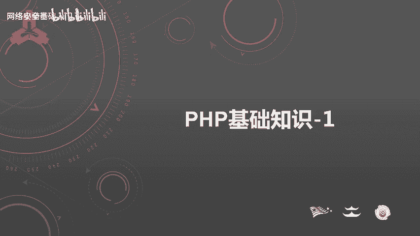
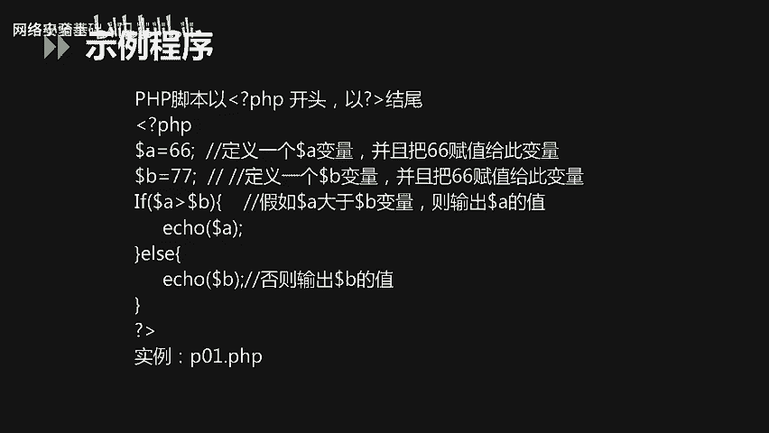
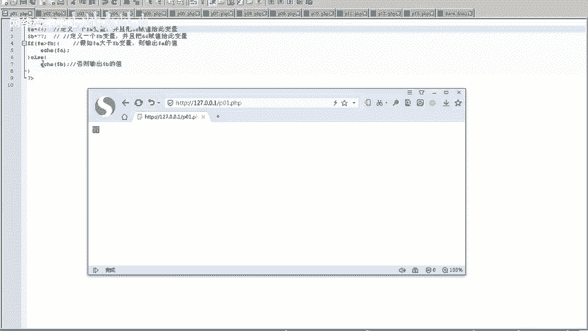
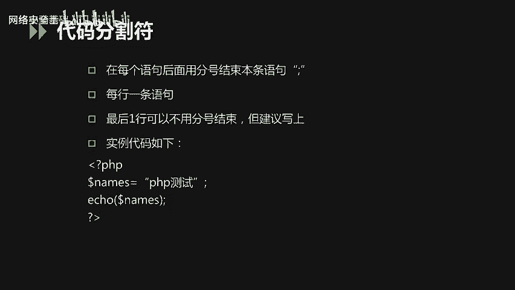
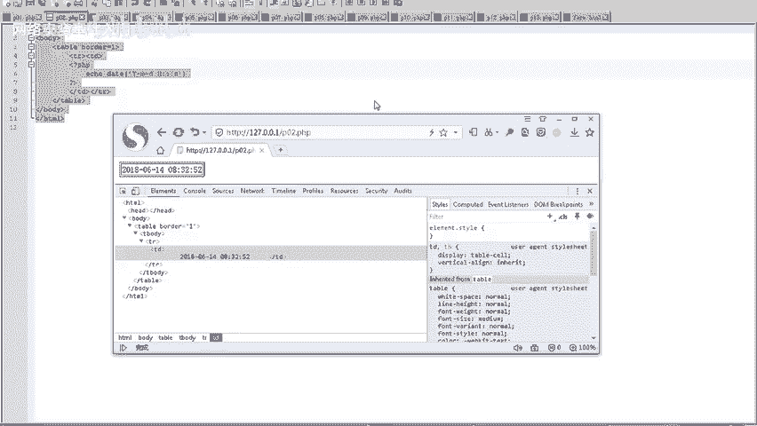
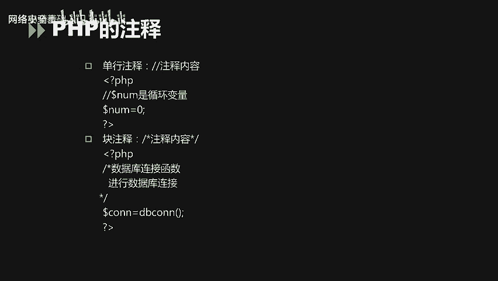
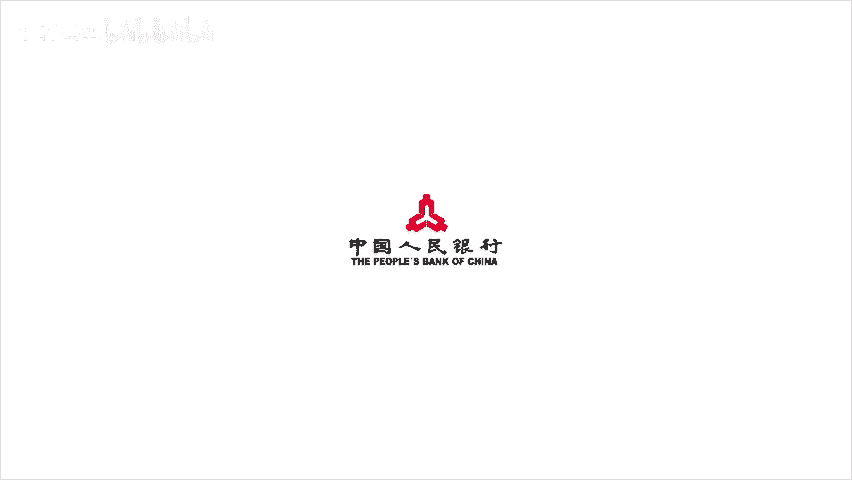

# CTF入门课程：P37：PHP基础知识_1 🐘



在本节课中，我们将要学习PHP的基础知识，包括其基本常识和核心语法。PHP是Web开发中广泛使用的服务器端脚本语言，理解其基础对于后续的网络安全学习和CTF挑战至关重要。

## 概述

本节课内容主要分为两部分：
1.  **PHP基本常识**：包括PHP的定义、开发与运行环境。
2.  **PHP基本语法**：包括数据类型、变量、常用函数等核心概念。

对于基本常识部分，我们只需要了解即可。而PHP的基本语法，则是本节课需要重点掌握的内容。

在未来的PHP开发或问题排查中，我们可以参考[PHP中文参考手册](https://www.php.net/manual/zh/)，并在PHP官网下载最新的文档。手册中包含189类、超过5000个函数，但在实际开发中，常用的函数大约在100个左右。

---

## PHP基本常识

### PHP的定义

PHP最初的名称是 **Personal Home Page Tools**。目前，PHP被定义为 **超文本预处理器**（PHP: Hypertext Preprocessor）的递归缩写。

PHP本身是一种被广泛应用的、开放源代码的多用途脚本语言。根据2017年12月的编程语言排行榜，PHP位列第九名，相比前几年排名有所下降。

### PHP的用途与竞争

PHP主要用于**服务器端脚本**开发，它执行后返回的是HTML代码。在服务器端开发领域，PHP的主要竞争语言有三类：
*   微软的 **C#** 语言。
*   Oracle的 **Java** 语言。
*   谷歌的 **Python** 语言。

这三类语言与PHP都是当前软件开发领域非常流行且被广泛使用的语言。

### PHP的主要应用领域

PHP的开发主要应用于以下领域：
*   **服务器端脚本/Web开发**：这是PHP最主要的应用场景，尤其适用于中小型网站的Web开发。
*   命令行脚本：可以直接在命令行界面下执行PHP程序。
*   客户端GUI应用程序开发：但当前应用场景较少。

主流的应用仍然是服务器端脚本和Web开发。

### PHP的运行环境



在软件开发中，大部分开发人员使用Windows操作系统，因此需要熟练掌握Windows下的PHP开发运行环境。当然，PHP也支持在其他操作系统上进行开发，包括Linux、Unix和macOS。

支持PHP运行的Web服务器主要包括 **Apache** 和 **Nginx**。

PHP本身支持多种数据库，主流的选择包括 **MySQL**、**SQL Server** 和 **Oracle**。

---

## PHP基本语法



上一节我们介绍了PHP的基本常识，本节中我们来看看PHP的核心语法。

### PHP示例程序

PHP脚本以 `<?php` 作为开始标签，以 `?>` 作为结束标签。

请看以下示例代码：
```php
<?php
$a = 88;
$b = 77;
if ($a > $b) {
    echo $a;
} else {
    echo $b;
}
?>
```
这段代码定义了变量 `$a` 和 `$b`，并比较它们的大小，然后输出较大的值。



**运行结果说明**：
*   当 `$a=88`, `$b=77` 时，输出结果为 `88`。
*   如果将 `$a` 的值改为 `66`，则 `$b` 的值 `77` 更大，输出结果会变为 `77`。

### PHP与HTML的融合

PHP代码可以嵌入到HTML页面中。以下是一个融合示例：
```php
<html>
<body>
    <table>
        <tr>
            <td>当前时间是：<?php echo date("Y-m-d H:i:s"); ?></td>
        </tr>
    </table>
</body>
</html>
```
在这段代码中，我们在HTML的表格单元格内，使用PHP的 `date()` 函数来获取并输出当前的系统时间（格式为：年-月-日 时:分:秒）。



运行此页面，会在表格中直接显示当前的日期和时间，实现了PHP脚本与HTML标签的无缝融合。

### 语句结束与注释

在PHP代码中，每条语句的结尾通常需要用**分号 (`;`)** 来标记语句结束。这是强制要求，否则程序会报错。虽然最后一行代码的结束分号可以省略，但建议始终加上以保持代码风格统一。

代码注释对于程序编写和维护至关重要。PHP支持两种主要的注释方式：

以下是注释的示例：
```php
<?php
// 这是单行注释，使用双斜杠
$name = "PHP测试"; // 为变量$name赋值

/*
   这是多行注释（块注释）。
   可以在这里写下多行说明文字。
   注释内容不会被程序执行。
*/
echo $name;
?>
```

---

## 总结



本节课中我们一起学习了PHP的基础知识。我们首先了解了PHP的定义、主要应用领域（尤其是Web开发）以及其运行环境（如Apache/Nginx服务器和各类数据库支持）。接着，我们重点学习了PHP的基本语法，包括脚本的基本结构、如何将PHP嵌入HTML、语句的结束方式以及代码注释的写法。



掌握这些基础知识是进一步学习PHP高级特性、进行Web开发以及分析相关CTF题目的重要第一步。