# CTF入门课程：P38：PHP基础知识_2


在本节课中，我们将继续学习PHP的基础知识，主要包括PHP的变量、常量以及字符串操作函数。

## 📊 PHP数据类型

上一节我们介绍了PHP的基本概念，本节中我们来看看PHP支持的数据类型。PHP支持8种原始数据类型，包括4种标量类型、2种复合类型和2种特殊类型。

以下是PHP数据类型的分类：

*   **标量类型**：
    *   **布尔型**：表示真或假。
    *   **整型**：表示整数。
    *   **浮点型**：表示小数。
    *   **字符串型**：表示文本。
*   **复合类型**：
    *   **数组**：存储多个值的有序集合。
    *   **对象**：存储数据和方法的实例。
*   **特殊类型**：
    *   **资源**：表示外部资源（如数据库连接）。
    *   **NULL**：表示变量没有值。

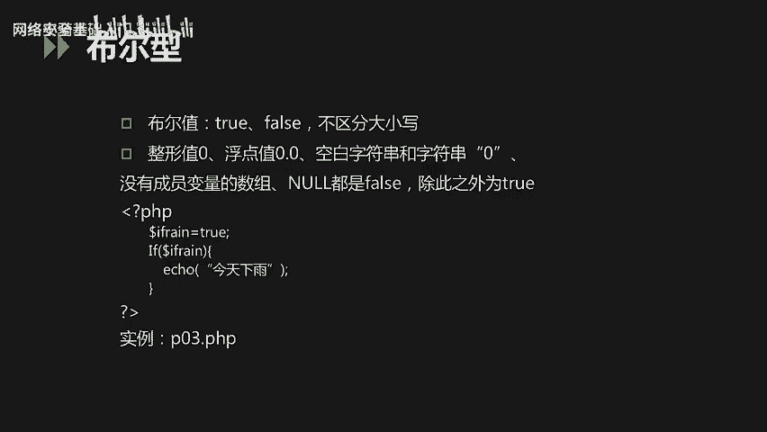

### 布尔型

布尔型只有两个值：`true`（真）和 `false`（假），不区分大小写。在PHP中，以下值在布尔上下文中被视为 `false`：

*   布尔值 `false` 本身
*   整型值 `0`
*   浮点型值 `0.0`
*   空字符串 `""` 和字符串 `"0"`
*   空数组 `[]`
*   `NULL`

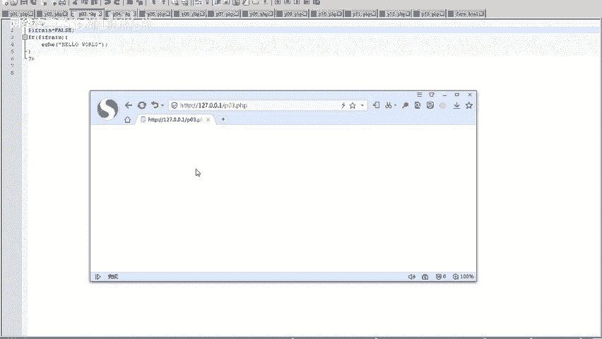

除此之外的值通常被视为 `true`。

我们来看一个判断布尔值的例子：

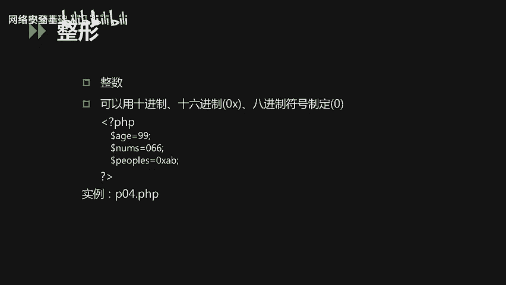

```php
<?php
$is_rain = true;
if ($is_rain) {
    echo "今天下雨";
}
?>
```

如果变量 `$is_rain` 的值为 `true`，则会输出“今天下雨”；如果为 `false`，则不会输出。

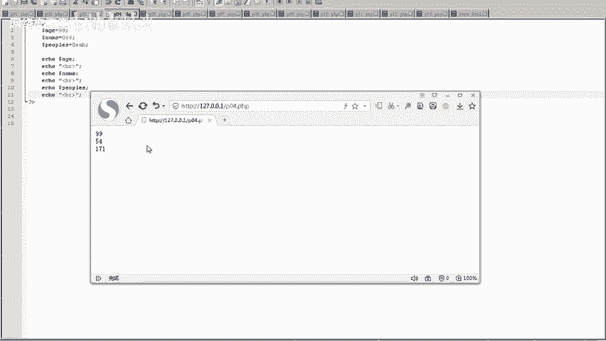

### 整型

整型用于存储整数，可以用十进制、十六进制（以 `0x` 为前缀）或八进制（以 `0` 为前缀）表示。

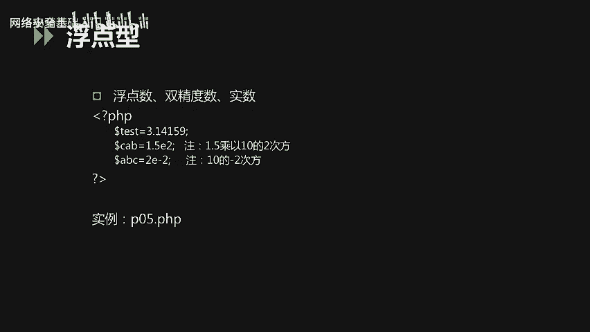

```php
<?php
$age = 99;        // 十进制
$num_oct = 066;   // 八进制，等于十进制的54
$num_hex = 0xAB;  // 十六进制，等于十进制的171
echo $age, $num_oct, $num_hex;
?>
```

### 浮点型

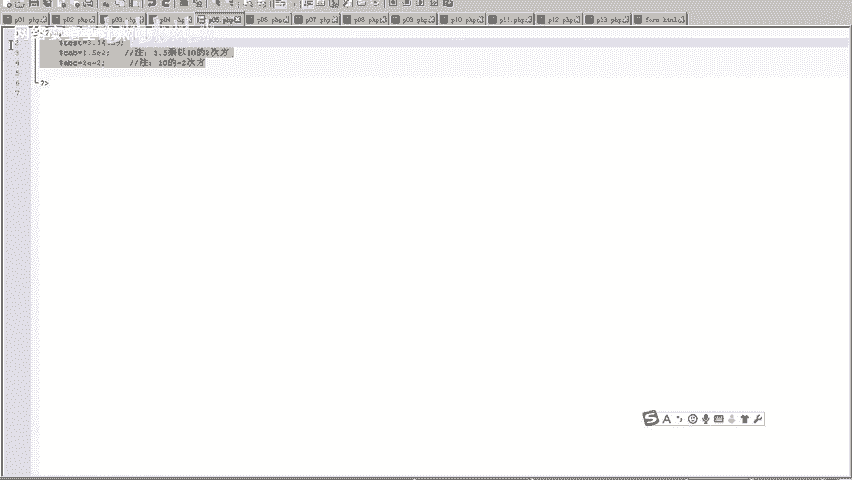

浮点型用于存储小数，也称为双精度数或实数。

```php
<?php
$float_num = 1.234;
$scientific_num = 1.2e3; // 科学计数法，等于1200
$double_num = 7E-10;
echo $float_num, $scientific_num, $double_num;
?>
```

### 字符串型

字符串是字符的序列，可以用单引号或双引号定义。

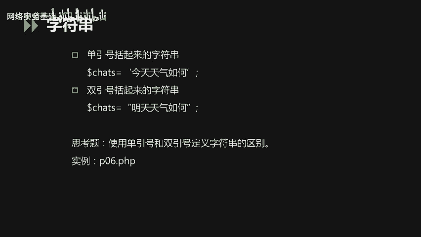

*   **单引号**：字符串内容会被原样输出，其中的变量和特殊转义字符（如 `\n`）不会被解析。
*   **双引号**：字符串中的变量会被替换为其值，特殊转义字符会被解析（如 `\n` 会换行）。

```php
<?php
$str = 6;
echo ‘$str\n‘; // 输出：$str\n
echo “$str\n”; // 输出：6（并换行）
?>
```

### 数组

数组用于在单个变量中存储多个值。PHP中有两种主要的数组类型：

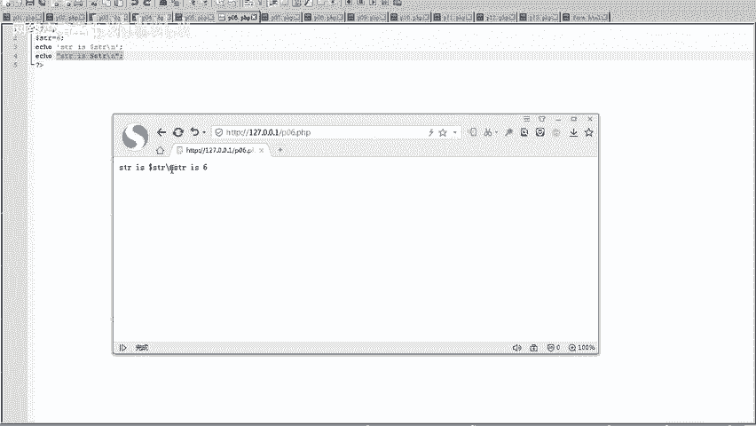

*   **索引数组**：使用数字作为键名（下标），默认从0开始。
*   **关联数组**：使用指定的字符串作为键名，形成键值对。

定义数组可以使用 `array()` 函数或简写语法 `[]`。

```php
<?php
// 索引数组
$names = array(“Peter”, “Joy”, “Lily”);
// 或 $names = [“Peter”, “Joy”, “Lily”];
echo $names[0] . “ and ” . $names[1] . “ are ” . $names[2] . “\'s neighbors.”;

// 关联数组
$person = array(“name” => “XuWeiBo”, “age” => 30);
// 或 $person = [“name” => “XuWeiBo”, “age” => 30];
echo $person[“name”] . “ is ” . $person[“age”] . “ years old.”;
?>
```

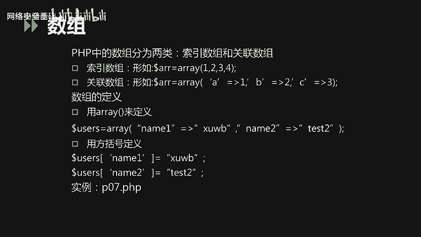

### NULL类型

`NULL` 类型表示一个变量没有值。它不区分大小写（`null` 或 `NULL`）。以下情况变量被认为是 `NULL`：

*   变量被显式赋值为 `NULL`。
*   变量尚未被赋值。
*   变量被 `unset()` 函数销毁。

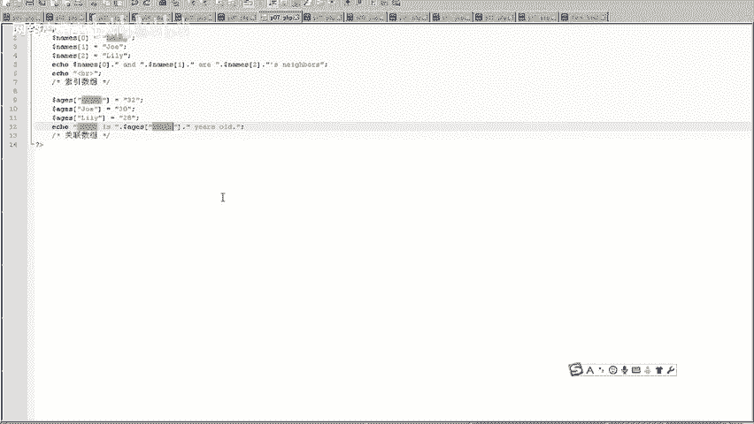

```php
<?php
$var1 = NULL; // 显式赋值为NULL
$var2;        // 未赋值
$var3 = “test”;
unset($var3); // 销毁变量
var_dump($var1); // 输出：NULL
?>
```

## 🔧 PHP变量

了解了数据类型后，我们来看看如何存储和操作这些数据，这就涉及到变量。

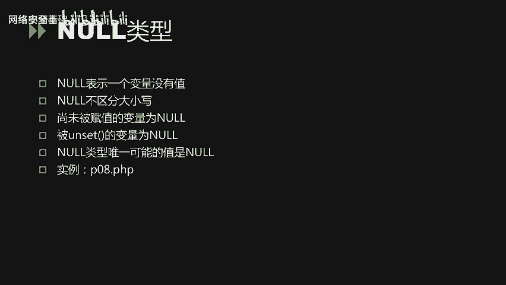

### 变量基础

PHP变量以美元符号 `$` 开头，后面跟着变量名。变量名是大小写敏感的，且通常以字母或下划线开头。

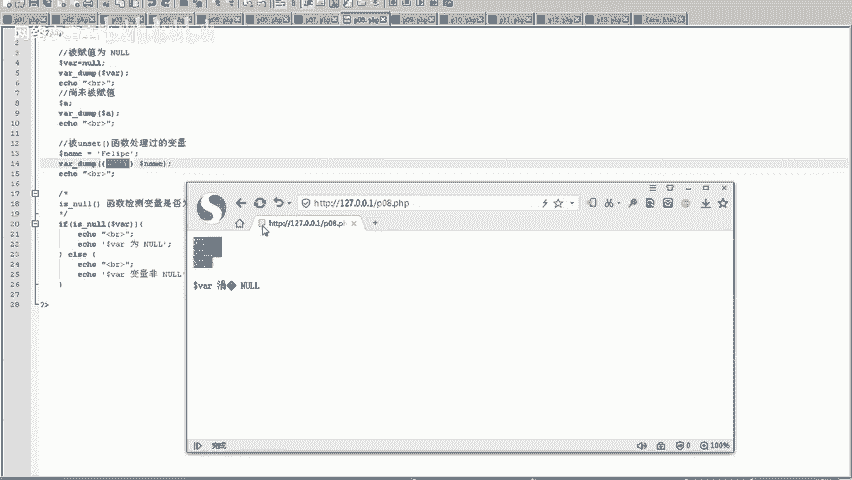

```php
<?php
$number = 10;
$Number = 20; // 与 $number 是不同的变量
?>
```

### 预定义变量

PHP提供了许多预定义变量，用于获取脚本运行环境的信息。例如：

*   `$_SERVER`：包含头信息、路径和脚本位置等信息的数组。
*   `$_GET`：通过URL参数（GET方法）传递的变量集合。
*   `$_POST`：通过HTTP POST方法传递的变量集合。
*   `$_COOKIE`：通过HTTP Cookies传递的变量集合。

```php
<?php
print_r($_SERVER); // 打印服务器和执行环境信息
print_r($_COOKIE); // 打印当前页面的Cookie信息
?>
```

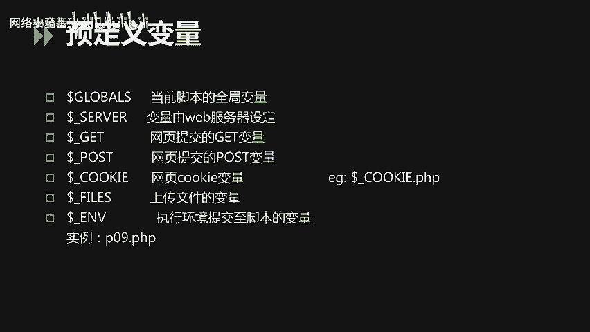

### 变量作用域

变量的作用域指的是变量在代码中可被访问的区域。

*   **全局作用域**：在函数外部定义的变量，通常在当前PHP文件内有效。
*   **局部作用域**：在函数内部定义的变量，仅在该函数内部有效。
*   **`global` 关键字**：在函数内部使用 `global` 关键字，可以访问函数外部的全局变量。
*   **`static` 关键字**：用于函数内部，使局部变量在函数调用结束后不丢失其值。

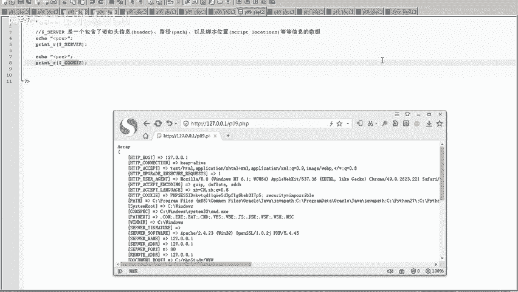

```php
<?php
$dd = 2; // 全局变量
function aa() {
    global $dd; // 使用global关键字引用全局变量$dd
    echo $dd;
}
aa(); // 输出：2
?>
```

### 外部变量（表单处理）

当HTML表单提交给PHP脚本时，表单中的数据会自动成为PHP可用的变量。

例如，一个简单的表单（`form.html`）：

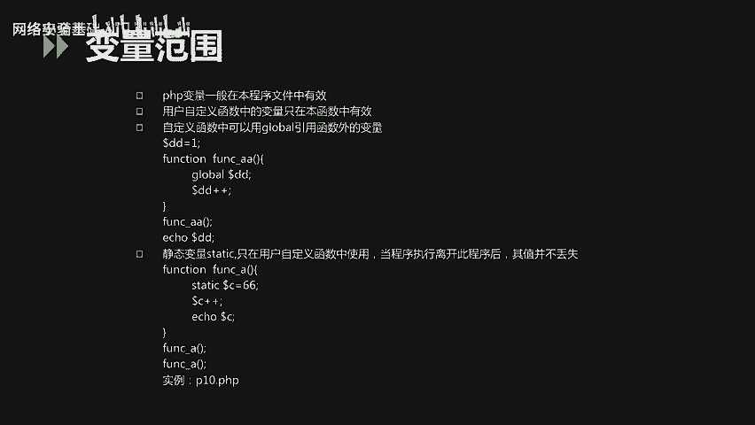

```html
<form action=“p11.php” method=“get”>
    姓名：<input type=“text” name=“fname”>
    年龄：<input type=“text” name=“age”>
    <input type=“submit”>
</form>
```

处理表单的PHP脚本（`p11.php`）：

```php
<?php
// 通过 $_GET 获取表单提交的数据
$name = $_GET[‘fname‘];
$age = $_GET[‘age‘];
echo “姓名：” . $name . “， 年龄：” . $age;
?>
```

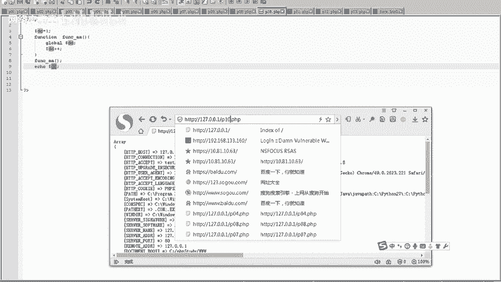

## 🏷️ PHP常量

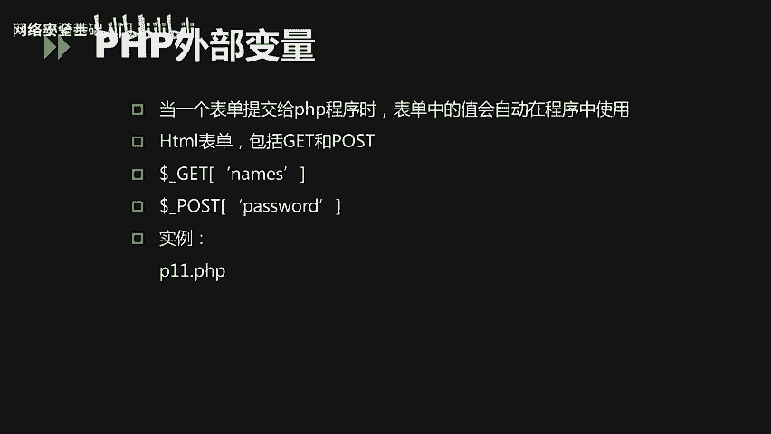

常量是一个简单值的标识符，在脚本执行期间其值不能改变。常量使用 `define()` 函数定义，默认区分大小写，且全局有效。常量名前面没有美元符号 `$`。

```php
<?php
define(“SITE_NAME”, “我的网站”);
echo SITE_NAME;
?>
```

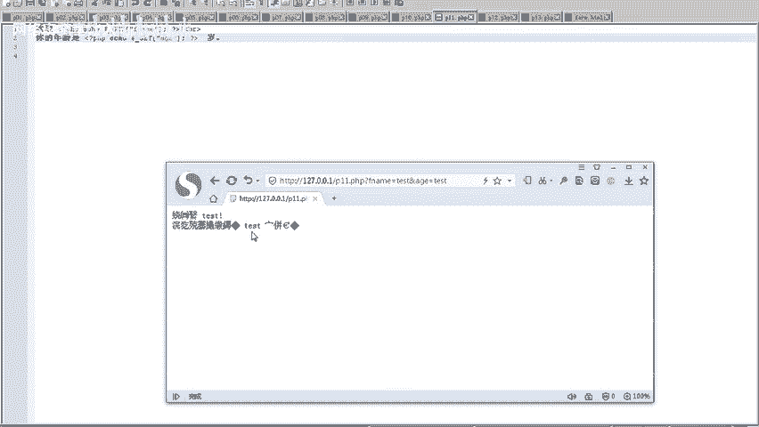

PHP也提供了一些预定义常量，如 `PHP_VERSION`（PHP版本号）、`__FILE__`（当前文件的完整路径和文件名）。

## 🛠️ 常用字符串函数

PHP提供了丰富的内置函数来处理字符串，以下是一些常用的：

*   `strlen($string)`：返回字符串的长度。
*   `strpos($haystack, $needle)`：在字符串中查找子串首次出现的位置。
*   `str_replace($search, $replace, $subject)`：替换字符串中的部分内容。
*   `print` / `echo`：输出一个或多个字符串。
*   `var_dump($expression)`：打印变量的类型和值，常用于调试。

```php
<?php
$text = “Hello World!”;
echo strlen($text); // 输出：12
echo strpos($text, “World”); // 输出：6
echo str_replace(“World”, “PHP”, $text); // 输出：Hello PHP!
?>
```

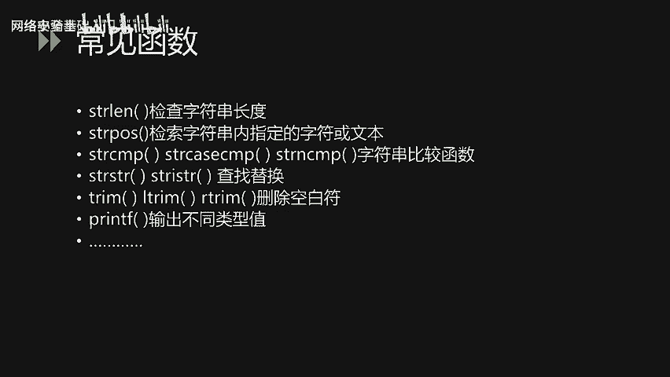

## 📝 总结


本节课中我们一起学习了PHP的核心基础知识。我们详细探讨了PHP的八种数据类型，包括布尔型、整型、浮点型、字符串、数组和NULL类型。接着，我们深入了解了变量的定义、作用域以及如何通过预定义变量获取外部信息。我们还学习了常量的定义和使用。最后，我们介绍了一些在处理数据时非常有用的内置字符串函数。掌握这些基础知识是编写PHP程序的第一步。