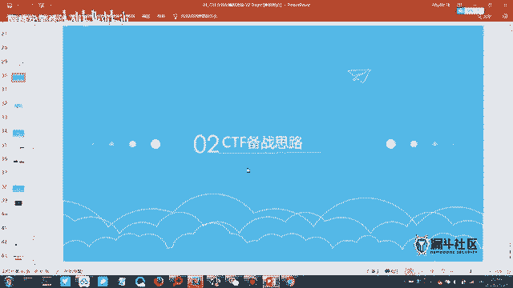
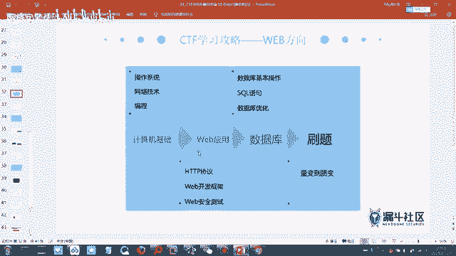
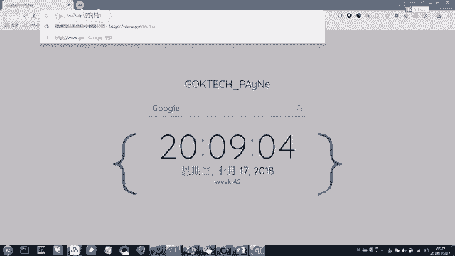
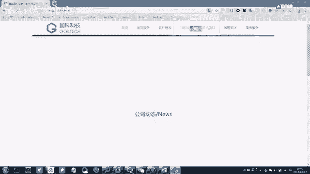
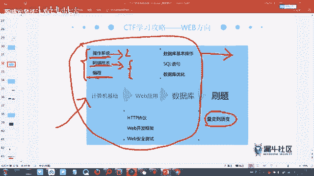
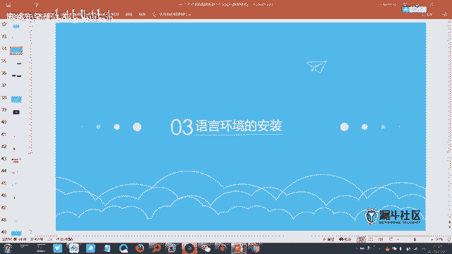
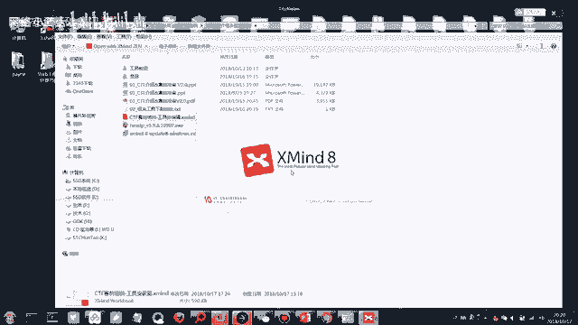
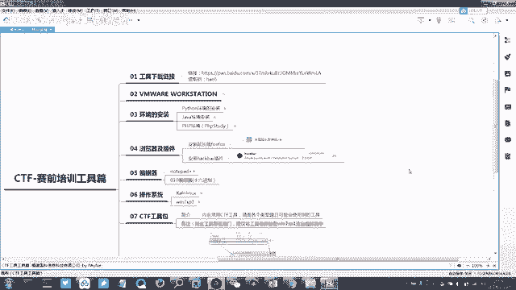

# CTF入门课程：3：CTF赛制介绍与工具介绍



## 概述
在本节课中，我们将学习CTF比赛的备赛思路，了解需要掌握的基础与专项知识，并介绍一些实用的在线练习平台和工具。

---

## CTF备赛思路梳理

上一节我们介绍了CTF的基本概念和模式，本节中我们来看看如何为CTF比赛做准备。梳理出适合自己的备赛思路，需要对CTF所需的技术知识有一定理解。

CTF比赛所需的知识分为两个主要模块：**基础知识**和**专项知识**。



### 基础知识模块
以下是需要掌握的基础知识领域：
*   **Linux系统基本使用**：需要了解基本的Linux命令，例如进入目录、查看文件等。这在使用Kali Linux等渗透测试系统时至关重要。
*   **网络协议分析**：涉及网络流量数据包的分析能力。
*   **计算机组成原理与操作系统原理**：这两部分了解即可，无需精通。





### 专项知识模块
专项知识主要分为两个方向：
*   **方向A（逆向工程与密码学）**：这个方向通常难度较高。
*   **方向B（Web安全与杂项）**：此方向涉及的技术点相对集中，更注重漏洞原理的利用和信息收集能力。

---

## 具体技能学习路线

为了更清晰地规划学习路径，以下是建议掌握的具体技能。

### 操作系统与网络
*   **Linux命令**：掌握基本命令是使用安全工具（如Kali Linux）的基础。
*   **网络技术**：需要具备类似HCNA或CCNA水平的网络基础知识，理解IP通信等过程。
*   **编程能力**：编程属于拔高技能，并非必须，但掌握后更有优势。

### Web应用相关
*   **HTTP/HTTPS协议**：必须掌握的核心协议。HTTPS可理解为 `HTTPS = HTTP + TLS`，提供了加密传输，更安全，但部署需要CA证书。
*   **数据库与SQL**：需要掌握数据库的增删查改（CRUD）基本操作。理解SQL语句是学习SQL注入漏洞的前提。基本查询语句如：
    ```sql
    SELECT * FROM users WHERE username='admin';
    ```

CTF注重知识的广度而非深度。建议对每个部分稍作了解，然后通过大量刷题来积累经验和思路。如果在做题时遇到未知知识点，再针对性搜索学习即可。

---

## 练习平台推荐

量变引起质变的关键在于刷题。以下是推荐的CTF练习平台。

**平台列表：**
*   **实验吧**：题目难度适中，适合入门，并提供答案解析（WP）。
*   **BugKu CTF**：题目友好，适合初学者练习。
*   **i春秋（CTF大本营）**：包含大量历年比赛真题，难度较高，适合进阶挑战。

**建议：** 初学者可以从**实验吧**和**BugKu CTF**开始。当感觉熟练后，可以挑战**i春秋**上的真题。这些平台题目丰富，无需担心无题可做。



---

## 工具安装与实践

现在进入今晚的实践操作部分：工具的安装与使用。

1.  请打开群文件中提供的思维导图软件（Xmind）。
2.  用该软件打开群文件中下载的思维导图文件，其中包含了更详细的知识图谱和工具介绍。

---







## 总结
本节课我们一起学习了CTF的备赛知识体系，明确了需要掌握的基础技能和专项方向，并获得了实用的在线练习平台资源。记住，学习CTF是一个循序渐进的过程，从广度入手，通过实践不断深化理解。接下来，请根据思维导图的指引，开始你的工具安装与学习之旅吧。