# CTF入门课程：P40：Windows系统安全基础

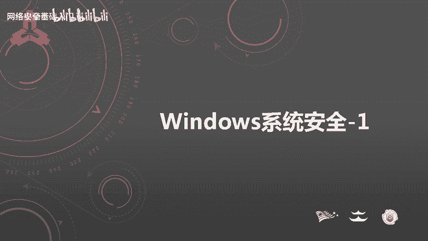

在本节课中，我们将要学习Windows系统安全的基础知识。作为最常用的操作系统，了解其安全机制对于网络安全工作者至关重要。本节课将分为四个主要部分，从基础命令到账户安全，再到策略配置和口令检查，帮助初学者建立Windows安全的基本认知。

## 常用命令

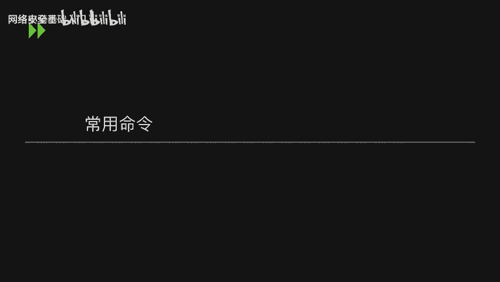

上一节我们介绍了课程概述，本节中我们来看看Windows系统安全的基础操作，首先从常用命令开始。掌握这些命令能帮助我们高效地操作系统，并避免因图形界面版本差异带来的操作困扰。

以下是常用Windows命令列表：

*   `winver`：查看系统版本。
*   `hostname`：查看主机名。
*   `ipconfig /all`：查看详细的网络配置信息，包括IP地址和MAC地址。
*   `net user`：查看用户信息。
*   `netstat -ano`：查看当前系统开放的端口以及网络连接状态。
*   `regedit`：打开注册表编辑器。
*   `eventvwr.msc`：打开事件查看器，查看系统日志。
*   `services.msc`：打开系统服务管理器。
*   `gpedit.msc`：打开组策略编辑器。
*   `secpol.msc`：打开本地安全策略。
*   `lusrmgr.msc`：打开本地用户和组管理器。

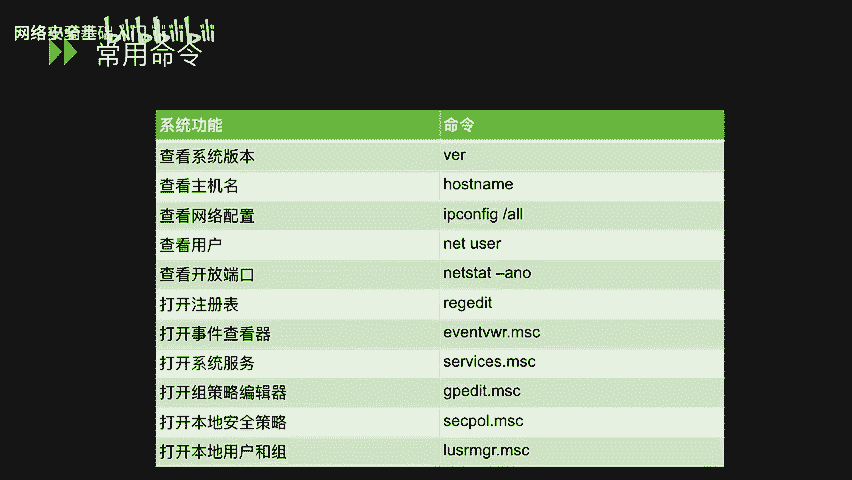

## 账户安全


了解了基础命令后，我们进入账户安全部分。账户是系统访问控制的第一道防线，管理好用户账户是保障系统安全的基础。

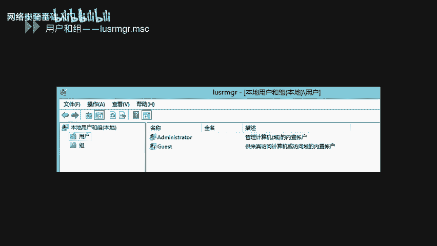

通过命令 `lusrmgr.msc` 可以打开本地用户和组管理器。在用户列表中，被禁用的账户图标上会有一个向下的箭头。

在安装和启动Windows应用程序时，建议为每个应用创建独立的低权限用户账户。这样可以在应用程序出现漏洞时，防止攻击者直接获得整个操作系统的控制权。

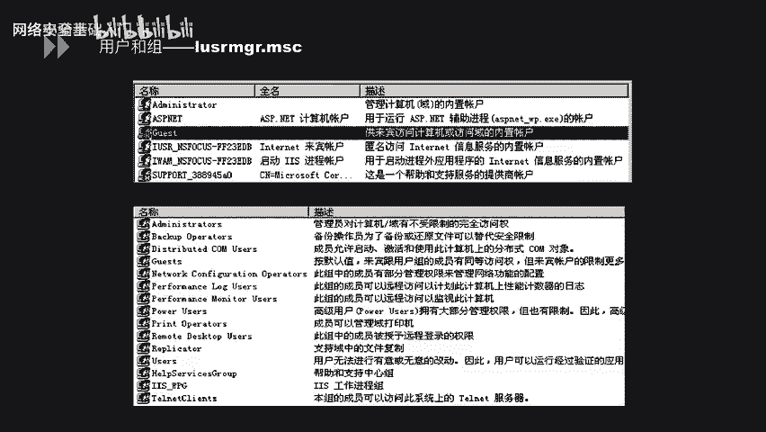

用户组管理允许我们将用户添加到不同的组中，从而批量管理用户的权限。

以下是两个管理账户的常用命令：

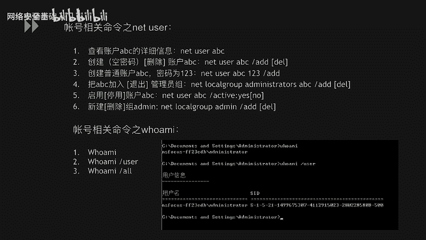

*   `net user`：用于查看、创建、修改或删除用户账户。例如，创建用户并设置密码：`net user testuser Password123 /add`。
*   `whoami`：查看当前登录用户的信息。使用 `whoami /all` 可以查看更详细的用户信息，包括所属的组。

### 隐藏账户创建实例

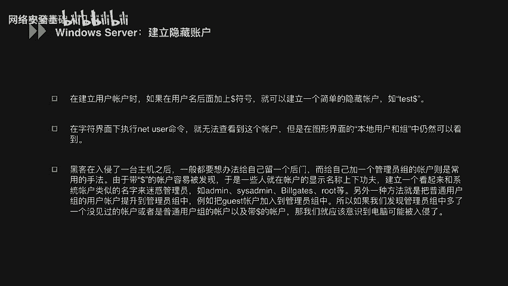

攻击者在获得系统权限后，为了维持长期访问，通常会创建隐藏账户。以下是一个创建完全隐藏账户的步骤示例。

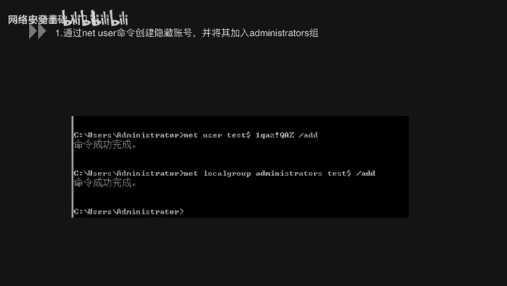

**第一步：创建隐藏账户并提权**
使用命令创建一个末尾带`$`符号的账户，并将其加入管理员组。
```cmd
net user test$ Password123 /add
net localgroup administrators test$ /add
```

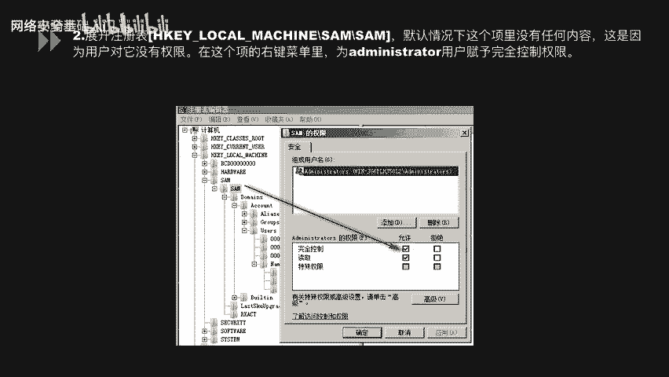

**第二步：获取注册表权限**
1.  运行 `regedit` 打开注册表。
2.  定位到 `HKEY_LOCAL_MACHINE\SAM\SAM`。
3.  默认无法查看，需右键点击`SAM`文件夹，选择“权限”，为`Administrators`组添加“完全控制”权限。

**第三步：导出账户注册表信息**
权限生效后，在 `SAM\Domains\Account\Users\Names` 下找到 `test$` 项，及其对应的 `Users\000003E9` 项（具体名称可能不同），分别将这两项导出为 `.reg` 文件。

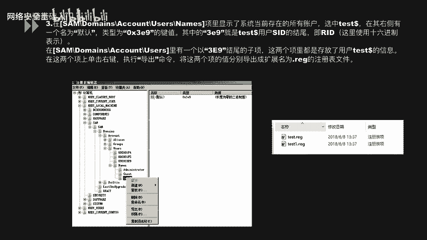

**第四步：删除可见账户**
使用命令删除刚才创建的账户。
```cmd
net user test$ /del
```
此时，在命令行和用户管理界面中将看不到该账户。

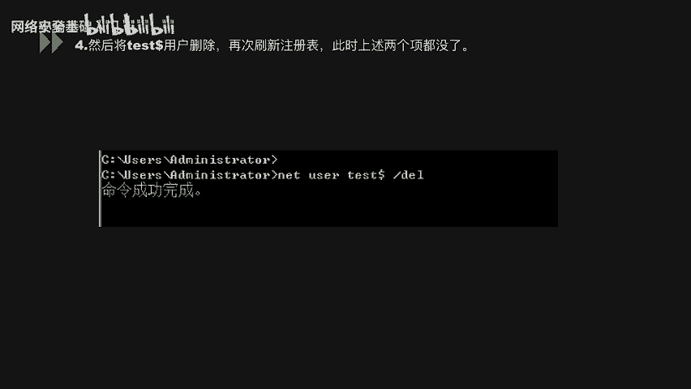

**第五步：导入注册表信息**
在注册表编辑器中，右键选择“导入”，将第三步导出的两个 `.reg` 文件重新导入。此时，账户信息仅存在于注册表中。

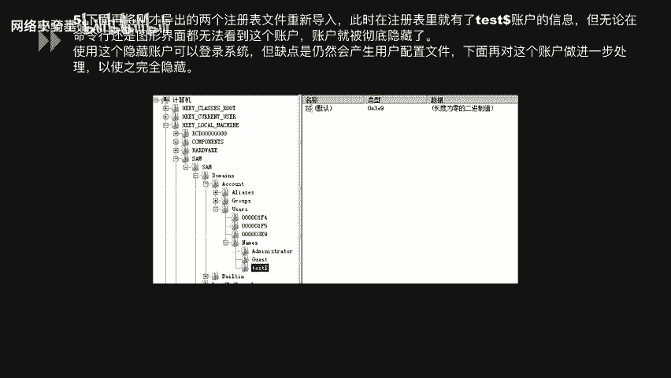

**第六步：克隆管理员SID实现完全隐藏**
1.  在注册表中找到管理员账户（如 `Administrator`）对应的项（例如 `000001F4`）。
2.  将其 `F` 键值的数据全部复制。
3.  找到隐藏账户对应的项（例如 `000003E9`），将其 `F` 键值的数据替换为刚才复制的数据。
此操作使系统将隐藏账户识别为管理员账户的影子账户，共享同一用户配置文件，从而实现完全隐藏。

**验证结果**
完成上述步骤后，使用 `net user` 命令或在图形界面中均无法看到 `test$` 账户，但可以使用该账户凭据登录系统。

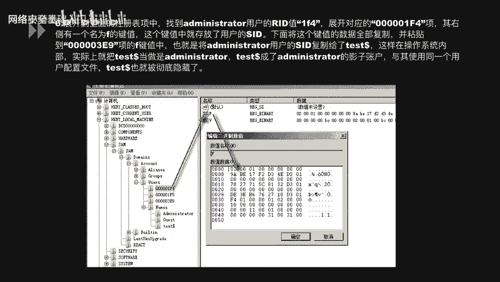

## 本地安全策略

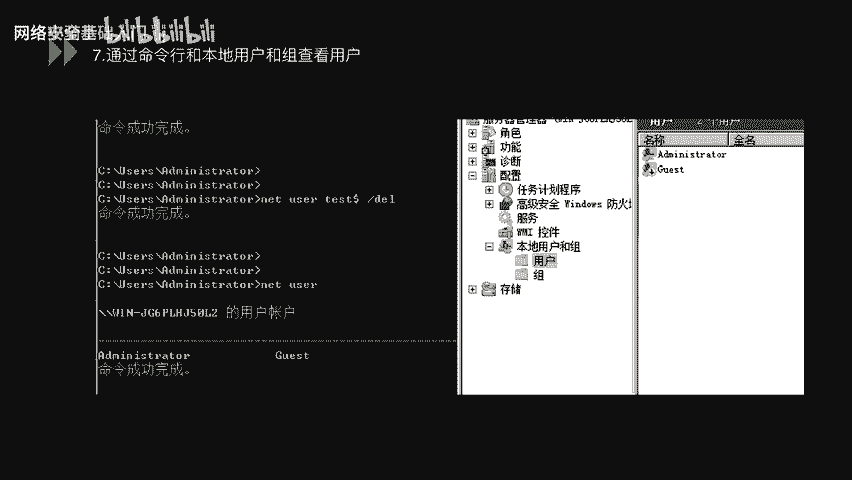


掌握了账户管理后，我们需要通过策略来规范账户行为。本地安全策略是Windows系统加固的重要工具。

通过命令 `secpol.msc` 可以打开本地安全策略。其中包含账户策略、本地策略、高级防火墙等关键配置。

在“账户策略 -> 密码策略”中，可以进行以下关键设置以增强口令安全性：

*   **密码必须符合复杂性要求**：启用后，密码必须包含大小写字母、数字和符号中的三种。
*   **密码长度最小值**：设置密码的最小长度，例如8位或12位。
*   **密码最短使用期限**：设置密码更改后必须使用的最短天数（例如1天），防止频繁改密。
*   **密码最长使用期限**：设置密码的有效期（例如90天），到期后强制更改。
*   **强制密码历史**：系统记住的旧密码数量（例如5个），防止重复使用近期密码。
*   **用可还原的加密来存储密码**：通常应禁用此选项，以使用更安全的加密方式存储密码哈希。

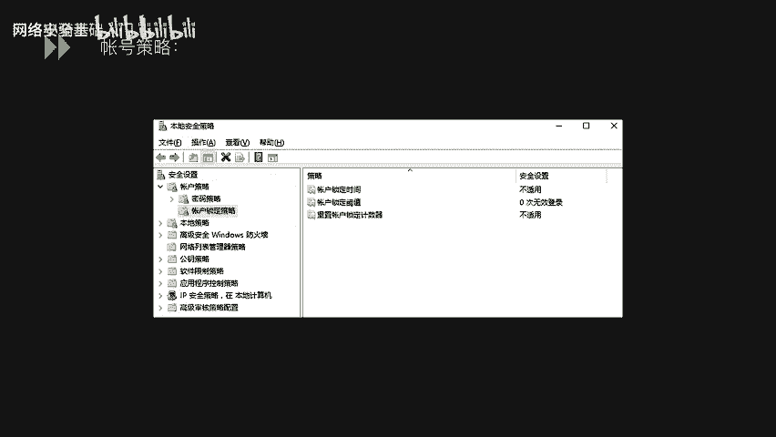

在“账户策略 -> 账户锁定策略”中，可以设置防御暴力破解的规则：


*   **账户锁定阈值**：设置登录失败次数（例如5次），超过后账户将被锁定。
*   **账户锁定时间**：设置账户被锁定的时长（例如30分钟）。
*   **重置账户锁定计数器**：设置在多少次失败的登录尝试后，计数器重置为零（例如30分钟后）。

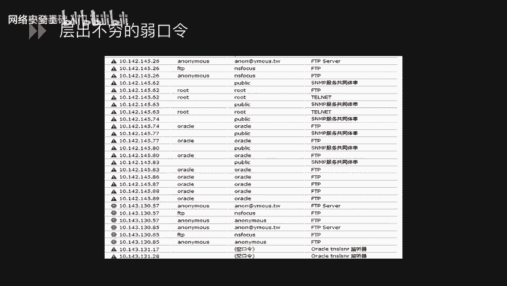

## 口令安全

最后，我们来探讨口令安全。弱口令是系统最常见的安全漏洞之一，攻击者往往通过破解弱口令轻松获得系统权限。

渗透测试中经常能扫描到各类服务的弱口令，例如FTP、数据库、SSH等，这为攻击者提供了直接的入侵路径。

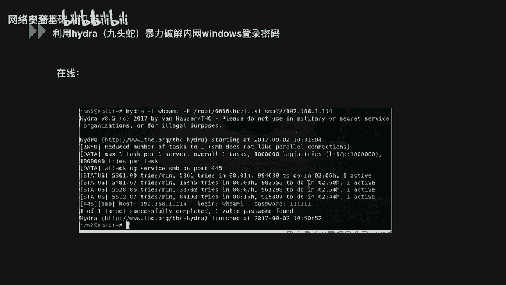

检查系统是否存在弱口令至关重要，主要有在线和离线两种方式。

**在线检测**
使用工具如 **Hydra** 进行在线暴力破解。这种方式直接、快速，但可能触发账户锁定策略，对生产环境造成影响。
```bash
hydra -l admin -P passlist.txt smb://192.168.1.114
```
上述命令使用 `passlist.txt` 字典对 `192.168.1.114` 主机的SMB服务进行密码爆破。

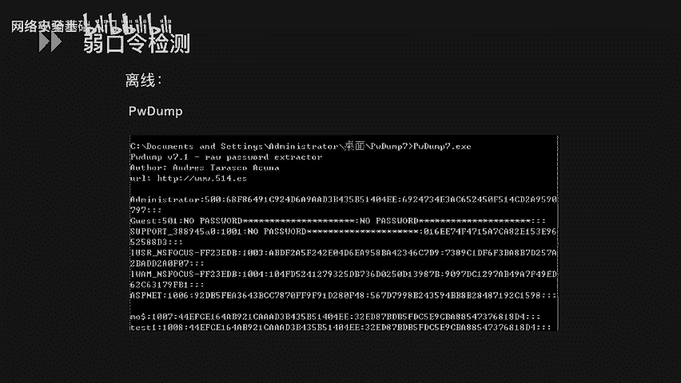

**离线检测**
为避免在线检测的风险，可以采用离线方式。核心步骤是从系统中提取密码哈希值，然后使用彩虹表等工具进行破解。
1.  **提取哈希**：由于系统运行时SAM文件被锁定，需要使用 **PwDump** 或 **Mimikatz** 等工具从内存或注册表中提取用户密码的哈希值（NTLM Hash）。
2.  **破解哈希**：将提取出的哈希值导入 **彩虹表（Rainbow Table）** 或使用 **Hashcat** 等工具进行离线破解。这种方式不会触发登录失败限制，更为隐蔽和安全。

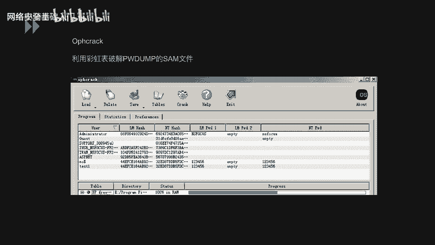

---


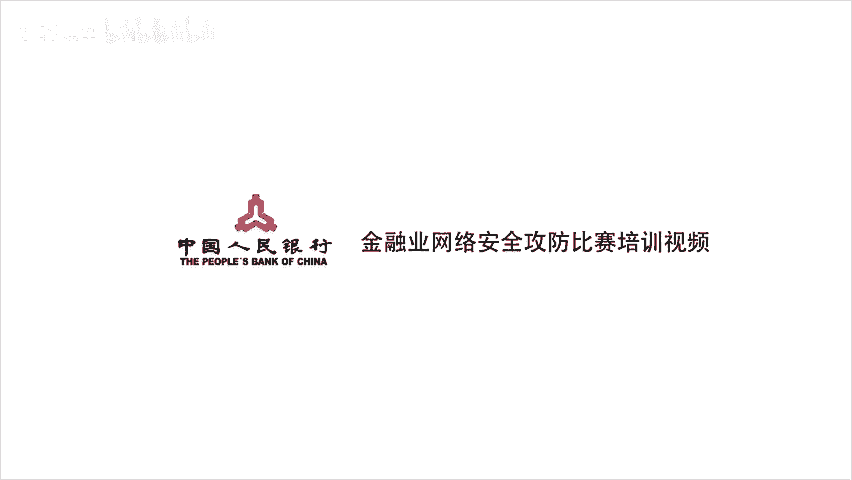

本节课中我们一起学习了Windows系统安全的基础知识。我们首先掌握了常用的系统管理命令，然后深入了解了账户安全管理，包括如何创建和发现隐藏账户。接着，我们学习了通过本地安全策略来强制实施强密码策略和账户锁定策略。最后，我们探讨了弱口令的风险以及在线和离线两种检测弱口令的方法。理解这些基础概念是进行Windows系统安全加固和应急响应的第一步。