# CTF入门课程：P41：Windows系统安全_2 - 网络安全基础入门


在本节课中，我们将要学习Windows系统安全配置规范。这部分内容将帮助我们理解如何通过配置系统服务、管理进程、审核日志和控制文件权限来增强Windows操作系统的安全性。


上一节我们介绍了Windows系统安全的基础概念，本节中我们来看看具体的安全配置规范。这部分内容分为四个小节：系统服务、服务于进程安全、日志审核以及文件权限控制。

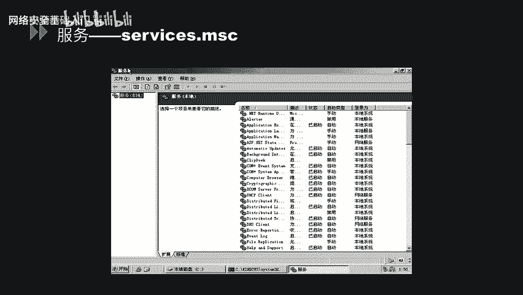

## 系统服务

系统服务是Windows操作系统在后台运行的程序，用于执行特定功能。管理这些服务的启动、停止和配置是系统安全的重要环节。

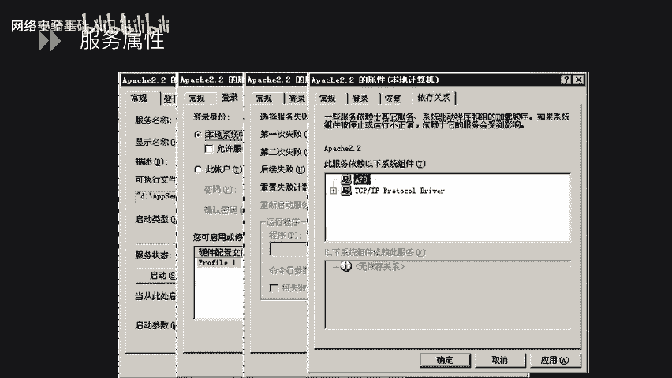

想查看系统中有哪些服务，可以使用 `services.msc` 命令。在CMD中直接输入此命令，即可打开服务管理界面。该界面会显示当前系统中存在的所有服务及其状态（如“已启动”或“已停止”）和启动类型（如“手动”、“禁用”、“自动”）。

接下来，我们可以查看某个服务的具体属性。以“Apache2.2”服务为例，右键点击该服务并选择“属性”。在“常规”选项卡中，可以看到服务名称、可执行文件路径以及启动类型设置。在“登录”选项卡中，可以设置运行此服务的账户身份。“恢复”选项卡允许配置服务失败时计算机的响应操作。“依存关系”选项卡则列出了此服务所依赖的其他服务或组件。

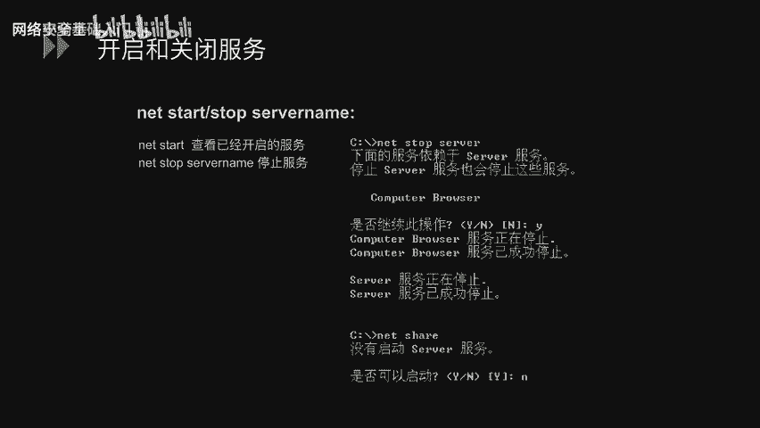

以下是使用系统命令开启和关闭服务的方法。以停止“serv”服务为例，在命令行中执行：
```cmd
net stop serv
```
系统可能会提示该服务依赖于其他服务，确认后即可停止。若要重新启动该服务，则执行：
```cmd
net start serv
```

从安全角度考虑，某些不必要或存在已知漏洞的服务应被停止。建议将以下服务的启动类型修改为“手动”并停止运行，以最小化攻击面：
*   **Server服务**：此服务曾存在MS06-040和MS08-067等缓冲区溢出漏洞，可导致远程代码执行，使攻击者完全控制系统。
*   **Print Spooler服务**：此服务曾存在MS10-061漏洞，即Windows打印机远程服务代码执行漏洞。

服务配置信息存储在注册表中。我们可以使用 `regedit` 命令打开注册表编辑器。服务的启动配置位于以下路径：
`HKEY_LOCAL_MACHINE\SYSTEM\CurrentControlSet\Services`
每个服务项下都有一个名为 `Start` 的数值，它决定了服务的启动方式（例如，2=自动，3=手动，4=禁用）。

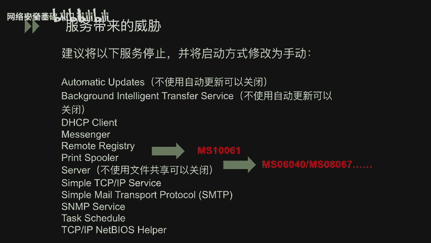

## 服务于进程安全

进程是正在运行的程序的实例。了解系统正常进程以及如何关联进程与网络连接，对于发现异常活动至关重要。

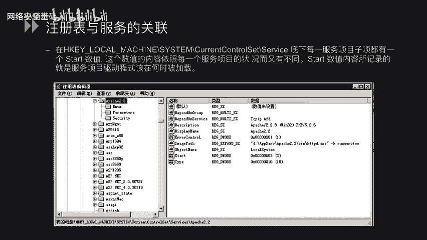


首先，我们需要熟悉Windows的基本系统进程。通过打开任务管理器，可以查看当前运行的进程列表，例如 `svchost.exe`、`explorer.exe` 等，这有助于我们识别可疑进程。

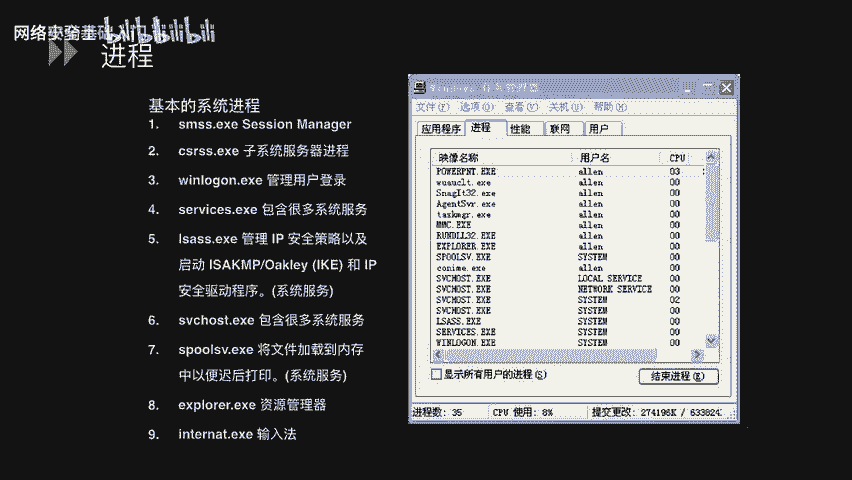

当发现某个网络端口被占用时，我们需要找出是哪个进程在使用它。以下是查看端口与进程对应关系的方法：
1.  使用 `netstat -ano` 命令查看所有网络连接和监听端口及其对应的进程ID（PID）。例如，查找占用443端口的进程：
    ```cmd
    netstat -ano | findstr :443
    ```
    输出中会显示PID。
2.  打开任务管理器，切换到“详细信息”或“进程”选项卡，点击“PID”列进行排序，找到对应的PID，即可看到进程名称。

## 日志审核

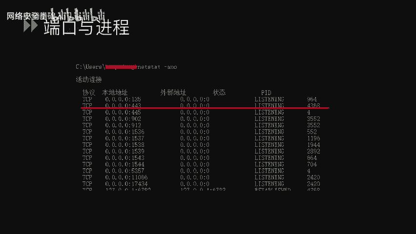

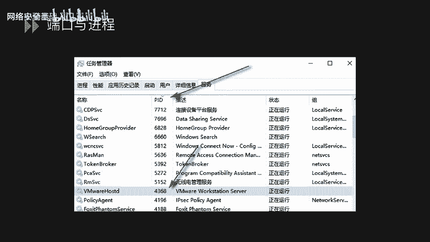

日志记录了系统、应用程序和安全相关的事件，是事后审计和调查安全事件的关键依据。

Windows日志主要存放在以下位置：
*   **默认日志**：包括“应用程序”、“安全”和“系统”日志，存放于 `%SystemRoot%\System32\Winevt\Logs\` 目录。
*   **其他服务日志**：如IIS的FTP连接日志、HTTP事务日志等，通常存放于 `%SystemDrive%\inetpub\logs\LogFiles\` 目录。

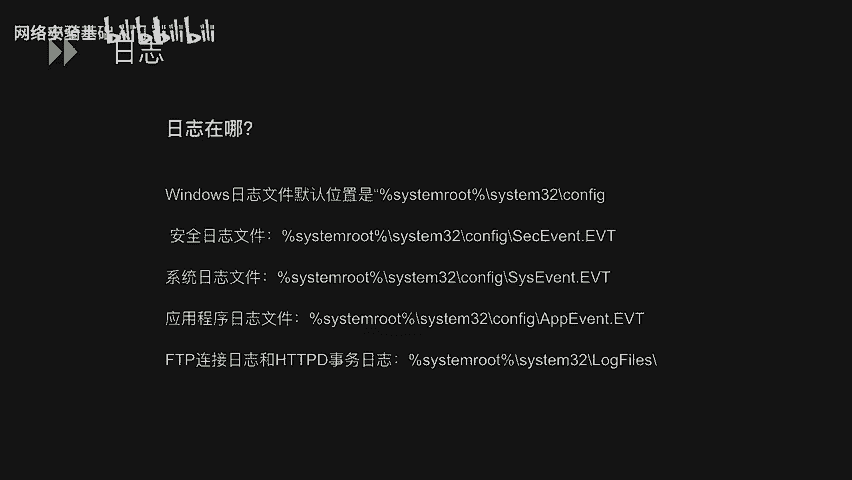

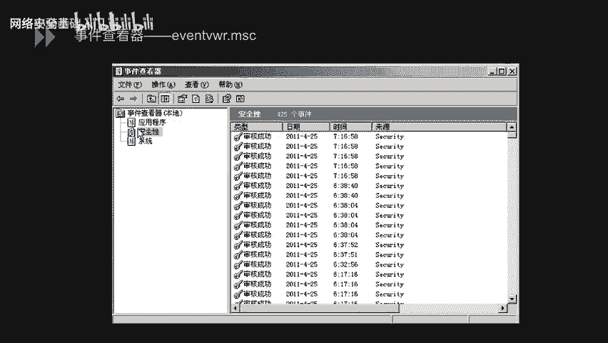

我们可以通过 `eventvwr.msc` 命令打开“事件查看器”，查看上述三类主要日志的详细信息。

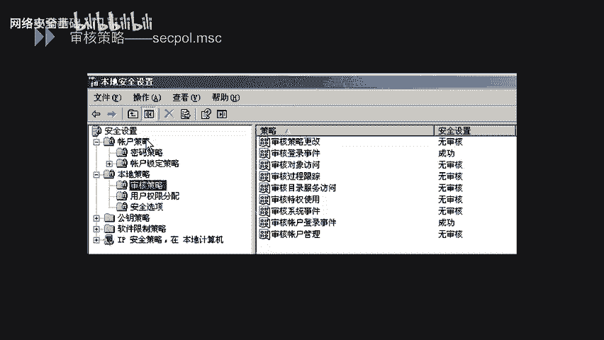

为了确保日志能有效记录安全事件，需要配置审核策略。使用 `secpol.msc` 命令打开“本地安全策略”，导航至“本地策略”->“审核策略”。这里列出了多项审核策略，如“审核账户登录事件”、“审核对象访问”等。对于每项策略，可以设置为“无审核”、“仅审核成功”、“仅审核失败”或“成功和失败都审核”。

## 文件权限控制

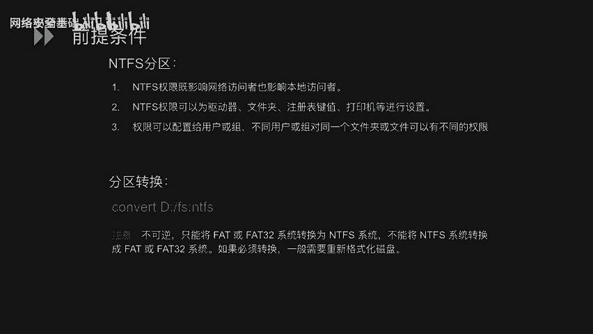

文件权限控制是保护数据安全的核心手段。以下讨论均基于NTFS文件系统。

NTFS权限具有以下特点：
1.  影响网络访问者和本地访问者。
2.  可为驱动器、文件夹、文件、注册表键值等对象设置。
3.  权限可分配给用户或组，不同用户或组对同一对象可拥有不同权限。

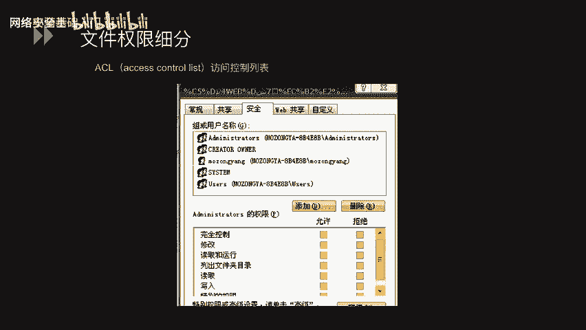

如果需要将FAT/FAT32分区转换为NTFS分区（此过程不可逆），可以使用以下命令：
```cmd
convert D: /fs:ntfs
```

文件权限可以进行细粒度控制。右键点击文件或文件夹，选择“属性”->“安全”选项卡。在此界面中，“组或用户名”列表显示了拥有权限的主体，下方的权限列表则显示了该主体被允许或拒绝的具体操作（如“完全控制”、“修改”、“读取和执行”）。

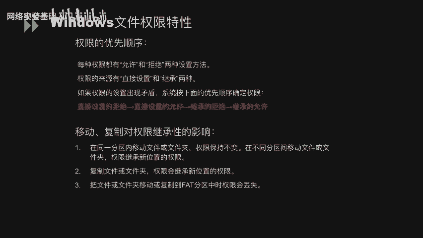

Windows文件权限遵循特定的优先顺序和继承规则：
*   **权限优先顺序**：当权限设置出现矛盾时，系统按以下顺序判定：直接设置的“拒绝” > 直接设置的“允许” > 继承的“拒绝” > 继承的“允许”。
*   **移动/复制对权限的影响**：
    1.  在同一NTFS分区内移动：保留原权限。
    2.  在不同NTFS分区间移动或复制：继承目标位置的权限。
    3.  移动或复制到FAT/FAT32分区：所有NTFS权限丢失。


本节课中我们一起学习了Windows系统安全配置规范的四个核心方面：系统服务的配置与管理、进程与端口的关联分析、日志审核策略的设置以及基于NTFS的文件权限控制。掌握这些知识，能够帮助我们构建一个更安全、更可控的Windows操作系统环境。