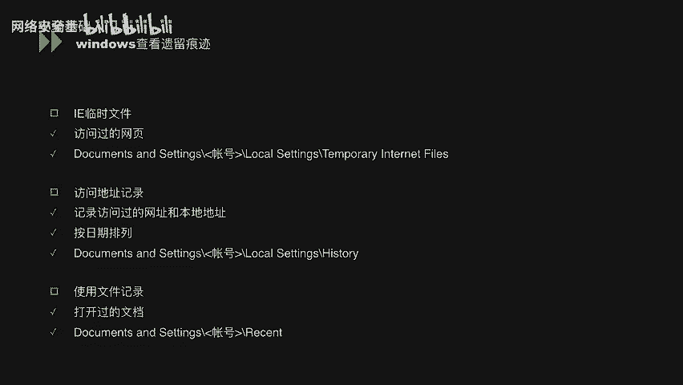
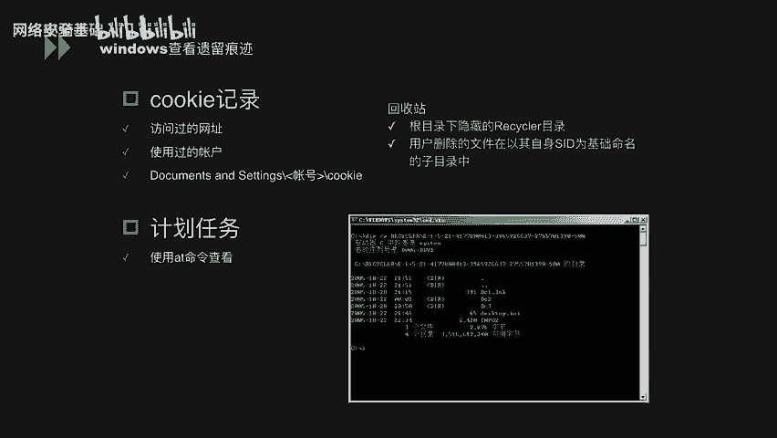
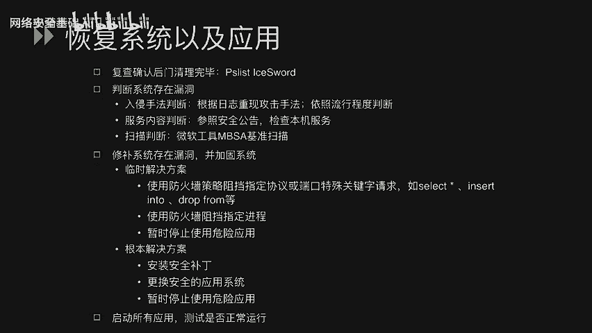

# CTF入门课程：42：Windows系统安全_3 - Windows入侵调查 🔍

在本节课中，我们将学习Windows系统安全中关于入侵调查的核心内容。我们将了解如何及早发现系统异常、如何通过日志分析入侵情况，以及如何恢复系统和应用程序。本节内容旨在为初学者提供一套清晰、实用的Windows系统入侵排查与响应流程。

## 及早发现系统异常 🚨

上一节我们介绍了Windows系统安全的基础概念，本节中我们来看看如何主动发现系统被入侵的迹象。及早发现异常是进行有效响应的第一步。

我们可以通过以下几种方式来尽早察觉系统异常：

以下是几种主要的异常发现途径：

1.  **系统启动方面**：通过系统日志记录的系统运行时间、网络连接时间等信息，可以直观判断系统是否在非计划时间内重启过。
2.  **系统资源方面**：观察进程是否异常占用大量CPU或物理内存；检查磁盘空间是否被未知文件快速占用或产生大量垃圾文件。
3.  **网络流量异常**：监控网络是否收到大量SYN、SMP数据包，或遭受DDoS等流量攻击。
4.  **边界安全产品告警**：关注部署在网络边界的IPS、WAF等防火墙设备发出的攻击告警信息。
5.  **其他管理报告**：留意其他管理员或用户反馈的系统功能异常或使用问题。

发现异常后，需要搜集Windows系统上可能遗留的痕迹，作为排查依据。

以下是攻击者或用户可能留下的关键痕迹：

*   **IE临时文件**：记录用户访问过的网页信息。
*   **访问地址记录**：记录在资源管理器等位置访问过的本地或网络地址，可按日期排序查看。
*   **使用过的文档记录**：记录用户登录后打开、修改、删除或移动的文档历史。
*   **Cookie信息**：浏览器本地保存的访问网址、登录账户等信息。
*   **计划任务**：通过 `schtasks` 命令查看，可能包含攻击者设置的定时执行任务。
*   **回收站**：检查回收站目录下是否有未及时清理的可疑文件。
*   **注册表**：查看曾经存在的用户账户（包括隐藏账户）以及已安装/卸载的软件信息。
*   **用户配置文件**：检查 `C:\Users`（或 `C:\Documents and Settings`）目录。若存在以某账号命名的文件夹但该账号已不在用户列表中，说明此账号曾被创建后又删除。

## 查看日志分析入侵情况 📊

在发现系统异常迹象后，下一步是深入分析日志，以确定入侵的具体情况、时间和方法。

分析入侵的基本流程是：首先查看各类审核日志，然后结合上一小节提到的遗留痕迹，综合分析入侵原因，最终定位并弥补安全漏洞。

Windows安全日志会记录不同的登录类型，这对于判断攻击者的入侵方式至关重要。以下是常见的登录类型解析：

*   **类型2：交互式登录**（用户在本机键盘上登录）。
*   **类型3：网络登录**（例如通过共享文件夹访问）。
*   **类型4：批处理登录**（为批处理任务保留）。
*   **类型5：服务登录**（服务启动）。
*   **类型7：解锁**（解锁带密码保护的屏幕）。
*   **类型10：远程交互**（通过远程桌面、终端服务登录）。**这是需要重点关注的类型**，可能意味着攻击者已远程控制服务器。

要有效分析日志，需确保两个前提：1) 系统已开启审核策略；2) 日志有足够的保存周期或已配置远程日志服务器。

以下是需要重点查看的日志类型及其关键信息：

*   **系统日志**：记录驱动、进程、服务状态变化及补丁安装情况。
    *   **关键线索**：非计划内的系统重启、服务异常、弹出连接数超限等对话框。
*   **应用程序日志**：记录应用程序活动。
    *   **关键线索**：防火墙/杀毒软件被关闭或禁用、杀毒软件报警、软件被异常安装或卸载。
*   **安全性日志**：记录登录、特权使用、审核策略变更等活动。
    *   **关键线索**：某用户成功/失败登录记录、审核策略被更改。
*   **Web日志（以IIS为例）**：记录Web服务器访问详情。
    *   **特定请求分析**：关注URL中包含 `upload`、`download` 等字符的上传/下载请求；包含 `select`、`insert into`、`delete from` 等SQL关键词的数据库操作请求；包含单引号(`‘`)、`and 1=1` 等字符的注入测试参数。
    *   **服务器状态码分析**：`2xx` 表示成功；`4xx` 表示客户端错误（如请求不存在页面）；`5xx` 表示服务器端错误（可能由恶意请求触发）。

## 恢复系统以及应用程序 🔧

通过日志和痕迹分析确认入侵方式和影响后，最终目标是清除威胁并恢复系统正常运行。

恢复工作主要包含以下四个步骤：

1.  **清除后门**：根据分析结果，复查系统，确认并彻底删除攻击者安装的后门程序。
2.  **判断漏洞**：结合入侵手法（如日志中的SQL注入尝试），判断系统可能存在的漏洞（如Web应用注入漏洞、系统服务漏洞）。可参考安全公告、使用微软基准安全分析器（MBSA）等工具进行扫描验证。
3.  **修补与加固**：
    *   **临时方案**：采用防火墙规则阻止敏感端口、可疑进程或危险应用。此方案治标不治本。
    *   **根本方案**：为系统和应用安装安全补丁；更换存在已知漏洞的不安全应用系统；在修补前，暂时停止运行存在高风险的服务或应用。
4.  **验证测试**：完成修补和加固后，需全面测试系统功能，确保其在安全的前提下能正常运行。

---

本节课中我们一起学习了Windows入侵调查的完整流程。我们从**及早发现系统异常**开始，学习了通过资源、网络、日志等多维度捕捉入侵信号；接着深入**查看日志分析入侵情况**，掌握了如何从系统、安全、应用及Web日志中提取关键线索，并解析了登录类型；最后，我们探讨了如何**恢复系统以及应用程序**，包括清除后门、判断漏洞、实施修补加固并进行验证。掌握这些技能，是进行有效安全应急响应的基础。