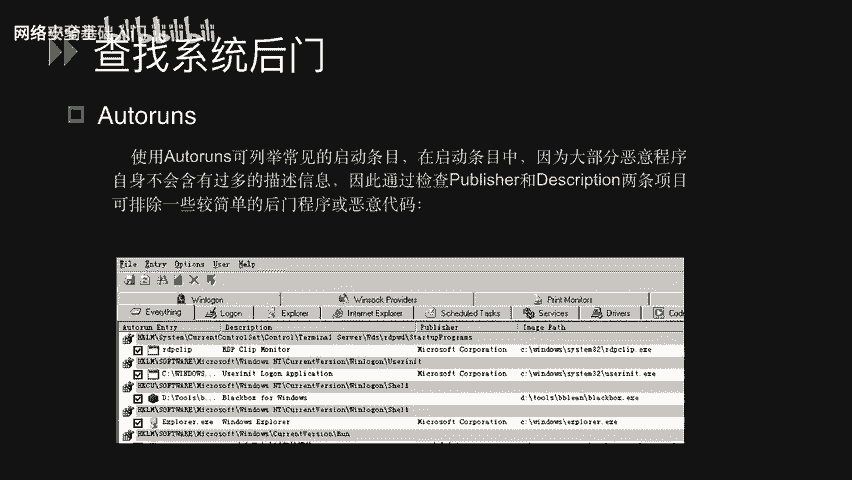
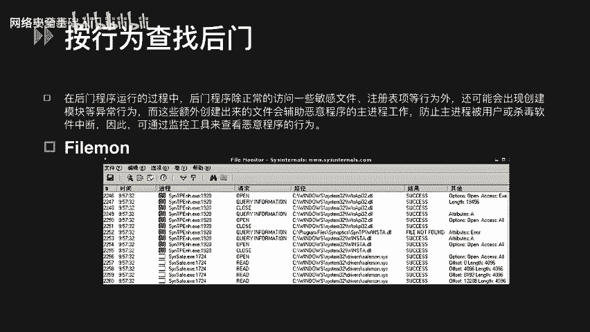
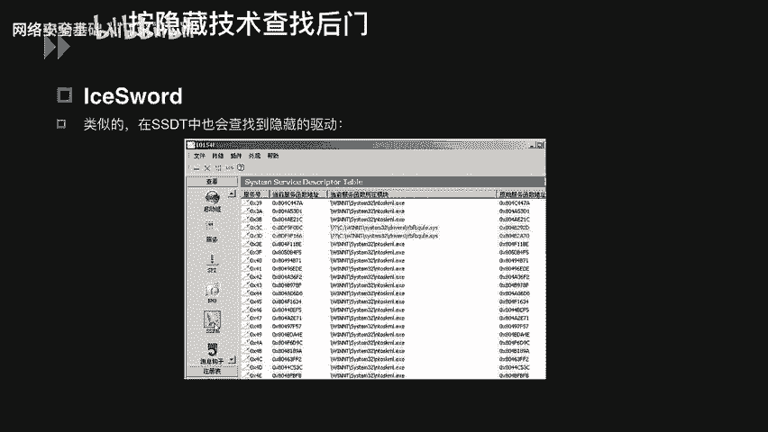
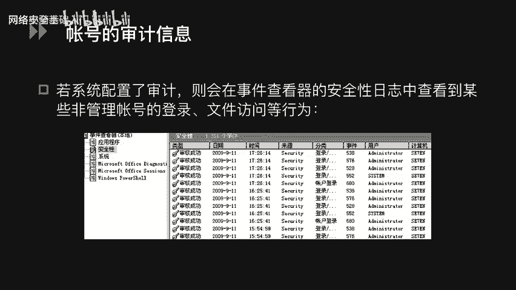
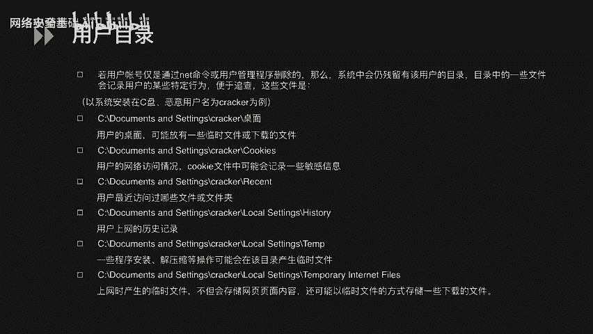
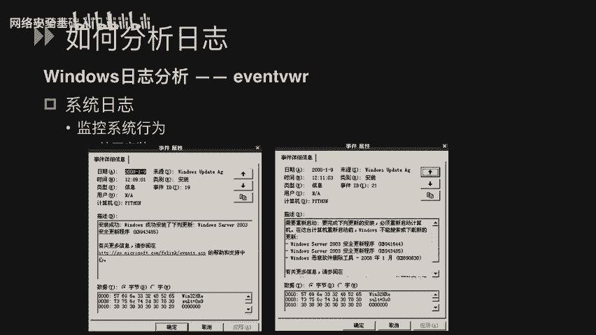
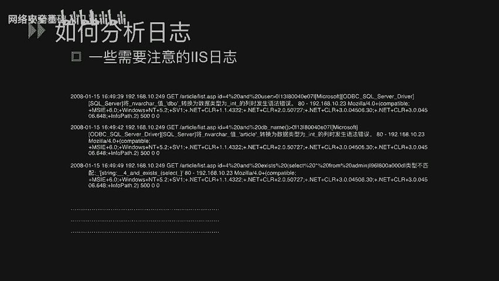

# CTF入门课程：P43：Windows系统安全_4 - Windows应急响应 🛡️

在本节课中，我们将学习Windows应急响应的核心内容。课程分为两个主要部分：第一部分介绍如何查找系统中可能存在的后门程序；第二部分讲解如何全面分析系统日志，以追踪攻击者的行为并发现潜在漏洞。

## 查找系统后门 🔍

上一节我们介绍了Windows系统的基本安全概念，本节中我们来看看当系统可能被入侵后，如何查找攻击者留下的后门。攻击者在获取系统权限后，通常会植入后门以便再次访问。以下是几种查找后门的方法和工具。

### 按启动项查找后门

通过检查系统启动时自动加载的程序，可以发现可疑的恶意软件。Windows自带的`msconfig.exe`功能有限，我们可以使用更强大的工具。

以下是使用`Autoruns`工具进行检查的要点：
*   `Autoruns`可以检查所有开机自动加载的程序，包括硬件驱动、Windows核心启动程序和应用程序。
*   它能显示`msconfig`无法看到的病毒、木马和恶意插件。
*   该工具会详细列出所有启动项加载的程序，例如登录项、IE浏览器加载的DLL和其他组件。
*   大部分恶意程序在`Publisher`和`Description`字段缺乏描述信息。通过检查这两项，可以初步判断程序是否可疑。

### 按行为查找后门

木马程序在运行过程中，除了访问敏感文件、注册表等，还可能创建辅助文件等异常行为。监控这些行为有助于发现恶意软件。

以下是两个用于行为监控的工具介绍：
*   **Filemon**：这是一个文件监控工具。它以进程为线索，记录该进程对文件的所有访问操作（如读取、写入）及其结果。可以通过指定进程名（例如 `csrss.exe`）来过滤监控结果。
*   **Regmon**：这是一个注册表监控软件。它会记录所有与注册表相关的操作（读取、修改、删除），并允许用户对记录进行保存、过滤和查找，为系统维护提供便利。

### 按隐藏技术查找后门

攻击者为了隐蔽自身，会隐藏其进程或驱动。使用特定工具可以揭露这些隐藏项。

以下是使用`IceSword`（冰刃）工具进行检查的方法：
*   `IceSword`是一款功能强大的安全检测工具。
*   利用其进程查看功能，可以检测系统中是否存在被隐藏的进程，隐藏进程会被标记为红色。
*   同样，在SSDT（系统服务描述符表）中，被隐藏的驱动也会被标记为红色。
*   系统中正常的常用进程通常不会隐藏，因此被标记为红色的项非常可疑，需要进一步分析。

## 全面分析系统日志 📊

在学习了如何查找后门之后，我们需要通过分析日志来了解攻击者是如何入侵系统的。全面的日志分析可以帮助我们定位攻击入口和系统存在的漏洞。

### 账号审计与用户目录

首先，我们可以检查系统的账号审计信息和用户目录留下的痕迹。

以下是账号审计信息的分析要点：
*   如果系统配置了审计策略，可以在“事件查看器”的“安全日志”中查看账号的登录、文件访问等行为记录。
*   日志会包含事件时间、来源、类别以及登录的用户账号等信息。

以下是用户目录可能留下的痕迹：
*   任何用户（包括攻击者）登录系统后，都会在用户目录中留下记录。
*   需要关注的目录包括：用户桌面（可能存放临时文件）、近期访问的文件夹、网络访问记录（如Cookie）、浏览器历史记录以及程序安装/解压的痕迹。

### 安全日志与系统日志分析

接下来，我们具体分析Windows的主要日志类型。

以下是安全日志的分析示例：
*   **日志类别：登录/注销**。可以查看是哪个用户在何时登录了系统。
*   **日志类别：对象访问**。可以查看用户访问了哪些目录并执行了何种操作。
*   **日志类别：策略更改**。可以查看用户是否修改了系统的审计或安全策略。

以下是系统日志的分析示例：
*   日志可能记录系统服务的启动与停止，例如事件日志服务的状态变更。
*   日志也会记录系统的更新安装情况，例如Windows成功安装了某个更新。

### 应用程序日志分析（以IIS日志为例）

对于Web服务器，分析IIS日志至关重要。IIS日志默认存储在 `%SystemRoot%\system32\LogFiles` 目录下，按日期（每天一个文件）命名。

以下是一条IIS日志条目的解析：
`2007-12-24 15:42:20 192.168.10.67 GET /NSFocus.html 8080 192.168.10.61 Mozilla 200`
*   `2007-12-24 15:42:20`：访问时间。
*   `192.168.10.67`：服务器IP地址。
*   `GET`：HTTP请求方法。
*   `/NSFocus.html`：请求访问的服务器资源。
*   `8080`：服务器端口。
*   `192.168.10.61`：客户端IP地址。
*   `Mozilla`：客户端浏览器标识。
*   `200`：服务器返回的HTTP状态码（成功）。

通过分析日志中的请求路径，可以发现攻击行为。例如，存在大量类似 `/admin/`、 `/data/`、 `/backup/` 的请求，这可能是攻击者在进行目录扫描，通过返回的`200`（存在）或`404`（不存在）状态码来探测服务器结构。

### 识别攻击payload

日志中出现的特殊字符或SQL语句通常是攻击的直接证据。

以下是常见的攻击payload示例：
*   **SQL注入测试**：在URL参数中出现 `' and 1=1`、 `' and user>0`、 `' and db_name()>0` 或 `select ... from admin` 等字符串，表明攻击者正在尝试SQL注入攻击。
*   **漏洞利用**：如果日志中出现大量此类payload，说明网站可能存在SQL注入漏洞，需要立即进行漏洞排查和修复。
*   **其他攻击**：要更好地分析日志，还需要了解其他攻击的特征，如XSS跨站脚本、命令注入、文件上传漏洞等攻击的典型请求模式。掌握这些知识有助于从日志中快速定位攻击行为和安全漏洞。

## 总结 📝

本节课中我们一起学习了Windows应急响应的两个核心部分。我们首先探讨了如何使用`Autoruns`、`Filemon`、`Regmon`和`IceSword`等工具，通过检查启动项、监控行为、查找隐藏项来发现系统中的后门程序。接着，我们深入讲解了如何全面分析系统日志，包括安全日志、系统日志以及关键的IIS Web日志，通过识别异常的账号活动、用户痕迹以及日志中的攻击payload（如目录扫描和SQL注入语句），来追踪攻击路径并定位系统存在的安全漏洞。掌握这些技能是进行有效安全防御和事件响应的基础。