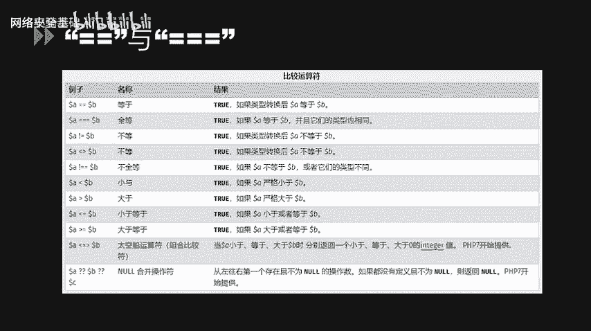
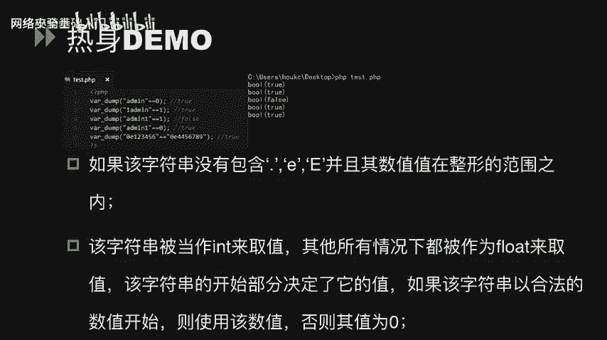
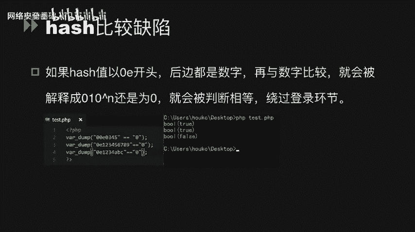
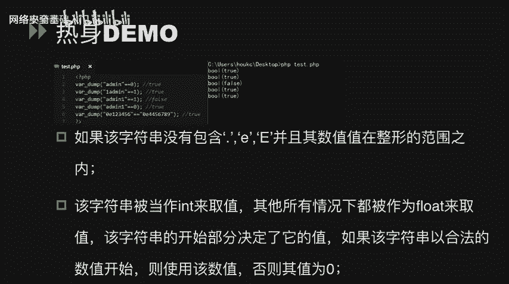
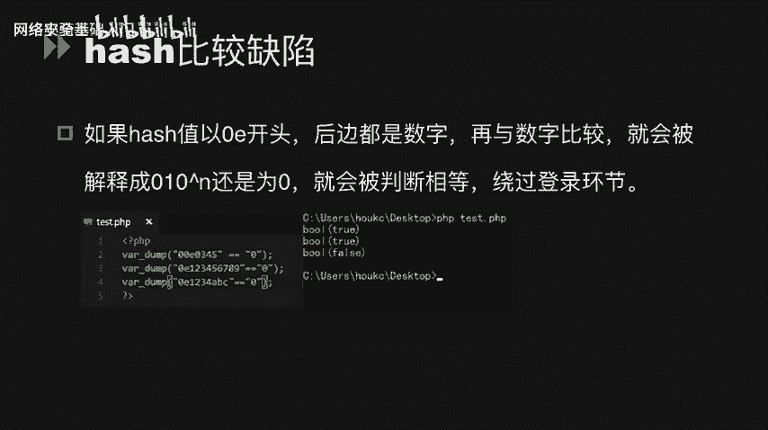
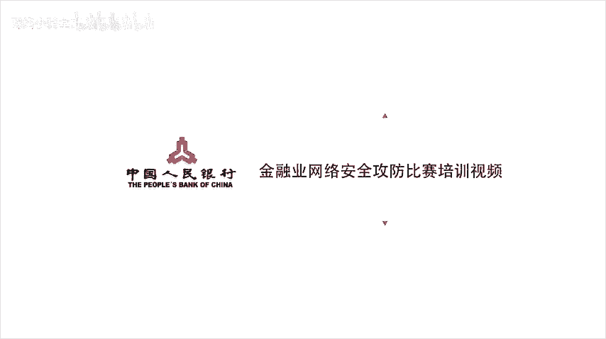

# CTF入门课程：P44：代码审计_1 - PHP代码审计基础 🐛


在本节课中，我们将要学习CTF比赛中PHP代码审计的基础知识。代码审计是发现Web应用漏洞的关键技能，通过分析源代码，我们可以找到绕过安全限制或获取系统权限的方法。

## 概述



在CTF比赛中，PHP代码审计占据了重要比例。通过审计PHP代码，我们可以发现其中的逻辑漏洞。利用这些漏洞，可以绕过条件判断，甚至获取权限。

## 松散比较与严格比较 🔍

上一节我们介绍了代码审计的重要性，本节中我们来看看PHP中两个核心的比较运算符：双等号（`==`）和三个等号（`===`）。它们的主要区别在于比较的严格程度。

*   **双等号 (`==`)**：称为松散比较。在比较前，会尝试将操作数转换为相同类型。
*   **三个等号 (`===`)**：称为严格比较。同时比较值和类型，类型不同直接返回 `false`。

在PHP官方手册的图表中，存在一些不符合自然逻辑的比较结果。例如，数值 `1` 和字符串 `"1"` 使用 `==` 比较结果为 `true`。字符串 `"admin"` 和数值 `0` 比较结果也为 `true`。

这是因为双等号在进行比较时，会先将字符串类型转化为数值再比较。如果字符串以数字开头，则转化该数字部分；否则转化为 `0`。



以下是几个演示示例：



```php
var_dump("admin" == 0); // 输出: bool(true)
// 解释: "admin" 被强转为 0， 0 == 0 为 true

var_dump("1admin" == 1); // 输出: bool(true)
// 解释: "1admin" 被强转为 1， 1 == 1 为 true



var_dump("admin1" == 1); // 输出: bool(false)
// 解释: "admin1" 被强转为 0， 0 == 1 为 false
```



## 哈希比较缺陷 🎯

哈希比较缺陷利用了PHP中科学计数法字符串在松散比较时的特性。如果一个哈希字符串以 `0E` 开头，后面全是数字，在松散比较时会被解释为科学计数法 `0 * 10^n`，其结果等于 `0`。


```php
var_dump("0e123456" == "0e4456789"); // 输出: bool(true)
// 解释: 两者都被解释为 0， 0 == 0 为 true
```

这种特性常被用来绕过登录凭证验证。例如，已知以下字符串的MD5值均为 `0E` 开头的纯数字形式：

*   `240610708` 的 MD5: `0e462097431906509019562988736854`
*   `QNKCDZO` 的 MD5: `0e830400451993494058024219903391`

因此，在松散比较 `md5($input) == "0e830400451993494058024219903391"` 时，输入 `240610708` 即可绕过。

## 布尔欺骗与类型转换 🔄

当使用 `json_decode()` 或 `unserialize()` 函数时，部分结构可能被解释为布尔类型 `true`，造成欺骗。


以下是 `json_decode()` 的示例：
```php
$json_string = '{"user":true,"pass":true}';
$data = json_decode($json_string, true);
if ($data['user'] == 'admin' && $data['pass'] == 'security') {
    echo "Login successful!";
}
// 输出: Login successful!
// 解释: json中的 true 在松散比较时等于任意非空字符串（如 'admin'）
```

以下是 `unserialize()` 的示例：
```php
$serialized_string = 'a:2:{s:4:"user";b:1;s:4:"pass";b:1;}';
$data = unserialize($serialized_string);
if ($data['user'] == 'admin' && $data['pass'] == 'security') {
    echo "Login successful!";
}
// 输出: Login successful!
// 解释: 反序列化后的布尔值 true 在松散比较时同样等于任意非空字符串
```

## 数字转换欺骗 ➗

字符串在转换为数值时可能产生非预期的结果，这被称为数字转换欺骗。

```php
var_dump(intval("2")); // 输出: int(2)
var_dump(intval("3ABCD")); // 输出: int(3) - 转换开头的数字部分
var_dump(intval("ABCD")); // 输出: int(0) - 无数字开头，转为0

var_dump("123456" == 0x1E240); // 输出: bool(true)
// 解释: 十六进制 0x1E240 等于十进制 123456

var_dump("0.999999" == 1); // 输出: bool(true)
// 解释: 字符串 "0.999999" 被转换为浮点数，与整数1松散比较时可能因精度问题相等

if ($_GET['uid'] == 1) {
    // 如果传入 uid=1.0， uid=1abc 等，都可能进入此分支
}
```

## 函数使用不当导致的漏洞 ⚠️

某些PHP函数如果传入非预期的参数类型（如数组），可能不会报错而是产生特殊行为，导致逻辑漏洞。

以下是 `strcmp()` 函数的示例。该函数用于比较两个字符串，但若第二个参数为数组，则返回 `NULL`。在松散比较中，`NULL == 0` 为 `true`。
```php
// 假设代码：if (strcmp($password, $_POST['pass']) == 0) { // 登录成功 }
// 攻击者传入 pass[]=任意值， strcmp($password, array()) 返回 NULL， NULL == 0 成立，绕过验证。
```

以下是 `md5()` 函数的示例。`md5()` 函数期望字符串参数，如果传入数组，会返回 `NULL`，导致任意两个数组的MD5值在松散比较时相等。
```php
$arr1 = array('a' => 'b');
$arr2 = array('c' => 'd');
var_dump(md5($arr1) == md5($arr2)); // 输出: bool(true)
// 解释: md5(数组) 产生警告并返回 NULL， NULL == NULL 为 true
```

## 哈希函数与生日攻击 🎂

哈希函数的目标是使输出与输入之间没有明显规律。但即使是一个复杂的哈希函数，由于其输出空间是有限的（如MD5有2^128种可能），根据“生日悖论”，在随机输入下，找到两个不同输入产生相同哈希值（碰撞）所需的尝试次数远小于输出空间的大小。

> **生日悖论**：在一个23人的班级中，有至少两人生日相同的概率超过50%。这远小于我们的直觉（需要366人）。

这个原理应用于密码学，就是“生日攻击”。它表明，通过尝试大约 `sqrt(哈希输出空间)` 次（对于MD5约为2^64次），就有很大概率找到一对碰撞。这证明了哈希函数在理论上是可能被攻破的，强调了使用强哈希算法（如SHA-256）和加盐（salt）的重要性。

## 总结

本节课中我们一起学习了PHP代码审计的多个基础知识点：
1.  **松散比较 (`==`)** 与**严格比较 (`===`)** 的区别及其可能引发的类型转换问题。
2.  利用**哈希比较缺陷**（`0E`开头的哈希值）绕过身份验证。
3.  **布尔欺骗**在 `json_decode` 和 `unserialize` 函数中的应用。
4.  字符串到数字的**类型转换欺骗**。
5.  因函数参数类型使用不当（如向 `strcmp`、`md5` 传入数组）导致的漏洞。
6.  **生日攻击**的基本概念，说明了哈希函数存在碰撞的可能性。




理解这些基础概念是进行有效PHP代码审计的第一步，能够帮助我们发现CTF题目和真实Web应用中的常见安全漏洞。