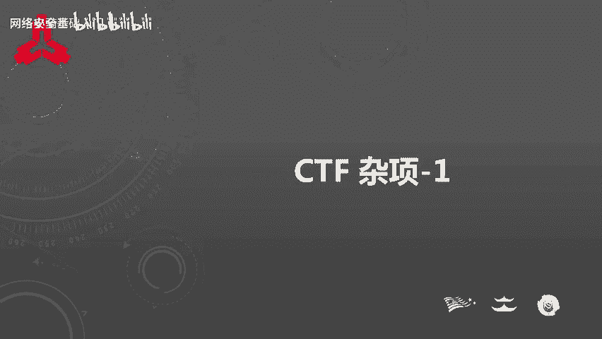
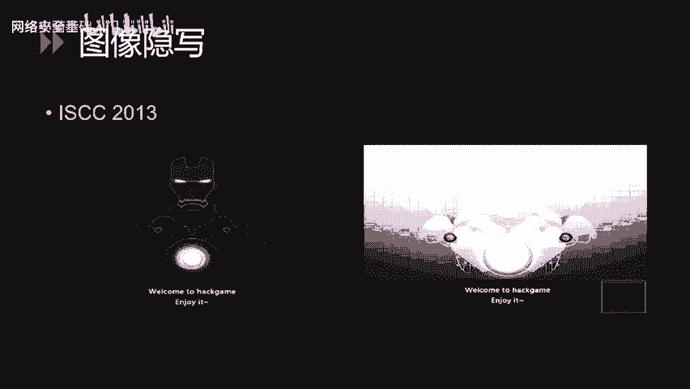
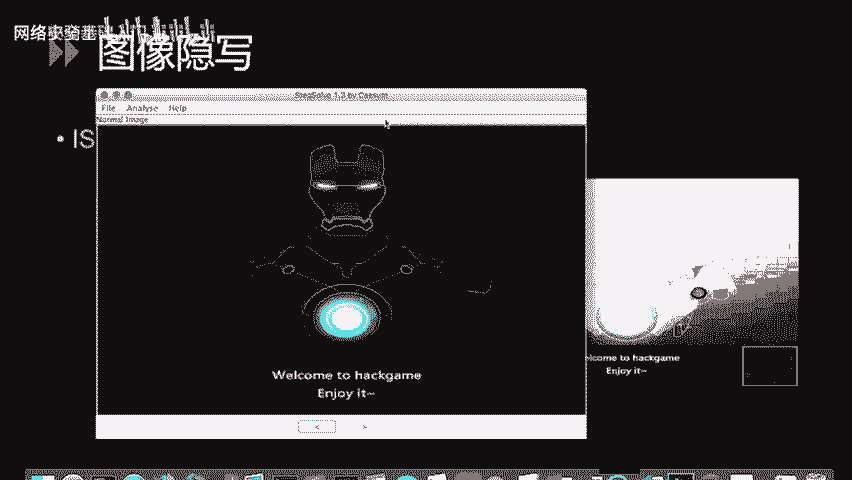
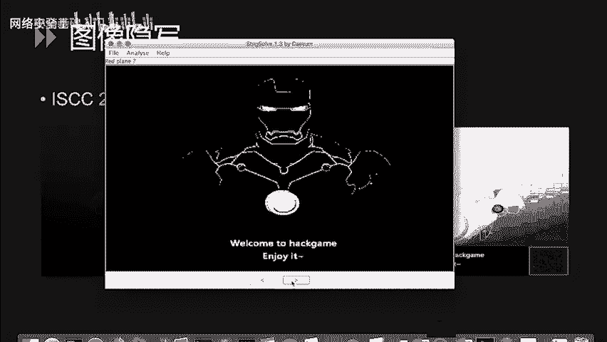
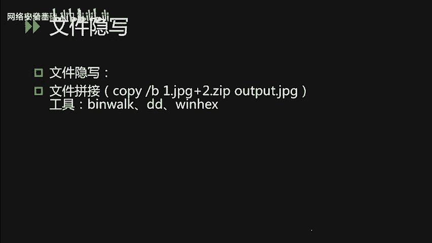
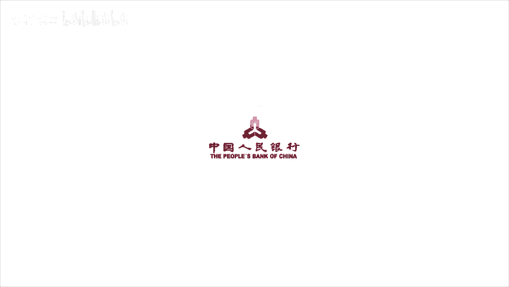

# CTF入门课程：P45：CTF杂项-1 - 网络安全基础入门 🛡️

在本节课中，我们将要学习CTF比赛中的三个重要领域：隐写术、密码编码以及综合性的杂项题目。这些题型在比赛中占有相当大的比重，掌握它们是入门CTF的关键一步。

## 课程概述

隐写术题目将Flag隐藏于图片、音频或压缩包等文件中，要求参赛者通过识别文件格式并提取内容来找到Flag。密码编码题目则是通过加密或编码算法将Flag藏于密文中，需要参赛者解密获得答案。杂项题目则是以上几类题型的综合性体现，可能融合了Web、逆向、隐写、密码等多种技术。本节课将主要针对隐写术、密码编码学及CTF取证技术进行讲解。



---

## 隐写术基础讲解 📁

上一节我们介绍了课程的整体内容，本节中我们来看看什么是隐写术。

隐写术是一种将信息隐藏在其他载体中，以防止非目标接收者获取信息的技术。古代，这项技术被用于传递机密信息和战争情报。例如，在电影中常见的场景：间谍获取一张纸，通过火烤或水浸使其显现出隐藏的文字。这是一种基于物理方式的传统隐写术。

而在CTF比赛中遇到的隐写术，大多以多媒体文件为载体，如图片、音频、视频或压缩包文件。此类题目出题方式非常灵活，载体可以是任何类型的文件。因此，在本次课程中，我们无法枚举所有出题类型，只能对常见的解题思路进行介绍。我们将以几个典型的类型作为示例。

CTF中的隐写术题目主要有两种常见类型：
*   **插入法**：将需要隐藏的消息插入文件中的某个空白部位。例如，常见的图片EXIF信息隐写。
*   **替换法**：通过改变原有文件中某部分的文件内容来达到隐写效果。

---

## 图像隐写术常见类型 🖼️

以下是图像隐写术的几种常见分类。

### 1. LSB（最低有效位）隐写
这种隐写技术利用了像素三原色的原理。我们知道显示器上的颜色由RGB三种颜色组成。例如，一个纯红色图案，其十进制颜色值为`255`，二进制表示为`11111111`。如果我们将最后一位的`1`变为`0`（变为`11111110`），肉眼无法察觉图像颜色的变化，但最低有效位已经发生了改变。

因此，可以利用像素颜色值的这种微小变化来进行图像隐写。我们可以使用工具`Stegsolve`来解答此类题目。

**示例**：
我们使用`Stegsolve`打开题目图片。
然后，点击下方的箭头按钮，查看不同通道和色差下的图像。
当调整到特定组合时，即可在右下角看到隐藏的二维码。使用扫码软件识别该二维码，即可得到隐藏的信息。



### 2. GIF多帧隐写
此类题目将Flag值隐藏在GIF动图的某一帧或许多帧中。同样可以使用`Stegsolve`工具一帧一帧地查看，该软件具有帧预览功能。当然，也可以使用`Photoshop`等图像处理软件进行逐帧查看。



### 3. EXIF信息隐写
照片的EXIF属性可以保存大量信息，如相机厂商、型号、镜头参数等。因此，出题者也喜欢将Flag值藏于EXIF中。解答此类题目非常简单，在Windows系统上右键点击图片，选择“属性”，在“详细信息”选项卡中即可查看相应内容。



### 4. 图片文件修复
这类题目会提供一个已破损的图片文件，我们需要根据各种图片文件的文件头结构对图片进行修复。首先需要熟悉常见图片类型（如JPEG、PNG、GIF、BMP）的文件头特征。

解决此类问题需要使用十六进制编辑器，如`WinHex`、`010 Editor`等软件。通常只需修复正确的文件头，即可正常打开文件查看。但需注意，以上几种隐写方式可能被组合使用，即一道题目可能既需要修复图片，又需要从修复后的图片中提取有效内容。

---

## 音频与视频隐写 🔊🎬

上一节我们介绍了图像隐写，本节中我们来看看其他媒体的隐写方式。

### 音频隐写
音频内容的隐写也很有趣，这时我们可能需要用到音频分析软件对音频进行数字化分析。

**示例**：
使用音频编辑软件`Audition`打开一道CTF题目音频文件。我们可以观察到其左右声道信息有所不同，大部分隐藏信息藏在左声道的中间部分。因此，可以尝试删除没有隐藏信息的部分。将右声道静音，并增大左声道的增益后，可以听到一段明显的摩斯电码声（长短音的组合）。我们可以手动或借助工具将这些声音转换为摩斯电码值，再将摩斯电码解码为英文字母，从而解题。

### 视频隐写
视频隐写与图像的多帧隐写相似。出题者习惯将Flag值藏在视频的多个帧中。因此，可以使用视频编辑软件（如`Premiere`）或专门的帧提取工具，对隐藏的内容进行提取和分析。

---

## 文件拼接隐写 🔗

文件的拼接隐写在CTF题目中也较为常见。

通常，简单的题目会直接使用Windows下的`copy /B`命令将两个文件合并。例如：
```cmd
copy /B image.jpg + secret.zip output.jpg
```
这个命令将一个图片和一个ZIP压缩包合并输出为一张图片（即所谓的“图种”）。直接打开这张图片，看到的仍然是图像，但文件的后半部分实际上是一个ZIP压缩包。解答此类题目时，可以直接将图片文件重命名为`.zip`后缀，然后使用解压软件打开即可。

如果我们遇到的题目无法直观看出是由哪两种文件拼接而成，可以使用Linux下的`binwalk`命令进行分析。
```bash
binwalk merged_file.jpg
```
这个命令可以直接将合并后的文件拆分成多个原始组成部分。我们也可以使用十六进制查看器，查看文件的特征值，找到对应的文件头（如`PK`（ZIP）、`Rar`、`FF D8 FF`（JPEG）等），从而手动进行文件拆分。

---

## 课程总结



本节课我们一起学习了CTF中隐写术、密码编码和杂项题目的基础概念。我们重点探讨了隐写术的多种形式：
1.  **图像隐写**：包括LSB隐写、GIF多帧隐写、EXIF信息隐写和图片文件修复。
2.  **音频隐写**：常通过分析音频频谱或隐藏摩斯电码等方式出题。
3.  **视频隐写**：与多帧图像隐写思路类似。
4.  **文件拼接隐写**：涉及文件格式识别与分离。



掌握这些基础技术和工具（如`Stegsolve`、`Audition`、`binwalk`、十六进制编辑器）的使用，是解决CTF杂项题目的第一步。在后续课程中，我们将深入密码编码和其他杂项技术。