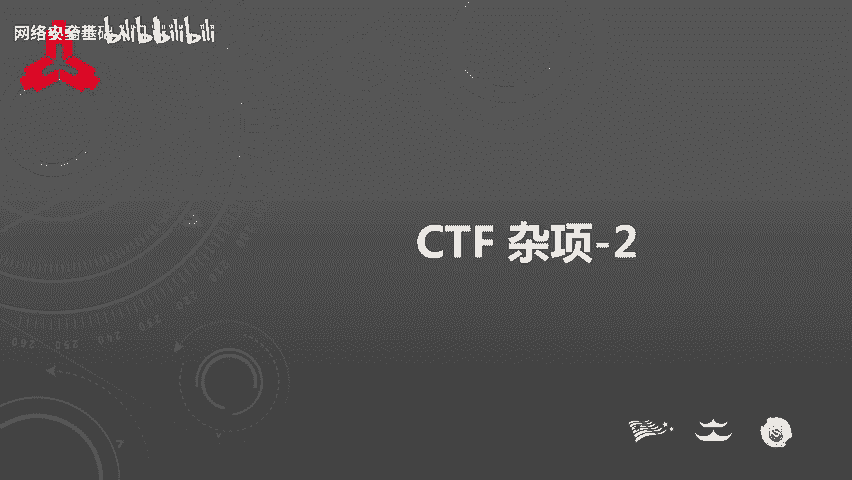
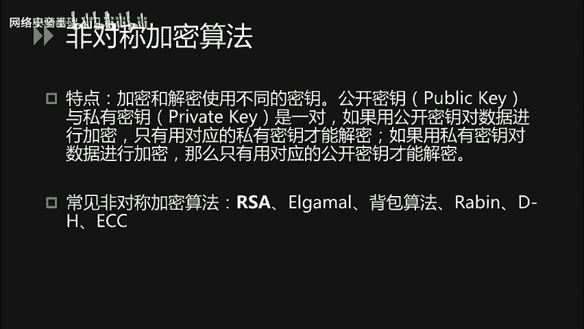
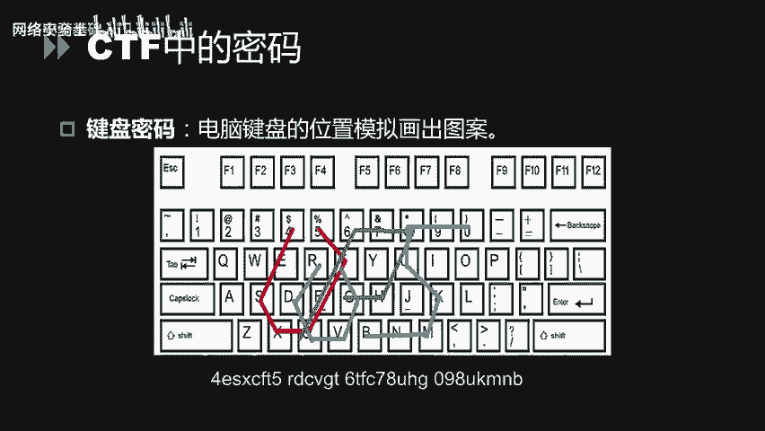
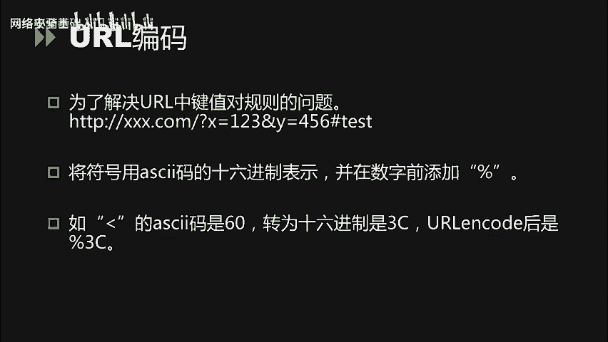
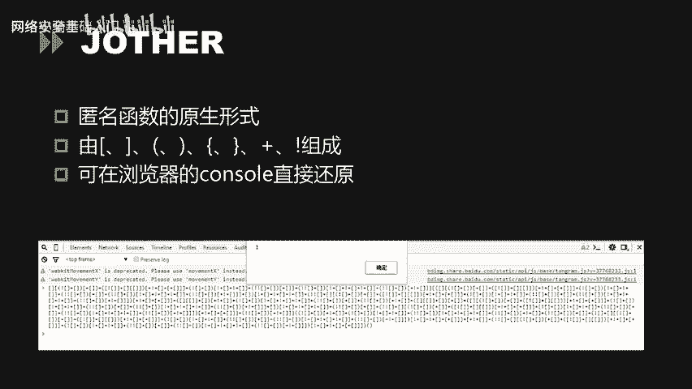
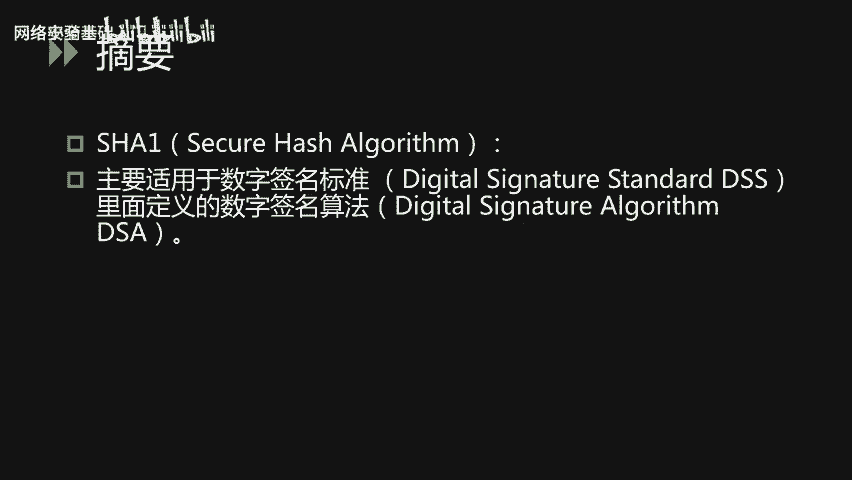
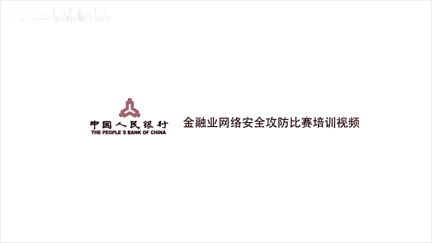

# CTF入门课程：P46：CTF杂项_2 - 密码、编码与摘要基础



在本节课中，我们将要学习CTF比赛中密码学、编码和摘要部分的基础知识。我们将从核心概念的定义和区别入手，然后分别介绍古典密码、现代密码、常见编码以及摘要算法，帮助你建立清晰的认知框架。

## 概述：密码、编码与摘要的区别

首先，我们需要明确密码、编码和摘要这三个核心概念的区别。

*   **密码**：指通过加密算法和**密钥**将明文信息转换为密文的过程。其特点是，没有密钥则无法将密文解密回明文。例如：`明文 + 密钥 -> 密文`。
*   **编码**：指按照公开、已知的规则将信息转换为特定格式，以便于传输或存储。任何人都可以按照规则进行解码，恢复原始信息。例如：Base64编码。
*   **摘要**（或称哈希/Hash）：指通过单向散列函数将任意长度的数据映射为固定长度的值（哈希值）。其特点是**不可逆**，无法从哈希值反推出原始数据。例如：MD5、SHA-1。

简单来说，**加密为了安全，编码为了格式，摘要为了校验**。

---

## 密码学基础

上一节我们明确了基本概念，本节中我们来看看密码学的具体分类。CTF中涉及的密码学主要分为三类：古典密码、现代密码以及一些CTF特有的图形化密码。

### 古典密码

古典密码通常规则简单，易于手算或通过脚本破解。在CTF中，常见的古典密码可分为置换密码和替换密码。

以下是几种典型的古典密码：

1.  **凯撒密码**
    凯撒密码是一种位移密码。它将字母表顺序移动固定的位数（即密钥K）来进行加密。
    *   **加密公式**：`密文字母 = (明文字母 + K) mod 26`
    *   **举例**：明文 `HELLO`，密钥K=1，则密文为 `IFMMP`（每个字母后移一位）。
    *   **破解**：由于只有26种可能的位移，可以通过暴力枚举所有K值（0-25）来尝试解密。

2.  **ROT13**
    ROT13是凯撒密码的特殊形式，固定位移13位。因其加密和解密过程完全相同（`ROT13(ROT13(text)) = text`），常被用于简单隐藏信息。

3.  **栅栏密码**
    栅栏密码是一种分组置换密码。它将明文按一定栏数（分组数）写成多行，然后按列读取形成密文。
    *   **举例**：明文 `HELLOWORLD`，栏数=2。
        写成两栏：
        ```
        H L O O L
        E L W R D
        ```
        按列读取密文：`HLELWORDLD`。
    *   **特点**：明文与密文长度相同，栏数通常是密文长度的因数。

4.  **维吉尼亚密码**
    维吉尼亚密码使用一个密钥词和表格进行多表替换，比单表替换的凯撒密码更安全。
    *   **加密方法**：使用一个维吉尼亚方阵（字母表矩阵）。用明文字母对应行，密钥字母对应列，交叉点即为密文字母。密钥循环使用。
    *   **举例**：明文 `ATTACK`，密钥 `LEMON`。
        A (行) + L (列) -> L
        T (行) + E (列) -> X
        ... 以此类推。

### 现代密码

现代密码学算法复杂，通常需要借助工具或编程实现加解密。主要分为两类：

1.  **对称加密**
    加密和解密使用**相同的密钥**。
    *   **常见算法**：DES、3DES、AES。
    *   **特点**：加解密速度快，但密钥分发和管理是挑战。

2.  **非对称加密**
    加密和解密使用**一对密钥**：公钥和私钥。用公钥加密的数据只能用对应的私钥解密，反之亦然。
    *   **常见算法**：RSA、ElGamal。
    *   **特点**：解决了密钥分发问题，但计算速度较慢。常用于数字签名和密钥交换。



### CTF中的特色密码

除了标准密码，CTF中还有一些基于图形或特殊规则的“密码”。

1.  **猪圈密码**
    使用由点和线构成的基本图形来代表字母。识别出图形后，查表即可得到明文。

2.  **培根密码**
    使用由A和B组成的5位序列来替换字母。通常将A视为0，B视为1，然后将5位二进制数对应到字母表顺序（A=0, B=1, ...）。
    *   **举例**：`AAAAA` -> 二进制 `00000` -> 对应字母 `A`。



3.  **键盘密码**
    利用键盘上字母的布局形状来编码。例如，将相邻按键的连线路径形状视为一个字母。
    *   **举例**：密文 `4ESX` 在键盘上依次连接这些键，其轨迹可能构成字母 `U` 的形状。

---

## 常见编码方式

说完了密码，我们来看看编码。编码的目的是为了数据能以标准、安全的格式在不同系统间传输。

以下是几种常见的编码：

1.  **ASCII码**
    美国信息交换标准代码，用7位二进制数（0-127）表示英文字母、数字及控制字符。看到两位或三位的十进制数字时，可以尝试转换为其对应的ASCII字符。

2.  **Base64编码**
    将二进制数据（每3个字节）转换成由64个可打印字符（A-Z, a-z, 0-9, +, /）表示的4个字符。常用于在HTTP等文本协议中传输二进制数据。
    *   **特征**：编码后的字符串末尾常出现 `=` 或 `==` 作为填充。
    *   **示例**：`Man` 经过Base64编码后为 `TWFu`。

3.  **URL编码**
    在URL中，某些字符（如 `?`, `&`, `=`, `空格`, 中文等）具有特殊含义或不能直接传输。URL编码将其转换为 `%` 后跟两位十六进制数的形式。
    *   **举例**：`<` 的ASCII码是60，十六进制是 `3C`，其URL编码为 `%3C`。

4.  **JSFuck / JJEncode**
    这两种都是仅使用JavaScript中少数几个字符（如 `[`, `]`, `(`, `)`, `!`, `+`）来编写完整JavaScript代码的编码方式。
    *   **解密方法**：直接将编码后的字符串复制到浏览器的开发者工具（Console）中执行，即可得到原始代码或输出结果。

5.  **摩斯电码**
    使用短点（`.`）和长划（`-`）的组合，以及间隔来表示字母和数字。
    *   **特征**：看到由点、划或类似A/B两种符号交替组成的序列，可考虑摩斯电码。



6.  **二维码**
    一种二维条码，用黑白方格在平面上记录数据。使用手机扫码工具或在线解码网站即可读取内容。

---

## 常见摘要算法



最后，我们来看两种最常见的摘要（哈希）算法。它们主要用于验证数据的完整性。

1.  **MD5**
    产生一个128位（通常表示为32位十六进制字符串）的哈希值。
    *   **特性**：
        *   压缩性：任意长度输入，输出固定长度。
        *   容易计算。
        *   抗修改性：原数据微小改动，哈希值变化巨大。
        *   弱抗碰撞性：已可被构造碰撞（找到两个不同数据具有相同MD5值）。
    *   **应用**：文件校验、密码存储（需加盐）。CTF中有时会考察MD5碰撞或查询已知的MD5彩虹表。

2.  **SHA-1**
    产生一个160位（通常表示为40位十六进制字符串）的哈希值。特性与MD5类似，但同样已被证明存在安全漏洞，不应用于高安全场景。

---

## 总结

本节课中，我们一起学习了CTF中密码、编码和摘要的基础知识。

*   我们首先厘清了**密码**（需密钥加解密）、**编码**（公开规则转换格式）和**摘要**（不可逆的哈希值）三者的根本区别。
*   接着，我们介绍了**古典密码**，如凯撒密码、栅栏密码和维吉尼亚密码，它们通常规则简单。
*   然后，我们了解了**现代密码**，包括对称加密（如AES）和非对称加密（如RSA），它们算法复杂，依赖工具。
*   我们还看到了一些**CTF特色密码**，如猪圈密码、培根密码和键盘密码，需要联想和查表。
*   在编码部分，我们学习了**ASCII、Base64、URL编码、JSFuck和摩斯电码**等常见形式的识别与解码方法。
*   最后，我们介绍了**摘要算法**MD5和SHA-1的基本特性及其应用场景。





掌握这些基础知识，是解决CTF中各类杂项题目的第一步。在实际比赛中，灵活运用在线工具、脚本和已知的密码表是成功的关键。