# CTF入门课程：P47：隐写术与密码编码常用工具 🛠️

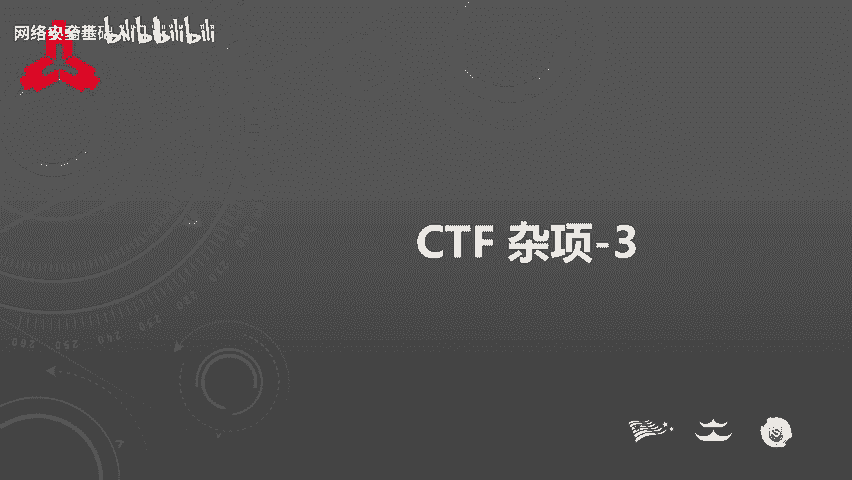

在本节课中，我们将学习CTF隐写术与密码编码题目中一些最常用的解题工具。隐写术题目没有固定套路，掌握合适的工具能极大提升解题效率。我们将依次介绍图片隐写、十六进制编辑、图像处理、音频分析以及密码编解码相关的工具。

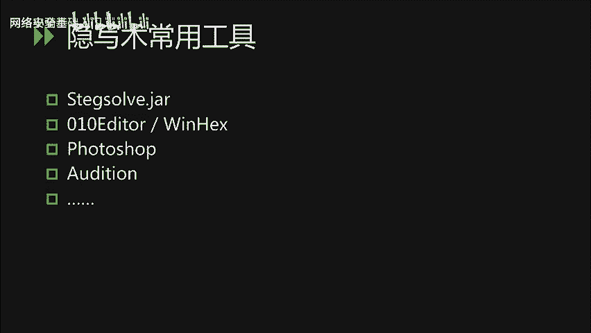

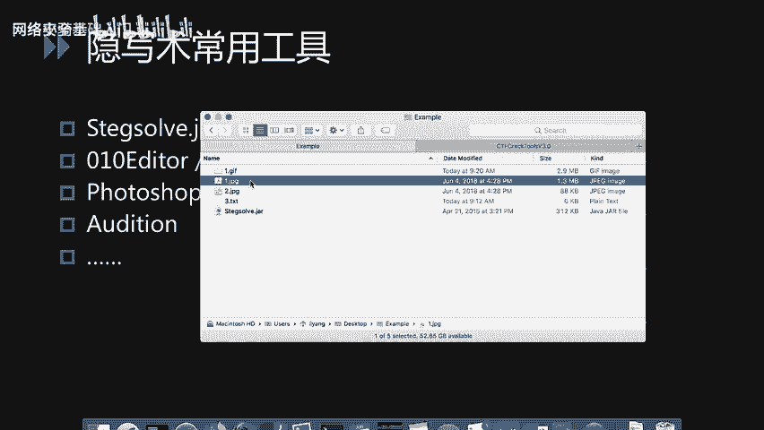

## 图片隐写分析工具：Stegsolve 🖼️

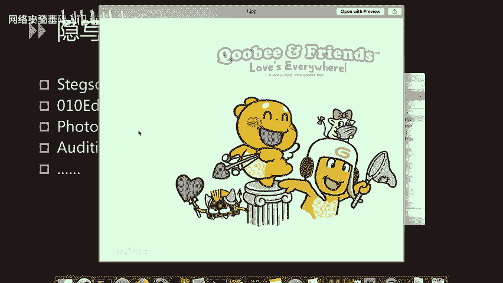

首先我们来看隐写术题目常用的工具。Stegsolve是一个用于分析图片隐写的常用工具，可以解决大部分图片隐写题目。

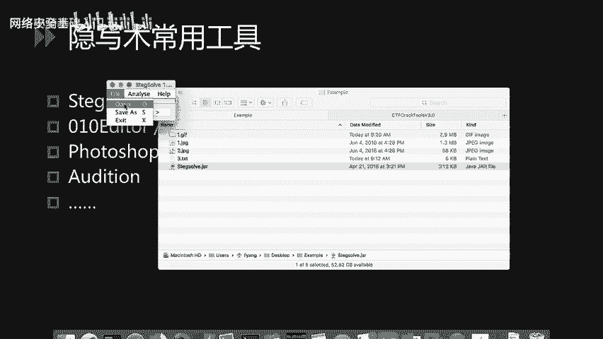

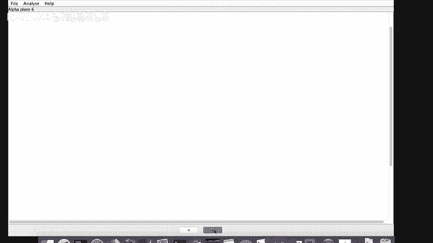

以下是Stegsolve的基本使用方法：

1.  **打开文件**：运行Stegsolve（一个JAR文件，需Java环境），通过“File” -> “Open”打开目标图片。
2.  **浏览通道**：如果直接查看图片没有发现隐藏信息，可以使用界面下方的左右箭头按钮，浏览图片在不同颜色通道（如Red、Green、Blue）和不同位平面下的呈现效果。
3.  **识别二维码**：在浏览过程中，可能会发现隐藏的二维码。此时可以尝试用手机扫码工具识别。

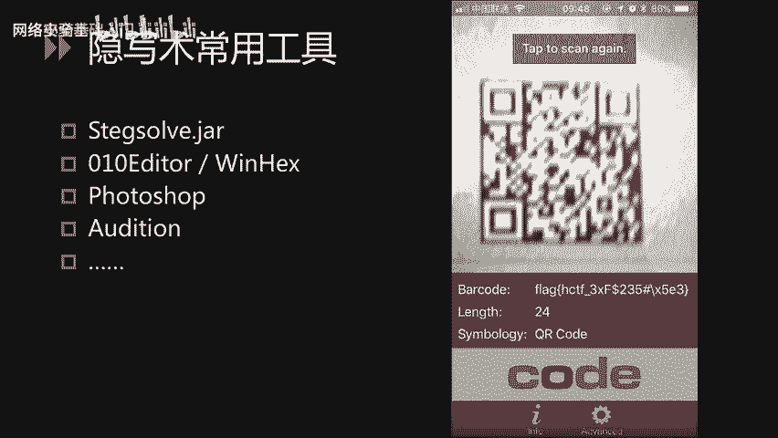

**示例1：隐藏的二维码**
题目给出一张看似普通的图片，用Stegsolve浏览至某个特定通道或阈值时，屏幕上显示出一个二维码。由于图片杂色可能影响识别，推荐使用识别能力强的手机扫码工具（如部分手机QQ内置的扫码）进行尝试。

**示例2：GIF帧分析**
题目是一个GIF动图，直接播放时可能有信息一闪而过，难以捕捉。此时可以使用Stegsolve的帧分析功能：
*   点击顶部 “Analyse” -> “Frame Browser”。
*   点击底部箭头逐帧浏览。
*   当浏览到包含`flag`信息的帧时，程序可能会自动将其提取并显示在屏幕左上角。

此外，Stegsolve的“Analyse”菜单还提供文件格式分析、检查文件附加数据等功能，可以便捷地分析图片中的隐写信息。

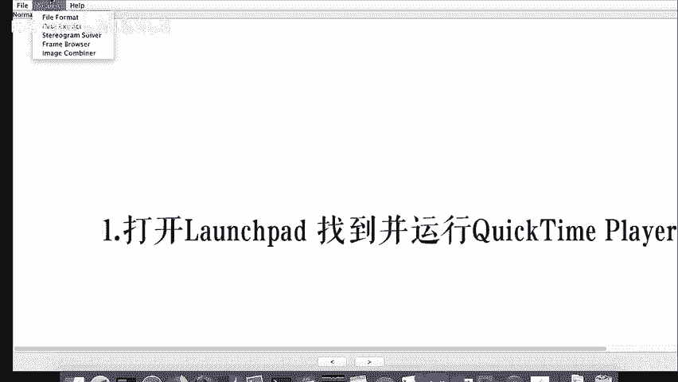

## 十六进制编辑器：010 Editor 🔢

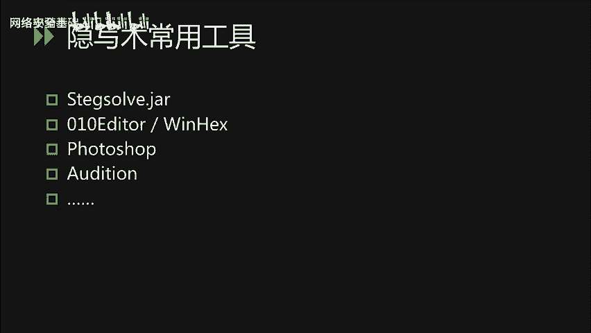

在Windows平台上，常用的十六进制编辑器有010 Editor、WinHex等。这里重点介绍010 Editor的“导入十六进制”功能，这在CTF中非常实用。

**示例：十六进制转文件**
有时题目会给出一串十六进制数字，这很可能是一个文件的十六进制形式被以文本格式导出。解题步骤如下：

1.  使用010 Editor，通过 “File” -> “Import” -> “Import Hex Text” 功能加载这串十六进制文本。
2.  加载后，观察文件头部签名。例如，如果看到文件头是 `PK`，则表明这是一个ZIP压缩包文件。
3.  将文件另存为 `.zip` 格式，即可用压缩软件打开。解压后可能得到进一步需要分析的图片等文件。

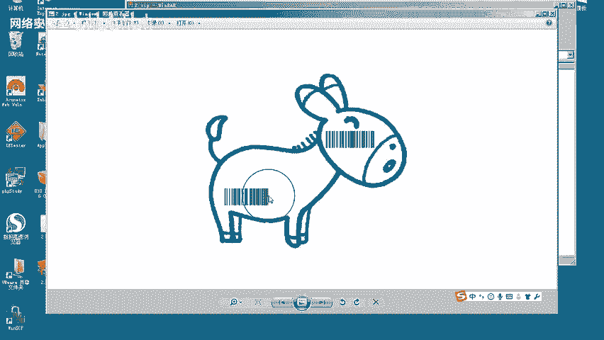

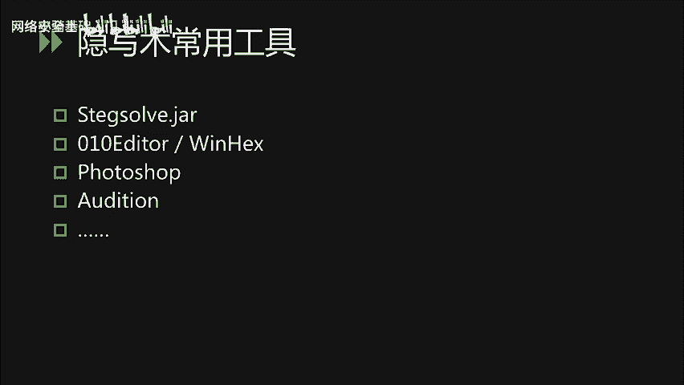

## 图像处理工具：Photoshop ✂️

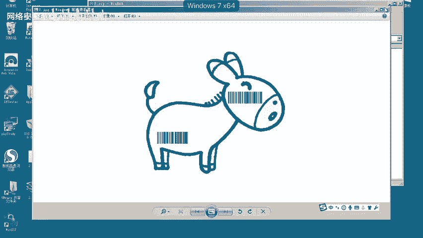

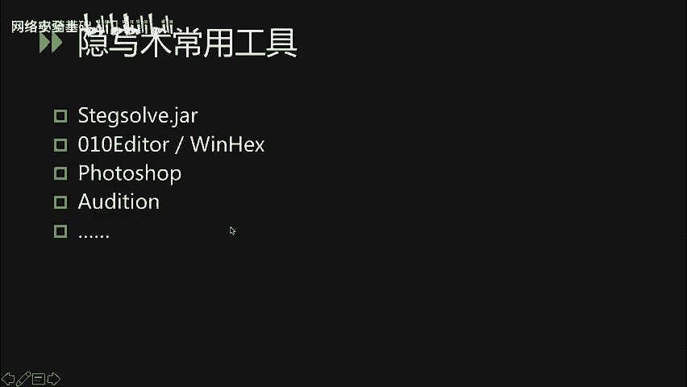

在CTF比赛中，经常需要使用Photoshop对残缺的二维码或条形码进行拼接处理。

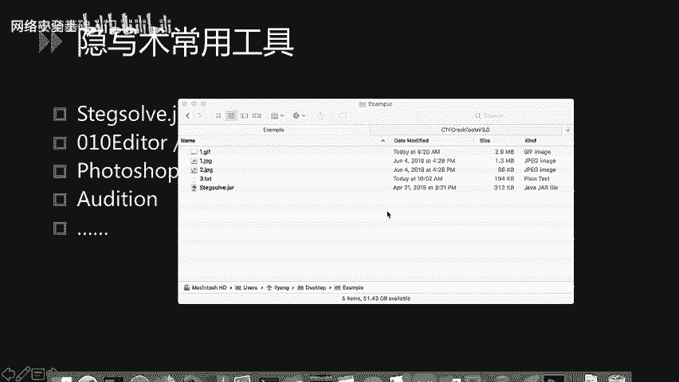

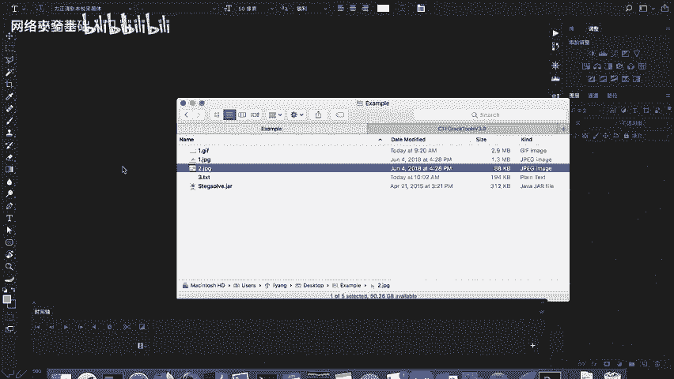

**示例：拼接条形码**
从上一环节得到的图片中，发现条形码被分割成两部分。以下是使用Photoshop进行基本拼接的步骤：

1.  使用 **矩形选框工具** 选中第一部分条形码，按 `Ctrl+C` (Windows) / `Cmd+C` (Mac) 复制。
2.  新建一个图层，按 `Ctrl+V` / `Cmd+V` 将复制的部分粘贴到新图层。
3.  同样操作，将第二部分条形码复制粘贴到另一个新图层。
4.  使用 **移动工具** 调整两个图层的位置，尝试将它们精确拼接。
5.  可以调整图层的 **混合模式**（如“变暗”），使拼接效果更清晰。
6.  对拼接后的完整条形码使用扫码工具，即可得到题目答案。

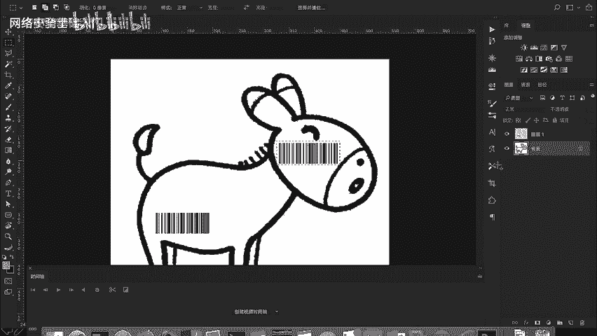

## 音频隐写分析工具：Audition 🔊

Audition是Adobe公司出品的音频处理软件，常用于分析CTF中的音频隐写题目。

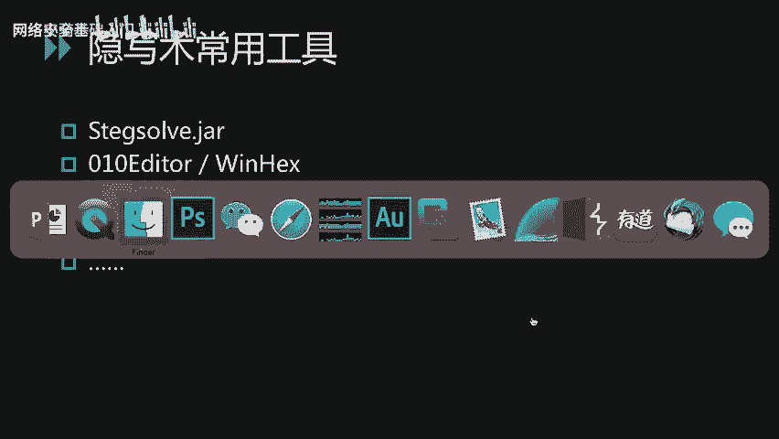

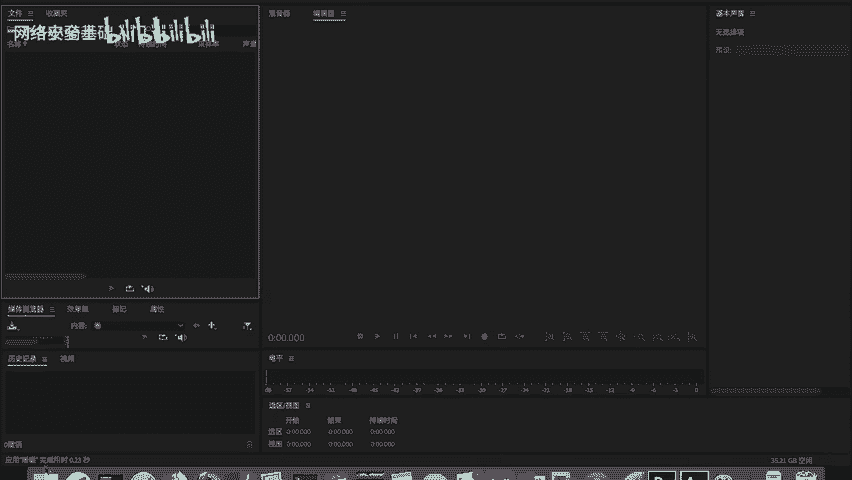

**基本操作流程如下：**

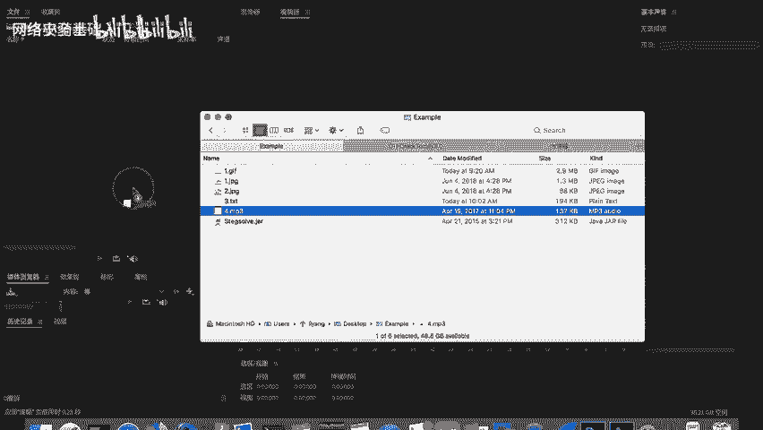

1.  打开Audition，在左侧文件窗口加载音频题目文件。
2.  双击文件进入编辑视图。视图中的 `L` 和 `R` 分别代表左右声道，可以点击按钮单独关闭或开启某个声道进行排查。
3.  用光标在波形图上选取区域，可以删除无信息的静音部分，保留可能包含隐写信息的部分。
4.  使用顶部工具栏的 **振幅调节** 功能（如“增幅”），可以放大音频信号，使隐藏的波形变化（如莫尔斯电码、慢速音频等）更加清晰可见。
5.  对于更复杂的隐写（如频谱隐写），可以使用“视图”菜单下的“频谱显示”功能进行查看。

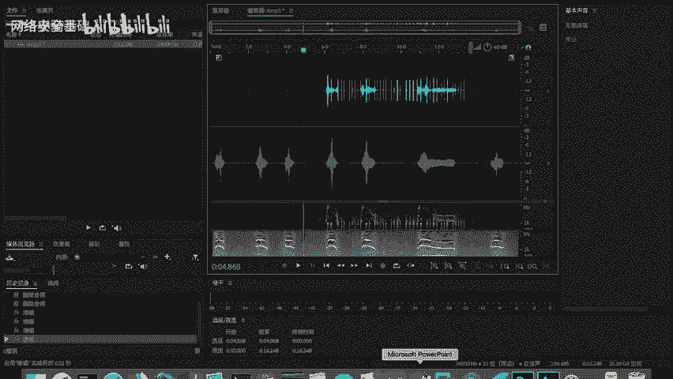

## 密码与编解码工具 🔐

最后，我们介绍密码学和编解码相关的工具。这类题目通常涉及各种加密算法的解密或编码转换。

**1. 在线工具与脚本**
*   可以通过搜索引擎找到大量在线的加解密、编码解码工具网站。
*   使用 **Python脚本** 在本地进行加解密操作非常灵活，网上有大量现成的算法脚本可供参考和使用。

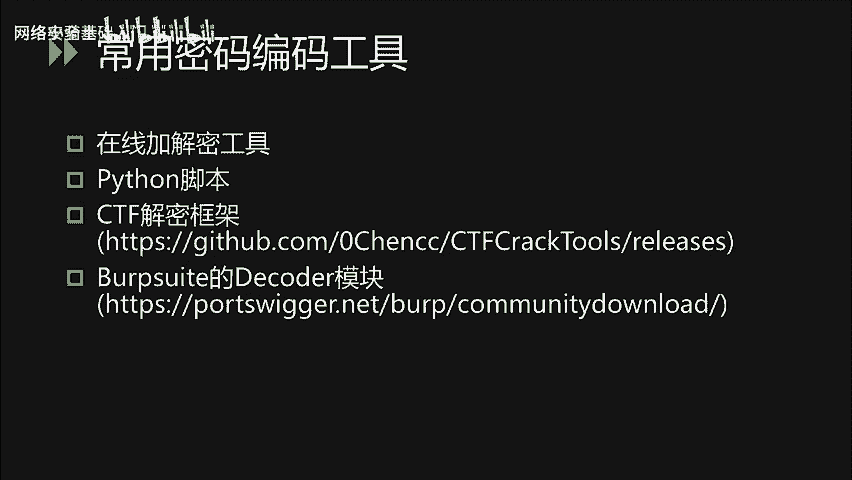

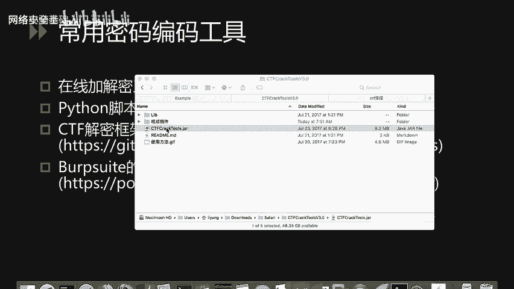

**2. CTF集成框架：CTFcrackTools**
这是一个由国内安全团队编写的CTF加解密框架，它集成了多种功能模块。
*   用户可以将自己编写的Python脚本以插件形式集成到该框架中。
*   这样可以统一管理多个解密脚本，在解题时切换和使用更加方便。该工具的GitHub地址通常会在相关资源中提供。

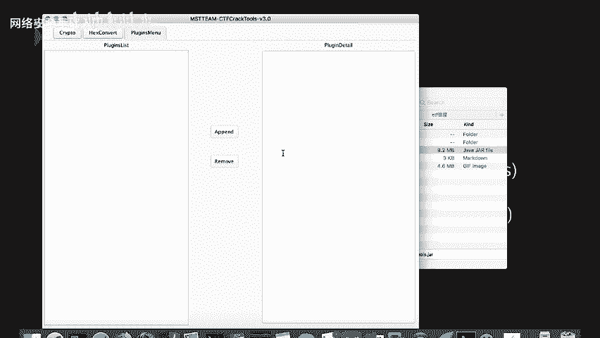

**3. Burp Suite 解码模块**
对于Web类题目或需要快速进行编码解码的情况，渗透测试工具Burp Suite内置的Decoder模块非常实用。
*   打开Burp Suite，找到 **Decoder** 模块。
*   在输入框中填入数据（如 `hello world`），可以在右侧的 **Encode** 部分选择不同编码方式（如URL、Base64、HTML）进行编码。
*   同样，在 **Decode** 部分可以对已编码的数据进行解码操作。由于它集成在Burp Suite中，使用起来十分便捷。

---

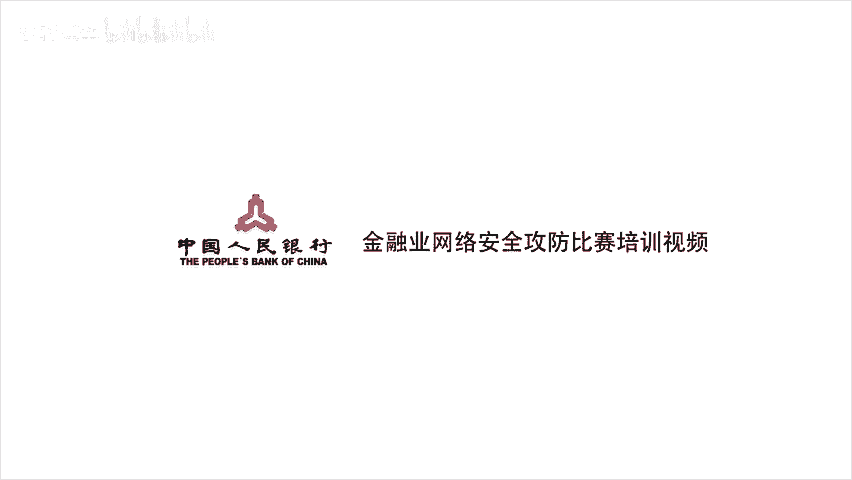

**本节课总结** 🎯
本节课我们一起学习了CTF隐写术与密码编码题目的常用工具链。我们介绍了用于图片隐写分析的 **Stegsolve**，用于十六进制数据还原的 **010 Editor**，用于图像拼接处理的 **Photoshop**，用于音频分析的 **Audition**，以及用于密码编解码的 **在线工具、Python脚本、CTFcrackTools框架和Burp Suite的Decoder模块**。熟练掌握这些工具，能帮助你更高效地解决各类CTF杂项题目。