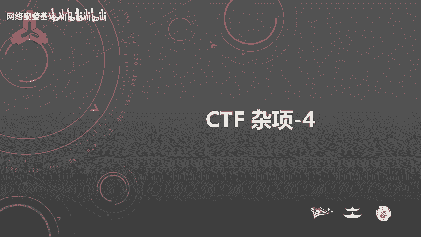
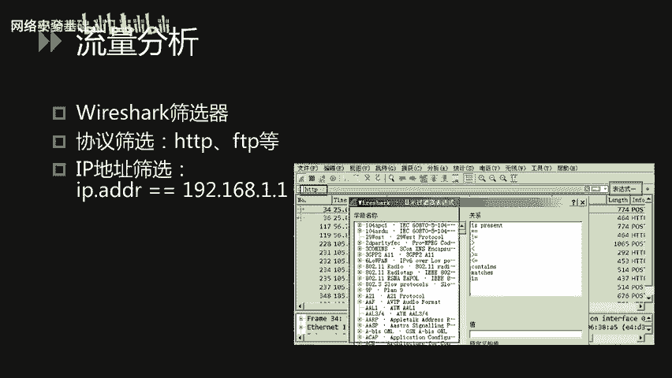
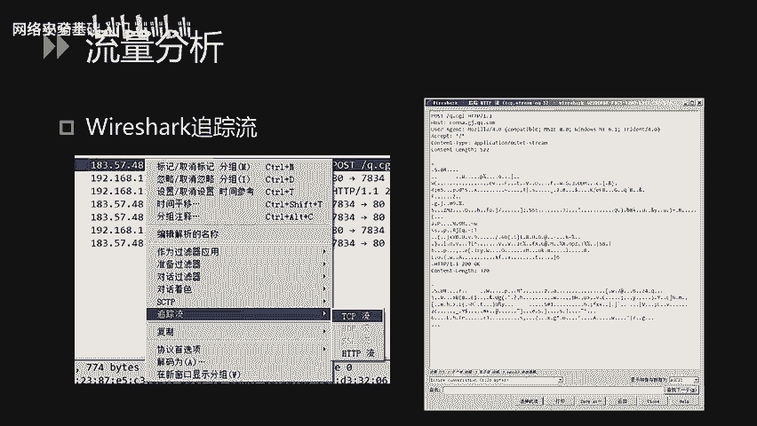
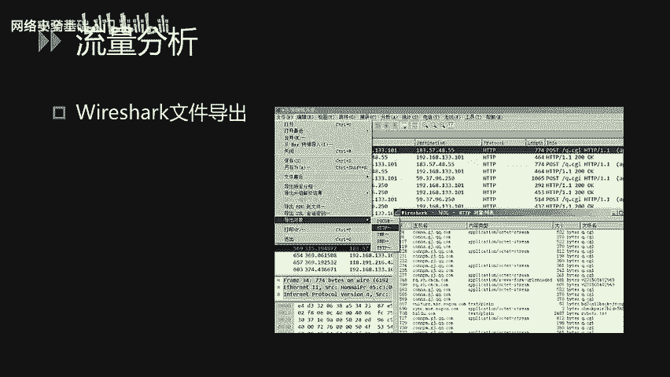
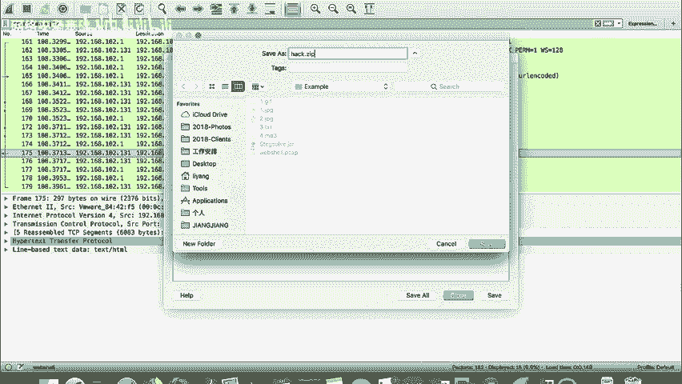
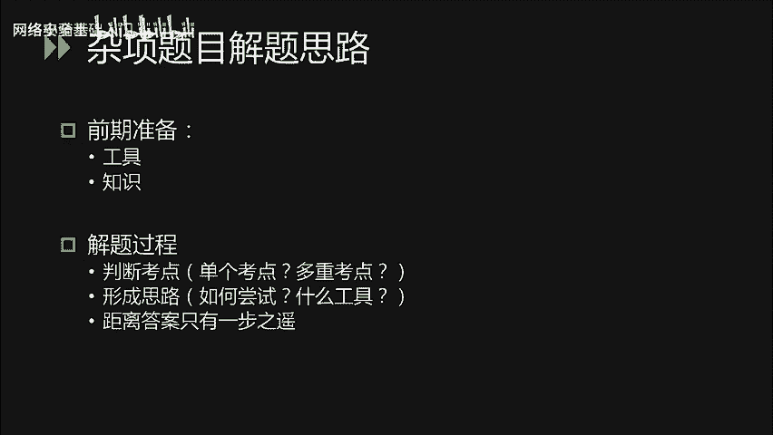
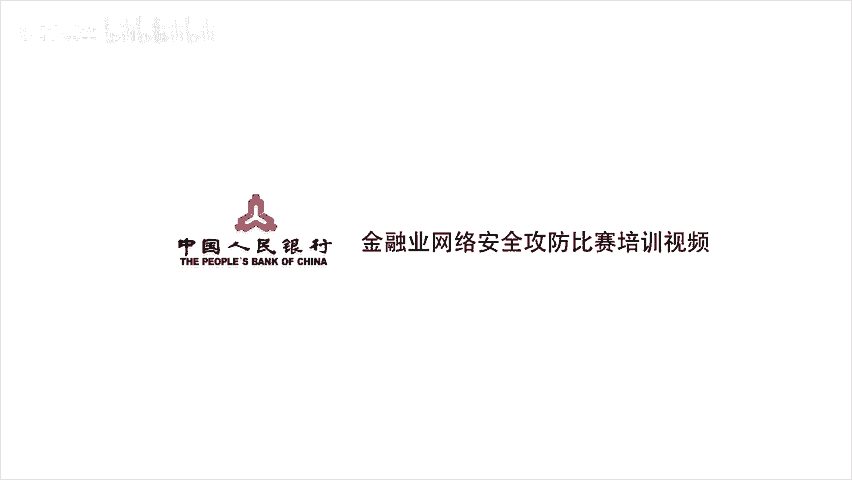

# CTF入门课程：P48：CTF杂项_4 - 取证技术与解题思路 📊

在本节课中，我们将学习CTF比赛中取证技术的基础知识，包括流量分析和日志分析，并探讨杂项题目的通用解题思路与技巧。



---

## 概述

上一节我们介绍了密码编码的基础知识，本节是杂项部分的最后一课。我们将重点讲解两类常见的取证技术：流量分析与日志分析，并总结杂项题目的解题方法论。

---

## 流量分析

流量分析是CTF取证题中的常见类型，主要工具是 **Wireshark**。其核心功能包括使用筛选器、追踪数据流和导出文件。

### Wireshark筛选器



通过Wireshark的筛选器，可以根据协议版本、IP地址等条件过滤数据包，从而清晰定位所需信息。

点击筛选器右侧的表达式按钮，可以使用Wireshark内置的表达式进行过滤。表达式支持逻辑关系运算符。

例如，可以使用等号（`==`）、不等号（`!=`）、大于（`>`）、小于（`<`）或匹配（`contains`）等运算符进行逻辑运算。

```
# 示例：过滤HTTP协议的数据包
http
# 示例：过滤源IP为192.168.1.1的数据包
ip.src == 192.168.1.1
```


### Wireshark追踪流功能



流量分析的本质是分析客户端请求与服务端响应。Wireshark的“追踪流”功能可以清晰地展示每次通信的完整内容。

在Wireshark中右键点击某条记录，选择“追踪流” -> “TCP流”或“HTTP流”，即可在新窗口查看完整的请求与响应对应关系。

在弹出的窗口中，可以使用查找功能搜索关键词，也可以选择过滤掉此流、打印或保存数据。


### Wireshark文件导出功能



如果流量中包含通过HTTP或FTP协议传输的文件（如文件下载），可以使用“文件导出”功能将其提取到本地。

以下是文件导出功能的操作步骤：
1.  在Wireshark菜单栏点击“文件”。
2.  选择“导出对象” -> “HTTP”（或相应协议）。
3.  在列表中找到目标文件，将其保存到本地。


### 实战演示：Webshell流量分析

下面我们通过一个CTF题目实例来演示Wireshark的文件导出功能。题目文件名为 `webshell.pcap`，提示我们需要分析一个Webshell的攻击流量。

打开文件后，可以看到大量数据包。首先使用筛选器过滤HTTP协议。

```
http
```

过滤后，可以看到几组关键的HTTP请求与响应。首先，攻击者访问了 `upload.php`，这很可能是在进行文件上传操作。

随后，攻击者访问了 `hack.php`，这个文件很可能就是上传的Webshell。为了分析攻击者上传Webshell后的操作，我们直接查看 `hack.php` 的流量。

右键点击相关数据包，选择“追踪流” -> “HTTP流”。可以看到请求内容经过了Base64编码，难以直接阅读，但响应内容显示这是一个列目录的操作。

继续查看后续流量，在最后的响应中，可以看到一个以 `PK` 开头的文件头，这表明数据流中包含一个ZIP压缩包。

熟悉ZIP文件结构可知，其文件头为 `PK`。此时，我们可以尝试导出这个ZIP文件。



使用“文件” -> “导出对象” -> “HTTP”功能，在列表中找到编号为175的响应（即包含ZIP包的响应），将其保存到本地，并重命名为 `.zip` 后缀。


在本地打开该ZIP文件时，可能会解压失败，这通常是因为文件头存在异常字符。可以使用 `010 Editor` 或 `WinHex` 等工具进行修复。

修复后，发现压缩包被加密。回顾攻击者的操作流量，可能会发现其使用了 `zip -P` 命令对压缩包进行加密。我们需要在流量中找到加密时使用的密码参数，才能成功解密并获取Flag。

以上就是利用Wireshark进行流量分析的完整流程。

---

## 电子取证：日志分析

电子取证的另一大方向是日志分析，常见的有Web服务器的Access日志、系统日志等。

我们以HTTP的Access日志为例。下图是某网站Access日志的截图：


日志每一行的格式通常为：
`客户端IP - 访问时间 - HTTP方法 - 访问路径 - 协议版本 - 状态码 - 响应长度`

在CTF中，此类题目可能要求参赛者通过分析Access日志来发现网站的SQL注入点。例如，攻击者进行盲注时，注入是否成功可能会反映在响应的状态码上。解题者需要熟悉SQL语法、盲注原理，并能通过日志编写脚本还原数据。

也可能是通过日志查找服务器上存在的Webshell。当日志文件较大时，可以使用 `Notepad++` 等文本编辑器打开，并通过全局搜索关键词（如 `eval`、`system`、`shell`）来定位。

还有可能是寻找用户访问过的敏感路径，通过发现某个敏感目录，再对该目录下的资源进行深入测试以获取Flag。

此类题目出题思路灵活，没有固定套路，需要根据具体日志内容和题目提示进行灵活分析。

---

## 杂项题目解题思路

杂项题目通常综合了各类CTF知识点，解题过程更具挑战性。以下是通用的解题思路。

### 前期准备

与其他类型题目相似，但杂项题要求更广泛的知识储备。需要提前准备各类解题工具，并学习常见的考点和知识点。善用搜索引擎（如Google、GitHub）来查找和学习所需工具与知识至关重要。

### 解题过程

解题过程的核心是定位考点并形成解题思路。

1.  **识别考点**：首先判断题目考察的是单个考点还是多个考点的综合。例如，经典题目“困在栅栏里的凯撒”就明确提示了“栅栏密码”和“凯撒密码”两个考点。
2.  **形成思路**：确定考点后，需思考解题顺序和最高效的尝试方法。例如，对于“困在栅栏里的凯撒”，需要思考是先解栅栏密码还是先解凯撒密码，并选择合适的工具进行尝试。
3.  **调整与坚持**：如果按初始思路无法解题，不要轻易放弃。可能离答案仅一步之遥，也可能思路有误。此时需要重新审视题目，判断是否需要调整策略，或决定是否暂时放弃以节省时间。

### 练习建议

杂项题目的能力提升离不开大量练习。

平时应多在CTF在线平台（如CTFHub、攻防世界）上练习各类题目。通过练习，可以在比赛中快速识别题目考点，并形成条件反射式的解题思路。同时，多学习其他优秀队伍的解题报告（Writeup）也是快速进步的有效途径。



---

## 总结


本节课我们一起学习了CTF中取证技术的基础，包括使用Wireshark进行流量分析、分析各类日志文件的方法，并梳理了杂项题目的通用解题思路与练习方法。掌握这些基础技能和思维模式，将有助于大家更从容地应对CTF比赛中的综合类挑战。

最后，祝大家在杂项部分解题顺利！



