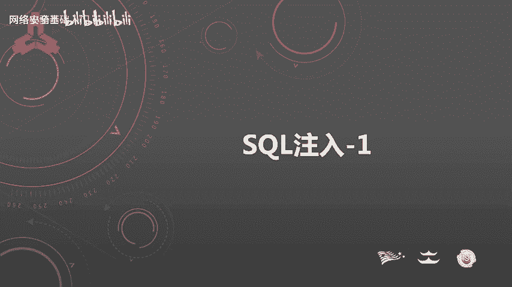
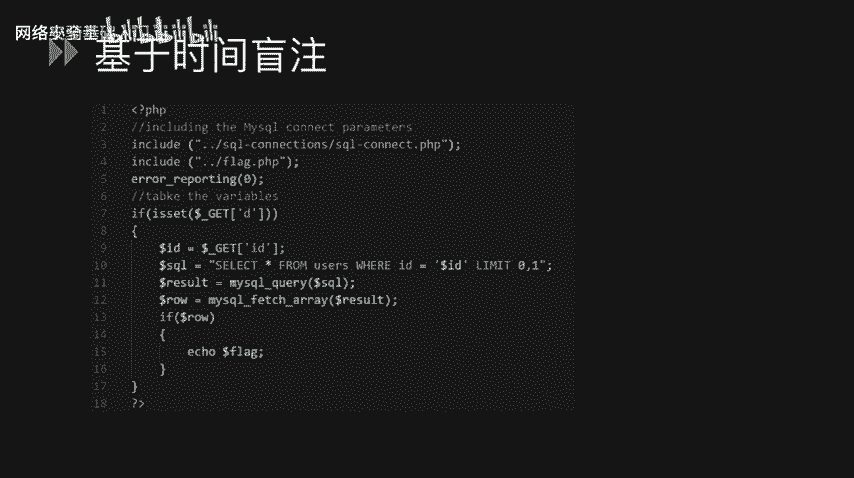
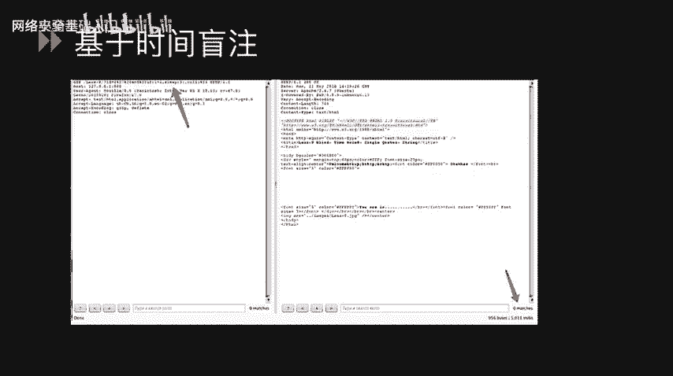
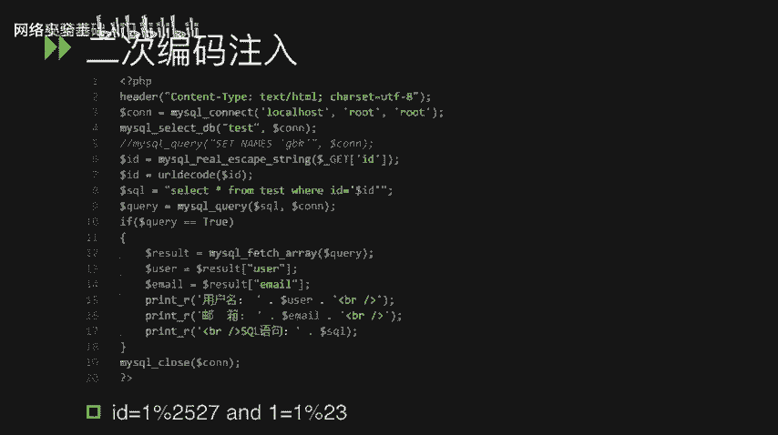

# CTF入门课程：P49：SQL注入基础与常见类型



在本节课中，我们将学习CTF比赛中一种非常常见的漏洞类型——SQL注入。我们将了解其基本概念、原理以及几种主要的注入类型，包括字符型注入、数字型注入、布尔盲注、时间盲注、宽字节注入和二次编码注入。

## 什么是SQL注入？🔍

SQL注入是攻击者通过将恶意的SQL命令插入到Web应用程序的POST提交数据或URL参数值中，从而欺骗数据库服务器执行非预期的额外SQL语句的一种攻击方式。

这些额外执行的SQL语句通常是攻击者精心构造的，可能是查询敏感数据的SELECT语句，也可能是破坏性的DELETE或UPDATE语句。这除了可能导致数据泄露，还可能对数据库的完整性和可用性造成严重威胁。

在CTF比赛中，我们最常遇到的是MySQL数据库。因此，本节将重点讲解MySQL数据库的注入技巧以及可能遇到的问题。

## SQL注入的常见类型

SQL注入有多种类型，我们将逐一进行讲解。

### 1. 字符型注入

我们来看一个示例代码。

```php
$name = $_GET['name'];
$sql = "SELECT * FROM users WHERE name = '$name'";
```

在第四行，SQL语句从`$_GET['name']`参数中获取值并直接拼接到查询中。

攻击者可以通过向`name`参数输入特定的值来构造恶意SQL语句。例如，可以输入：
```
name=test' UNION SELECT ...
```
这里的单引号`'`用于闭合原SQL语句中的前一个单引号，然后通过`UNION SELECT`执行额外的查询，从而获取其他数据。

### 2. 数字型注入

我们来看另一个示例。

```php
$id = $_GET['id'];
$sql = "SELECT content FROM test WHERE id = $id";
```

在这个例子中，`id`变量是一个从GET参数获取的数字。由于它没有用引号包围，我们称之为数字型注入。

攻击者可以构造如下Payload：
```
id=1 UNION SELECT ...
```
通过这种方式，同样可以执行联合查询，获取额外信息。

### 3. 布尔盲注

有时，应用程序会对输入进行过滤，例如使用`addslashes()`或`mysql_real_escape_string()`函数对单引号进行转义或过滤，使得直接的联合查询无法进行。或者，查询语句可能被`LIMIT 1`等子句限制，导致无法直接看到查询结果。

在这种情况下，我们可以使用布尔盲注。以下是一个示例场景：

```php
$id = $_GET['id'];
$sql = "SELECT content FROM test WHERE id = '$id' LIMIT 1";
```

以下是布尔盲注的判断步骤：
*   输入 `id=1'`：我们通过单引号闭合前一个引号，破坏了SQL语法，导致语句无法执行，页面无回显或报错。
*   输入 `id=1' AND 1=1 -- `：`-- `是注释符，用于注释掉后面的单引号和`LIMIT 1`。`1=1`恒为真，因此整个语句能正常执行，页面有回显。
*   输入 `id=1' AND 1=2 -- `：`1=2`恒为假，因此整个查询条件为假，页面无回显。

通过观察页面回显的差异（有/无数据），我们可以判断此处存在SQL注入漏洞。

接下来，我们需要通过盲注来逐位获取敏感信息（如数据库名、表名、数据）。这通常借助以下几个MySQL函数：
*   **`LENGTH(str)`**：返回字符串的长度。
*   **`SUBSTRING(str, pos, len)`** 或 **`MID(str, pos, len)`**：从字符串`str`的第`pos`位开始，截取`len`个字符。
*   **`ASCII(char)`**：返回字符的ASCII码。
*   **`IF(condition, value_if_true, value_if_false)`**：条件判断函数。

例如，要猜测当前数据库名的长度，可以构造如下Payload：
```
id=1' AND LENGTH(DATABASE()) = 8 -- 
```
通过不断尝试数字（如1,2,3...），当页面有正常回显时，即可确定长度。

知道长度后，再通过`SUBSTRING`和`ASCII`函数，结合二分法，逐位猜测数据库名每个字符的ASCII码，最终还原出完整的字符串。获取表名、列名的原理与此相同。



### 4. 时间盲注

时间盲注与布尔盲注原理相似，适用于无论输入真假，页面回显都完全一致的情况。此时，我们通过让数据库执行时间延迟函数，根据页面响应时间的差异来判断注入是否成功。



我们使用`SLEEP(seconds)`函数来制造延迟。

```php
$id = $_GET['id'];
$sql = "SELECT content FROM test WHERE id = '$id'";
```

构造Payload如下：
```
id=1' AND SLEEP(5) -- 
```
如果页面响应时间明显增加了约5秒，则说明`SLEEP(5)`函数被执行，此处存在SQL注入漏洞。

获取数据的方法与布尔盲注类似，只是判断依据从页面内容变成了响应时间。例如：
```
id=1' AND IF(ASCII(SUBSTRING(DATABASE(),1,1))>100, SLEEP(5), 0) -- 
```
如果第一个字符的ASCII码大于100，则休眠5秒，否则立即返回。通过观察响应时间，即可逐位推断出数据。

### 5. 宽字节注入

宽字节注入通常发生在PHP使用GBK、GB2312等宽字符集连接MySQL时。问题源于数据库层（如使用`addslashes`或`mysql_real_escape_string`）对单引号`'`进行转义（在其前面加上反斜杠`\`，变成`\'`），但宽字符集的编码特性可能导致反斜杠被“吃掉”，从而使单引号逃逸。

看以下示例：
```php
mysql_query("SET NAMES 'gbk'"); // 设置为GBK字符集
$id = addslashes($_GET['id']); // 转义特殊字符， ' 变为 \'
$sql = "SELECT content FROM test WHERE id = '$id'";
```

攻击者可以输入：
```
id=%df%27
```
其中`%27`是单引号`'`的URL编码。经过`addslashes`转义后，变成了`%df%5c%27`（`%5c`是反斜杠`\`）。
在GBK字符集中，`%df%5c`构成了一个合法的宽字符“運”（繁体）。这样，后面的`%27`（单引号）就被独立出来，成功闭合了前面的引号，从而实现了注入。

修复方法是将数据库连接字符集设置为`utf8mb4`。

### 6. 二次编码注入

二次编码注入是由于安全函数被重复或错误使用导致的问题。例如，先对输入进行转义，然后又进行了一次URL解码。

```php
mysql_set_charset('utf8');
$id = mysql_real_escape_string($_GET['id']); // 第一次过滤
$id = urldecode($id); // 第二次解码
$sql = "SELECT content FROM test WHERE id = '$id'";
```

攻击者可以输入双重编码的单引号：
```
id=%2527
```
*   `%2527`是单引号`'`经过两次URL编码的结果（`%25`是`%`的编码）。
*   经过`mysql_real_escape_string`时，它查找的是单引号`'`，而非`%2527`，因此不会转义。
*   随后经过`urldecode`，`%2527`被解码一次，变成`%27`。
*   当这个值被放入SQL语句时，`%27`在数据库层面会被解码为单引号`'`，从而引发注入。

## 总结



本节课我们一起学习了SQL注入的基础概念和六种常见类型。
*   **字符型**和**数字型注入**是基础形式，可通过联合查询直接获取数据。
*   当无法直接看到查询结果时，需要使用**布尔盲注**或**时间盲注**，通过逻辑判断或时间延迟来间接获取信息。
*   **宽字节注入**利用了特定字符集的编码特性，绕过了转义函数。
*   **二次编码注入**则源于安全过滤与解码操作的顺序不当。


理解这些不同类型的原理和利用方式，是CTF中解决SQL注入挑战的关键。在后续课程中，我们将学习更高级的注入技巧和防御方法。