# CTF入门课程：4：CTF赛制介绍&工具介绍

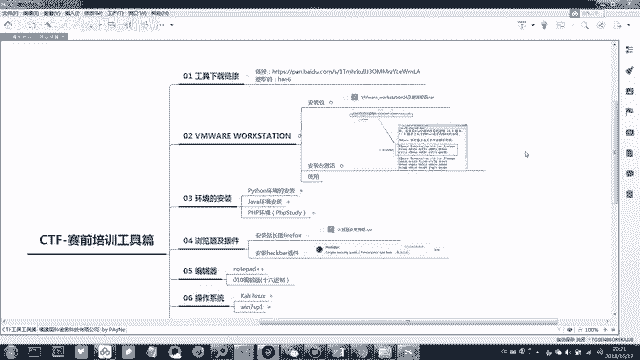

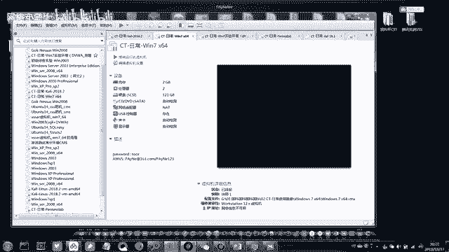

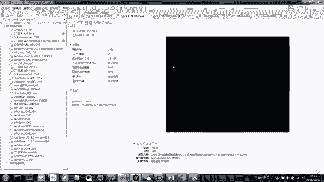

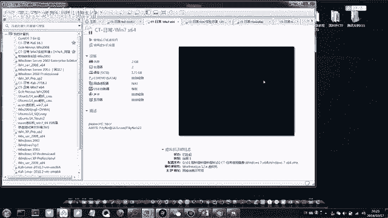

在本节课中，我们将学习CTF比赛的基本赛制，并详细介绍在后续学习和解题过程中需要用到的一系列核心工具。掌握这些工具是进行网络安全实践的基础。

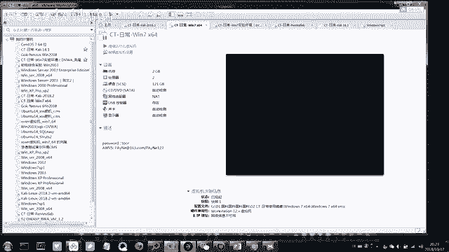

上一节我们介绍了CTF的基本概念，本节中我们来看看实战中需要准备哪些“武器”。

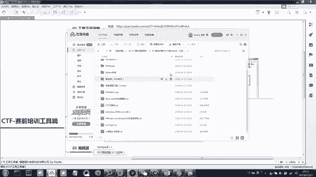

## 🛠️ VMware Workstation 虚拟机软件

首先，我们要介绍的第一个工具是 **VMware Workstation**。这是一个虚拟机软件，用于在您的真实电脑（称为“真机”）上模拟运行另一个或多个独立的操作系统（称为“虚拟机”）。

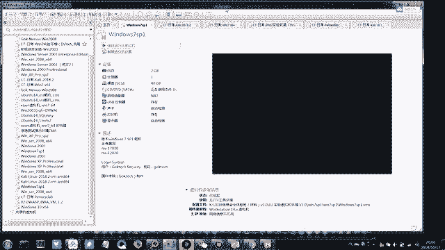

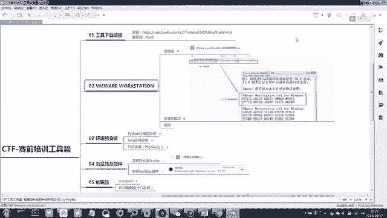

以下是VMware Workstation的主要功能和使用方法：

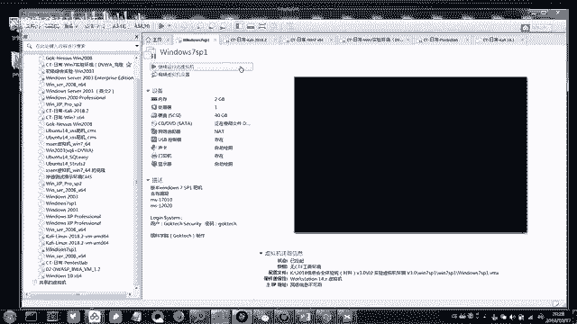

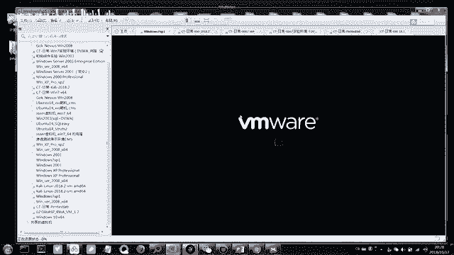

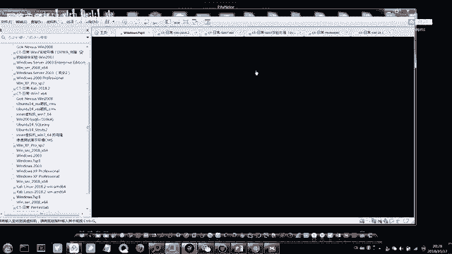

*   **安装与激活**：安装过程遵循常规软件的“下一步”原则。激活时，请使用提供的许可证密钥文件中的 **14版本** 密钥进行激活。您可以在软件的“帮助”->“关于”菜单中查看版本信息。
*   **打开虚拟机**：我们提供的虚拟机文件是 `.vmx` 格式，这意味着系统已经预先安装好。您只需在VMware中点击“打开”，选择对应的 `.vmx` 文件即可加载该虚拟机。
*   **虚拟机与真机隔离**：虚拟机与您的真实电脑是隔离的。即使在虚拟机中运行了恶意软件或测试工具，也不会影响真机的安全。**因此，强烈建议将所有CTF工具包放在虚拟机内使用**。
*   **调整显示**：打开虚拟机后，如果窗口显示过小，可以点击菜单栏的“查看”->“立即适应客户机”，让窗口自动适配。
*   **快照功能**：这是一个强大的“时光机”功能。您可以在虚拟机的某个状态（例如，安装好所有工具后）创建一个快照。之后如果系统出现问题或配置混乱，可以一键恢复到创建快照时的状态。请注意，创建快照会占用额外的硬盘空间。
*   **资源配置**：您可以调整分配给虚拟机的资源。右键点击虚拟机，选择“设置”，可以修改：
    *   **内存**：根据您真机的内存大小调整。例如，真机为8G内存，可分配1-2G给虚拟机。
    *   **处理器**：分配CPU核心数量。
    *   **硬盘**：设定虚拟机可使用的最大硬盘容量。
*   **文件共享**：在真机和虚拟机之间传输文件有两种常用方法：
    1.  **安装 VMware Tools**：我们提供的虚拟机已预装此工具。安装后，您可以直接在真机和虚拟机之间复制、粘贴文件和文本。如果此功能失效，可以尝试重启虚拟机或重装VMware Tools。
    2.  **设置共享文件夹**：在虚拟机设置中，添加一个“共享文件夹”，指向真机上的某个目录（**路径请使用英文**）。然后在虚拟机内，通过“映射网络驱动器”访问此文件夹。这样，双方对此文件夹的修改都能实时同步。

## 🐍 Python 环境安装

接下来，我们需要安装 **Python** 编程环境。因为在CTF解题中，经常需要运行或编写Python脚本进行加解密、网络请求、数据处理等操作。

以下是安装步骤：

*   **安装程序**：运行提供的Python安装包（请根据系统选择32位或64位），全程使用默认选项进行安装。
*   **配置环境变量**：这是关键步骤，目的是让系统在任何位置都能识别 `python` 命令。
    *   打开命令提示符（按 `Win + R`，输入 `cmd` 并回车）。
    *   需要将Python的安装路径添加到系统的 `PATH` 变量中。具体操作请参照提供的截图，将路径修改为您实际的Python安装目录。
*   **验证安装**：打开新的命令提示符，输入 `python` 并回车。如果出现Python的交互式命令行界面（显示类似 `>>>` 的提示符），则说明安装和配置成功。在此界面，您可以使用Python的内置函数，例如：
    *   `ord(‘A’)`：将字符 ‘A’ 转换为其ASCII码值 `65`。
    *   `chr(65)`：将ASCII码值 `65` 转换为字符 ‘A’。

## ☕ Java 环境安装

某些CTF工具（特别是一些图形化界面的逆向或分析工具）依赖于 **Java** 运行环境。

以下是安装步骤：

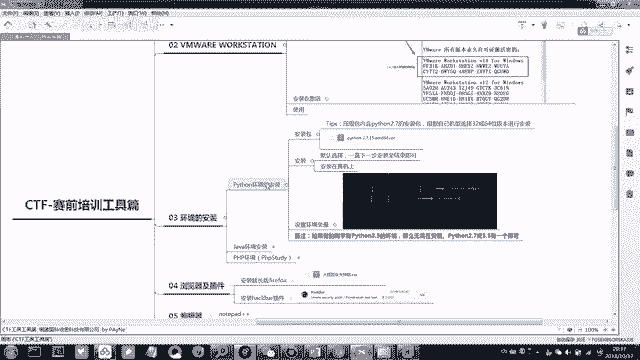

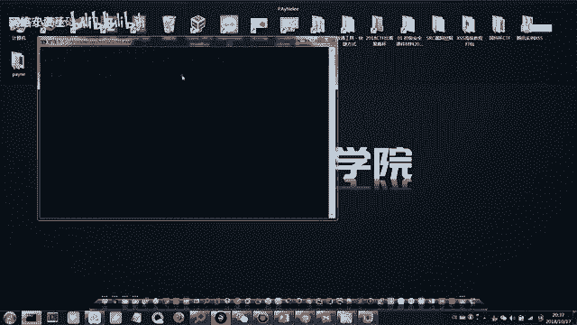

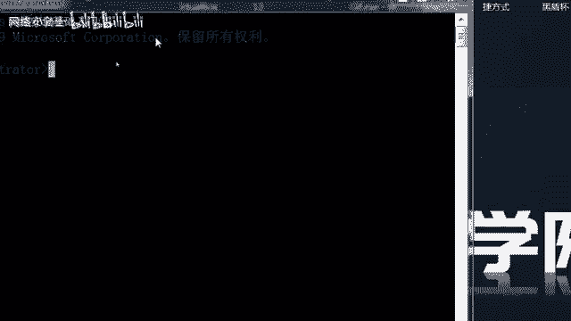

*   **安装程序**：运行提供的Java安装包，同样全程使用默认选项安装。
*   **验证安装**：打开命令提示符，输入 `java -version` 并回车。如果成功显示Java的版本信息，则说明安装成功。

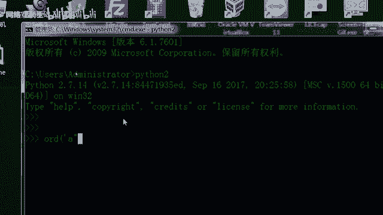

## 🌐 PHP 集成环境 (PHPStudy) 安装

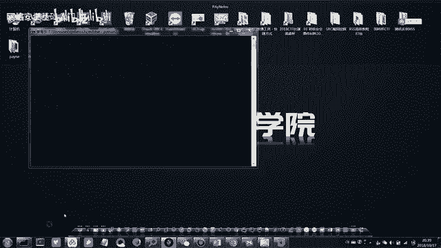

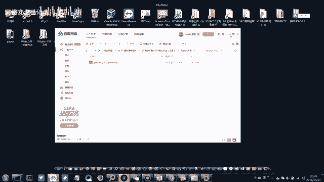

在Web类题目中，我们可能需要本地搭建一个网站服务器环境进行调试。**PHPStudy** 是一个集成了Apache/Nginx、MySQL、PHP等组件的软件，可以一键搭建完整的服务器环境。

以下是安装步骤和注意事项：

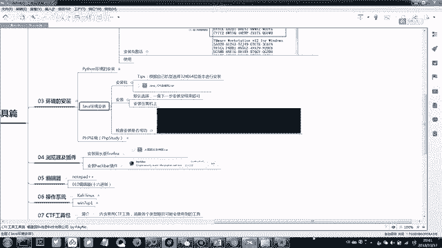

*   **安装程序**：解压并运行PHPStudy安装包，选择中文，按提示完成安装。
*   **解决常见问题**：如果安装后打开PHPStudy时，系统提示缺少 `VC9`、`VC14` 等运行库，请安装我们提供的“32位VC9和VC14运行库”组件。
*   **重要提示**：安装路径**不要包含中文**，尽量使用默认的英文路径，以避免出现兼容性问题。

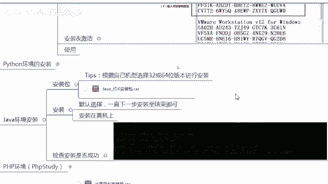

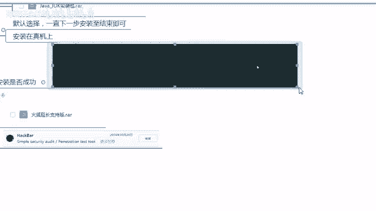

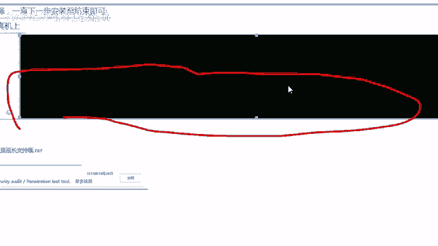

## 🦊 浏览器与插件安装

我们需要一个特定的浏览器来安装安全测试插件。

*   **安装特定版本火狐浏览器**：请安装我们提供的**旧版本火狐浏览器**。因为后续需要的插件与该版本兼容性最好。如果您已安装新版火狐，建议先卸载再安装此版本。
*   **安装 HackBar 插件**：
    *   打开火狐浏览器，点击菜单，进入“附加组件”。
    *   在扩展中搜索 `HackBar`。
    *   在搜索结果中，**请选择安装发布于2014年的那个版本**（在脑图中有截图示例）。这个版本的插件功能稳定，是CTF中常用的工具。

## 📝 编辑器安装

最后，我们需要两款功能强大的文本/代码编辑器。

*   **Notepad++**：这是一个增强版的文本编辑器，支持代码高亮、多种编码格式，非常适合查看和编写脚本、配置文件等。安装过程简单，无特殊要求。
*   **010 Editor**：这是一款专业的二进制编辑器，在“杂项”类题目中分析文件结构、查看文件头尾、修改二进制数据时必不可少。请按照提示安装即可。

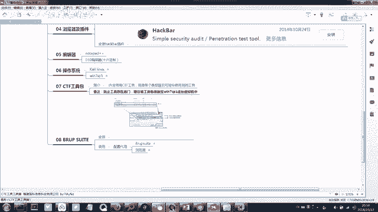

本节课中我们一起学习了CTF实战的基础工具链，包括虚拟机软件VMware Workstation、Python/Java/PHP运行环境、特定配置的火狐浏览器以及两款重要的编辑器。请务必按照指引完成这些工具的安装与配置，它们将是您后续CTF学习之旅中不可或缺的伙伴。下一节课，我们将继续介绍其他专业工具。