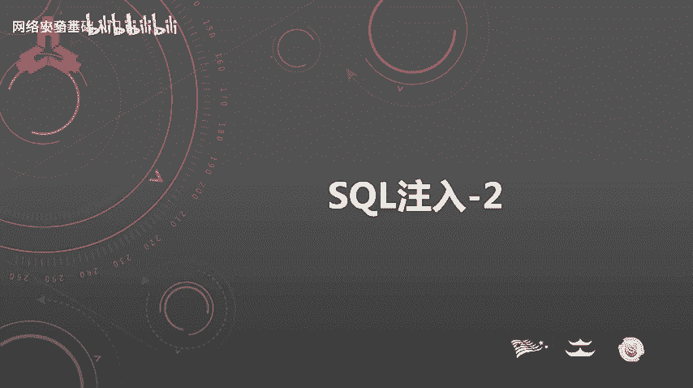
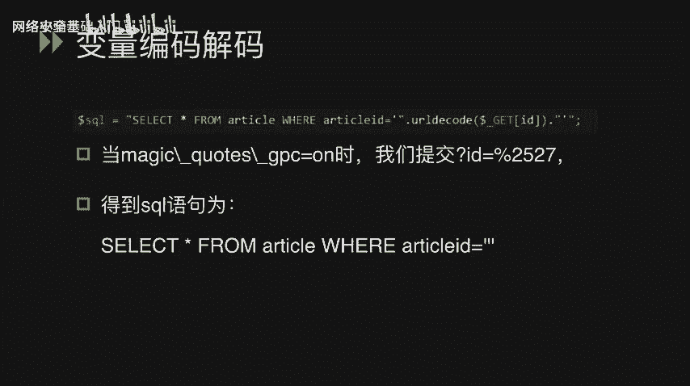
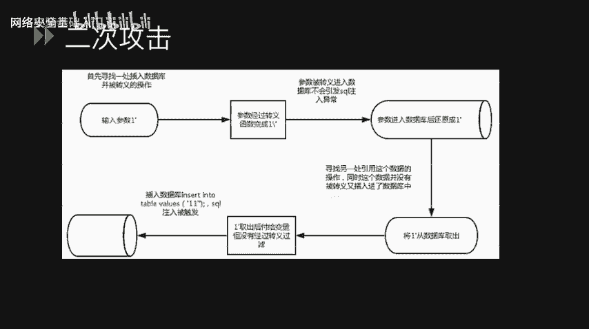
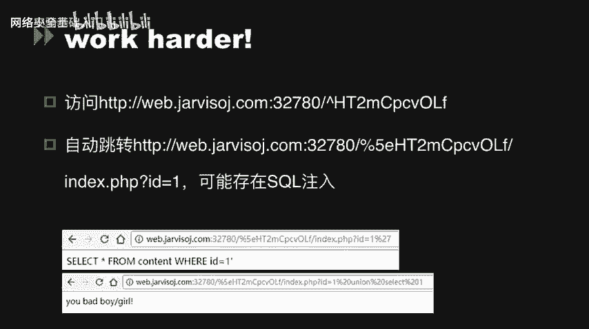
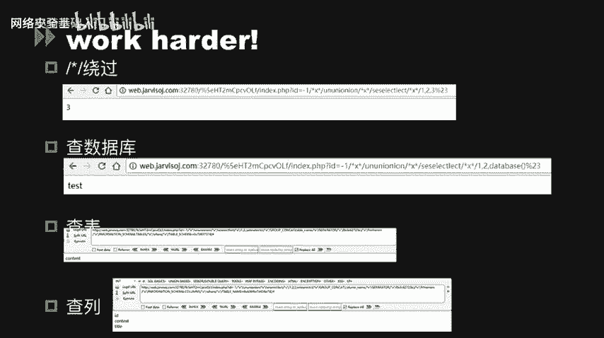
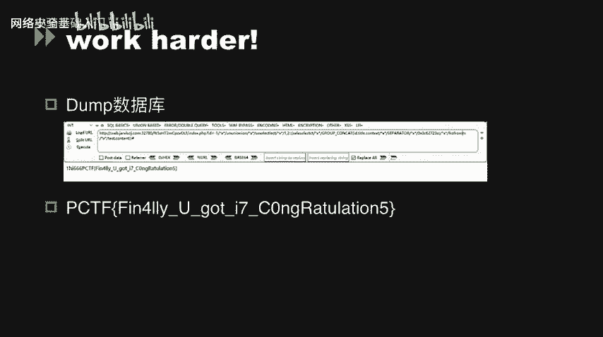
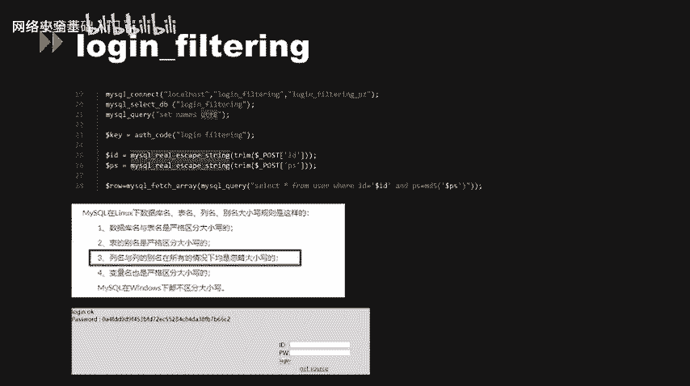

# CTF入门课程：P50：SQL注入_2



## 概述
在本节课中，我们将要学习SQL注入在CTF比赛中的几种关键应用场景，特别是围绕PHP的魔术引号（magic_quotes_gpc）安全机制展开。我们将探讨其原理、缺陷、如何绕过，并通过三道真题来实践这些知识。

---

## PHP魔术引号（magic_quotes_gpc）🔧

上一节我们介绍了SQL注入的基础概念，本节中我们来看看一个历史上重要的PHP安全配置——魔术引号。

在CTF中，一个关键的PHP设置选项是“魔术引号”，其选项名称为 `magic_quotes_gpc`。当此选项被设置为 `on` 时，所有用户输入的**单引号（'）**、**双引号（"）**、**反斜线（\）** 和 **NULL字符** 都会被自动加上一个反斜线进行转义。

从原理上讲，这与 `addslashes()` 函数的作用完全相同。例如，用户输入一个反斜线（\），系统就会在其前面再加一个反斜线，使其失去转义作用，变为普通字符串。

**转义示例：**
*   输入 `\` → 变为 `\\`
*   输入 `'` → 变为 `\'`
*   输入 `"` → 变为 `\"`
*   输入 `NULL` → 变为 `\0`

在PHP版本小于4.2.3时，此选项是全局生效的。自4.2.3起，它变为可按目录配置的选项。该选项自PHP 5.3.0起被废弃，并在PHP 5.4.0中被移除。

### 为何关闭魔术引号？
既然这是一个安全选项，为何会被关闭？主要原因是它破坏了PHP项目的一致性。并非所有被转义的数据都需要插入数据库，对所有输入数据进行转义会影响程序执行效率。此外，在不需要转义的地方看到被转义的数据（如邮件内容中出现大量斜杠），可能导致程序误判。

针对此问题，可以使用 `stripslashes()` 函数对数据进行反转义处理。`stripslashes()` 实质上是 `addslashes()` 的解码函数。

### 魔术引号的缺陷
`magic_quotes_gpc` 选项也存在缺陷，它可能影响 `$_SERVER` 等超全局变量，导致一些如 `CRLF` 注入等漏洞被利用。

我们可以通过 `get_magic_quotes_gpc()` 函数来检测当前PHP环境是否开启了此选项。在 `$HTTP_RAW_POST_DATA` 中，也常看到该选项的应用，主要出现在SOAP、XML-RPC或Web发布功能中。

以下是一个演示代码片段，展示了 `$HTTP_RAW_POST_DATA` 如何获取数据并受魔术引号影响：

```php
// 示例：获取原始POST数据
$raw_data = $HTTP_RAW_POST_DATA;
// 此数据会先经过 magic_quotes_gpc 转义，再交给PHP应用代码
```

在 `IN`、`LIMIT`、`ORDER BY`、`GROUP BY` 等数据库操作中，开发者容易忘记对变量进行手动转义，此时魔术引号会提供一层保护。例如：

```php
// 示例：在IN语句中使用变量
$uids = $_GET['uids']; // 假设 uids 为 “1,2,3”
// 如果 uids 中包含引号，magic_quotes_gpc 会对其进行转义
$sql = "SELECT * FROM users WHERE id IN ($uids)";
```

---

## 变量编码与解码问题 🔄

上一节我们提到了 `stripslashes` 和 `addslashes` 的对应关系，现在我们来系统了解PHP中常见的字符串转换函数对。

PHP中存在多组用于编码和解码的对应函数：
*   **Base64编码/解码**：`base64_encode()` 与 `base64_decode()`
*   **URL编码/解码**：`urlencode()` 与 `urldecode()` （`rawurlencode()` 与 `rawurldecode()` 功能类似）
*   **序列化/反序列化**：`serialize()` 与 `unserialize()`

在变量编码解码过程中，往往会产生安全问题，例如我们接下来要讲的二次编码注入。

### 二次编码注入攻击
请看以下SQL语句：
```php
$sql = "SELECT * FROM article WHERE articleid=" . urldecode($_GET['id']);
```
假设全局开启了 `magic_quotes_gpc`，用户输入的 `id` 参数若包含单引号，会先被转义（例如 `'` 变为 `%27`，再被转义为 `%5C%27`？这里需要厘清：魔术引号转义的是字符，不是URL编码。更典型的场景是：输入 `%2527`）。

**攻击过程**：
1.  攻击者输入 `id=%2527`（`%25` 是 `%` 的URL编码）。
2.  由于魔术引号未检测到单引号字符（只看到`%2527`这个字符串），故不进行转义。
3.  程序调用 `urldecode()` 对 `%2527` 进行第一次解码，得到 `%27`（因为 `%25` 解码为 `%`）。
4.  在某些情况下，数据可能被再次处理或存储后取出，再次解码，`%27` 被解码为单引号（`'`），从而逃逸出来，引发SQL注入。



**核心绕过原理**：利用多层解码（如URL解码）在魔术引号转义之后执行，使得被编码的恶意字符在最终执行时还原。

---

## 二次攻击（二次注入）💥

二次攻击（或二次注入）与二次编码攻击概念不同。我们看一下二次攻击的业务逻辑过程。



以下是二次攻击的典型步骤：
1.  **寻找插入点**：找到一处将用户输入插入数据库，并且该处存在转义（如魔术引号或 `addslashes`）的操作。例如，输入参数为 `1'`。
2.  **首次存储**：由于转义存在，`1'` 在存入数据库时变为 `1\'`。此时不会引发SQL注入异常。
3.  **数据取出**：在应用的其他功能点，程序从数据库中取出这条数据（例如用户名 `1\'`），并**未进行任何过滤或转义**，直接赋值给变量 `$username`。此时 `$username = “1'”`（反斜杠在从数据库取出时可能被去除，取决于数据库和配置）。
4.  **再次使用**：程序在另一个SQL查询中引用了 `$username` 变量，例如 `$sql2 = “SELECT * FROM logs WHERE user='$username'”;`。这时，未被转义的单引号 `'` 就被引入到新的SQL语句中，成功引发注入。

**本质**：整个攻击过程的核心在于，从数据库取出的变量没有经过适当的过滤就被再次拼接到SQL语句中。这种“先转义存储，后原样使用”的模式导致了防御的失效。

**不同数据库的差异**：
*   **MySQL**：默认转移字符为反斜线（\）。提交 `'` 经魔术引号变为 `\'`，存入数据库时，如果数据库配置或处理不当，反斜杠可能被存储或解释掉，取出时变回 `'`。
*   **MySQL的`ANSI_QUOTES`模式或其它DB**：转移字符可能为另一个单引号（`''`）。魔术引号产生的 `\'` 可能被直接当作字符串 `\'` 存储，行为有所不同。

---

## 魔术引号的新型攻击与问题 ⚠️

反斜杠符号不仅仅是转义符，在Windows系统下，它也是目录路径分隔符（与正斜杠 `/` 作用相同）。这个特性可能导致PHP应用产生一些意料之外的漏洞。

当你使用 `magic_quotes_gpc` 或 `addslashes()` 对用户输入进行转义时，实际上可能无意中为输入添加了目录跳转符（`\`），这可能为后续的目录遍历攻击创造条件。

魔术引号还会带来其他新问题。请看以下示例代码：
```php
$order_sn = $_GET['orderSN']; // 用户输入
$first_char = substr($order_sn, 0, 1); // 截取第一个字符
// 假设全局开启 magic_quotes_gpc，用户输入 \'，则 $order_sn = \"\\'\"
// 那么 $first_char = \"\\\" (反斜杠)

$sql = “SELECT * FROM orders WHERE order_sn='$first_char' AND order_tn='$_GET[orderTN]'”;
```
在这个例子中，`$first_char` 被截取为反斜杠（\）。当它被注入到SQL语句的 `order_sn='$first_char'` 部分时，会变成 `order_sn='\'`。这个反斜杠转义了它后面的那个由SQL语句本身提供的单引号，使得 `order_sn` 字段的字符串定义被“逃逸”。

此时，攻击者可以精心构造 `orderTN` 参数，在其位置注入完整的SQL语句。因为前面的单引号已被反斜杠转义，`orderTN` 参数的内容就能被当作SQL代码执行。

---

## 其他魔术引号相关配置 🛠️

除了 `magic_quotes_gpc`，PHP历史上还存在其他相关配置：

*   **`magic_quotes_runtime`**：此选项与 `gpc` 的区别在于，它是对**从数据库或文件中取出的数据**进行转义。这理论上可以防御二次注入攻击（在数据取出环节进行转义）。然而，如果使用不当，也可能造成问题。它会影响 `fgets()`、`fread()`、`mysql_fetch_array()` 等很多数据库查询和文件读取函数。此选项别名是 `set_magic_quotes_runtime()`，自PHP 5.3.0起废弃，PHP 7.0.0中正式移除。

*   **`magic_quotes_sybase`**：此选项与 `gpc` 的区别在于，它只转义空字符（NULL），并将单引号转为**两个单引号**（`'` 变为 `''`）来进行转义（这是Sybase数据库的风格）。当此选项为 `on` 时，它会覆盖 `magic_quotes_gpc` 的配置，但仍受 `addslashes()` 和 `stripslashes()` 影响。此选项同样自PHP 5.3.0起废弃，于5.4.0移除。

---

## CTF真题实战 🎯

接下来，我们通过三道CTF题目来实践上述知识。

### 真题一：基础绕过与注释符利用

题目提供了一个URL，查看源代码后发现提示，要求访问 `index.phps`（通常用于展示源码的文件）。访问后获得源代码。

**解题思路**：
源代码中存在关键的条件判断语句需要绕过。主要涉及两个点：
1.  对变量 `$data` 的检查，可以使用 `php://input` 流来绕过。
2.  对 `eregi()` 函数的绕过，该函数用于正则匹配，通常可使用截断（如 `%00`）或利用函数特性进行绕过。



成功绕过判断后，获得一个提示路径。访问该路径，发现存在SQL注入点。

**注入过程**：
进行测试时，发现题目过滤了空格。此时，我们可以使用注释符 `/**/` 来替代空格进行绕过。
以下是利用步骤：
1.  判断注入点类型。
2.  使用 `union select` 查询，将空格替换为 `/**/`。例如：`union/**/select/**/1,2,3`。
3.  逐步获取数据库名、表名、列名。
4.  最终读取到存储flag的字段内容。



### 真题二：宽字节注入



在题目源代码中，使用了 `mysql_real_escape_string()` 函数进行转义。这通常引出了“宽字节注入”漏洞。

**解题思路**：
宽字节注入利用了MySQL数据库在使用GBK、BIG5等宽字符集时的特性。当转义函数在单引号前添加反斜杠（`\'`）时，如果我们可以构造一个特殊字符（如 `%df%27`），使得 `%df%5c`（反斜杠的编码）组合在一起被数据库解释为一个宽字符（如“運”），后面的 `%27`（单引号）就能逃逸出来。
我们可以手动构造Payload，也可以使用自动化工具如SQLMap，并加载 `tamper` 脚本中的 `unmagicquotes.py` 来辅助进行宽字节注入。

### 真题三：大小写绕过

题目同样使用了 `mysql_real_escape_string()` 函数进行转义，并且在代码第21行将全局字符集设置为UTF-8。这使得宽字节注入无法利用。

**解题思路**：
我们需要寻找其他绕过 `mysql_real_escape_string()` 的方法。经过探索，我们发现MySQL在Linux系统下有一条重要的命名规则：**列名与列的别名在所有情况下都是忽略大小写的**。而题目中登录验证恰好是使用用户名和密码作为列名进行查询。

因此，我们可以利用大小写混淆来绕过。例如，如果数据库中的列名是 `Password`，我们在注入Payload中尝试 `PASSWORD`、`password`、`PaSsWoRd` 等，MySQL在执行时可能会将其视为相同的列名，从而绕过检查，实现注入。通过这种方式，我们可以绕过登录验证，获取到最终的flag。



---


## 总结
本节课中，我们一起深入学习了SQL注入在CTF中的进阶应用。我们从PHP的魔术引号机制出发，探讨了其原理、缺陷（如二次编码注入、二次攻击），以及由反斜杠特性引发的新型攻击。我们还介绍了 `magic_quotes_runtime` 和 `magic_quotes_sybase` 等相关配置。最后，通过三道真题的实战，我们练习了使用注释符绕过空格过滤、利用宽字节注入绕过 `mysql_real_escape_string()`、以及利用MySQL列名大小写不敏感的特性进行绕过。理解这些历史机制和绕过技巧，对于分析和解决现代Web安全题目依然具有重要的参考价值。