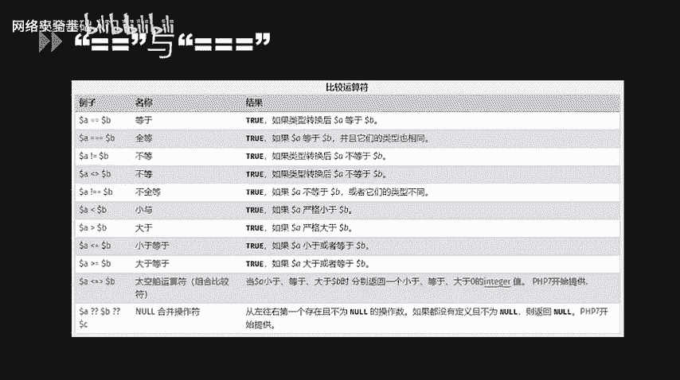
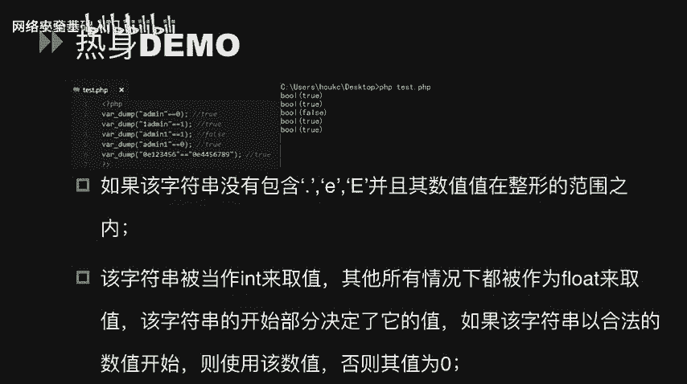
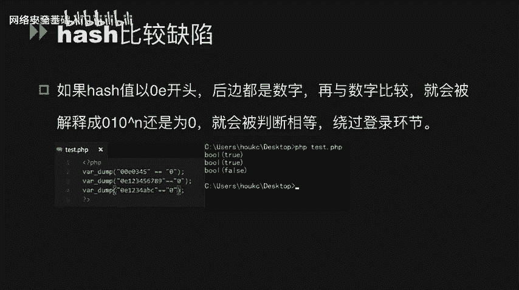
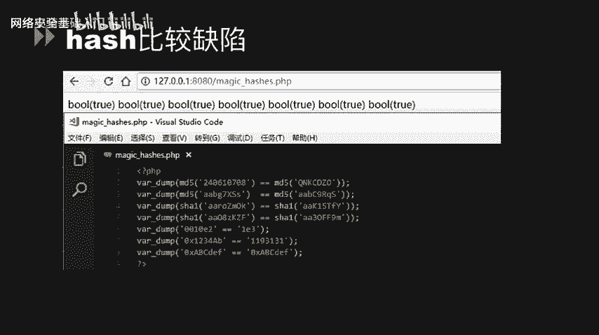
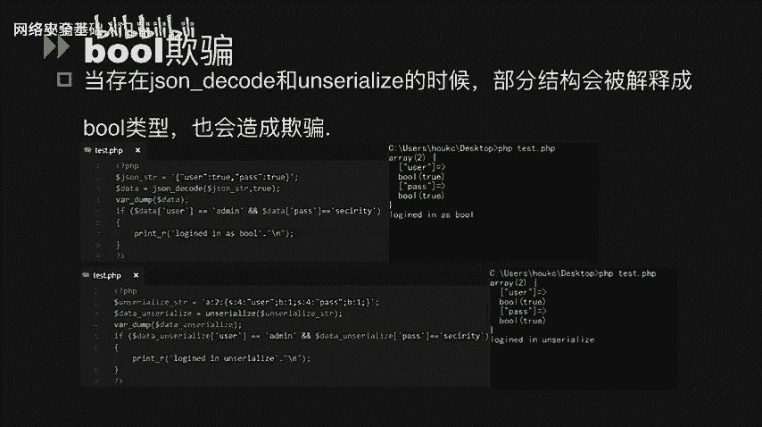
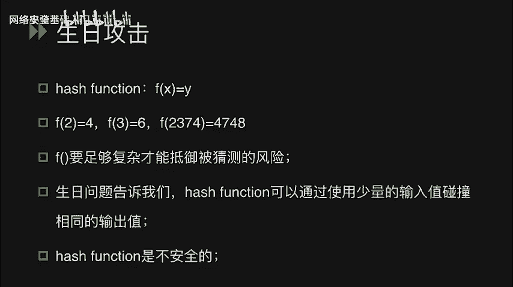

# CTF入门课程：P52：代码审计_1 - PHP代码审计基础 🛡️


在本节课中，我们将要学习CTF比赛中PHP代码审计的基础知识。代码审计是发现Web应用漏洞的关键技能，通过分析源代码，我们可以找到逻辑缺陷、绕过安全限制，甚至获取系统权限。本节将重点介绍PHP中因类型比较和函数使用不当而引发的常见安全问题。

## 松散比较与严格比较 🔍



上一节我们介绍了代码审计的重要性，本节中我们来看看PHP中两个核心的比较运算符：双等号（`==`）和三个等号（`===`）。它们的主要区别在于类型检查的严格程度。

*   **双等号 (`==`)**：称为松散比较。在进行比较时，PHP会尝试将两边的操作数转换为相同类型，然后再比较值。
*   **三个等号 (`===`)**：称为严格比较。在进行比较时，PHP会同时检查两边的值和类型是否完全相同。

在PHP官方手册中，存在一些不符合直觉的比较结果，例如：
*   数值 `1` 和字符串 `"1"` 使用 `==` 比较，结果为 `true`。
*   数值 `0` 和字符串 `"abc"` 使用 `==` 比较，结果也为 `true`。

这是因为在松散比较中，字符串会被尝试转换为数值。转换规则是：如果字符串以数字开头，则取其开头的数字部分；否则，字符串会被转换为 `0`。

以下是几个演示示例：

```php
var_dump("admin" == 0); // true，因为"admin"被转为0
var_dump("1admin" == 1); // true，因为"1admin"被转为1
var_dump("admin1" == 1); // false，因为"admin1"被转为0
var_dump("admin1" == 0); // true，因为"admin1"被转为0
```


## 哈希比较缺陷 🎯


哈希函数（如MD5、SHA1）的输出本应是唯一的，但PHP的松散比较会引入安全风险。当一个哈希值以 `0E` 开头，后面全是数字时（例如 `0e123456`），PHP会将其解释为科学计数法表示的 `0`（即 `0 * 10^123456 = 0`）。



如果两个不同的字符串经过哈希计算后，都得到 `0E` 开头的哈希值，那么它们在松散比较时就会被判定为相等。



```php
// MD5("240610708") = 0e462097431906509019562988736854
// MD5("QNKCDZO")   = 0e830400451993494058024219903391
var_dump(md5('240610708') == md5('QNKCDZO')); // true
```

攻击者可以利用这个缺陷，绕过基于哈希值匹配的登录验证或权限检查。



以下是已知的一些会产生 `0E` 开头哈希值的字符串对（魔法哈希）：
*   `240610708` 与 `QNKCDZO` (MD5)
*   `aabg7XSs` 与 `aabC9RqS` (SHA1)
*   `0e215962017` 与 `0e291242476940776845150308577824` (MD5)

## 布尔欺骗 🔄

当使用 `json_decode()` 或 `unserialize()` 函数处理用户输入时，如果输入被解释为布尔类型 `true`，也可能造成欺骗。

**示例一：json_decode**
```php
$json_string = '{"user":true,"pass":true}';
$data = json_decode($json_string, true);
if ($data['user'] == 'admin' && $data['pass'] == 'security') {
    echo "Access Granted!";
}
// 因为 $data['user'] 和 $data['pass'] 都是布尔值 true，
// 在松散比较中，true == ‘admin‘ 和 true == ‘security‘ 结果均为 true。
```

**示例二：unserialize**
```php
$serialized_string = 'a:2:{s:4:"user";b:1;s:4:"pass";b:1;}';
$data = unserialize($serialized_string);
if ($data['user'] == 'admin' && $data['pass'] == 'security') {
    echo "Access Granted!";
}
// 原理同上，反序列化后的布尔值 true 在松散比较中会与任意非空字符串相等。
```

## 数字转换欺骗 🔢



字符串在转换为数值时，会遵循“取首部连续数字”的原则，这可能导致意外的比较结果。

```php
var_dump(intval("2")); // 2
var_dump(intval("3abcd")); // 3，只取开头的3
var_dump(intval("abcd")); // 0，没有数字开头

var_dump("123456" == "0x1E240"); // true
// 字符串"0x1E240"被识别为十六进制数，转换为十进制后正好是123456。

var_dump("0.999999" == "1"); // true
// 字符串"0.999999"被转换为浮点数，在比较时与整数1相等。

var_dump("1.1" == "1"); // false？ 注意：这里结果为 false，因为1.1不等于1。
// 但如果是 `"1.0" == "1"`，结果会是 true。
// 一个常见的利用是：`$uid = $_GET[‘uid‘]; if ($uid == 1) {...}`
// 传入 `uid=1.0` 或 `uid=1abc` 都可以使条件成立。
```

## 函数使用不当引发的漏洞 ⚙️

某些PHP函数在接收非预期类型的参数时，行为异常，可能被利用。

**1. strcmp 函数**
`strcmp($str1, $str2)` 用于比较两个字符串。但当 `$str2` 是一个数组时，函数会返回 `NULL`。在松散比较中，`NULL == 0` 为 `true`。

```php
if (strcmp($password, $_GET[‘t‘]) == 0) {
    echo "Welcome!";
}
// 如果传入 `t[]=任意值`，`$_GET[‘t‘]` 是数组，strcmp返回NULL。
// NULL == 0 为 true，从而绕过密码检查。
```

**2. md5 函数**
`md5()` 函数期望接收一个字符串参数。如果传入一个数组，函数不会报错，但会返回 `NULL`。这使得任意两个数组的MD5“值”在松散比较时都相等。

```php
$arr1 = array(‘a‘ => ‘b‘);
$arr2 = array(‘c‘ => ‘d‘);
var_dump(md5($arr1) == md5($arr2)); // true
// 因为 md5($arr1) 和 md5($arr2) 都返回 NULL，NULL == NULL 为 true。
```

## 哈希函数与生日攻击 🎂

哈希函数的目标是产生看似随机的、不可逆的输出。但理论上，任何哈希函数都存在“碰撞”（两个不同的输入产生相同的输出）。

生日攻击源于“生日悖论”：在一个23人的房间里，有超过50%的概率至少有两人生日相同。这个数字远小于我们的直觉（365天）。这说明，找到哈希碰撞所需的尝试次数，远小于遍历所有可能输出值的次数。

结论是：**没有绝对安全的哈希函数**。对于MD5、SHA1这类算法，已经可以高效地制造碰撞。因此，在安全要求高的场景中，应使用更抗碰撞的算法（如SHA-256、SHA-3），并配合加盐（Salt）使用。

---

本节课中我们一起学习了PHP代码审计的入门知识，包括：
1.  **松散比较(`==`)**与**严格比较(`===`)**的区别及安全隐患。
2.  利用**哈希比较缺陷**和**魔法哈希**绕过验证。
3.  `json_decode`/`unserialize` 函数可能引发的**布尔欺骗**。
4.  字符串到数字转换过程中的**类型转换欺骗**。
5.  `strcmp`、`md5` 等函数在接收**数组参数**时的异常行为。
6.  理解**生日攻击**的概念，认识到哈希函数存在碰撞的必然性。




掌握这些基础概念和技巧，是进一步进行复杂PHP代码审计和漏洞挖掘的基石。在后续课程中，我们将结合真实CTF题目，实践这些知识的应用。