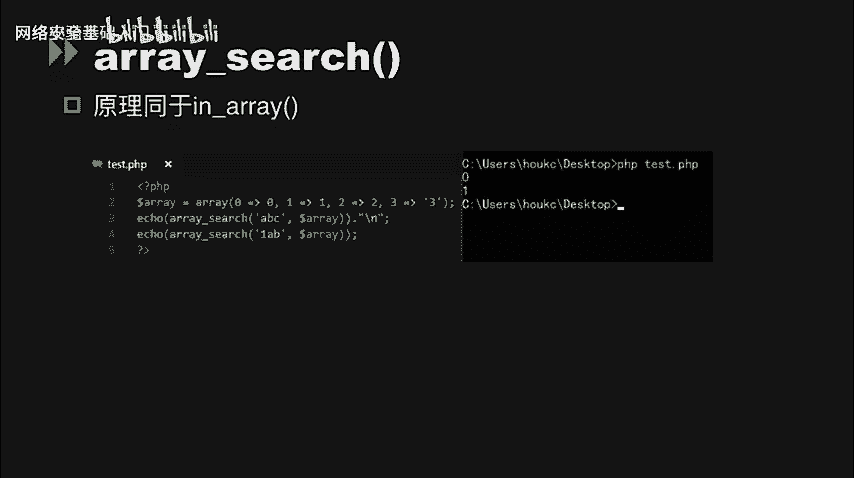
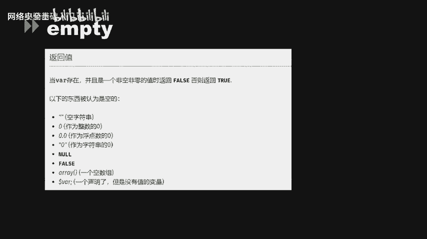
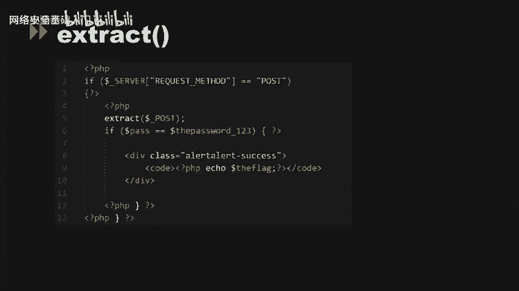
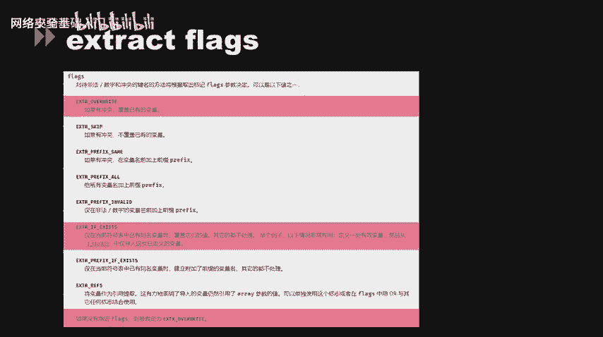
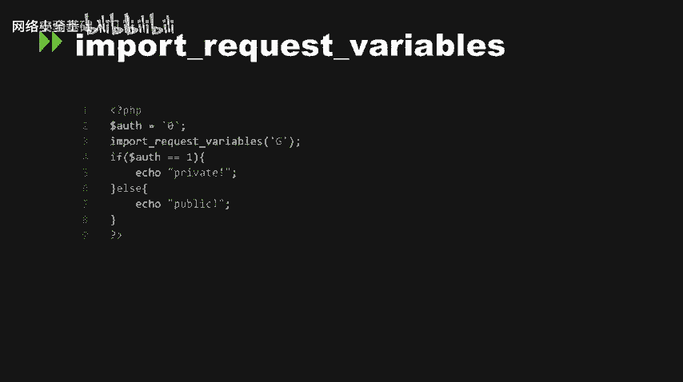
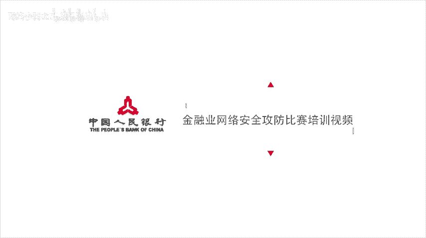

# CTF入门课程：P53：代码审计_2 🔍


在本节课中，我们将学习PHP代码审计中的几个核心概念，包括松散比较的绕过、类型转换问题以及变量覆盖漏洞。这些是CTF Web题目中常见的安全问题。

## 松散比较与MD5绕过 🔓

上一节我们介绍了代码审计的基本思路，本节中我们来看看PHP中松散比较和MD5函数可能引发的安全问题。

在之前的CTF题目中，出现过一道签到题。它的第一个环节是判断两个参数是否相等，然后对它们进行MD5处理后再次判断是否相等。这两次比较都使用了松散比较（`==`）。我们可以直接利用哈希缺陷来绕过这个环节。

第二个环节同样是通过松散比较来判断。我们可以利用MD5函数在处理数组输入时的缺陷来绕过。当MD5函数的输入是数组时，它会返回`NULL`，并且产生一个警告，这使得两个数组的MD5“值”在松散比较下相等。

到了第三个环节，我们发现无法再使用松散比较或MD5的数组缺陷来绕过。这时就需要用到MD5碰撞。我们可以找到两个不同的输入字符串，但它们的MD5哈希值完全相同。这可以通过选择前缀碰撞的方法实现。以下是两个现成的字符串示例：

```
字符串A: 4dc968ff0ee35c209572d4777b721587d36fa7b21bdc56b74a3dc0783e7b9518afbfa200a8284bf36e8e4b55b35f427593d849676da0d1555d8360fb5f07fea2
字符串B: 4dc968ff0ee35c209572d4777b721587d36fa7b21bdc56b74a3dc0783e7b9518afbfa202a8284bf36e8e4b55b35f427593d849676da0d1d55d8360fb5f07fea2
```

这两个字符串的MD5值相同。我们可以将它们分别作为参数一和参数二的输入值，从而绕过该环节，完成题目。

## 类型转换相关问题 🔄

接下来，我们探讨PHP中因类型转换不当可能引发的安全问题。

**switch函数**是一个典型的例子。`switch`函数根据接收到的参数值跳转到对应的分支。考虑以下代码：

```php
$input = “2ABC”;
switch ((int)$input) {
    case 2:
        echo “进入case 2”;
        break;
}
```

当`switch`接收到参数值`”2ABC”`时，经过强制类型转换`(int)`后，它会变成整数`2`，从而进入`case 2`分支。这里用到了字符串向数值的强制转换。

**is_numeric函数**在做判断时也存在风险。如果攻击者将输入改为十六进制格式（例如`0x…`），`is_numeric`会先将十六进制数判断为数字型并返回`true`。如果这个值被直接带入SQL语句，MySQL数据库会将其解析成字符串存入。如果这个字段后续被取出并进行二次利用，就可能造成二次注入漏洞。



以下是一个示例测试，它接收一个ID值输入，然后提取并输出，成功执行了我们构造的SQL语句。

**in_array函数**用于判断一个值是否存在于数组中。其函数原型为：
`bool in_array ( mixed $needle , array $haystack [, bool $strict = FALSE ] )`

如果未提供可选的`$strict`参数（即未将其设置为`true`），`in_array`就会使用松散比较来判断`$needle`是否在`$haystack`中。当`$strict`为`true`时，`in_array`会比较`$needle`和`$haystack`中元素的值和类型是否都相同。



许多程序员可能不会去设置这个`$strict`参数。例如在下面的demo中，只设置了前两个必选参数：

```php
$array = array(0, 1, 2, ‘3’);
if (in_array(‘abc’, $array)) {
    echo “‘abc’ 在数组中”;
}
```

字符串`’abc’`在松散比较下会被强制转换为整数`0`，而`0`存在于数组中，因此条件判断为真。同理，`’1abc’`会被转换为`1`，也会返回`true`。

**array_search函数**的原理与`in_array`类似，也会进行类型强转，存在相同的问题。

**empty函数**用于判断一个变量是否为空。根据官方手册，如果当前输入为`0`（数值`0`、字符串`”0”`或`0.0`），`empty`也会返回`true`。许多程序员没有意识到它对`0`的判断也为真，这可能导致一些条件判断被绕过。

同样存在类似类型转换或判断问题的函数还有`isset`函数、`strpos`函数以及`preg_match`函数等，在代码审计时都需要注意。

## 变量覆盖漏洞 🎭

上一部分我们讨论了类型转换，现在我们来关注另一类常见漏洞：变量覆盖。

**双美元符号（$$）** 可能导致变量覆盖。我们看以下demo：

```php
foreach ($_GET as $key => $value) {
    $$key = $value;
}
echo $liam;
```

这段代码使用`foreach`遍历`$_GET`数组，然后将获取到的数组键名作为变量名，数组键值作为该变量的值。这就产生了变量覆盖。当我们请求`?liam=test`时，变量`$liam`的值会被覆盖为`”test”`。因此，`$$key`（即`$liam`）会变成`”test”`。

**extract函数**是一个典型的变量覆盖函数。`extract`函数的作用是从数组中将变量导入到当前的符号表中。该函数使用数组键名作为变量名，数组键值作为变量值。针对数组中的每个元素，都会在当前符号表中创建对应的变量。

考虑以下demo（test.php）：
```php
$size = “large”;
$var_array = array(“color” => “blue”, “size” => “medium”, “shape” => “sphere”);
extract($var_array, EXTR_PREFIX_SAME, “wddx”);
echo “$color, $size, $shape, $wddx_size”;
// 输出：blue, large, sphere, medium
```

`extract`获取了一个数组`$var_array`，并设置了`EXTR_PREFIX_SAME`模式（当有冲突变量时，为导入的变量添加前缀）。最终输出时，`$color`对应`”blue”`，但`$size`变量变成了`”large”`，而不是数组中的`”medium”`。这是因为`”medium”`被赋给了带前缀的变量`$wddx_size`（值为`”medium”`），而原有的全局变量`$size`（值为`”large”`）被保留了下来。

再看一个更典型的利用`extract`进行变量覆盖的例子：
```php
extract($_GET);
if ($gift == $congrat) {
    echo $flag;
}
```



`extract`直接处理了`$_GET`参数。我们可以通过GET请求直接覆盖`$gift`变量，从而绕过下面的条件判断。原本`$congrat`可能是经过处理的`$flag`变量值。题目中使用了`extract($_GET)`来接收GET请求中的数据，并将键名和键值转换为变量名和变量值，然后再进行`if`条件判断。因此，我们可以提交GET参数来覆盖变量，满足条件。

我们的Payload可以是：`?flag=&gift=`。这样，`extract`函数会将`$flag`和`$gift`变量的值都覆盖为空，使得`$gift == $congrat`条件成立（假设`$congrat`也为空或未定义），从而输出flag。



另一道类似的题目只是将输入方式改成了POST提交。我们通过POST提交`pass`和`thepassword123`参数，并将它们的值都置为空，从而绕过条件判断，输出flag。

值得一提的是，`extract`函数有一个`$flags`标记位。当`$flags`为`EXTR_OVERWRITE`或`EXTR_IF_EXISTS`时，才会存在变量覆盖行为。**如果没有指定`$flags`参数，则默认假定为`EXTR_OVERWRITE`**。因此，在默认情况下，它就存在变量覆盖漏洞。

**parse_str函数**用于将字符串解析成变量。函数原型为：
`parse_str ( string $encoded_string [, array &$result ] ) : void`
`$encoded_string`是必须输入的字符串，`$result`是可选数组。如果没有设置`$result`参数，那么该函数设置的变量将会覆盖当前作用域中的同名变量。

PHP中的一个配置项`magic_quotes_gpc`（位于php.ini中）会影响该函数的输出。如果启用了该选项，`parse_str`在解析之前，变量会被`addslashes`函数进行转义。

看下面这道题：
```php
if ($_GET[‘id’] != md5(‘QNKCDZO’) && $_GET[‘id’] == md5(‘QNKCDZO’)) {
    echo $flag;
}
```

要满足`$a[0] != ‘QNKCDZO’`，同时`md5($a[0]) == md5(‘QNKCDZO’)`，就需要利用PHP弱类型的特性。字符串`”0e123”`在松散比较时会被当作科学计数法（即`0 * 10^123`，结果为`0`）。因此，我们需要找到一个字符串，其MD5值是以`”0e”`开头，后面全是数字的。例如，数字`240610708`的MD5值就是`0e462097431906509019562988736854`。所以，我们的Payload是：`?id[]=240610708`。

**import_request_variables函数**（在较新版本中已移除）也存在变量覆盖风险。当访问`test.php?os=1`时，如果代码中有`import_request_variables(‘G’)`，网页上可能会输出`private`。因为该函数指定导入GET请求中的变量，从而导致变量覆盖。

`import_request_variables`函数会将GET、POST、Cookie中的变量导入到全局作用域中。如果你禁用了`register_globals`配置项，但又想用到一些全局变量，那么这个函数就可以用来在`register_globals`关闭的情况下注册全局变量，但也因此带来了安全风险。

## 总结 📝



本节课我们一起学习了PHP代码审计中的几个关键知识点：
1.  **松散比较与MD5绕过**：利用`==`的比较机制、MD5处理数组的缺陷以及MD5碰撞，可以绕过某些条件判断。
2.  **类型转换问题**：`switch`、`is_numeric`、`in_array`、`array_search`、`empty`等函数在类型转换或判断时可能产生非预期行为，导致安全漏洞。
3.  **变量覆盖漏洞**：`$$`、`extract`、`parse_str`、`import_request_variables`等特性或函数可能允许攻击者覆盖已有变量的值，从而改变程序逻辑，绕过安全检查。



理解这些原理对于发现和利用CTF中的Web漏洞至关重要。在代码审计时，需要特别注意这些函数和比较方式的使用场景。