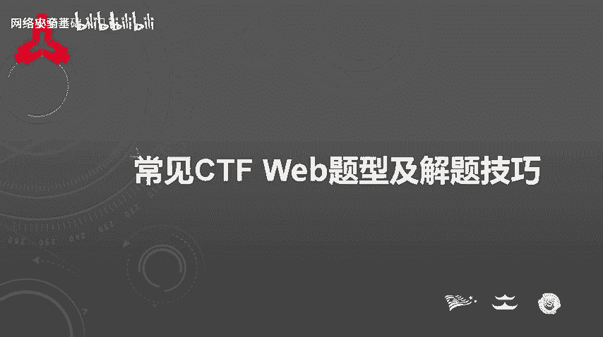
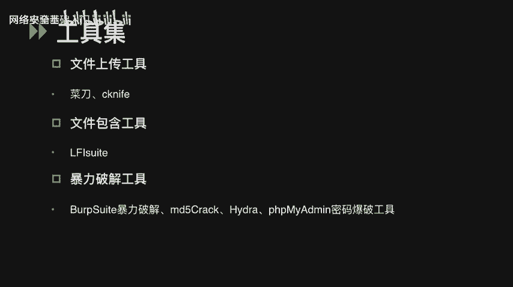
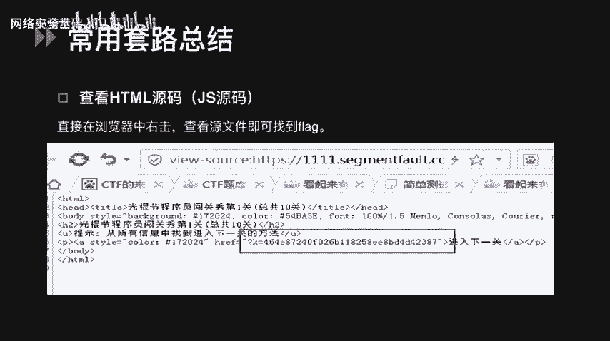
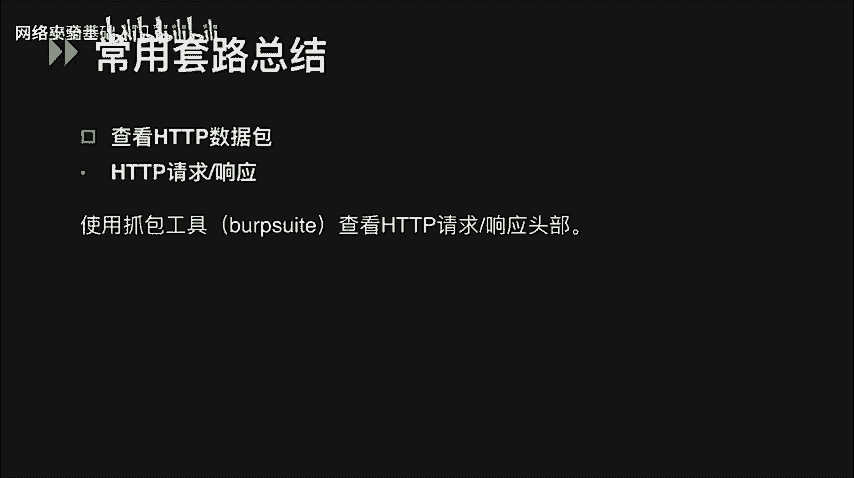
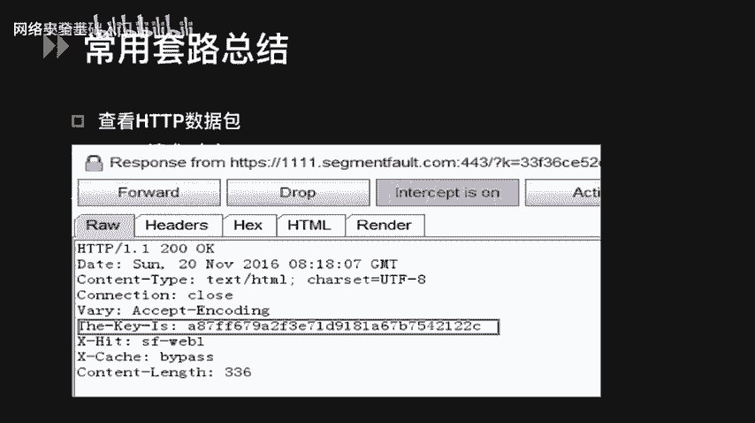
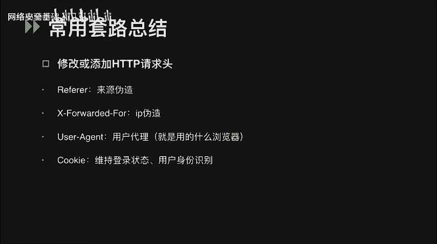
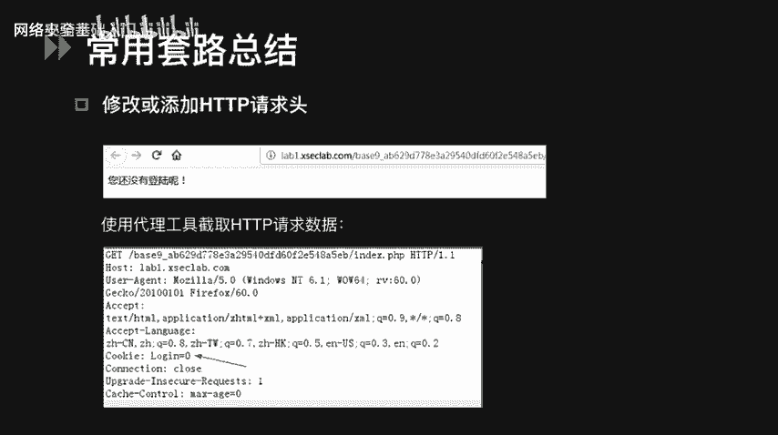
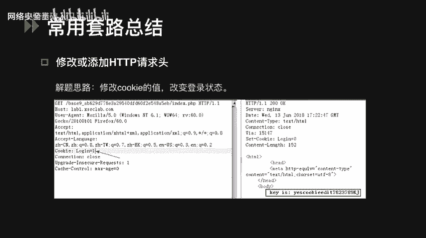
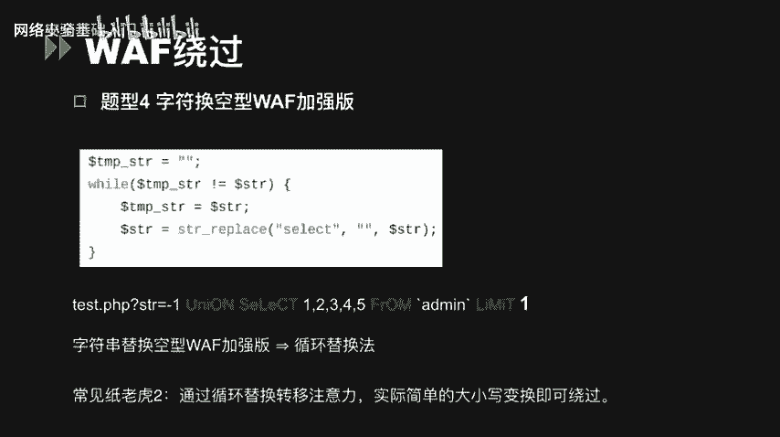
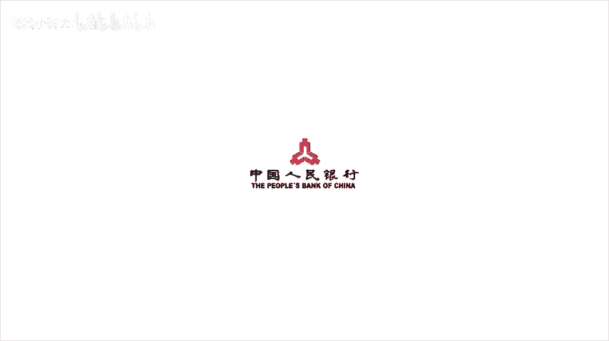

# CTF入门课程：P57：常见CTF WEB题型及解题技巧 🕵️

在本节课中，我们将要学习CTF比赛中常见的Web题型及其解题技巧。课程内容主要分为两个部分：常用工具集介绍和常见题型的解题技巧总结。通过学习，你将掌握识别和解决各类Web安全挑战的基本方法。

## 常用工具集介绍 🛠️

上一节我们介绍了课程概述，本节中我们来看看在CTF Web类题目中常用到的一些工具。熟练使用这些工具是解题的基础。

以下是基础代理与浏览器插件工具：
*   **Burp Suite**：一个代理工具，也是用于攻击Web应用程序的集成平台，包含了许多功能强大的工具。
*   **Firefox浏览器插件**：功能强大，例如HackBar可以支持修改POST请求提交的参数，提供了SQL注入和XSS工具的功能，能够快速对字符串进行各种编码。

以下是扫描与探测工具：
*   **御剑/DirBuster**：可以对网站后台目录进行扫描。
*   **Nmap**：可以扫描开放端口，探测服务。
*   **AWVS**：一个Web漏洞扫描工具，可以扫描一些常规的Web漏洞。但需要注意，在CTF比赛中，扫描工具要慎用，有的比赛禁止参赛人员进行大批量的扫描操作。

以下是专项利用工具：
*   **SQL注入工具**：最常用的工具是`sqlmap`。
*   **XSS平台**：能够通过注入XSS代码获取他人浏览器窗口甚至设备里的信息，比如本地存储的`localStorage`、`cookie`等。可以自己搭建，比较有名的是`XSS Platform`，可以在GitHub上下载源码。
*   **文件上传工具**：主要是中国菜刀、Cknife。向网站上传木马文件后，可以在本地连接木马，获取甚至控制整个网站的目录。
*   **LFI Suite**：一个本地文件包含漏洞神器，它提供了8种不同的本地文件包含攻击模块，使用方法也非常简单。

以下是暴力破解工具：
*   **Burp Suite Intruder模块**：可以用来做认证破解。
*   **MD5Crack/MD5Craft**：如果密码是MD5加密的，可以使用这类软件进行破解。
*   **Hydra**：一款开源的暴力破解工具，目前支持的破解服务有SSH、FTP、MSSQL、Telnet、POP3等。
*   **PHPMyAdmin密码爆破工具**：可以通过指定账号和密码对MySQL数据库暴力破解进行登录尝试。

除此之外，还有很多其他的工具可以使用。大家也可以去网上把这些工具下载下来，自己尝试着去使用一下。

## 常见题型与解题技巧 🧩

在CTF比赛中，Pwn、Reverse、Crypto都是稳扎稳打的题型，而Web题型则更需要一些技巧和套路。

### 信息隐藏与查找

首先，最简单的一种套路是直接在浏览器右击查看页面源代码，就可以看到flag。

除了在源代码中，有时flag会藏在HTTP请求或响应包的头部，可以通过代理工具（也就是之前提到的Burp Suite）抓包查看flag值。可以看到图中HTTP响应包的`The-Key-Is`头部的值，就是我们要获取的flag。

我们还可以通过修改或添加HTTP请求头来伪造客户端信息，例如：
*   修改`Referer`头，可以伪造来源。
*   修改`X-Forwarded-For`，可以伪造客户端IP。
*   修改`User-Agent`，可以伪造浏览器标识。
*   修改`Cookie`，可以改变用户的登录状态等。

这里有一道例题，题目提示当前为未登录状态。根据题意，我们可以使用代理工具查看Cookie的值为`login=0`。

那我们的解题思路就是可能需要我们保持一个登录的状态。那么我们可以去尝试修改Cookie的值，改成`login=1`。当用户处于登录状态的时候，我们就可以得到flag值了。

### 源码泄露

Web源码泄露是CTF中比较常见的题型。线上CTF比较常见的是VIM源码泄露。如果发现页面有提示vi或者vim之类的，说明存在`.swp`文件泄露，直接访问`/.index.php.swp`或`/index.php~`可以获得源码。有的时候可能我们下载下来的文件还是有一定的乱码，可以在Linux下执行`vim -r index.php`来恢复文件。

还有一种比较常见的是备份文件泄露，可以去访问`index.php.bak`或`www.zip`等带有备份后缀的文件。

另外，在运行`git`初始化代码库的时候，会在当前目录下面产生一个`.git`的隐藏文件，用来记录代码的变更记录等，造成`.git`源码泄露，可以访问`.git/config`去获取git源码，也可以使用`GitHack`等工具，使用方法比较简单。

`SVN`是一个开放源代码的版本控制系统。我们可以通过访问`.svn/entries`获取SVN源码。工具有`Seay SVN`和`dvcs-ripper`等。

### 编码与加解密

在Web题型里，也常会出现编码加解密这一类的题目。我们来看一下这道题，访问页面源码得到了一长串加密的字符串。根据末尾的等号判断，它可能是一个Base64编码后的字符串。我们可以用`base64_decode()`解码一次，发现并没有得到一个明文的字符。那么猜测可能是经过了多次Base64加密。我们可以用Python去写一个解密的脚本，将多次Base64加密的字符串放在一个`1.txt`的文档中，执行这个脚本就可以得到flag。

接下来看一下摩尔斯电码。摩尔斯电码是一种早期的数字化通信形式，它不同于现代只使用0和1两种状态的二进制代码，它的代码包括5种：点、横杠、点和横杠之间的停顿、字符间短的停顿、单词之间中等的停顿以及句子之间长的停顿。编码后就形如密码样例下的一串字符。我们想要比较快速地破解它，可以使用网上的一些在线加解密的网站。

培根密码是一种本质上用二进制来设计的密码，没有用通常的0和1来表示，而是采用A和B。它选取5个为一组，对于明文上的一个字符加密后会形如密码样例下的结果，同样也可以使用一些在线加解密的网址对它进行解密。

栅栏密码也是CTF中常见的加密方式之一。不过栅栏密码本身有一个潜规则，就是组成栅栏的字母一般不会太多，一般不会超过30个，也就是一两句话。

凯撒密码是通过把字母移动一定的位数来实现加密和解密的，也就是按照26个英文字母的顺序，分别用这个字符的前面或者后面第多少位来进行替换。这是凯撒密码的一个加密的样例。我们可以看到，当偏移量为1时，那么将T往后偏移一位就是U。所以说此时T对应的密文就是U，这就是凯撒密码的一个加密原理。网上可以找到一些加解密凯撒密码的工具。

最后我们来看JSFuck。JSFuck编码是由`[`、`]`、`(`、`)`、`!`、`+`这6个字符组成的。如果我们碰到类似于这样的字符串的话，就可以判断它是用JSFuck进行编码的。网上也有一些在线的加解密地址。

其实编码类的题目主要是看我们平时在做题过程中积累的经验，看到这样的字符，你能不能迅速地去判断出它是由哪一种方法加密或者编码的。

### 系统特性利用

还有一些Windows的特性可以利用。首先是短文件名。短文件名是由于为了兼容16位MS-DOS的程序，Windows为文件名较长的文件和文件夹生成了对应的Windows 8.3短文件名。我们可以利用波浪号字符猜测暴露短文件或文件夹的名称，例如`backup-08-etc.cl`这个文件，它的短文件名就是`backup~1.cl`。

第二个是IIS解析漏洞。Windows上IIS的解析漏洞，可以用来绕过文件上传中的服务端的白名单和黑名单的检测，具体可以参见文件上传的课程。

### PHP弱类型与绕过技巧

在CTF中，有一些题型总能难倒一些人，比如PHP弱类型、WAF相关的题型，但它们往往有一些技巧和套路。

首先我们来看PHP包含的类型：`String`（字符串）、`Integer`（整数）、`Array`（数组）、`Boolean`（布尔）、`Float`（浮点数）、`Object`（对象）、`Resource`（资源）、`NULL`（空）。其中`NULL`类型唯一可能的值就是`NULL`，也就是空或者出错了会返回一个`NULL`。

接下来看一下PHP的类型比较。在PHP中，`==`是比较运算符，会先将字符串类型转化成相同的，再进行比较。如果比较一个数字和字符串，或者比较涉及到数字内容的字符串，那么字符串会被转换成数值，并且比较会按照数值来进行。所以：
*   字符串`"123"`和整数类型的`123`是相等的。
*   十六进制数`0x1`和十进制数`1`也是相等的。
*   空字符串`""`、`NULL`、布尔值`FALSE`均等于`0`，它们的数组形式也相等。

这里我们可以看到有两个等式，一个是字符串`"abc" == 0`，另一个是字符串`"123a" == 123`。其实它们是相等的。字符串和数值的松散比较，会取它的第一个字符。如果字符是字母，强转为`0`；如果这个字符是数字，那么就转为这个数字。

最后是`"0e123"`和`"0e456"`开头的两个字符串，它们也是相等的，是因为`0e`开头的字符串在比较的时候会把它视为科学计数法。所以`0e`后面无论是什么，就相当于0的多少次方，它依然是0。

首先我们来讲解两道关于PHP弱类型的题。

**题型一：strcmp字符串比较**
`strcmp`函数用于二进制安全字符串比较。如果`str1`小于`str2`，返回小于0；如果`str1`大于`str2`，返回大于0；如果两者相等，返回0。我们这里可以看到，在题目中有一个`if`判断，是通过`strcmp`去比较从GET请求传来的参数`flag`和代码里写好的`flag`，如果它们相等的话，就会返回0，和后面的0相等，这样我们就可以得到flag。`strcmp`传入的期望类型是字符串类型。我们传入一个数组类型的参数`flag[]`就可以绕过，是因为函数接收到了不符合的类型，将发生错误返回`NULL`，那么`NULL == 0`，我们就可以得到flag。

**题型二：MD5绕过**
我们看到源代码里题目的大意是要输入一个字符串和数字类型，它们原值不相等，但是MD5值是相等的。如果满足这两个条件的话，就可以成功执行下一步语句，得到flag值。这道题有两种解法。
*   **第一种解法是使用科学计数法绕过**。什么是科学计数法呢？就是`与10的幂次相乘`的形式，可以用`0e`来表示。那么`0e123456789`和`0e987654321`，它们表示的都是0乘以10的幂指数，不管幂指数是多少，结果都会是0。那么MD5值的取值范围也是0到F，包含了`e`这个字母。我们可以找到一个字符串和一个整数类型，它们的MD5值刚好都是`0e`开头的，那么MD5函数在判断它的时候，会把它当成一个科学计数法去处理，认为它们俩都等于0，这样就可以绕过这个检测。
*   **第二种解法是数组绕过**，就是通过数组来绕过这个MD5函数。MD5函数的特性是它无法去比较数组，因为这是它不接受的数据类型。那么我们就没有必要再用弱类型比较的特性去做这道题，可以直接利用MD5函数的特性。解法是我们可以传两个数组类型的数据，当`md5()`处理它们的时候，发现无法接受，就返回`NULL`值，这样可以成功绕过得到flag。

### WAF绕过技巧

接下来讲绕过WAF的几种常见方式。

以下是几种常见的绕过方法：
*   **大小写混合**：使用大小写混合的方式，绕过对关键字的检测。但是这种形式只针对小写或者大写的关键字匹配技术，正则表达式使用修饰符`/i`时，对大小写不敏感就无法绕过。
*   **编码绕过**：例如单引号进行URL编码后为`%27`，斜杠为`%2F`。当单引号被过滤时，我们需要读某个数据库或者表下面的数据时，可以使用十六进制编码数据库的库名或者数据库的表名。
*   **注释符使用**：在SQL注入中也是很常见的，常见的注释符有`#`、`-- `（两个减号加空格）、`--+`和`/**/`。`/**/`这种注释符可以绕过对空格的过滤或者关键字的识别。看下面的几个例子，第一个是用注释符替代空格，第二个和第三个是用注释符绕过对关键字的识别。
*   **空字节绕过**：空字节能起作用，是因为在一些语言中，空字节表示字符串结束符。过滤器在处理输入的时候，如果碰到空字节就会停止处理。那么我们只要把空字节放在注入的语句之前，过滤器就不会处理后面的语句了。
*   **嵌套剥离绕过**：使用嵌套剥离的前提是替换或者删除`select`、`union`等关键词，而且只匹配了一次。那么我们就可以通过在`select`里嵌套一个`select`绕过一次剥离。
*   **避开自定义过滤器**：一些过滤器，它所过滤的字符串都是事先写好的。只要我们输入的语法和它们过滤的不匹配，即可绕过。例如把`and`转换成`aNd`等。

来看一道题，**题型三：字符替换空型WAF**。这种绕过方式很简单，就是刚刚说过的嵌套剥离的方法。由于`str_replace`只替换了一次，故剥离了一个`select`，还剩下一个。这种做法就是很纸老虎的做法，看起来似乎过滤了所有的关键字，却把关键字都替换成了空值，这样就让攻击者钻了个空子。

来看**题型四：字符换空型WAF加强版**。这题就是通过`while`语句实行循环替换，通过循环替换来转移我们的注意力。实际上简单的大小写混合就可以绕过这个WAF。

## 总结 📝

本节课中我们一起学习了CTF Web题型的常见解题技巧。我们从必备的工具集入手，了解了Burp Suite、sqlmap等核心工具。随后，我们深入探讨了多种题型，包括信息查找、源码泄露、编码解密、系统特性利用，以及PHP弱类型和WAF绕过等高级技巧。掌握这些基础套路和思维方法，是解决CTF Web挑战的关键。希望大家能多加练习，积累经验。