# CTF入门课程：P58：金融业网络安全攻防案例剖析 🛡️


在本节课中，我们将剖析金融业网络安全攻防中的实际案例。通过学习这些案例，我们可以了解攻击者常用的手法以及防御的关键点，从而更好地理解网络安全实践。

## 概述

网络攻击主要包含四类漏洞：应用层漏洞、业务逻辑层漏洞、安全运维层漏洞和安全意识层漏洞。本章将根据这四部分进行详细描述。

## 一、应用层漏洞

应用层漏洞主要包括OWASP Top 10中介绍的漏洞，例如SQL注入、XSS、CSRF、SSRF以及文件操作、命令执行等。

### 1. SQL注入案例

在案例一中，我们遇到了一个系统的SQL Server注入漏洞。此漏洞的后果不仅是获取敏感数据，还能通过向操作系统写入文件达到获取Shell权限的目的。

首先观察数据包。在POST数据包中，我们在`UID=1`后加入了一个单引号，程序报错，初步判断此处可能存在注入。

经过一系列尝试，我们使用了一个类型转换函数`CONVERT`，将数据库中的`user`参数（`char`类型）转化为`int`类型。当把这个字符串组合在数据包中发送给后端时，程序报错，提示将`char`转化为`int`失败，由此断定存在SQL注入。

进一步测试发现，当前MySQL数据库的权限是`SA`权限（最高权限），支持`UNION`查询，操作系统用户权限是`system`权限，并且数据库开启了`xp_cmdshell`函数特性。开启此函数后，可以通过注入点执行系统命令。

在数据包中，我们将之前`user`转`int`的操作逻辑改为使用`xp_cmdshell`执行`whoami`命令，并将结果输出到Web目录下的一个`.txt`文件中。发包后发现成功写入文件，访问该文件即可看到当前操作系统的权限用户。

**回顾**：通过此SQL注入，攻击者不仅可以窃取数据，还能直接获取操作系统权限。

#### 什么是SQL注入？

SQL注入是指通过构造特殊的输入作为参数传递给后端Web程序，从而执行攻击者意图的操作。当应用程序未对用户输入进行过滤时，就会发生此类攻击，导致攻击者能够操作数据库语句。

根据注入类型，SQL注入可分为字符型注入和数字型注入等。其危害主要表现为数据库信息窃取，在某些条件下，攻击者还能写入恶意文件，导致操作系统权限丢失。SQL注入漏洞发生频率非常高。

### 2. 数据伪造案例

除了常见的身份伪造，很多企业还存在加密算法或密钥被窃取的漏洞。

观察案例中的数据包，这是一个普通的数据包，但链接中有一个`getToken`方法，它将`req`参数的值处理后返回对应用户的`token`。

测试中发现`req`参数可能是Base64编码或DES加密。**DES加密**是一种密钥加密算法，于1977年被确定为美国联邦资料处理标准，在国际上广泛使用。DES设计使用了分组密码设计的混淆和扩散原则，以抵抗统计分析。

逆向分析客户端应用后，我们发现了包含`secretKeySpace`参数的加密/解密函数代码，该参数就是DES加密使用的密钥。获取此密钥后，即可对`req`参数进行加密或解密。

尝试将`givospddxhuwo-1`这样的参数用该密钥进行DES加密后，粘贴到数据包中重放，成功返回了相应用户的`token`，从而可以获取其身份信息。

此类密钥硬编码在客户端的现象目前仍很常见。传统加密方式可能已完善，但移动端成为了新的攻击入口。建议在客户端打包或上线前进行**加壳**或加固操作。

**什么是加壳？**
加壳是在二进制程序中植入一段代码，程序运行时优先获取控制权以执行额外工作。这是一种应用加固手段，通过对二进制原始文件进行加密、混淆和隐藏，有效阻止攻击者反编译，加大其获取敏感信息的难度。

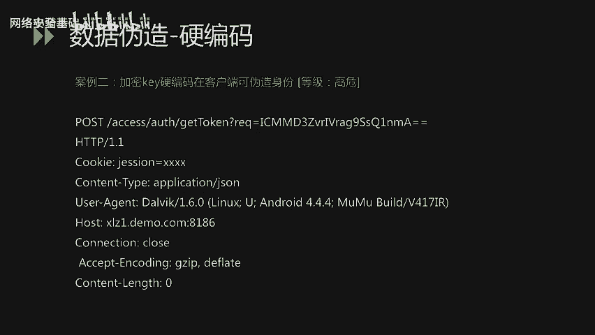

### 3. 沙盒逃逸案例

案例三涉及金融证券行业常见的安全问题——沙盒逃逸。

首先介绍**量化交易系统**。它是以数学模型替代人为判断，利用计算机技术从历史数据中筛选策略，减少投资者情绪影响，避免非理性决策的系统，广泛应用于金融证券行业。

此类系统通常为用户提供源码编辑功能，用户可编写代码实现自动化策略。但编码后的代码运行在系统沙盒中，一旦沙盒被逃逸，攻击者就能在操作系统层执行命令。

#### 具体案例

在量化交易模型的用户源码界面，用户可以调用常见函数或模块定制策略。常见的沙盒是Python沙盒。

我们介绍Python的`subprocess`模块。该模块从Python 2.4引入，用于创建子进程执行外部指令，并通过管道获取返回信息，取代了旧的`os.system`等方法。

#### 如何进行沙盒逃逸？

我们将恶意代码写入源码中，通过编译运行实现沙盒逃逸。

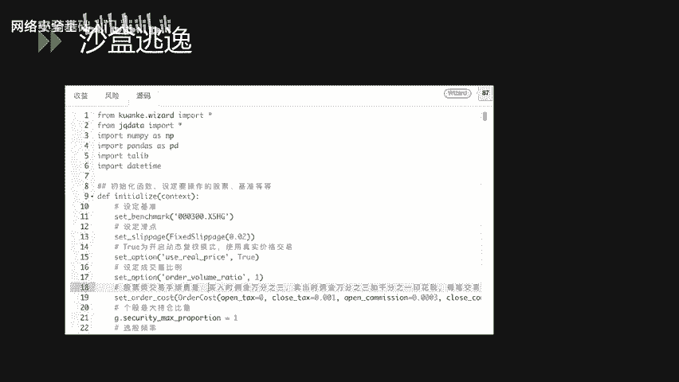

以下是Payload示例：
```python
import subprocess

def handle_data():
    tt = "/bin/ps -ef"
    process = subprocess.Popen(tt, shell=True)
    # ... 其他处理逻辑
```
这段代码引入了`subprocess`模块，定义了一个命令`ps -ef`（用于列出系统进程），并通过`Popen`方法执行。当`shell=True`时，可以直接传入命令字符串。

将Payload放入量化交易模型的沙盒中点击编译运行，在日志中可以看到输出了当前系统的进程信息，成功在操作系统层面执行了命令，完成了沙盒逃逸。

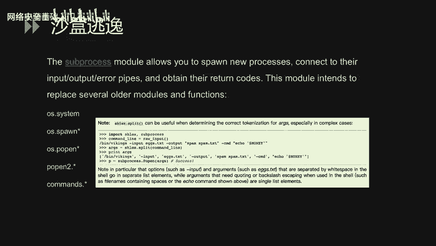

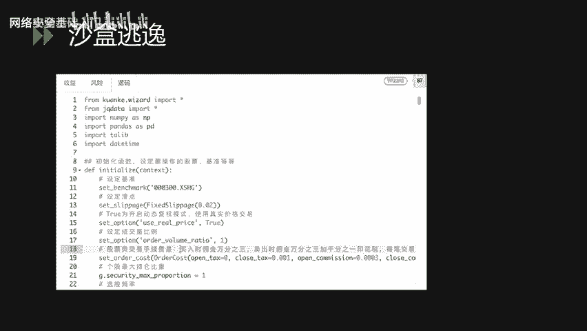

攻击者还可以执行其他命令，如网络相关命令或下载恶意文件，进一步入侵内网。沙盒逃逸在金融证券行业仍较常见，部分原因是关注度不足或基础库未及时更新迭代。

### 4. 文件操作漏洞案例

案例四展示了通过任意文件操作导致GetShell的过程，结合了文件上传和任意文件读取。

首先，通过`curl`某个地址获取了`bash_history`内容，此处存在任意文件读取漏洞，攻击者可以在URL中拼接文件路径来读取文件。

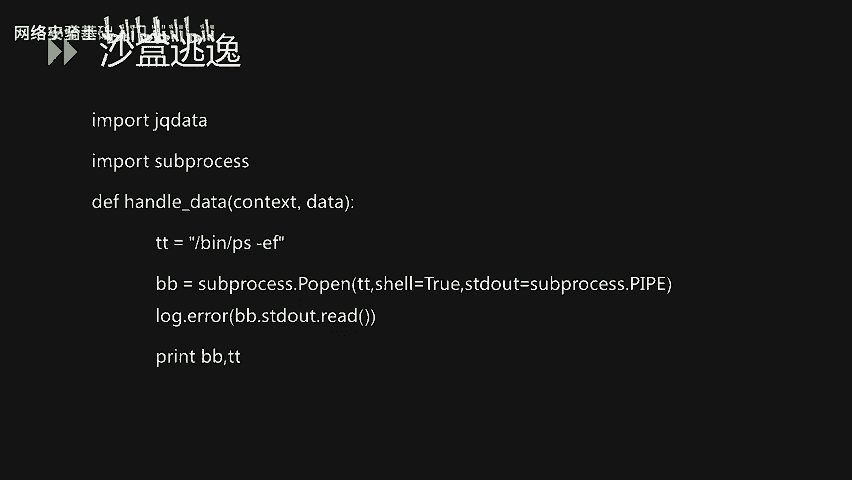

#### 什么是任意文件操作漏洞？

它包括文件上传、读取、删除、下载及包含等一系列操作。其中，**任意文件上传**是渗透测试中常见的安全问题。许多业务系统都有上传功能（如头像），若系统未对上传文件进行校验或过滤，攻击者可能直接上传WebShell从而控制服务器。

在本案例中，通过任意文件读取获取了Web系统的部分代码。审计代码发现，某些未在网站体现的接口仍可访问，例如一个个人资料设置功能中的上传头像接口。该接口未对文件类型进行限制（如只允许jpg/png）。

我们直接上传一个`.jsp`的WebShell文件，发现文件成功被解析。传入参数后，直接获得了操作系统命令执行权限。图中展示了获取当前操作系统IP地址的命令。

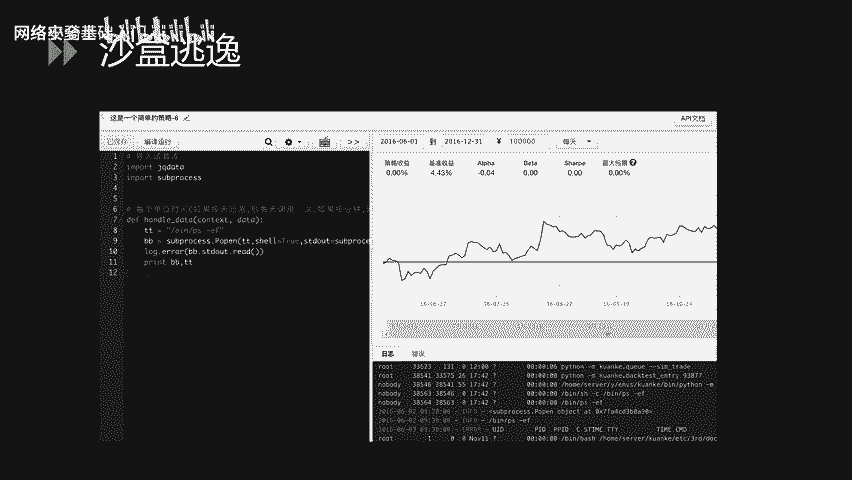

## 二、业务逻辑层漏洞

相较于应用层漏洞，业务逻辑层漏洞更难通过自动化检测发现，因为它需要结合业务逻辑进行分析。

### 1. 越权漏洞案例

这是一个系统个人信息查询功能的越权漏洞。

观察数据包，这是一个普通的POST请求。在Body中有一个`number`参数，值为`223`。测试发现，`number`值代表了当前用户的UID，后端通过它查询数据库中的用户信息。

通过修改`number`值（如从`223`改为`220`），即可获取其他用户的信息。一旦被攻击者发现，可进行自动化批量操作，获取大量用户的姓名、身份证、账户余额、工作单位等信息，对企业和用户造成严重影响。

越权漏洞在金融证券领域出现频率较高，因为业务复杂，若接口调用不当或身份验证不严，很容易出现此类漏洞。

### 2. 密码重置漏洞案例

密码重置漏洞是业务逻辑漏洞的一种形式。本案例介绍如何在注册账号过程中重置他人密码。

这是一个标准的开户/注册流程：创建账户 -> 设置密码 -> 设置个人信息 -> 审核。

首先，注册一个受害者用户A（如001），密码设为`1234`。同时，注册一个攻击者用户B（如002），密码设为`5678`。

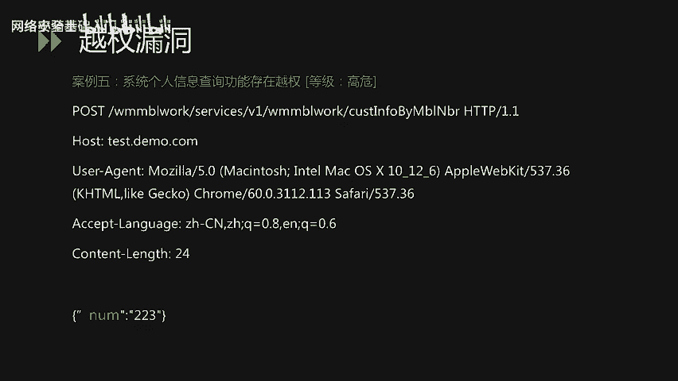

在提交密码的步骤中，拦截数据包，将其中关键的`account`参数（账号信息）从`002`改为受害者账户`001`，然后提交数据包。后端成功执行后，登录发现用户001的密码已被重置为`5678`。

通过修改`account`参数为任意目标账户，即可将其密码设置为攻击者可控的密码。密码重置漏洞虽相对较少，但危害非常严重。

## 三、安全运维层漏洞

运维漏洞主要分为两类：N-day漏洞利用和配置不当。

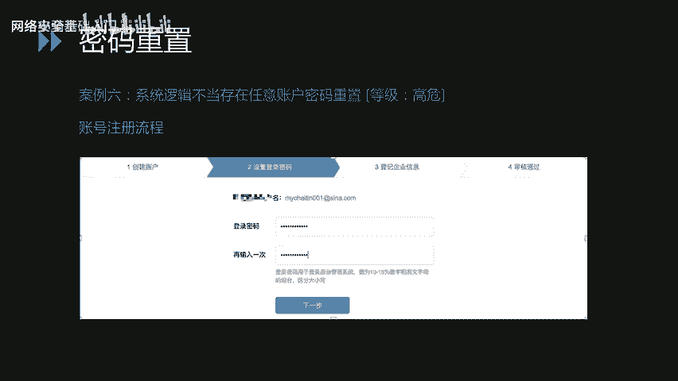

### 1. N-day漏洞案例

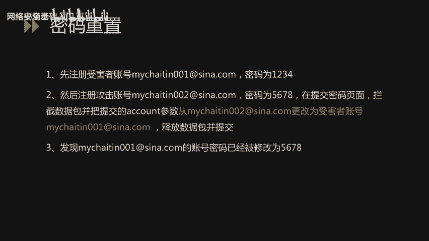

N-day漏洞区别于0-day漏洞，指官方已发布补丁或漏洞公开已久、已有防御措施，但目标系统因未及时更新而仍受影响的漏洞。

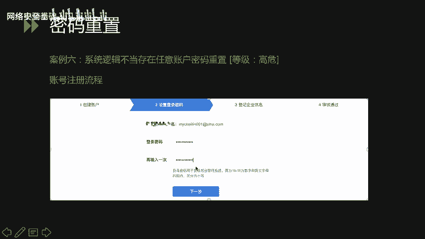

案例七介绍了金融证券行业常见的WebLogic、Struts、Tomcat等中间件或框架的漏洞。

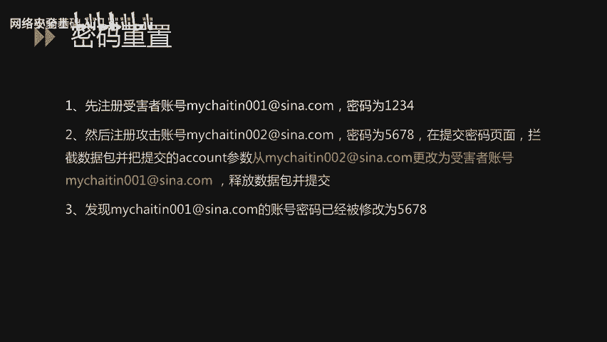

在测试某金融网站时，于8009端口发现了WebLogic的报错信息。尝试使用已知漏洞进行测试，发现输入某些操作系统命令后，服务器成功执行并返回结果，这是一个典型的N-day漏洞利用案例。

这要求企业运维人员及时梳理系统中间件、框架的版本信息，建立映射关系，以便在新漏洞爆发时能快速了解业务系统风险。

### 2. 配置不当案例

案例八介绍了因备份文件未删除导致的严重安全问题。

首先，通过`curl`发现并下载了一个网站备份文件。解压后发现，该文件夹包含了整个网站的代码、配置信息和日志。

在翻阅备份文件时，发现了一个配置文件，其中包含了数据库的端口、用户名、DB名和密码。虽然数据库在内网可能无法直接连接，但这些信息可以帮助攻击者发现密码规律，对渗透测试有很大帮助。

## 四、安全意识层漏洞

安全意识是最难管理和杜绝的环节，主要分为口令安全和代码安全两类。

### 1. 弱口令案例

案例九是一个典型的因弱口令导致GetShell的案例。

图中是一个Tomcat管理界面。攻击者通过弱口令登录系统后台。Tomcat是一个Web容器，可以部署Web应用。登录后，攻击者部署了一个包含恶意文件的Web应用，直接获取了Web服务器权限。

上传成功后，可以执行命令查看当前目录文件、新建文件夹/文件、上传文件以及执行操作系统命令。

### 2. 代码泄露案例

案例十介绍了GitHub等平台上的配置文件或代码泄露问题。

开发人员可能将项目代码上传到公开平台进行管理。若这些代码被恶意攻击者获取，可进行白盒审计，或直接从中提取配置文件，从而发现黑盒测试难以发现的漏洞，对业务系统造成危害。

在图中，我们搜索`mysql`连接数据库的关键字，发现了大量结果，其中很多可能可以直接连接。这提示我们在开发过程中应避免将代码上传至互联网。

在另一个案例中，通过关键字搜索，直接获取到了运维人员的运维手册。手册中详细记录了不同系统、数据库的内外网地址、用户名和密码等信息。若此文件被攻击者获取，可直接威胁企业安全。

### 3. SVN泄露案例

案例十一介绍了SVN泄露漏洞。

SVN管理代码时会生成一个隐藏的`.svn`文件夹，包含重要的源代码信息。若网站管理员发布代码时直接复制文件夹而非导出，会导致`.svn`文件夹暴露在外网。攻击者可借助其中的文件索引还原线上代码，进行白盒审计或搜索配置信息，威胁企业内网安全。

在本案例中，通过SVN泄露成功获取了线上服务器代码，并在代码中找到了一个静态文件存储的OSS服务器密钥（`AccessKey`和`AccessSecret`）。通过该账号，攻击者直接获取了企业内的敏感数据和数据库文件，造成致命影响。

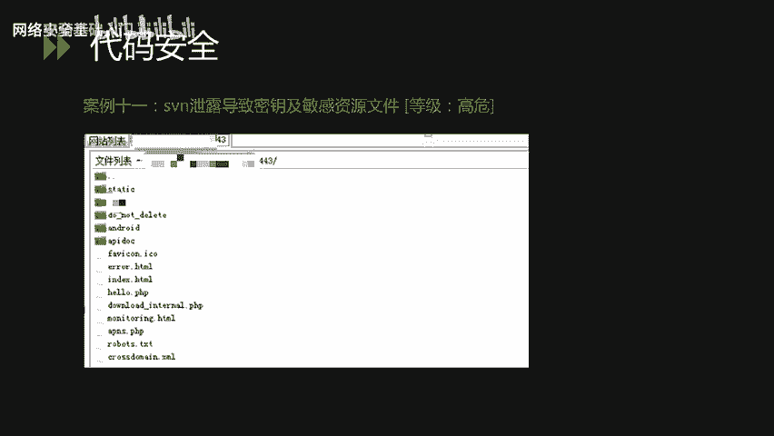

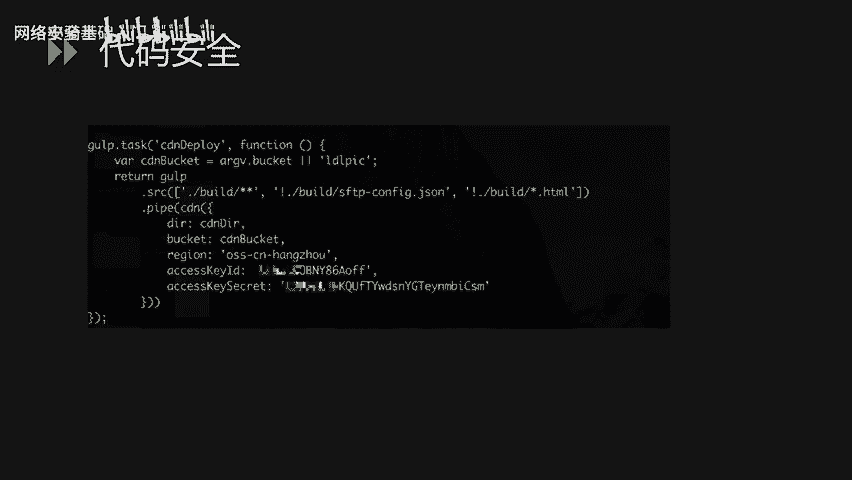

## 总结

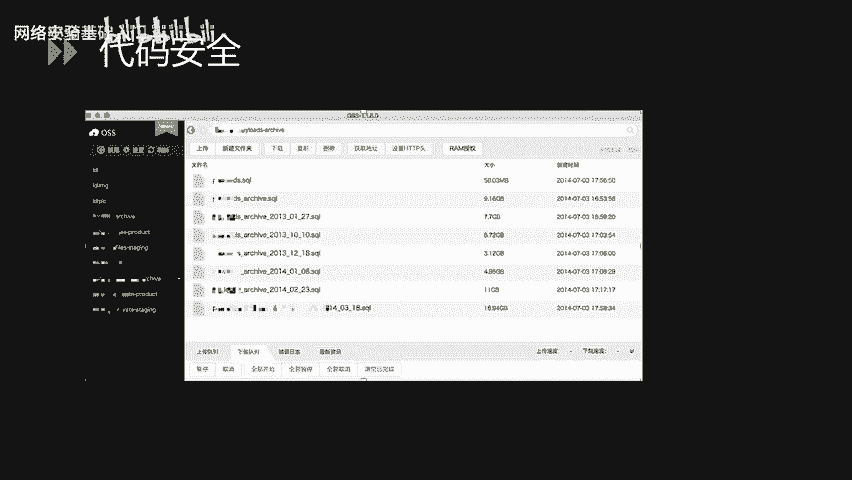

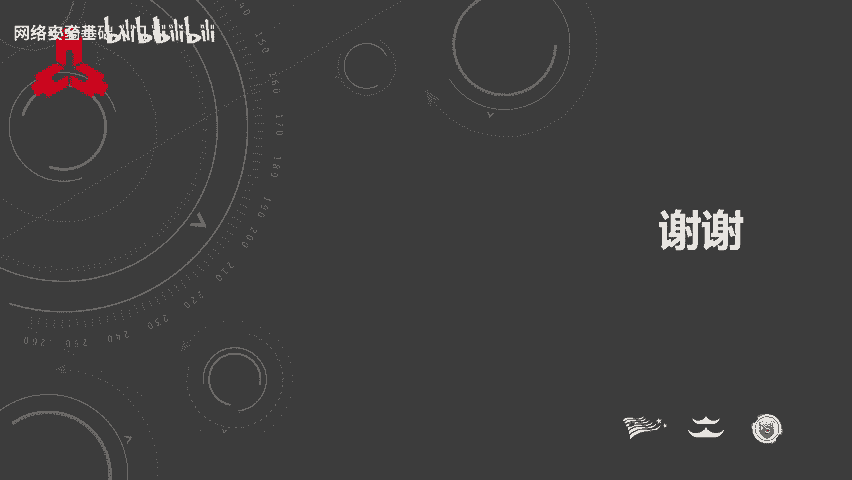

本节课我们一起学习了金融业网络安全的四类典型漏洞及其案例：应用层漏洞（如SQL注入、数据伪造、沙盒逃逸、文件上传）、业务逻辑层漏洞（如越权、密码重置）、安全运维层漏洞（如N-day利用、配置不当）以及安全意识层漏洞（如弱口令、代码泄露）。通过剖析这些实际攻防案例，我们理解了攻击原理和防御重点，认识到安全需要从技术、运维和意识多方面共同加固。