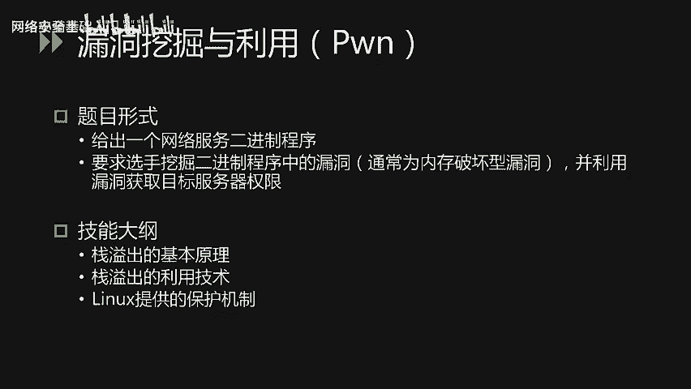
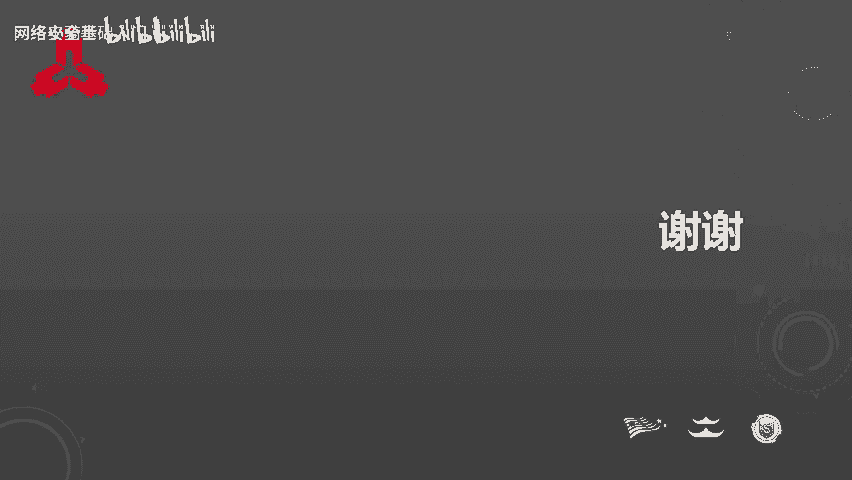

# CTF入门课程：P59：命题思路与赛题类型 🎯

在本节课中，我们将梳理CTF比赛的命题思路与主要赛题类型，帮助参赛者更好地进行赛前准备。

## 整体命题思路 📝

为了最大化参赛选手的收获，命题遵循以下核心要求。

首先，每个赛题的考点设置必须合理。选手在解题时应有明确目标，且预期的解题思路是合理的。我们会尽量避免套路题和依赖大量猜测的脑洞题。

其次，题目设置的考点应能为金融业的网络安全工作带来实际帮助，避免考查选手用不到的技能。

最后，题目考点需具备丰富的技术多样性。现实中攻击者的技术千变万化，防守方必须具备全面的技能树才能应对。同时，赛题的知识点比重应大致符合金融业网络安全工作的实际需求，做到学以致用。

本次比赛的所有命题都将以金融业相关业务为主题背景，并紧密结合金融业网络安全攻防的真实案例。这些案例源于我们参与的金融业安全工作，后续会有相关课程详细介绍。

以下是命题参考的部分真实攻防案例：
*   网站入侵
*   恶意软件与勒索软件的清理
*   移动应用破解
*   日志与流量的分析和取证
*   密码保护方式
*   企业信息泄露

## 赛题类型总览 🗂️

上一节我们介绍了命题的整体思路，本节中我们来看看具体的赛题类型。本次比赛题目共分为6种类型，分别是：
1.  **Web安全**
2.  **移动安全**
3.  **逆向工程**
4.  **密码学**
5.  **取证分析**
6.  **Pwn**（二进制漏洞挖掘与利用）

各类型题目在此次比赛中的占比如下图所示。其中，**Web安全**占比最高，因为Web网站是金融行业业务系统中应用时间最长、范围最广的形式，一旦被入侵可能导致服务器端所有数据被窃取，后果最为严重。**移动安全**紧随其后，随着移动互联网兴起，金融机构普遍研发了移动应用产品，其安全重要性日益凸显。其余类型的题目数量相对较少，但涉及的技术在网络安全工作中也都会用到。

接下来，我们将依次详细介绍这几种题目类型。

## Web安全 🌐

对于Web安全类题目，通常会给出一个Web网站，要求选手通过信息收集、挖掘漏洞并利用漏洞的方式，获取给定目标的权限或数据。

以下是需要准备的相关技能：
*   掌握经典OWASP Top 10漏洞的原理与利用技巧，特别是SQL注入、XSS、文件上传等。
*   了解常见的信息泄露方式。
*   具备代码审计能力，需了解PHP语言和Java语言。对于Java，可能需要使用反编译工具。
*   题目除考察应用漏洞外，也可能涉及业务逻辑问题。
*   了解近年来出现的著名漏洞，这是应急响应工作的基础能力。

## 移动安全 📱

移动安全类题目通常有两种形式。一种是给出一个安卓应用，要求选手通过分析算法来求解正确的输入，这种形式常被称为 **`crack me`**，也是二进制逆向分析中的常见题型。另一种形式会要求选手分析客户端与服务端的通信，并实现指定目标。

以下是需要掌握的相关技能：
*   安卓应用与服务端通信的流量抓取与分析。
*   安卓应用的逆向分析与调试。
*   安卓应用的修改。

## 取证分析 🔍

取证分析类题目通常会提供一段日志或网络流量数据，要求选手分析其中包含的关键信息。这模拟了企业在发现入侵痕迹后所需进行的调查工作。

选手需要具备以下能力：
*   常见的日志分析能力。
*   熟悉网络流量抓取与分析的方法。

## 隐写术 🖼️

隐写术类题目通常会给出一个多媒体文件，如图像、音频、视频或文档等，要求选手找出其中隐藏的信息。

这要求大家了解常见的文件格式及其结构。

## 逆向工程 ⚙️

逆向工程类题目主要有两种形式。一种是给出一个二进制程序，要求选手通过分析其算法来求解正确的输入，这是一种标准的 **`crack me`**。另一种可能的形式是要求选手通过修改二进制程序来实现非预期的功能。

这类题目考察的技能包括：
*   Windows和Linux软件的逆向分析与调试技术。
*   二进制软件的修改方法。

## 密码学 🔐

密码学类题目通常会给出密文及相关信息（如加密代码或加密方式描述），要求选手通过分析这些信息来破解明文。破解方式可能是针对加密算法误用的攻击，或是对加密代码逻辑的反推等。

选手需要掌握以下技能：
*   常见的哈希算法。
*   分组密码及其加密模式，例如 **`ECB`**、**`CBC`** 等。
*   非对称加密算法，如最常见的 **`RSA`** 的原理及相关攻击方式。

## Pwn（漏洞挖掘与利用） 💥

Pwn类题目通常是给出一个网络服务或二进制程序，要求选手挖掘其中的漏洞（通常是内存破坏型漏洞），并利用该漏洞获取目标服务器的权限。

这类题目要求选手掌握：
*   栈溢出的基本原理。
*   栈溢出的利用技术。
*   最好能了解Linux系统提供的安全保护机制及其绕过方法。

## 总结 📚

本节课中，我们一起学习了CTF比赛的命题思路与六大核心赛题类型。我们了解到命题旨在考查合理、实用且多样化的技能，并紧密贴合金融业安全实战。赛题涵盖Web安全、移动安全、逆向工程、密码学、取证分析及Pwn等多个方向，每个方向都有其特定的考查重点和所需技能。希望本课内容能帮助大家有针对性地进行备赛。

预祝各位在比赛中取得好成绩！