# CTF入门课程：5：杂项的基本解题思路上半部分

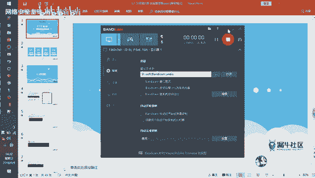

在本节课中，我们将要学习CTF比赛中杂项（Misc）题型的基本解题思路。杂项题目内容庞杂，但掌握核心工具和方法后，是快速拿分的关键。本节课将重点介绍文件操作与隐写、图片隐写术的基础知识。

---

## 文件操作与隐写

上一节我们介绍了CTF的五大题型。本节中，我们来看看杂项题中最基础的部分：文件操作与隐写。很多时候，题目会直接给你一个文件，你需要从中找出隐藏的信息。

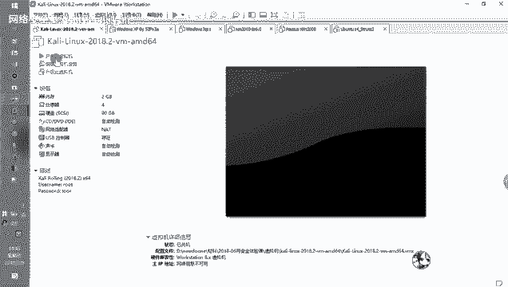

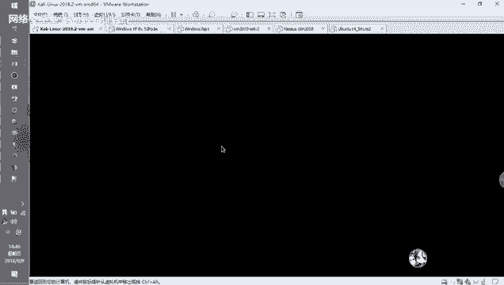

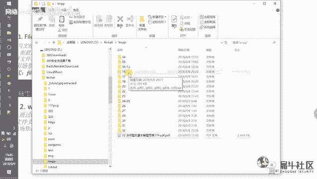

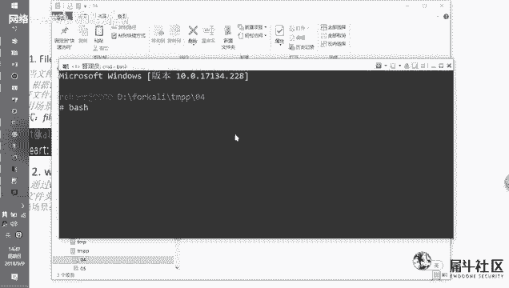

### 文件类型识别

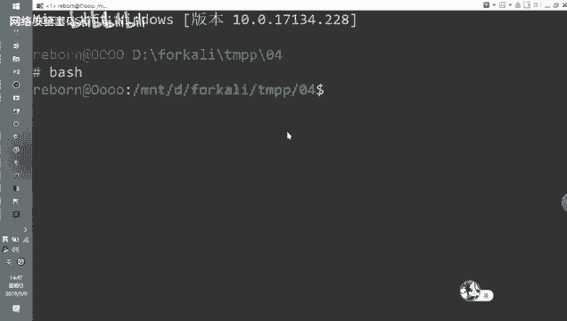

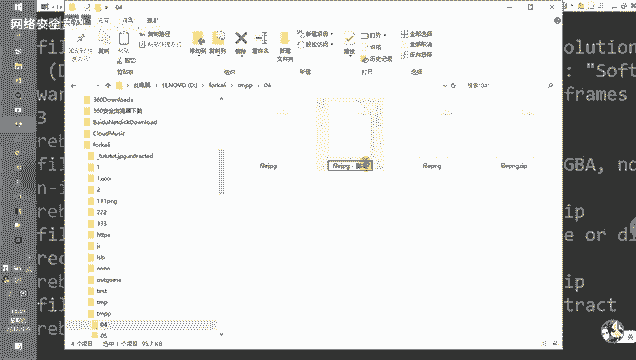

要对文件进行操作，首先需要知道它是什么类型的文件。出题人有时会删除文件的后缀名来增加难度。

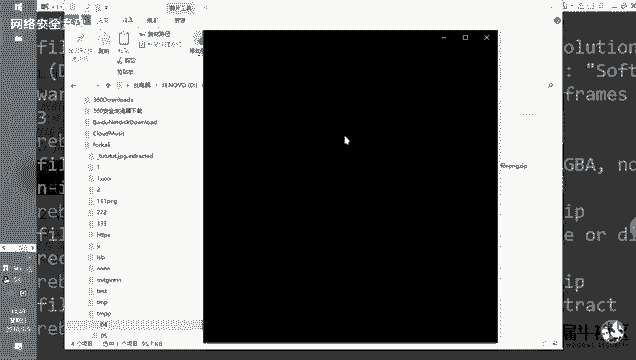

以下是识别文件类型的常用方法：

*   **`file` 命令**：这是Linux下的一个命令行工具，可以识别文件的真实类型。其基本用法是 `file 文件名`。
*   **十六进制编辑器**：所有文件在计算机底层都由二进制数据构成，转换为十六进制后，不同文件类型在文件头部有特定的标识（Magic Number）。通过查看文件头，可以判断文件类型。

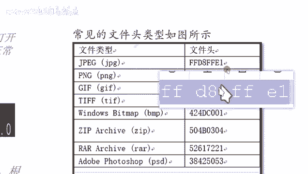

常见的文件头标识：
*   **JPEG**: `FF D8 FF E0` 或 `FF D8 FF E1`
*   **PNG**: `89 50 4E 47 0D 0A 1A 0A`
*   **ZIP**: `50 4B 03 04`
*   **RAR**: `52 61 72 21`

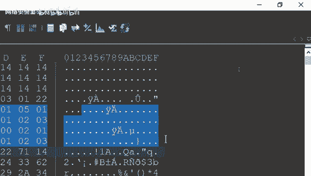

### 十六进制编辑器

当文件头被破坏或需要深入分析文件内容时，我们需要使用十六进制编辑器。

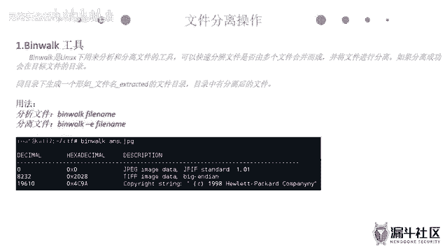

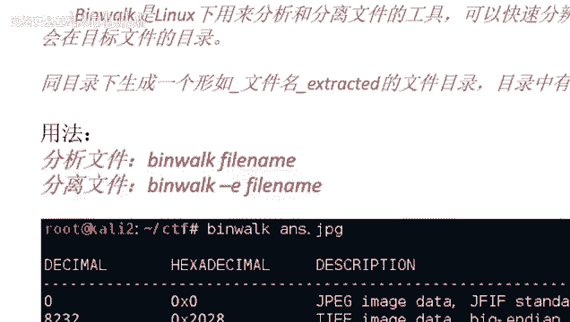

以下是三个常用的十六进制编辑器工具：

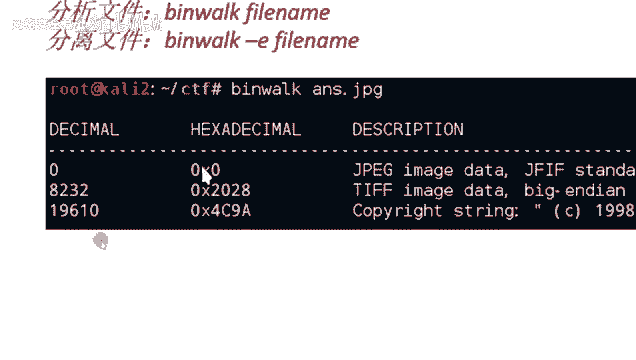

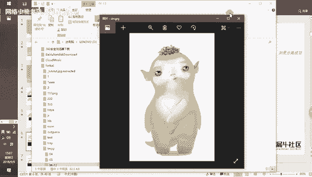

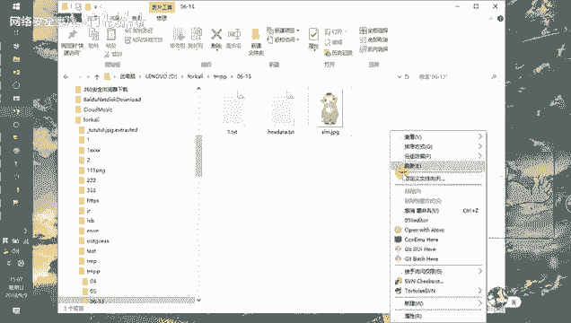

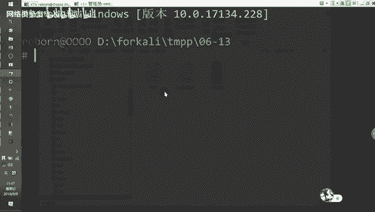

*   **WinHex**：功能强大的十六进制编辑器。
*   **010 Editor**：同样功能强大，推荐使用。
*   **Notepad++**：配合 `Hex Editor` 插件，也可以查看和编辑十六进制。

最简单的文件隐写方式，就是将flag直接以明文或可读字符的形式，藏在文件的头部或尾部。使用十六进制编辑器打开文件，仔细查看开头和结尾部分，有时就能直接发现flag。

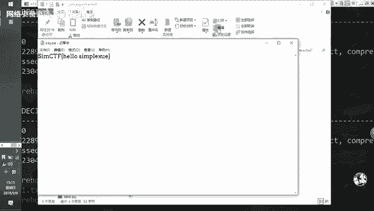

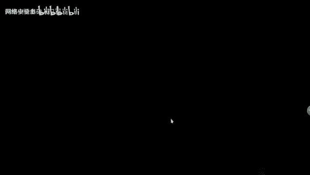

### 文件头修复

如果文件头被破坏或错误，`file` 命令可能无法识别，或文件无法正常打开。这时需要进行修复。

修复步骤如下：
1.  用十六进制编辑器打开文件。
2.  根据文件应有的类型，查找其正确的文件头。
3.  在文件起始位置，手动补全或修正为正确的文件头数据。

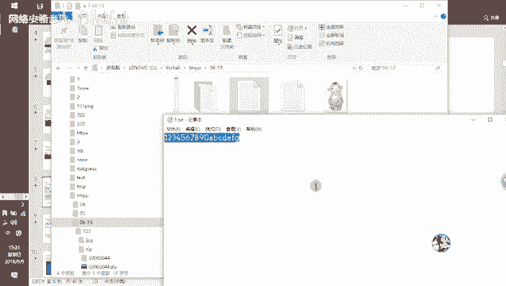

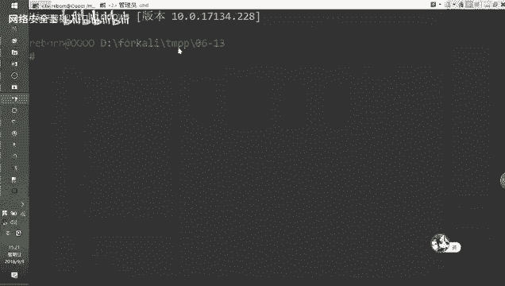

### 文件分离

一个文件可能由多个文件拼接而成。例如，一张图片的后半部分可能隐藏着一个压缩包。

以下是进行文件分离的几种方法：

*   **`binwalk` 命令**：自动分析文件中嵌入的其他文件。使用 `binwalk -e 文件名` 可以自动分离出嵌入的文件。
*   **`foremost` 命令**：另一个自动分离文件的工具。使用 `foremost -o 输出目录 文件名`。
*   **`dd` 命令**：一个强大但较复杂的手动分离工具。当自动工具失效时，可以用它精确截取文件的特定部分。基本格式为 `dd if=输入文件 of=输出文件 bs=块大小 count=块数 skip=跳过块数`。
*   **手动分离**：在十六进制编辑器中，直接选中属于另一个文件的数据区域，然后另存为新文件。

### 文件合并

与文件分离相反，有时题目会将一个完整文件分割成多个碎片给你，需要你将其合并。

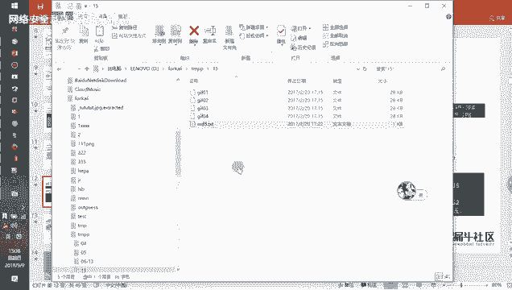

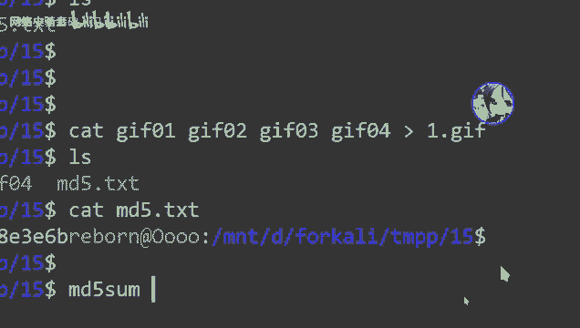

以下是文件合并的方法：

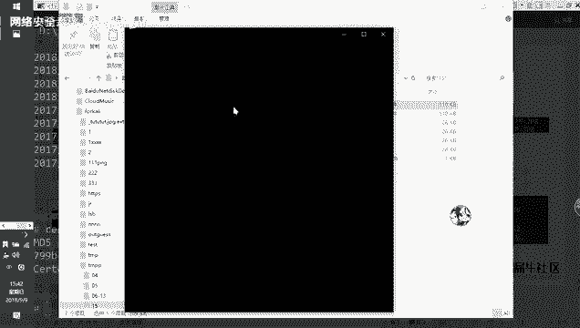

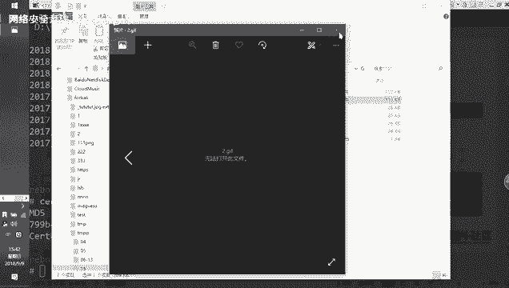

*   **Linux (`cat` 命令)**：`cat 碎片1 碎片2 碎片3 > 合并后的文件名`
*   **Windows (`copy` 命令)**：`copy /B 碎片1 + 碎片2 + 碎片3 合并后的文件名`

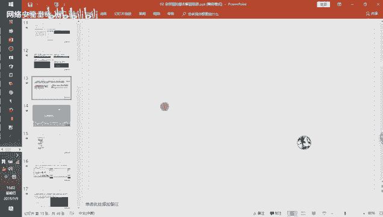

合并后，务必检查文件的完整性（例如使用MD5校验），并确认文件头是否正确。

### 字符串查找

在毫无头绪时，一个最基本的方法是直接在文件中搜索可能的关键字。

搜索方法：
1.  使用 `Notepad++` 或 `010 Editor` 打开文件。
2.  使用查找功能（Ctrl+F），搜索如 `flag`、`key`、`ctf` 等常见关键词。
3.  不仅搜索文本字符串，也要尝试在十六进制模式下进行搜索。

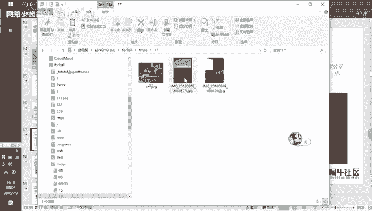

---

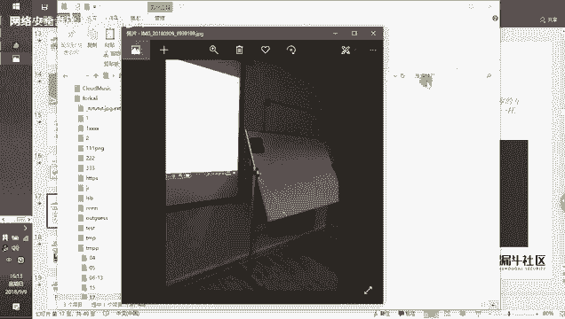

## 图片隐写术

上一节我们介绍了通用的文件操作。本节中，我们来看看专门针对图片文件的隐写术。图片中能隐藏信息的位置和方式非常多。

### 基本工具与信息查看

*   **图片处理**：简单的图片操作（如格式转换、取反、旋转）可以使用系统自带的“画图”软件完成。更专业的工具如 `Photoshop`，但我们也常用 `Fireworks` 的绿色版来查看图片图层或GIF动图的帧。
*   **EXIF信息**：图片文件通常包含拍摄信息（元数据），如相机型号、拍摄时间、GPS坐标等。这些信息可能直接包含flag或重要提示。在Windows中，右键图片属性->详细信息即可查看。Linux下可使用 `exiftool` 命令。

### 图片操作与通道分析

当遇到两张看似相同或有关联的图片时，考点可能是对图片进行像素级的运算。

*   **`Stegsolve` 工具**：这是一个Java编写的图片分析利器。它可以对两张图片进行 **异或 (XOR)**、**与 (AND)**、**或 (OR)**、**加 (Add)**、**减 (Subtract)** 等操作，从而揭示隐藏的信息。操作顺序有时会影响结果。

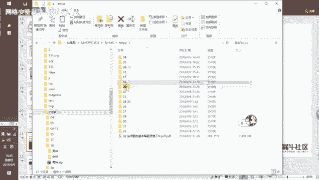

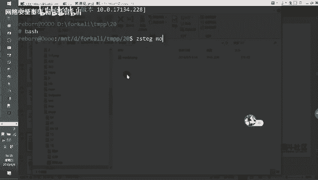

### LSB（最低有效位）隐写

这是一种非常常见的图片隐写方式。原理是修改像素颜色值（RGB）二进制表示的最后一位（Least Significant Bit）。由于改动极小，人眼无法察觉，但可以借此编码隐藏信息。

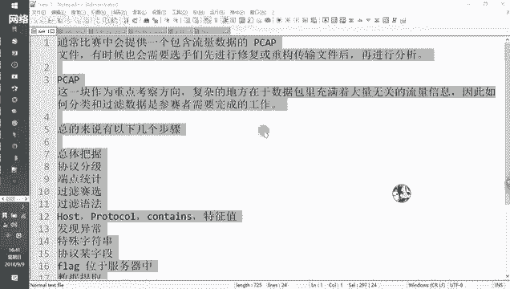

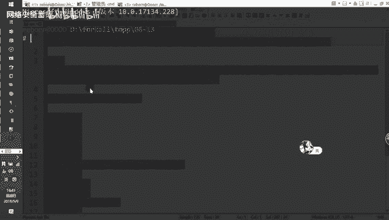

以下是提取LSB隐写信息的几种工具：

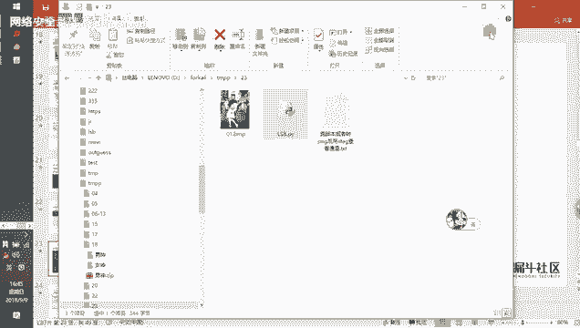

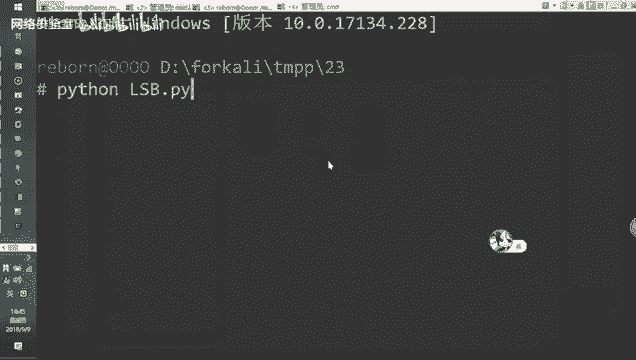

*   **`Stegsolve`**：在 `Analyse` -> `Data Extract` 功能中，可以勾选不同的位平面（Bit Planes）和通道（RGB），预览提取出的数据，从中寻找flag。
*   **`zsteg` 命令**：一个强大的LSB隐写检测工具，能自动尝试多种组合，并将可能隐藏的数据列出来。安装命令：`gem install zsteg`。
*   **`wbStego4open` 工具**：图形化工具，支持对BMP、PDF等文件的LSB隐写进行编解码。
*   **Python脚本**：当现成工具无法应对出题人做的微小改动时，需要自己编写或修改脚本进行提取。这要求一定的脚本编写能力。

### 图片修复（以PNG为例）

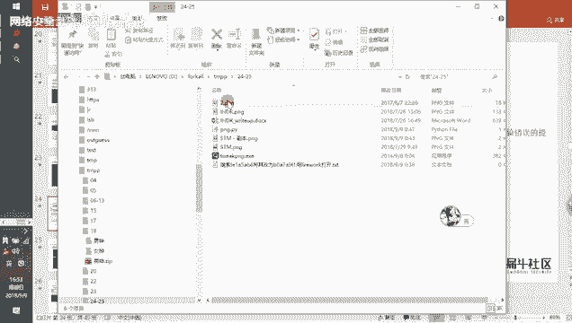

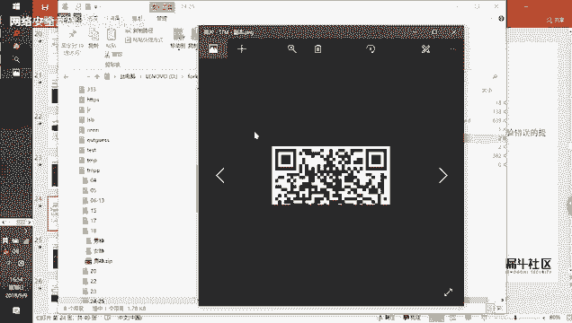

有时你拿到的图片无法正常显示，可能是因为文件结构被破坏。

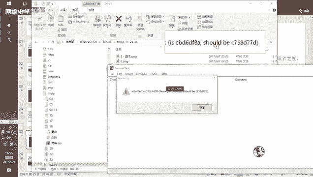

常见的修复点：
1.  **CRC校验错误**：PNG文件包含CRC校验值。如果图片尺寸等数据被篡改，CRC校验就会失败。可以使用 `TweakPNG` 这类工具打开图片，它会提示正确的CRC值，然后用十六进制编辑器修正即可。
2.  **图片尺寸错误**：更常见的是，出题人修改了图片存储的高度或宽度值，导致只显示图片的一部分。我们需要计算正确的图片尺寸。通常可以借助Python脚本，通过未篡改的CRC值反向计算出正确的高度或宽度，再用十六进制编辑器修改回来。

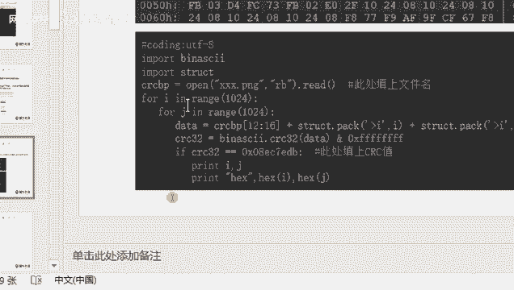

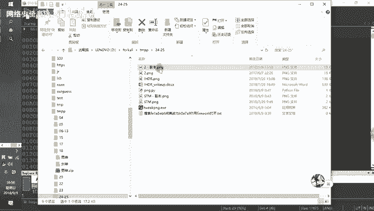

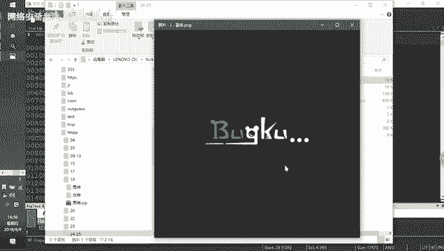

### 图片加密

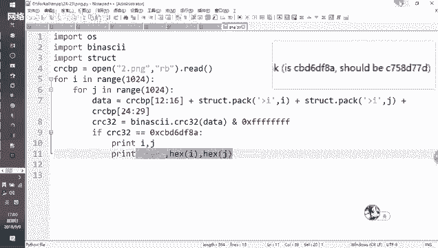

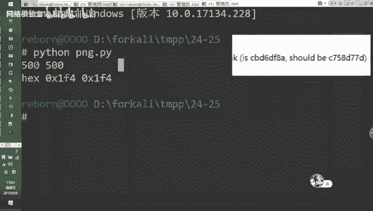

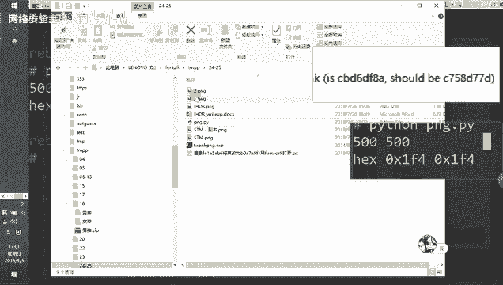

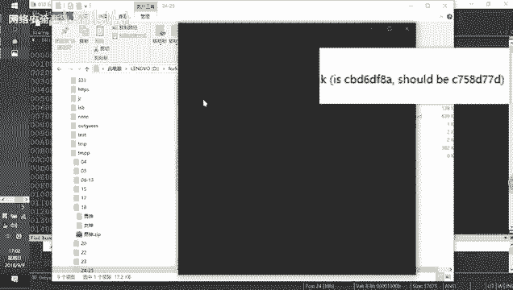

图片本身可能被某种算法加密。解题关键在于识别加密方式并找到对应的解密工具。

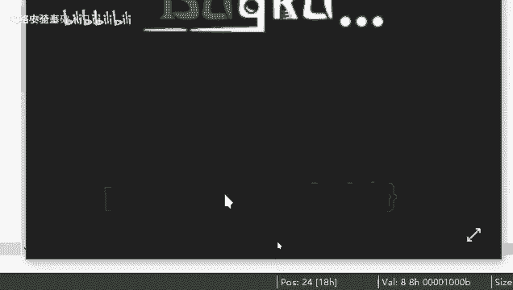

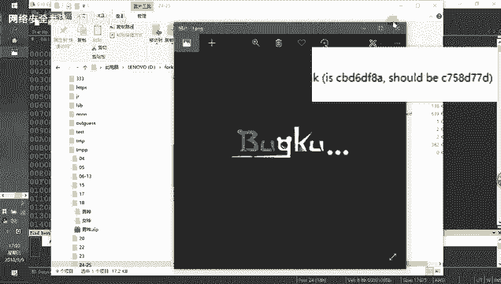

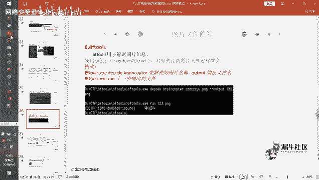

识别与解密流程：
1.  **识别算法**：观察题目名称、描述或文件注释中是否有提示（如 `outguess`、`F5`）。对于JPG文件，可以使用 `stegdetect` 工具进行自动检测：`stegdetect -s 敏感度 图片名`。
2.  **使用对应工具解密**：
    *   **`outguess`**：命令行工具。解密示例：`outguess -r 加密图片.jpg 解密输出文件`。
    *   **`steghide`**：图形化/命令行工具。解密可能需要密码。
    *   **`jphide` (`jpseek`)** 与 **`F5`**：这两个针对JPG的加密工具，需要特定的解密程序（通常由C或Java编写），可能需要编译后使用。

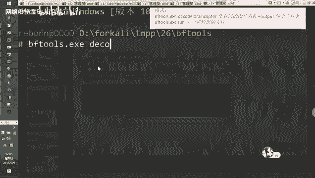

### 二维码处理

费尽周折得到的二维码可能无法直接扫描，需要进一步处理。

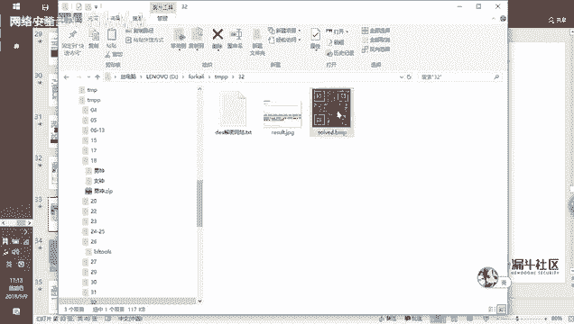

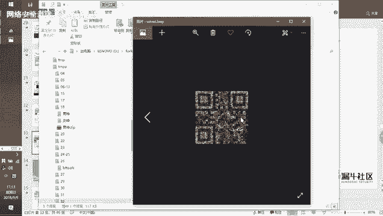

常见处理方式：
1.  **补全**：如果二维码定位点或部分区域被破坏、涂抹，需要用绘图工具将其修补回标准的黑白块。
2.  **取反**：如果二维码是反色的（白底黑码变成黑底白码），可以使用画图软件的“反色”功能，或者用 `Stegsolve` 的 `Invert` 功能。
3.  **通道分离**：彩色二维码可能将信息藏在某个颜色通道（如红色通道）里。使用 `Stegsolve` 查看不同的颜色通道，找到那个能构成有效二维码的通道视图。

---

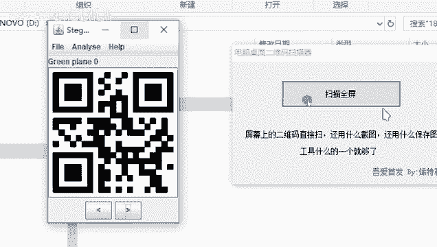

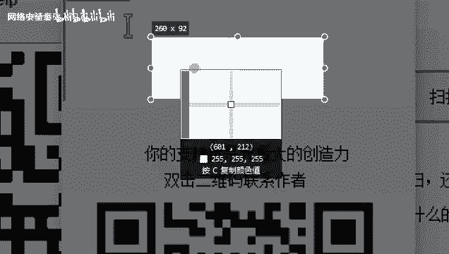

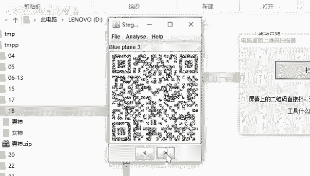

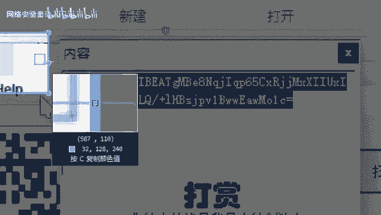

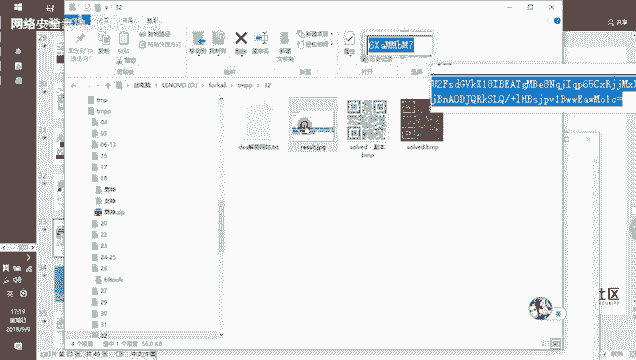

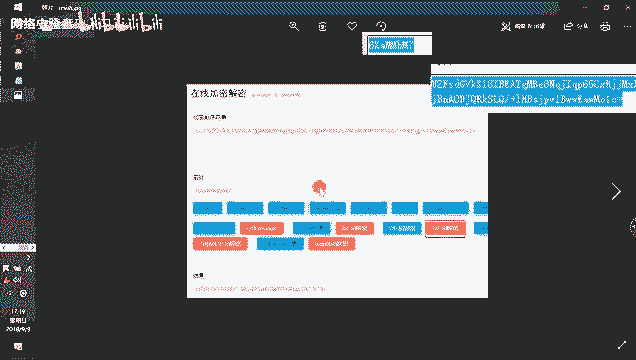

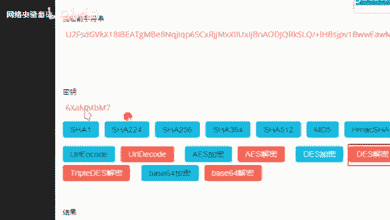

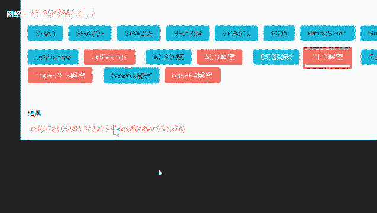

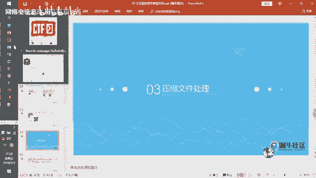

本节课中我们一起学习了CTF杂项题型中文件操作与图片隐写的基础知识和核心工具。关键在于熟悉各种工具的使用场景，并养成多尝试、多查看（如文件头、EXIF、字符串）的习惯。下节课我们将继续学习杂项中的压缩文件处理和流量分析等内容。